```{r setup, include=FALSE}
library(knitr)
library(RRPP)
library(geomorph)
library(scatterplot3d)
knitr::opts_chunk$set(echo = FALSE)

library(xaringanthemer)
style_mono_light()
```

###  A Vision of Morphometrics

“The study of form may be descriptive merely, or it may become analytical.  We begin by describing the shape of an object in simple words of common speech: we end by defining it in the precise language of mathematics; and the one method tends to follow the other in strict scientific order and historical continuity.”

###### D'Arcy Thompson. (1915). *Trans. Roy. Soc. Edinburgh*
---

### Morphology, Form, and Shape

+ Biologists have long quantified morphology, and done so in many ways 

```{r, echo = FALSE, fig.align = "center", out.width="80%"}
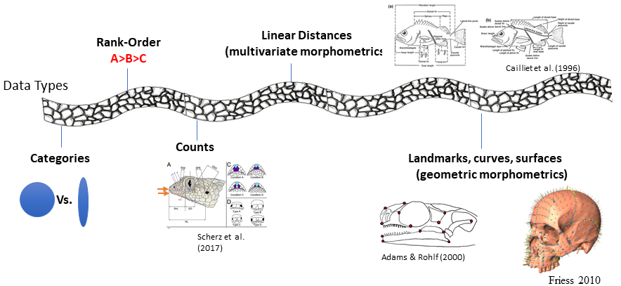  
```

+ These data types capture different aspects of morphology
+ Complexity $\uparrow$ from L $\rightarrow$ R, but not all characterize organismal shape *per se*
---

### Morphometrics

+ What is morphometrics?
+ From Greek: morpho (form) + metrikos (measure)
+ The quantification and analysis of morphological objects
+ Application of multivariate statistical analysis to the study of variation in plants and animals (Reyment, 1985)

  + The study of size and shape
  + The quantification of form (Lestrel, 2000)
  + **The study of shape variation and its covariation with other variables** (Bookstein, 1991)

+ This workshop is concerned with the quantification of shape as derived from landmark-based methods, and a proper evaluation of patterns of shape variation relative to explanatory variables

---

### Early Uses of Morphometrics

+ For centuries, biologists used descriptive morphology to compare organisms
+ Species taxonomy, classification, and ecological specialization were all addressed using anatomical properties
  + Plato & Aristotle: believed that understanding form lead to understanding of function
  + Geothe: ‘morphology’ the form of an organism
+ Much early work was based on a vague notion of organismal form that lacked explicit definitions

---

### Morphometrics, Evolution, and Statistics

+ The development of morphometrics is intertwined with that of evolutionary biology and statistics

+ Based on observations of linear measurements, the **Biometric Tradition** of the late 1800s viewed most biological variation as continuous
  + Galton, Pearson, Fisher, etc. espoused this view and simultaneously developed biostatistical methods for summarizing patterns of biological variation: $\sigma^2$, $\rho$, $\chi^2$, $\beta$, etc.

+ In the $20^{th}$ century, statistics and evolutionary biology continued to develop together
  + Fisher, Wright, Rao, Spearman and others derived statistical approaches to summarize patterns in biological data
  + ANOVA, variance partitioning, Discriminant Analysis, Principal Components, multivariate T-tests, Path Analysis, etc.  

+ These analytical advances paved the way for multivariate morphometric methods
  + However, analytical advances alone were not sufficient to advance our understanding of organismal form
  + Like any quantitative discipline, understanding *WHAT* one is characterizing (and how) is equally important, but was far from clear. This hampered meaningful biological inference!
  
---

### Form and Shape

+ Historically, form and shape were used interchangeably, but there is a distinction:

  + Over the past 50 years, a more formal distinction has emerged: 

  + `Form = size + shape`

+ **This requires a definition of shape:**

  + Shape: The geometric properties of an object that are invariant to changes in translation, rotation, and scale (Bookstein 1991); Dryden and Mardia (1998)

  + or Shape: The variation that remains once position, orientation, and scale have been mathematically held constant

+ That is all fine and dandy, but how do we make this operational?
+ What, exactly do we quantify?

---

### Quantifying Shape

**Morphometrics: the study of shape variation and its covariation**

+ The Problem:  There are no *natural* units for shape

  + Use a set of proxy variables to represent shape (morphometric traits)
  + Different approaches use different types of variables and methodologies to obtain them

+ **Data should**

  + Register shape in a repeatable manner and archive it for statistical analyses
  + Contain enough information to reconstruct a graphical representation of the structure of interest
  + Be appropriate to address the biological question of interest
---

### Morphometric Data

+ Morphometric data may quantify:

  + The location of discrete anatomic features (**points**)
  + Distances between anatomic features (**lines**)
  + Outlines of a structure (**curves**)
  + The surface of a structure (**surfaces**)

+ The modern morphometric synthesis permits the combination of ALL these types of data (via landmarks and semilandmarks)
---

### Homology in Morphometrics

+ Data must quantify shape in a repeatable manner

+ Homology: correspondence across specimens

  + Evolutionary homology: structures derived from the same tissue of the most recent common ancestor
  + Operational homology: correspondence in the position of structures

+ In Morphometrics, we may use both, depending on the question being addressed
+ The important point is to obtain **repeatable** data across observations
---

### Data Types: Linear Measurements

+ Use linear measurements, angles, etc., between anatomic features, or structures (e.g. head width)
+ Use some method to eliminate non-shape variation (size)
+ Analyze the data using multivariate statistics
+ aka 'traditional' or “multivariate” morphometrics

```{r, echo = FALSE, fig.align = "center", out.width="80%"}
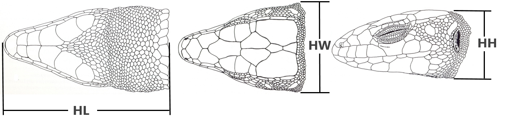  
```
---

### Linear Measurements: Considerations

+ **Advantages**

  + Allow comparison to previous studies
  + The variables used are very intuitive and easy to interpret biologically
  
+ **Disadvantages**

  + Size is a latent factor and there is no global consensus on how to account for it – different approaches provide different results
  + The same values may represent different shapes
  + Homology is difficult to evaluate and guarantee
  + Usually it is difficult to obtain a graphical representation of variation in shape (because the geometry of the structure is not preserved in the analysis)
---

### Linear Measures: Same Values Different Shapes

```{r, echo = FALSE, fig.align = "center", out.width="80%"}
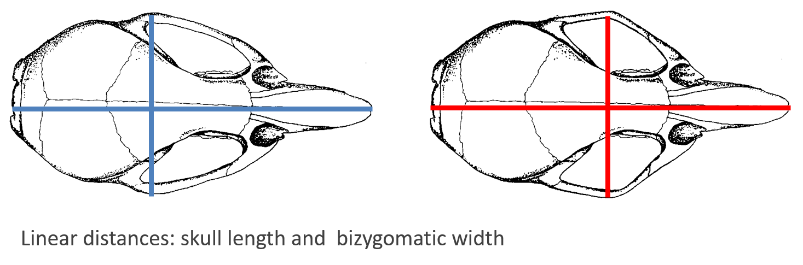  
```

```{r, echo = FALSE, fig.align = "center", out.width="30%"}
include_graphics("LectureData/01.Intro/SameMeasures.png")  
```

Something is missing! The relative positions of the distances on the structure
---

### Historical Side-Note: The Truss

+ An interconnected network of distance measurements between anatomical points
+ The truss was an effort to maintain the relative positions between traits
+ Can provide a graphical representation

```{r, echo = FALSE, fig.align = "center", out.width="60%"}
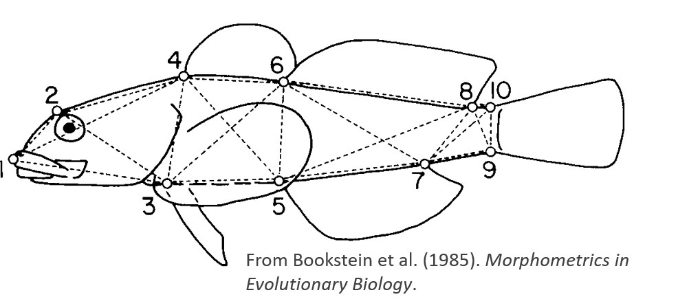  
```

+ However, statistical treatment was problematic
  + Measurements partially redundant (thus, resulting covariance matrices singular)
  + Mean shapes were not always physically realizable (e.g., needed to 'flatten' the truss)
---

### The Morphometric Revolution

+ In the 1980s, there is a radical shift in methodology

  + Linear measurements do not capture all of the properties required to describe shape, but their endpoints did
  + Thus, use landmark coordinates as the raw data

+ From this **Geometric Morphometric Methods (GMM) emerged**

+ This advance was aided by the simultaneous development of mathematical shape theory

```{r, echo = FALSE, fig.align = "center", out.width="50%"}
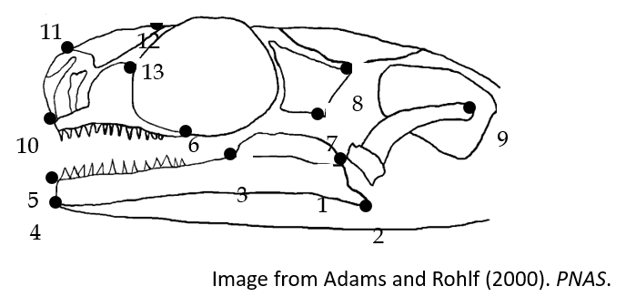  
```
---

### Landmark Coordinates

+ Use x, y (or x, y, z) coordinates of anatomic locations to quantify anatomical variation
+ Eliminate non-shape variation (size and others, see further on)
+ Multivariate data analysis

```{r, echo = FALSE, fig.align = "center", out.width="50%"}
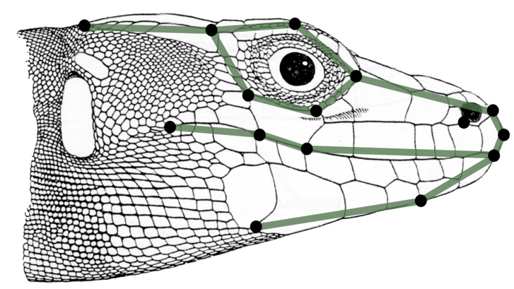  
```

+ 'Landmarks are the points at which one’s explanations of biological processes are grounded.'  Bookstein (1990)
---

### Types of Landmarks

```{r, echo = FALSE, fig.align = "center", out.width="70%"}
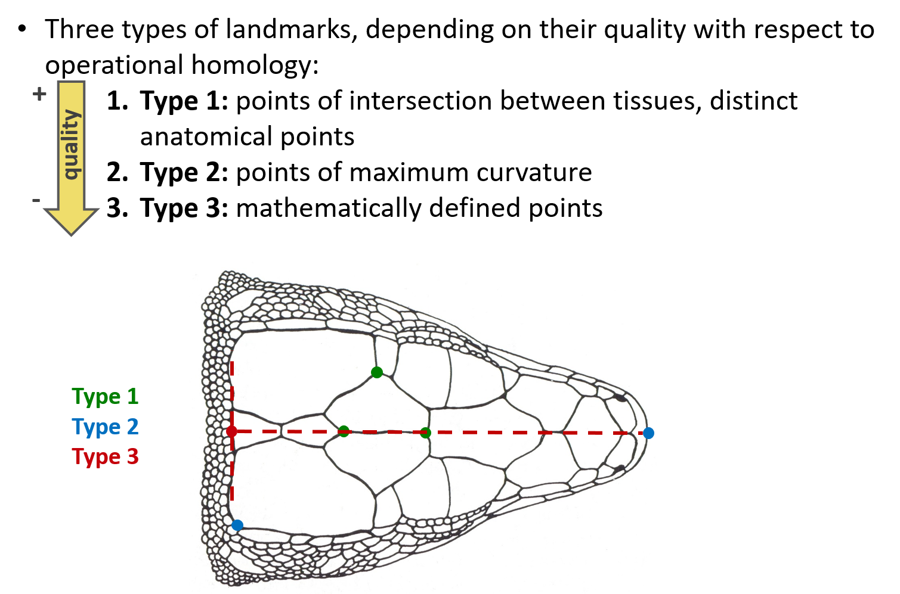  
```
---

### Data Types: Curves

+ Quantify a biological curve via a mathematical function (polynomials, Bezier, Fourier, etc.)
    + **Partial Curves**: different starting and ending points
    + **Complete Curves**: the starting and ending point coincide (closed curves)

```{r, echo = FALSE, fig.align = "center", out.width="60%"}
include_graphics("LectureData/01.Intro/Curves.png")  
```

+ **Advantage**   
  + Useful when there are few or no landmarks
  
+ **Disadvantages**   
  + Homology difficult to assess
  + Alternative analytical summaries can lead to differing biological conclusions 
---

### Semilandmarks

+ Semilandmarks are used to quantify anatomical curves and surfaces

+ Can be quantified on curves (2D) or surfaces (3D)

+ They are treated as “degenerate” landmarks, the position of which is limited to slide on a curve (or surface) during analysis

+ Only variation orthogonal (perpendicular) to the curve is relevant

```{r, echo = FALSE, fig.align = "center", out.width="60%"}
include_graphics("LectureData/01.Intro/Semilandmarks.png")  
```
---

### The Procrustes Paradigm

.pull-left[
+ Combining landmarks and semilandmarks there is a general solution for quantifying biological shape variation

+ We obtain quantitative information that represents:
    + Discrete anatomical points
    + Curves (outlines) of structures
    + Surfaces of structures

+ We can combine it all in a single analysis!

]

.pull-right[
```{r, echo = FALSE, fig.align = "center", out.width="75%"}
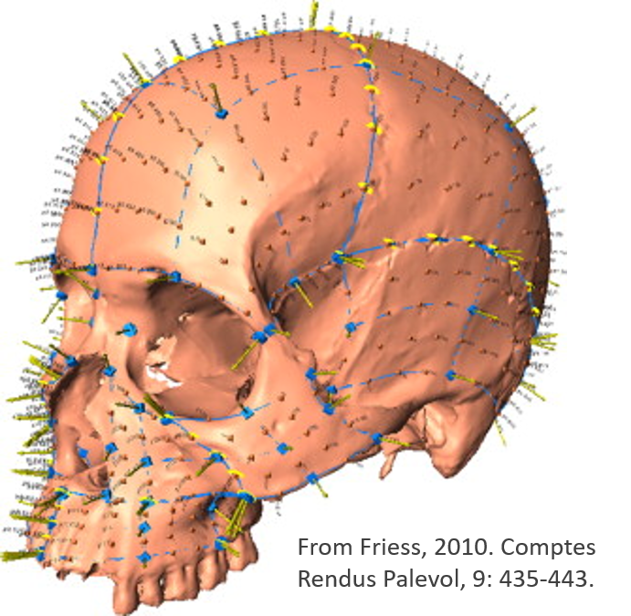  
```
]
---

### General Morphometric Protocol

```{r, echo = FALSE, fig.align="center", out.width="70%"}
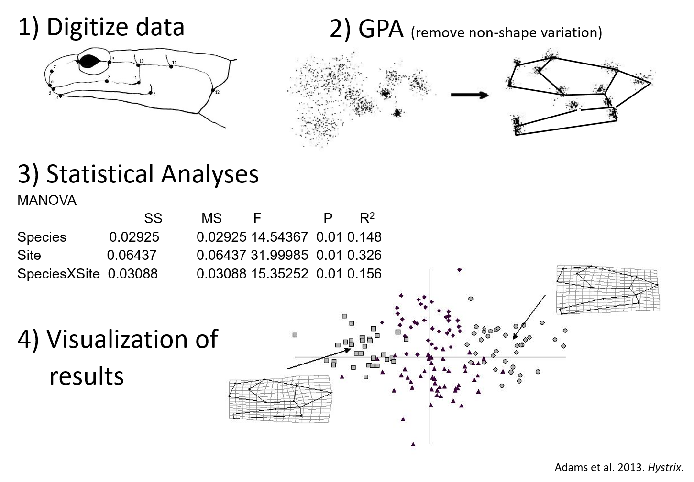  
```
---

### Special Considerations: Missing Data

+ Sometimes landmarks are missing
+ Methods to estimate their location exist (discussed later this week)

```{r, echo = FALSE, fig.align = "center", out.width="80%"}
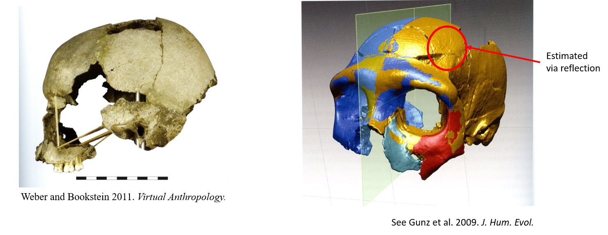  
```
---

### Special Considerations: Symmetry

+ Sometimes objects display symmetry
+ GMM procedures adjusted slightly for this  (discussed later this week)

```{r, echo = FALSE, fig.align = "center", out.width="80%"}
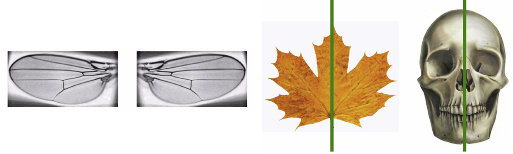  
```
---

### Dean's View of Quantitative Biology

+ Methods are a product of theory and data type
+ Choose methods that are mathematically sound, but also theoretically and biologically sound

+ METHODS SHOULD NOT INTRODUCE PATTERNS!!!!


