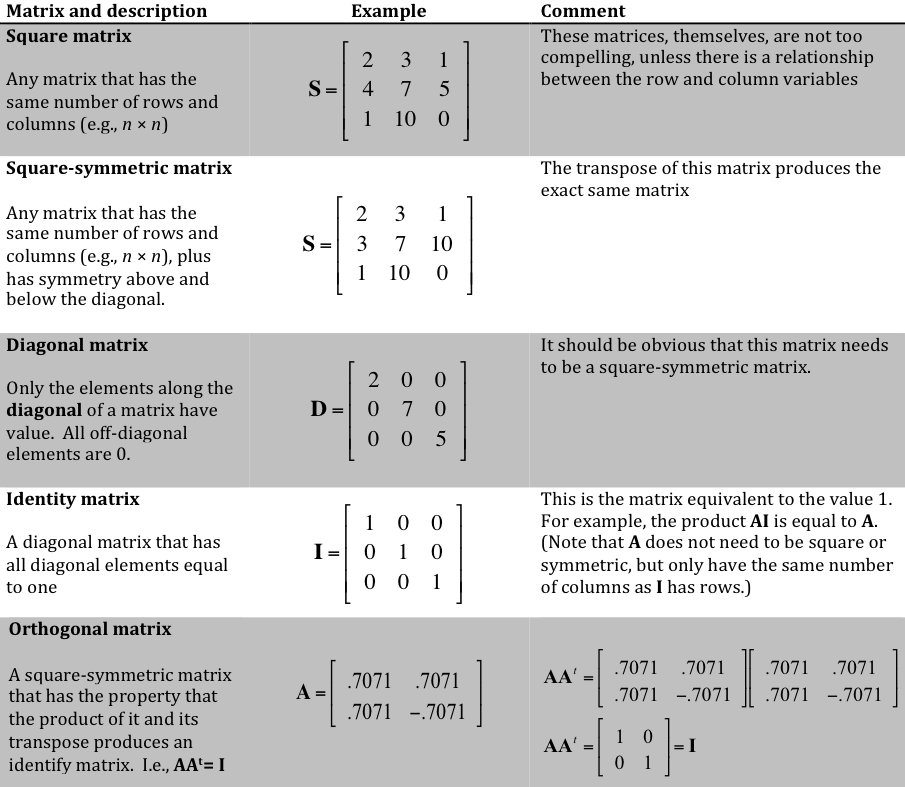

```{r setup, include=FALSE, echo = TRUE, tidy = TRUE}
library(knitr)
opts_chunk$set(echo = TRUE)
```

# Matrix Algebra: Goals

Understand why these two equations are the same and why the second is universally easier to apply

$$\small{s}_y^2=\frac{1}{n-1}\sum(y_i-\overline{y})^2$$

$$\small{s}_y^2=\frac{1}{n-1}\mathbf{[y-1(1^T1)^{-1}1^Ty]^T}\mathbf{[y-1(1^T1)^{-1}1^Ty]}$$

# Matrix Algebra: Goals

Understand why these two equations are the same and why the second is universally easier to apply

$$\small{s}_y^2=\frac{1}{n-1}\sum(y_i-\overline{y})^2$$

$$\small{s}_y^2=\frac{1}{n-1}\mathbf{[y-1(1^T1)^{-1}1^Ty]^T}\mathbf{[y-1(1^T1)^{-1}1^Ty]}$$

Understand why this equation is the single most important equation used in geometric morphometrics (GM) 

$$\small\mathbf{Z}=[tr[\mathbf{(Y-\overline{Y})(Y-\overline{Y})^T}]]^{-1/2}\mathbf{(Y-\overline{Y})H}$$

# Matrix Algebra: Goals

Understand why these two equations are the same and why the second is universally easier to apply

$$\small{s}_y^2=\frac{1}{n-1}\sum(y_i-\overline{y})^2$$

$$\small{s}_y^2=\frac{1}{n-1}\mathbf{[y-1(1^T1)^{-1}1^Ty]^T}\mathbf{[y-1(1^T1)^{-1}1^Ty]}$$

Understand why this equation is the single most important equation used in geometric morphometrics (GM) 

$$\small\mathbf{Z}=[tr[\mathbf{(Y-\overline{Y})(Y-\overline{Y})^T}]]^{-1/2}\mathbf{(Y-\overline{Y})H}$$


Understand why this equation is the single most important equation in multivariate statistics (and burn it into your memory)

$$\hat{\mathbf{B}}=\left ( \mathbf{\tilde{X}}^{T} \mathbf{\tilde{X}}\right )^{-1}\left ( \mathbf{\tilde{X}}^{T} \mathbf{\tilde{Y}}\right )$$

# Overview:
- Scalars and Vectors
- Vector addition and subtraction
- Vector multiplication
- Matrices (collections of vectors)
- Special Matrices
- Matrix inversion
- Special Matrix Properties
- General Linear Model Preview
- Sums of Squares and Cross-products
- Covariance matrices
- Decompositions
- Summary

# Scalars and Vectors

Scalars
 
$$a = 5$$   $$b = 2$$   $$c = -3$$

Vectors
 
$$\mathbf{a} = \begin{bmatrix}
 5 \\ 
 3 \\ 
 -2 
\end{bmatrix}$$

$$\mathbf{a}^T = \begin{bmatrix}
 5 & 3 & -2
\end{bmatrix}$$

The superscript, $^T$, means vector transpose.  Note, $\left(\mathbf{a}^T \right)^T = \mathbf{a}$

# Scalars and Vectors (cont.)

Vector addition/subtraction (consistent orientation is important)

$$\mathbf{b}^T = \begin{bmatrix}
 -5 & 0 & 1
\end{bmatrix}$$

$$\mathbf{a}^T + \mathbf{b}^T= \begin{bmatrix}
 0 & 3 & -1
\end{bmatrix}$$

$$\mathbf{a} - \mathbf{b} = \begin{bmatrix}
 10 \\ 3 \\ -3
\end{bmatrix}$$

# Vector Multiplication

### Not this!

$$\mathbf{a}^T = \begin{bmatrix}
 5 & 3 & -2
\end{bmatrix}$$

$$\mathbf{b}^T = \begin{bmatrix}
 -5 & 0 & 1
\end{bmatrix}$$

$$\mathbf{a}^T \times \mathbf{b}^T= \begin{bmatrix}
 -25 & 0 & -2
\end{bmatrix}$$

But it is kind of that, in part...

# Vector Multiplication (cont.)

Vector multiplication is both multiplication and summation of scalars.  Before performing vector multiplication, there has to be consistency with **inner dimensions**.

- Dimensions $\mathbf{a}: 3 \times 1$

- Dimensions $\mathbf{a}^T: 1 \times 3$

- Dimensions $\mathbf{b}: 3 \times 1$

- Dimensions $\mathbf{b}^T: 1 \times 3$

For any vector product, arrange the dimensions for the attempted product and see if inner dimensions match; e.g., 
$$\mathbf{a} \times \mathbf{b}: 3 \times \color{blue} {1 \times 3} \times 1$$
Does not match, so this product is not possible

# Vector Multiplication (cont.)

Vector multiplication is both multiplication and summation of scalars.  Before performing vector multiplication, there has to be consistency with **inner dimensions**.

- Dimensions $\mathbf{a}: 3 \times 1$

- Dimensions $\mathbf{a}^T: 1 \times 3$

- Dimensions $\mathbf{b}: 3 \times 1$

- Dimensions $\mathbf{b}^T: 1 \times 3$

For any vector product, arrange the dimensions for the attempted product and see if inner dimensions match; e.g., 
$$\mathbf{a}^T \times \mathbf{b}: 1 \times \color{blue} {3 \times 3} \times 1$$
**This matches!** Multiplication is possible.

# Vector Multiplication (cont.): Vector Inner-products

If inner dimensions match, the multiplication is possible.  The product has dimensions equal to the outer dimensions of the match.  There are two types of products:

- Inner-product: the vector product results is a single scalar, i.e., the outer dimensions are $1 \times 1$

- Outer-product: the vector product results in a series of scalar products with number and arrangement defined by outer dimensions

# Vector Multiplication (cont.): Vector Inner-products  (cont.)

## Vector Inner-Product

For $n \times 1$ vectors

$$\mathbf{a}^T \mathbf{b} = \sum_{i=1}^n a_ib_i$$

For example, 
$$\mathbf{a}^T = \begin{bmatrix}
 5 & 3 & -2
\end{bmatrix}$$

$$\mathbf{b} = \begin{bmatrix}
 -5 \\ 0 \\ 1
\end{bmatrix}$$

$$\mathbf{a}^T \mathbf{b} = \left(5\times -5 \right) + \left(3 \times 0 \right) + \left(-2 \times 1 \right) = -27$$

###### *Helpful mnemonic: "Run Amok Computational Demon!" for row-accross and column-down pattern (will be helpful for matrices)*

# Vector Multiplication (cont.): Vector Outer Products

If inner dimensions match, the multiplication is possible.  The product has dimensions equal to the outer dimensions of the match.  There are two types of products:

- Inner-product: the vector product results is a single scalar, i.e., the outer dimensions are $1 \times 1$

- Outer-product: the vector product results in a series of scalar products with number and arrangement defined by outer dimensions

## Vector Outer-Product

For $n \times 1$ vectors

$$\mathbf{a}\mathbf{b}^T  = \begin{bmatrix}
a_1b_1 & a_1b_2 & a_1b_3 & \cdots & a_1b_n\\
a_2b_1 & a_2b_2 & a_2b_3 & \cdots & a_2b_n\\
a_3b_1 & a_3b_2 & a_3b_3 & \cdots & a_3b_n\\
\vdots & \vdots & \vdots & \ddots & \vdots\\
a_nb_1 & a_nb_2 & a_nb_3 & \cdots & a_nb_n\\
\end{bmatrix} =
\mathbf{M}_{n \times n}
$$

# Vector Multiplication (cont.): Vector Outer Products (cont.)

### Important Notes

$$\mathbf{a}\mathbf{b}^T  = \begin{bmatrix}
a_1b_1 & a_1b_2 & a_1b_3 & \cdots & a_1b_n\\
a_2b_1 & a_2b_2 & a_2b_3 & \cdots & a_2b_n\\
a_3b_1 & a_3b_2 & a_3b_3 & \cdots & a_3b_n\\
\vdots & \vdots & \vdots & \ddots & \vdots\\
a_nb_1 & a_nb_2 & a_nb_3 & \cdots & a_nb_n\\
\end{bmatrix} =
\mathbf{M}_{n \times n}
$$

- $\mathbf{M}$ is called a matrix, with dimensions defined
- $\mathbf{M}$ comprises row vectors and column vectors
- because $\mathbf{M}$ has the same number of rows and columns, it also has a diagonal vector
- the sum of the diagonal vector, called the **trace**, is the inner-product of $\mathbf{a}$ and $\mathbf{b}$

# Matrices
A matrix is more than a vector outer-product (more precisely, a vector outer-product is merely one type of matrix).  A matrix is a collection of vectors, arranged in a specific way, such that linear algebra operations can be carried out as systematic operations.  For example, the arrangement of vectors in a matrix indicates how to find a series of inner-products and display their results.

The most basic matrices for statistics are **data frames**.  In data frames, column vectors are variables and row vectors are observations.  We can demonstrate this easily in R with the *data.frame* and *matrix* functions.

```{r, include = TRUE}
y1 <- c(2, 3, 2, 5, 6, 8) # variable 1 with 6 observations
y2 <- c(-1, -2, 0, 0, 1, -1) # variable 2 with 6 observations
Y <- data.frame(y1 = y1, y2 = y2)
rownames (Y) <- paste("obs", 1:6, sep = ".") # giving our observations some names
Y

```


# Matrices (Cont.)


```{r, include = TRUE}
Y

```
Which is R's way of saying,

$$\small{\mathbf{Y} = \begin{bmatrix}
2 & -1 \\
3 & -2 \\
2 & 0 \\
5 & 0 \\
6 & 1 \\
8 & -1 \\
\end{bmatrix}}
$$
$\mathbf{Y}$ is a matrix and a data frame.  Row vectors are observations for the variables represented as column vectors. The dimensions of $\mathbf{Y}$ are $n \times p$ for the $n$ observations of subjects for $p$ variables.

# Matrix Addition, Subtraction, Multiplication

### Matrix addition and subtraction
Matrix addition and subtraction is no different than vector addition and subtraction.  Matrices have to have *commensurate* dimensions (same $n \times p$).

### Matrix multiplication
Matrix multiplication is nothing more than systematic calculation of vector inner-products and arrangement of these into precise corresponding elements of a new matrix.  Like vectors, inner dimensions must match and the product is defined by the outer dimensions.  The simplest way to define this is as follows

Let $\mathbf{X}$ be an $n \times k$ matrix and let $\mathbf{Y}$ by an $n \times p$ matrix, such that

$$ \mathbf{X} = \begin{bmatrix}
\mathbf{x}_1 &
\mathbf{x}_2 &
\cdots &
\mathbf{x}_k 
\end{bmatrix}
$$
and 

$$ \mathbf{Y} = \begin{bmatrix}
\mathbf{y}_1 &
\mathbf{y}_2 &
\cdots & 
\mathbf{y}_p
\end{bmatrix}
$$
Note that each $\mathbf{x}_i$ column vector is $n \times 1$ in dimension for $k$ vectors and each $\mathbf{y}_i$ is $n \times 1$ in dimension for $p$ vectors.  Thus,

# Matrix Addition, Subtraction, Multiplication (Cont.)

$$ \mathbf{X} = \begin{bmatrix}
\mathbf{x}_1 &
\mathbf{x}_2 &
\cdots &
\mathbf{x}_k 
\end{bmatrix}
$$

and 

$$ \mathbf{Y} = \begin{bmatrix}
\mathbf{y}_1 &
\mathbf{y}_2 &
\cdots & 
\mathbf{y}_p
\end{bmatrix}
$$

and 

$$\mathbf{X}^T\mathbf{Y} = \begin{bmatrix}
\mathbf{x}_1^T\mathbf{y}_1 & \mathbf{x}_1^T\mathbf{y}_2 & \cdots & \mathbf{x}_1^T\mathbf{y}_p\\
\mathbf{x}_2^T\mathbf{y}_1 & \mathbf{x}_2^T\mathbf{y}_2 & \cdots & \mathbf{x}_2^T\mathbf{y}_p\\
\vdots & \vdots & & \vdots\\
\mathbf{x}_k^T\mathbf{y}_1 & \mathbf{x}_k^T\mathbf{y}_2 & \cdots & \mathbf{x}_k^T\mathbf{y}_p\\
\end{bmatrix}$$
The matrix product is a matrix with $k \times p$ inner-products

# Matrix Multiplication (Cont.)

### Matrix multiplication example (using R script)

```{r, include = TRUE}
y1 <- c(2, 3, 2, 5, 6, 8) # variable y1 with 6 observations
y2 <- c(-1, -2, 0, 0, 1, -1) # variable y2 with 6 observations
Y <- as.matrix(data.frame(y1 = y1, y2 = y2))  # R needs to know that this is preceisely a matrix
rownames (Y) <- paste("obs", 1:6, sep = ".") # giving our observations some names
Y
```

# Matrix Multiplication (Cont.)

### Matrix multiplication example (using R script)
```{r, include = TRUE}
x1 <- rep(1, 6) # variable x1 with 6 observations
x2 <- c(rep(0, 3), rep(1,3)) # variable x2 with 6 observations
X <- as.matrix(data.frame(x1 = x1, x2 = x2))
rownames(X) <- rownames(Y)
X

dim(Y)
dim(X)
t(X) %*% Y # %*% means matrix multiplication, whereas * means element by element multiplication

```

# ~~Matrix Division~~
This is not something we can do.  We can invert some matrices, but we will come back to this later.

# Important Matrix and Vector Multiplication Properties
>- Any matrix or vector multiplied by a scalar multiplies every element by the scalar.  The name, "scalar," means that every element is scaled.
>- Like vectors that have inner-products (dot products) or outer-products, sometimes matrices can be similar.  The tendency though is to call these cross-product matrices.  
>- A vector inner-product of the form, $\mathbf{x}^T\mathbf{x}$ is a generalized method of squaring.  It is precisely the sum of squared values, rather than just a squared value.
>- A matrix cross-product of the form, $\mathbf{X}^T\mathbf{X}$ is a generalized method of squaring.  This matrix has summed squared values of column vectors of $\mathbf{X}$ on a diagonal vector and summed cross-products between vectors in the off-diagonal elements.
>- A matrix is **square** when it has equal rows and columns, e.g., $n \times n$.
>- If $\mathbf{XY}$ is possible and $\mathbf{YX}$ is possible, they will not have the same product unless both matrices are square and $\mathbf{X} = \mathbf{Y}$.  The dimensions of matrix products are also likely different.
>- The next slide will describe some special matrices.

# Special Matrices

```{r, echo = FALSE, out.width="100%"}
  
```
Orthogonal vectors or matrices with vectors that are also unit length, $\left( \mathbf{a}^T\mathbf{a}\right)^{1/2} = 1$, are also **orthornormal**.

# Special Matrices and Special Matrix Properties

### Some additional notes
- Some sources refer to "triangular" matrices.  These might be symmetric matrices, where the elements above a diagonal match the elements below.  However, these might refer to a matrix that looks like a symmetric matrix but values below the diagonal are all 0.
- A matrix cross-product will always produce a symmetric matrix.

### Special Matrix Properties (Really important at times!)
- **Symmetry**: $\mathbf{X} = \mathbf{X}^T$
- **Positive-definite**: If $\mathbf{X}$ is symmetric, $\mathbf{a}^T \mathbf{Xa}$ is a positive scalar if $\mathbf{a}$ has non-zero values.  It also means all eigenvalues of $\mathbf{X}$ are non-negative (more later).
- **Idempotent**: If $\mathbf{X}$ is square, $\mathbf{XX} = \mathbf{X}$.

# Special Matrices and Special Matrix Properties (Cont.)

### Matrix Projection
Matrix multiplication is often used for the purpose of projection of data, $\mathbf{Y}$.  In a most technical and overly mathematical sense, projection is an alignment of data in a manifold of the data space (where Euclidean geometry is at least approximately appropriate).  In a simpler sense, projection is a method of rotating, stretching, flipping, and/or scaling a data space.  This is the essence of linear models - finding a constrained explanation of the data.


Two ways to understand projection:

$\mathbf{HY}$: where $\mathbf{H}$ is an $n \times n$ projection matrix

$\mathbf{YH}$: where $\mathbf{H}$ is a $p \times p$ rotation/shear/scale matrix

Both of these will make more sense with exposure to linear model uses, but for now, let's consider what the latter does.

# Matrix Projection: Geometric Interpretations

To best understand attributes of high-dimensional data spaces and algebra applied to them, consider two-dimensional data spaces and realize the algebra can be generalized to higher dimensions.

### The Result of $\mathbf{YH}$, where $\mathbf{H}$ is a $p \times p$ matrix

$\mathbf{H}$ type | Description | Result/Comment
:------- | :----------- | :--------------
$\mathbf{I}$ | Identity matrix | No change
$c\mathbf{I}$ | Scaled identity matrix | Enlarge (expand) or reduce (shrink).  $c\mathbf{I}$ is not idempotent.
$\mathbf{D}$ | Diagonal matrix | Stretching of axes (variables).  $\mathbf{D}$ is not idempotent.
$\mathbf{H}_{orthogonal}$ | $\mathbf{H} = \mathbf{H}^T$ | Rigid (orthogonal) rotation of $\mathbf{Y}$ (see note).  
$\mathbf{H}_{oblique}$ | $\mathbf{H} \neq \mathbf{H}^T$ | Shear of $\mathbf{Y}$.  $\mathbf{H}_{oblique}$ is not orthogonal.


**Note** that $\mathbf{H}_{orthogonal}$ can be viewed as a rotation matrix, which makes sense in low-dimensional data spaces.  For example, in a two dimension data space, it can be the same as:
$$\mathbf{H}_{orthogonal} = \begin{bmatrix}
\cos\theta & -\sin\theta\\
\sin\theta & \cos\theta
\end{bmatrix}
$$
for a rotational angle, $\theta$, in a plane.

# Matrix Projection: Geometric Interpretations (Cont.)
```{r, echo = FALSE, out.width="100%"}
include_graphics("LectureData/02.matrices/projections.png")  
```

# Matrix Inversion

- Matrices cannot be divided.  Much like division of a scalar is the same as multiplication by its inverse, some matrices can be inverted.
- Matrix needs to be square, *non-singular*; symmetric, non-singular is optimal.  
- Matrix inversion fulfills the property that $\mathbf{AA}^{-1} = \mathbf{I}$
- Illustration is simplest with a $2 \times 2$ matrix

Let $\mathbf{A}$ be a $2 \times 2$ matrix,
$$\mathbf{A} = \begin{bmatrix}
a & b \\
c & d
\end{bmatrix}$$
Then,
$$ \mathbf{A}^{-1} = \left| \mathbf{A} \right|^{-1} \begin{bmatrix}
d & -b\\
-c & a
\end{bmatrix}
$$
where $\left| \mathbf{A} \right| = ad-bc$

If $|\mathbf{A}| = 0$, the matrix is *singular* and cannot be inverted (dividing by 0 from matrices).

# Matrix Inversion (Cont.)

#### Example
$$\mathbf{A} = \begin{bmatrix}
3 & 4 \\
4 & 6
\end{bmatrix}$$

$$\left| \mathbf{A} \right| = 18-16$$
$$\left| \mathbf{A} \right|^{-1} = 0.5$$
$$ \mathbf{A}^{-1} = \left| \mathbf{A} \right|^{-1} \begin{bmatrix}
d & -b\\
-c & a
\end{bmatrix} = 
0.5 \begin{bmatrix}
6 & -4\\
-4 & 3
\end{bmatrix} =
\begin{bmatrix}
3 & -2\\
-2 & 1.5
\end{bmatrix}
$$

Confirm (using R script)

```{r, include = TRUE}
A = matrix(c(3, 4, 4, 6), nrow = 2, ncol = 2)
A
solve(A) # solve function finds inverse
A %*% solve(A)
```

# Matrix Inversion (Cont.)

- Note, inversion with 3 × 3 matrices or larger, not a trivial exercise
- Plagiarized from Wikipedia…

```{r, echo = FALSE, out.width="80%"}
include_graphics("LectureData/02.matrices/wiki.inversion.png")  
```

# Putting Our Current Knowledge to Good Use!
- Recall that a matrix must be square in order to be inverted.
- Recall that data frames are $n \times p$ in dimension, and it might be rare that $n=p$.
- Recall that matrix cross-products are essentially the squaring of matrices, and they are symmetric.
- **Thus**, matrix cross-products are invertible (and frequently used as a step before inversion).

#### An Example (recalling an earlier example) using R scripts

```{r, include = TRUE}
y1 <- c(2, 3, 2, 5, 6, 8) # variable y1 with 6 observations
y2 <- c(-1, -2, 0, 0, 1, -1) # variable y2 with 6 observations
Y <- as.matrix(data.frame(y1 = y1, y2 = y2))  # R needs to know that this is preceisely a matrix
rownames (Y) <- paste("obs", 1:6, sep = ".") # giving our observations some names
Y

x1 <- rep(1, 6) # variable x1 with 6 observations
x2 <- c(rep(0, 3), rep(1,3)) # variable x2 with 6 observations
X <- as.matrix(data.frame(x1 = x1, x2 = x2))
rownames(X) <- rownames(Y)
X

```
# Putting Our Current Knowledge to Good Use! (Cont.)

#### An Example (recalling an earlier example) using R scripts

We cannot invert $\mathbf{X}$, but let's invert the cross-product of $\mathbf{X}$.

```{r, include = TRUE}
crossprod(X)
solve(crossprod(X))

```
While we are on the topic…
Imagine that the second column is a variable, $X$, taking on the value either 0 or 1

The first column is a “dummy” variable

```{r, include = TRUE}
X
```
With a little bit of mind-bending, one might notice that 

$$\mathbf{X}^T\mathbf{X} = \begin{bmatrix}
n & \sum X\\
\sum X & \sum X^2
\end{bmatrix}
$$

# Putting Our Current Knowledge to Good Use! (Cont.)

#### An Example (recalling an earlier example) using R scripts

Let's reduce the $\mathbf{X}$ matrix, such that
$$\mathbf{X}_0 = \begin{bmatrix}
1\\
1\\
1\\
1\\
1\\
1
\end{bmatrix}
$$

And now in R, let's find the cross-product of this, and its inverse
```{r, include = TRUE}
X0 <- X[,1] # just the first column
crossprod(X0)
solve(crossprod(X0))
```
Thus, $\mathbf{X}_0^T\mathbf{X}_0 = n$ and $\left( \mathbf{X}_0^T\mathbf{X}_0 \right)^{-1} = n^{-1}$

# Putting Our Current Knowledge to Good Use! (Cont.)

#### An Example (recalling an earlier example) using R scripts

Now for fun, let's find the cross-product between $\mathbf{X}_0$ and $\mathbf{Y}$
```{r, include = TRUE}
crossprod(X0, Y)

```
If we examine $\mathbf{Y}$ again, you might notice something
```{r, include = TRUE}
Y

```
$\mathbf{X}_0^T\mathbf{Y}$ produces vector sums, $\sum y_i$ for each variable.

One more step!  Let's find the result of two things:
$$\left( \mathbf{X}_0^T\mathbf{X}_0 \right)^{-1}\mathbf{X}_0^T\mathbf{Y}$$
and
$$\mathbf{X}_0 \left( \mathbf{X}_0^T\mathbf{X}_0 \right)^{-1}\mathbf{X}_0^T\mathbf{Y}$$

# Putting Our Current Knowledge to Good Use! (Cont.)

#### An Example (recalling an earlier example) using R scripts

One more step!  Let's find the result of two things:
$$\left( \mathbf{X}_0^T\mathbf{X}_0 \right)^{-1}\mathbf{X}_0^T\mathbf{Y}$$
and
$$\mathbf{X}_0 \left( \mathbf{X}_0^T\mathbf{X}_0 \right)^{-1}\mathbf{X}_0^T\mathbf{Y}$$

```{r, include = TRUE}
solve(crossprod(X0)) %*% crossprod(X0, Y)
X0 %*% solve(crossprod(X0)) %*% crossprod(X0, Y)

```
#### The former finds a (row) vector of variable means.  The latter creates a matrix of variable means for every observation in the original data matrix, $\mathbf{Y}$!

Although it might not yet be obvious, we just used the general linear model to find fitted (predicted) values for a model design that has a single mean (centroid).

# Putting Our Current Knowledge to Good Use! (Cont.)

#### An Example (recalling an earlier example) using R scripts
If we now substitute $\mathbf{X}$ for $\mathbf{X}_0$, this is the result
```{r, include = TRUE}
solve(crossprod(X)) %*% crossprod(X, Y)
X %*% solve(crossprod(X)) %*% crossprod(X, Y)
```
Recall
```{r, include = TRUE}
X
```
One can see that the second variable is an indicator variable with 0 for one group and 1 for the other (two groups each with three observations).  This approach allows one to estimate two group means and create a matrix of fitted values that has two means instead of one.

# The General Linear Model
$$\huge \mathbf{Y}=\mathbf{X}\mathbf{\beta } +\mathbf{E}$$

Component | Dimension | Description
:------- | :----------- | :-----------------------------
$\mathbf{Y}$ | $n \times p$ | Data matrix with $n$ observations for $p$ variables
$\mathbf{X}$ | $n \times k$ | Linear model design matrix with $n$ observations for $k$ parameters
$\mathbf{\beta}$ | $k \times p$ | Matrix of coefficients expressing change in values for the $k$ model parameters for each of $p$ variables
$\mathbf{E}$ | $n \times p$ | Matrix of residuals (error) for $n$ observations for $p$ variables

Like any area of statistics, the coefficients for a linear model (which has parameters for variable change associated with some hypothetical process) are generally unknown but exist in a population, and are, therefore, estimated from a sample.  We can solve this algebraically as the solution that would be true if there was no error in the model (i.e., $\mathbf{E}$ = 0).  The goal is to solve for $\mathbf{\beta}$.

$$\mathbf{Y}=\mathbf{X}\mathbf{\beta } $$
$$\mathbf{X}^T\mathbf{Y} = \mathbf{X}^T\mathbf{X}\mathbf{\beta } $$

$$\left( \mathbf{X}^T\mathbf{X} \right)^{-1} \mathbf{X}^T\mathbf{Y} = 
\left( \mathbf{X}^T\mathbf{X} \right)^{-1} \mathbf{X}^T\mathbf{X}\mathbf{\beta } $$
$$\left( \mathbf{X}^T\mathbf{X} \right)^{-1} \mathbf{X}^T\mathbf{Y} = 
\mathbf{I}\mathbf{\beta } $$

$$\hat{\mathbf{\beta }}=\left ( \mathbf{X}^{T} \mathbf{X}\right )^{-1}\left ( \mathbf{X}^{T} \mathbf{Y}\right )$$
The ^ reminds us that this is a matrix of estimate values.

# The General Linear Model (Cont.)

$$\huge \mathbf{Y}=\mathbf{X}\mathbf{\beta } +\mathbf{E}$$

With coefficients estimated, we can make predictions for any design matrix with the same types of parameters or the original design matrix (called **fitted** values in this case); i.e., 

$$\mathbf{\hat{Y}}=\mathbf{X}\mathbf{\hat{\beta }}$$
This is how we obtained fitted means and fitted group means in the previous example.

Before going further, let's consider that values in the data and the model design matrix might be first transformed.  This is common for weighting estimates, accounting for the non-independence of observations, or some combination of both.  Let $\mathbf{T}$ be an $n \times n$ transformation matrix and $\mathbf{\tilde{Y}} = \mathbf{TY}$ and $\mathbf{\tilde{X}} = \mathbf{TX}$.  In cases when there is no transformation needed, $\mathbf{T} = \mathbf{I}$ and neither matrix is changed. Thus,

$$\hat{\mathbf{\beta }}=\left ( \mathbf{\tilde{X}}^{T} \mathbf{\tilde{X}}\right )^{-1}\left ( \mathbf{\tilde{X}}^{T} \mathbf{\tilde{Y}}\right )$$
and

$$\hat{\mathbf{Y}}=\mathbf{X}\hat{\mathbf{\beta }}=\mathbf{X}\left ( \mathbf{\tilde{X}}^{T} \mathbf{\tilde{X}}\right )^{-1} \mathbf{\tilde{X}}^{T} \mathbf{\tilde{Y}} = \mathbf{H\tilde{Y}}$$
The matrix, $\mathbf{H}$ is an $n\times n$ projection matrix.  If we let, $\mathbf{H}' = \mathbf{HT}$, be a projection matrix that accounts for both the linear model and transformation, then $\hat{\mathbf{Y}} = \mathbf{H}'\mathbf{Y}$.  This means that a linear model can be thought of as a means to project data from a manifold that best describes a hypothetical pattern (associated with a process).

$\mathbf{H}^{'}$ is positive-definite and idempotent.  If it is symmetric, then it produces an **orthogonal projection**.  If it is not symmetric, it produces an **oblique projection**.


# The General Linear Model (Cont.)

$$\huge \mathbf{Y}=\mathbf{X}\mathbf{\beta } +\mathbf{E}$$

The unexplained component of the data is the matrix of residuals, $\mathbf{E}$, found as
$$\mathbf{E} = \mathbf{Y} - \hat{\mathbf{Y}}=\mathbf{Y} - \mathbf{H}'\mathbf{Y} =\left(\mathbf{I}-\mathbf{H}'\right)\mathbf{Y}$$
$\left(\mathbf{I}-\mathbf{H}'\right)$ is also a projection matrix, meaning the residuals are a projection of $\mathbf{Y}$ into a different orientation from the manifold, where attributes of the points can be examined, especially with reference to the fitted value projections.  

Therefore, the general linear model finds projections of data as fitted values and residuals, $\mathbf{H}'\mathbf{Y}$ and $\left(\mathbf{I}-\mathbf{H}'\right)\mathbf{Y}$, respectively.  We will learn how and why this is important in just about every subsequent lecture.

# Covariance and Correlation Matrices
Recall, if we have a design matrix, $\mathbf{X}_0$ that is an $n \times 1$ vector of 1s, and we do not transform the data, then $\mathbf{H}'\mathbf{Y}$ is a matrix with every row equal to a vector of mean values for each variable (the mean, or the centroid) and $\left(\mathbf{I}-\mathbf{H}'\right)\mathbf{Y}$ is a matrix of residuals, subtracting the centroid from the data.  These residuals are sometimes called **mean-centered** data; i.e.,

$$\mathbf{Y}_c = \left(\mathbf{I}-\mathbf{H}'\right)\mathbf{Y} = \mathbf{Y}- \mathbf{X_0} \left ( \mathbf{X_0}^{T} \mathbf{X_0}\right )^{-1}\left ( \mathbf{X_0}^{T} \mathbf{Y}\right )$$

If we find the cross-product of these centered data, we obtain a **sums of squares and cross-products** matrix ($SSCP$); i.e., 

$$\mathbf{C} = \mathbf{Y}_c^T\mathbf{Y}_c$$
We use the term, $\mathbf{C}$, to mean *corrected* $SSCP$.  (Technically, we could calculate an uncorrected $SSCP$ by not centering the data, which is unconventional.)  The diagonal of this symmetric matrix provides each of the variable sum of squares.  The off-diagonal elements are the summed cross-products.  If we divide this matrix by the $n-1$ degrees of freedom, we obtain a **covariance** matrix; i.e., 

$$\mathbf{\hat{\Sigma}} = \left(n-1\right)^{-1}\mathbf{C}$$

$\mathbf{\Sigma}$ is the standard notation for a covariance matrix and we use the $\hat{}$ to remind us that it is estimated from the sample, rather than a matrix of true population parameters. In cases where variables are on quite different scales, it might be better to standardize the covariance matrix.  Doing this produces a **correlation** matrix; i.e., 

# Covariance and Correlation Matrices (Cont.)

$$\mathbf{\hat{\Sigma}} = \left(n-1\right)^{-1}\mathbf{C}$$

$\mathbf{\Sigma}$ is the standard notation for a covariance matrix and we use the $\hat{}$ to remind us that it is estimated from the sample, rather than a matrix of true population parameters. In cases where variables are on quite different scales, it might be better to standardize the covariance matrix.  Doing this produces a **correlation** matrix; i.e., 

$$\mathbf{W} = diag \left( \mathbf{\hat{\Sigma}} \right)^{-1/2}$$

$$\mathbf{R} = \mathbf{W\hat{\Sigma}W}$$

Note that often the term, $\mathbf{W}$, refers to a diagonal matrix of *weights*.  In this case the weights happen to be inverses of variable standard deviations.  $\mathbf{R} = \mathbf{W\hat{\Sigma}W}$ is the general format for *matrix weighting.*  A correlation matrix is a weighted covariance matrix and because the weights describe dividing by the standard deviation, it is more specifically a *standardized* matrix.


# Covariance and Correlation Matrices (Cont.)

#### Demonstration with R
```{r, include = TRUE}
Y <- matrix(rnorm(30, mean = 5, sd = 1), nrow = 10, ncol = 3)
Y
fit <- lm(Y ~1)
Yc <- fit$residuals
Yc

```
# Covariance and Correlation Matrices (Cont.)
#### Demonstration with R
```{r, include = TRUE}
SSCP <- crossprod(Yc)
SSCP

Cov <- SSCP/9
Cov
cov(Y) # R's built-in function

W <- diag(diag(Cov)^(-1/2))
Cor <- W %*% Cov %*% W
Cor
cor(Y) # R's built-in function
```

# Covariance and Correlation Matrices (Cont.)
#### Demonstration with R

What was just performed, as a summary
```{r, echo = FALSE, out.width="100%"}
include_graphics("LectureData/02.matrices/cov.cor.png")  
```

# Matrix Decompositions

### Eigen analysis
For an $p \times p$ square matrix, $\mathbf{S}$, there exists a vector of $p$ values, $\mathbf{\lambda}$, such that, 

$$\mathbf{Sv} =\lambda\mathbf{v}$$
which can also be written (in a more computationally feasible way) as 
$$\left( \mathbf{S}-\lambda\mathbf{I} \right) \mathbf{v} = 0$$  

Solving each *possible* eigenvector ($\mathbf{v}$) and eigenvalue ($\lambda$) via a characteristic polynomial is called, "eigen analysis".  This is done systematically by first describing the determinant, $\left| \mathbf{S}-\lambda\mathbf{I} \right|$.  This will be an equation with $p$ possible solutions for $\lambda$ that balance the equation.  Up to $p$ real numbers exist if $\mathbf{S}$ is positive-definite.  Some of these numbers might be 0 if $\mathbf{S}$ is not full-rank.  Some can be negative if $\mathbf{S}$ is not symmetric. (This is not a certainty but might be common with non-metric association matrices; i.e., the similarity of A to B is not the same as B is to A.)  By finding the values of $\lambda$ that work, the vectors, $\mathbf{v}$, are estimated such that the solution above holds true.

Computers can solve characteristic polynomials easily via numerical approximation algorithms  A popular choice is the QR algorithm, which uses QR decomposition until convergence.  Do not try to perform the characteristic polynomial solution or QR algorithm by hand!

# Matrix Decompositions (cont.)

### QR Decomposition
$$\mathbf{X}_{n \times k} =\mathbf{Q}_{n \times k} \mathbf{R}_{k \times k}$$

$\mathbf{Q}$ and $\mathbf{R}$ are solved via numerical approximation algorithms $\mathbf{R}$ is a triangular matrix (only diagonal and elements above diagonal can have values other than 0).  If $\mathbf{R}$ is not full-rank, some of the upper elements will be 0.  The matrix, $\mathbf{X}$ was used on purpose, as QR decomposition is often used on design matrices in linear models, for calculations of coefficients or $SSCP$ matrices.

### Singular Value decomposition of a Rectangular Matrix

$$\mathbf{Y}_{n \times p} =\mathbf{U}_{n \times p'} \mathbf{\Lambda}_{p' \times p'} \mathbf{V}_{p' \times p'}^T$$

$\mathbf{U}$ (left singular values) and $\mathbf{V}$ (right singular values) are solved via numerical approximation algorithms.  The number of singular values is $p'= \min(n,p)$. If $\mathbf{Y}$ is not full-rank, some of the singular values in $\mathbf{\Lambda}$ will be 0.  The singular values decrease from largest to smallest.

### Singular Value decomposition of a Symmetric Matrix

$$\mathbf{S}_{p \times p} =\mathbf{U}_{p \times p} \mathbf{\Lambda}_{p \times p} \mathbf{U}_{p \times p}^T$$

$\mathbf{U}$ (left and right singular values) are solved via numerical approximation algorithms If $\mathbf{S}$ is symmetric, positive-definite, $\mathbf{U}$ is the matrix of eigenvectors and $\mathbf{\Lambda}$ the matrix of eigenvalues, equal to those found from eigen analysis using the characteristic polynomial function.  This is a "short-cut" method, often employed for principal component analysis when it is sure that $\mathbf{S}$ is symmetric, positive-definite.

# Matrix Decompositions (Cont.)

Matrix decompositions provide mechanisms for many multivariate methods, including ordinations, linear model coefficient calculations, and matrix covariation analyses.  Those presented here will show up again later.  One can return to this lecture to review.

# Summary/Important Points

Vectors are important.  They are the points in high-dimensional data spaces.  They are the algebraic work horses.  They have length and direction.  They are the most important component of high-dimensional data analysis.

Matrices are not really more special than vectors, but they bundle vectors in important ways.  

Many multivariate analyses involve inverting matrices, which means obtaining a symmetric matrix to invert.  It is imperative to understand how and why these steps are important.

Once comfortable with the process of inverting matrices, recognizing that EVERY multivariate analysis is a permutation of linear model calculations. Linear model calculations make multivariate analysis easier.

$SSCP$, covariance, and correlation matrices are important for many analyses.  These are the most basic output from linear models.

Understanding projection is also important.  Recognizing that different methods are just different ways of projecting data will help simplify some complex topics.

# Revisit Goals

Understand why these two equations are the same and why the second is universally easier to apply

$$\small{s}_y^2=\frac{1}{n-1}\sum(y_i-\overline{y})^2$$

$$\small{s}_y^2=\frac{1}{n-1}\mathbf{[y-1(1^T1)1^Ty]^T}\mathbf{[y-1(1^T1)1^Ty]}$$

# Revisit Goals

Understand why these two equations are the same and why the second is universally easier to apply

$$\small{s}_y^2=\frac{1}{n-1}\sum(y_i-\overline{y})^2$$

$$\small{s}_y^2=\frac{1}{n-1}\mathbf{[y-1(1^T1)^{-1}1^Ty]^T}\mathbf{[y-1(1^T1)^{-1}1^Ty]}$$

$$\small{s}_y^2=\frac{1}{n-1}\mathbf{[y-x\hat{b}]^T}\mathbf{[y-x\hat{b}]}$$

$$\small{s}_y^2=\frac{1}{n-1}\mathbf{[y-\hat{y}]^T}\mathbf{[y-\hat{y}]}$$

# Revisit Goals

Understand why this equation is the single most important equation used in geometric morphometrics (GM) 

$$\small\mathbf{Z}=[tr[\mathbf{(Y-\overline{Y})(Y-\overline{Y})^T}]]^{-1/2}\mathbf{(Y-\overline{Y})H}$$

If $\small\mathbf{Y}$ is a matrix of Cartesian coordinates:

# Revisit Goals

Understand why this equation is the single most important equation used in geometric morphometrics (GM) 

$$\small\mathbf{Z}=[tr[\mathbf{(Y-\overline{Y})(Y-\overline{Y})^T}]]^{-1/2}\mathbf{(Y-\overline{Y})H}$$

If $\small\mathbf{Y}$ is a matrix of Cartesian coordinates:

```{r, echo = FALSE, out.width="100%"}
include_graphics("LectureData/02.matrices/GPAParts.png")  
```

# Revisit Goals

Understand why this equation is the single most important equation in multivariate statistics (and burn it into your memory)

$$\hat{\mathbf{B}}=\left ( \mathbf{\tilde{X}}^{T} \mathbf{\tilde{X}}\right )^{-1}\left ( \mathbf{\tilde{X}}^{T} \mathbf{\tilde{Y}}\right )$$

All of geometric morphometrics and multivariate statistics relies on linear models; linear models require estimation of model coefficients.  Some times this is nothing more than a mean.  

But even just a mean is found the exact same way as a linear model with coefficients to estimate group differences, linear associations, and much more complex interactions.
