```{r setup, include=FALSE, echo = TRUE, tidy = TRUE}
library(knitr)
library(geomorph)
library(scatterplot3d)
opts_chunk$set(echo = TRUE)

library(xaringanthemer)
style_mono_light()
```

### From Landmarks to Shape

+ Landmark coordinates describe the relative positions of anatomical points
+ However, we cannot analyze the raw coordinates directly, as they contain more than
just shape
+ Digitized specimens also differ in **Location, Scale, and Orientation**

```{r, echo = FALSE, fig.align = "center", out.width="70%"}
include_graphics("LectureData/03.superimposition/SuperIdea.png")  
```

We must mathematically partial out these components to estimate shape $^{1}$ .left[.footnote[1: scale is clearly biological, so we will sequester it for further analysis]]

---

### Scale and Size
.pull-left[
+ Position and orientation are due to digitizing procedures, and are not biologically relevant for most applications
+ **Scale** includes the combined effects of focal distance during digitizing and “real” size variation
+ Digitizing scale is calibrated during data acquisition
+ **Size** is of biological interest. So, we standardize for it to obtain shape variables, but record it for subsequent analyses $^{1}$ .left[.footnote[1: One can perform GM analyses without recording digitizing 'scale', but in this case one has no inherent size estimate, and no notion of its effect on shape]
]]

.pull-right[
```{r, echo = FALSE, fig.align = "center", out.width="70%"}
  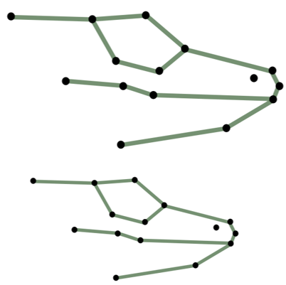  
```
]

---

### Size in GM Studies

.pull-left[
+ Small objects: landmarks are closer together
+ Large objects: landmarks are further apart

+ **Centroid size**: the square root of the sum of the squared distances between each landmark and the centroid (center of mass of the object) of the landmark configuration:

$$CS=\sqrt{\sum_{i,j}^{k,p}\left(\mathbf{Y}_{ij}-\mathbf{Y}_{ic}\right)^2}$$

where $p$ is the number of landmarks and $k$ is the number of coordinate dimensions
]

.pull-right[
```{r, echo = FALSE, fig.align = "center", out.width="70%"}
  include_graphics("LectureData/03.superimposition/CSize.png")  
```
]
---

### Centroid Size (CS): Properties 

- One could use other size measures (a baseline, area, perimeter, …)
- BUT, centroid size has some useful properties
    - CS is **uncorrelated with shape** in the absence of allometry
    - As such, there is a **unique solution** for the quantification of “shape” (when standardizing size effects)
    - CS is an **unambiguous size measure**
    - Of different size measures proposed, CS is the only one that has this property
---

### Shape from Landmarks

+ To obtain shape variables, we first need to standardize position, scale and orientation: superimposition
+ Several approaches have been proposed (see further on)
+ The most robust for most situations, and the main tool of morphometrics is:
+ *Least-squares superimposition* aka **Procrustes Superimposition**

```{r, echo = FALSE, fig.align = "center", out.width="50%"}
  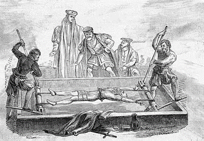  
```
---

### Procrustes Superimposition

Generalized Procrustes Analysis (GPA) removes non-shape information from landmark coordinates

  + Translate all specimens to the origin
  + Scales all specimens to unit centroid size
  + Rotates all specimens to minimize differences
  
```{r, echo = FALSE, fig.align = "center", out.width="70%"}
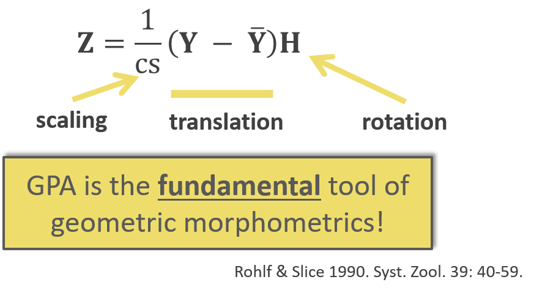  
```
---

### Procrustes Superimposition: Translation

- Translate object to origin (mean centering)

<video width="640" height="480" controls="controls">
  <source  src="LectureData/03.superimposition/Trans.mp4"></source>
</video>
---

### Procrustes Superimposition: Scale

+ Scale object to unit centroid size:  $CS=\sqrt{\sum_{i,j}^{k,p}\left(\mathbf{Y}_{ij}-\mathbf{Y}_{ic}\right)^2}=1$

```{r, echo = FALSE, fig.align = "center", out.width="80%"}
  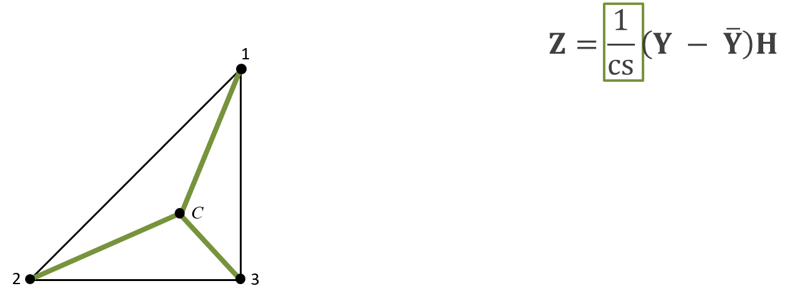  
```

---

### Procrustes Superimposition: Rotation

- Rotate $\mathbf{Y}_2$ to minimize landmark differences relative to $\mathbf{Y}_1$ (in a least-squares sense)

<video width="640" height="480" controls="controls">
  <source  src="LectureData/03.superimposition/Rot.mp4"></source>
</video>
---

### How Much to Rotate?

$\mathbf{Z}=\frac{1}{CS}\mathbf{(Y-\overline{Y})H}$

+ Rotation accomplished by rigid rotation: 
$$\mathbf{H}=\begin{bmatrix} 
    \cos\theta       & \sin\theta \\
    -\sin\theta       & \cos\theta
\end{bmatrix}$$

+ $\mathbf{H}$ is found from a regression (i.e., fit) of $\mathbf{Y}_2$ on $\mathbf{Y}_1$
  + Perform `SVD` of: $\mathbf{Y}_1^T\mathbf{Y}_2=\mathbf{UDV}^T$
  + Then $\mathbf{H}=\mathbf{VSU}^T$

+ Here $\mathbf{S}$ has diagonals of $1$ and of the same sign as $\mathbf{D}$
  + Diagonals of $1$ so rigid rotation 
  + Of same sign to eliminate reflections
---

### Ordinary Procrustes Analysis: Review

$\mathbf{Z}=\frac{1}{CS}\mathbf{(Y-\overline{Y})H}$

```{r, echo = FALSE, fig.align = "center", out.width="45%"}
  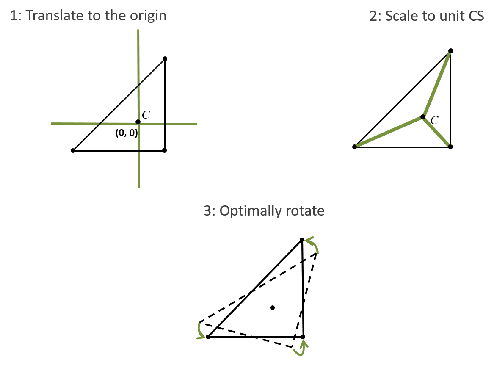  
```

+ $\mathbf{Z}$ are Procrustes residuals (aligned shape)
+ Optimal LS rotation, distributing the displacement among all landmarks
+ **BUT**, OPA is for $n=2$ objects only
---

### Generalized Procrustes Analysis

+ Perform OPA in iterative fashion

1. Translate and rotate all specimens
2. Rotate all objects to the $1^{st}$ specimen
3. Find the mean ( $\mathbf{\overline{Y}}$) 
4. Estimate the total variation ( $TSS$)
5. Repeat steps 2 - 4, rotating to $\mathbf{\overline{Y}}$ until convergence ( $TSS$ will $\downarrow$ each iteration)
    
```{r, echo = FALSE, fig.align = "center", out.width="55%"}
    
```
---

### GPA: Example

+ Head shape in *Podarcis* wall lizards
  + 12 lateral 2D landmarks from males and females
  + Later we will visualize shape variation (PCA)
  + Later we will test for shape differences (MANOVA)

```{r, echo = FALSE, fig.align = "center", out.width="60%"}
  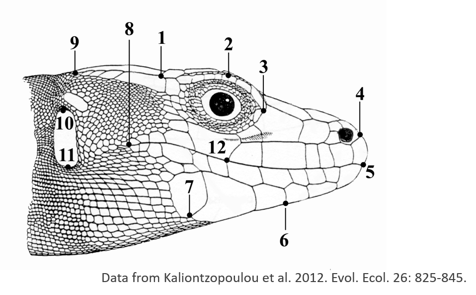  
```
---

### GPA: Example (Cont.)

```{r echo=FALSE, fig.align = "center", eval=TRUE}
lizards <- readland.nts('LectureData/04.shape.vars/lizards_LAT.nts')
links <- read.csv('LectureData/04.shape.vars/links.txt', header=FALSE, sep = " ")
liz.lab <- read.csv('LectureData/04.shape.vars/liz_groups.csv',header=TRUE, sep="\t")
col.gp <- rep("red",nrow(liz.lab))
col.gp[which(liz.lab$SEX=='M')] <- 'blue'
```

```{r echo=TRUE, fig.align = "center", eval=TRUE}
Y.gpa <- gpagen(lizards, print.progress = FALSE)
plotAllSpecimens(Y.gpa$coords, links=links)
```

```{r echo=FALSE, fig.align = "center", eval=TRUE}
gdf <- geomorph.data.frame(Y.gpa, gp = col.gp)
```
---

### GPA: Step By Step

```{r echo=FALSE, fig.align = "center", eval=TRUE}
source('LectureData/plot.specimens/plot.Specimens.r')
n <- dim(lizards)[1];p <- dim(lizards)[2]
Yc <- simplify2array(lapply(1:dim(lizards)[3], function(j) geomorph:::fast.center(lizards[,,j],n,p)))
Yc.rot <- simplify2array(lapply(1:dim(lizards)[3], function(j)  Y.gpa$coords[,,j]*Y.gpa$Csize[[j]]))
par(mfrow=c(2,2)) 
x <- plot.specimens(lizards, links = links, col=gdf$gp)
mtext("Original Specimens")
x <- plot.specimens(Yc,links = links, col=gdf$gp)
mtext("Translated Specimens")
x <- plot.specimens(Yc.rot,links = links, col=gdf$gp)
mtext("Translated and Scaled Specimens")
x <- plot.specimens(Y.gpa$coords, links=links, col=gdf$gp)
mtext("GPA-Aligned Specimens")
par(mfrow=c(1,1)) 
```

+ GPA-aligned coordinates now used as shape variables
---

### PCA: *Podarcis*

.pull-left[
```{r echo=TRUE, fig.align = "center", out.width="80%" }
PCA <- gm.prcomp(Y.gpa$coords)
plot(PCA,pch = 21, bg=col.gp,cex = 2)
```
]
.pull-right[
+ And the eigenvalues:
```{r echo=FALSE}
matrix(prcomp(two.d.array(Y.gpa$coords))$sdev,ncol=3, byrow=T)
```

+ Why are 4 exactly = 0?
]
---

### GPA: Data Dimensionality

+ 2D data initially contain $2p$ variables: $2$ coordinates for $p$ landmarks
+ GPA standardized $4$ dimensions:
  + Translation in X
  + Translation in Y
  + Scaling
  + Rotation

+ Therefore, the shape space for GPA-aligned specimens has $2p-4$ dimensions for 2D data
+ For 3D data, dimensionality is $3p-7$ (general form is: $pk – k – k(k – 1)/2 – 1$

+ Because these dimensions are redundant, standard parametric statistical hypothesis testing will not work (singular covariance matrix... means divide by zero)

+ One can eliminate these dimensions via **Orthogonal Projection** or the **thin-plate spline** $^1$ .left[.footnote[1: As we'll see later, use of permutation methods (RRPP) alleviates this issue.]]
---

### GPA: Extensions to Three Dimensions

+ GPA works the same with 3D data (matrices simply have $\small{3}^{rd}$ column)
.pull-left[
```{r, echo = FALSE, fig.align = "center", out.width="40%"}
  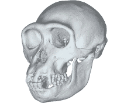 

```

$${Y}=\begin{bmatrix} X_1 & Y_1 & Z_1 \\ X_2 & Y_2 & Z_2 \\ \vdots & \vdots & \vdots \\ X_p & Y_p & Z_p \\ \end{bmatrix}$$
]
.pull-right[
+ GPA as: $\mathbf{Z}=\frac{1}{CS}\mathbf{(Y-\overline{Y})H}$

  + Translation in $\small{x}$, $\small{y}$, and $\small{z}$, directions 
  + Scale to $\small{CS=1}$
  + Rotate in $\small{(XY)}$, $\small{(XZ)}$, and $\small{(YZ)}$ planes

+ GPA for 3D data standardizes $7$ dimensions
]
---

### Modifications: Full Vs. Partial Procrustes Fitting

+ GPA is a regression of $\mathbf{Y}_i$ on $\mathbf{\overline{Y}}$ after centering and scaling ( $CS = 1$)
  + Fitting can be improved by allowing size to vary
  + Full fitting: superimposition allowing $CS$ to vary
  + Partial fitting: superimposition after $CS = 1$

+ NOTE: while mathematically elegant, Full Procrustes is NOT symmetrical 
  + $CS$ from fitting $\mathbf{Y}_1$ on $\mathbf{Y}_2$ $\neq$ $CS$ from fitting $\mathbf{Y}_2$ on $\mathbf{Y}_1$

+ In practice, only partial fitting seems useful for empirical studies
---

### Historical Note: Bookstein's Shape Coordinates

+ An alternative approach to shape alignment 
  + Standardize Position: Translate so landmark $1$ at origin (0,0)
  + Standardize Orientation: Rotate so landmark $2$ on X-axis (X,0)
  + Standardize Size: Scale object so $Baseline_{1,2}$ = 1 (i.e., landmark $2$ at (1,0)
    
```{r, echo = FALSE, fig.align = "center", out.width="50%"}
  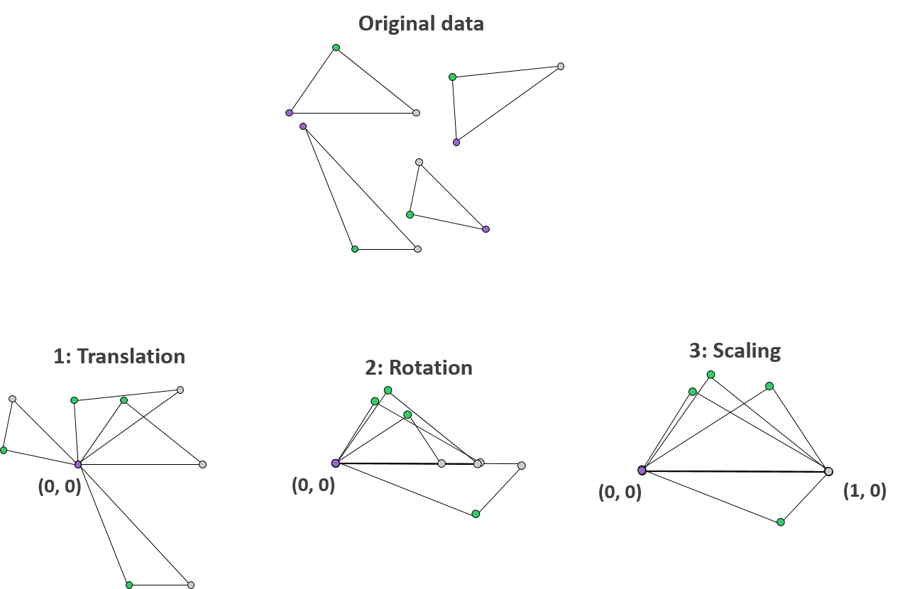  
```
---

### Bookstein's Shape Coordinates: Comments

+ Approach is simple and intuitive, however:
  + Selection of landmarks $1$ & $2$, which define the baseline, is arbitrary
  + Choice of baseline alters size and shape estimates
  + Short baselines cause instabilities in shape inference (so choose long baseline)
  + Baseline length IS correlated to shape variables

+ Conclusion: while intuitive and easy to understand, GPA is preferred
---

### Modifications: Resistant-Fit

+ GPA: a globally optimal solution (in the least-squares sense)
  + Spreads shape variation across all landmarks

+ If shape variation is localized in a few landmarks this can be a problem: The 'Pinocchio effect'
+ One may desire methods resistant to this effect

```{r, echo = FALSE, fig.align = "center", out.width="30%"}
  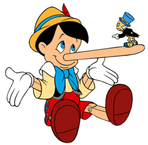  
```
---

### Resistant-Fit Superimposition

+ Estimate parameters for translation, scaling and rotation using medians instead of least-squares means

+ Example: two shapes that differ only in the front triangle

```{r, echo = FALSE, fig.align = "center", out.width="60%"}
  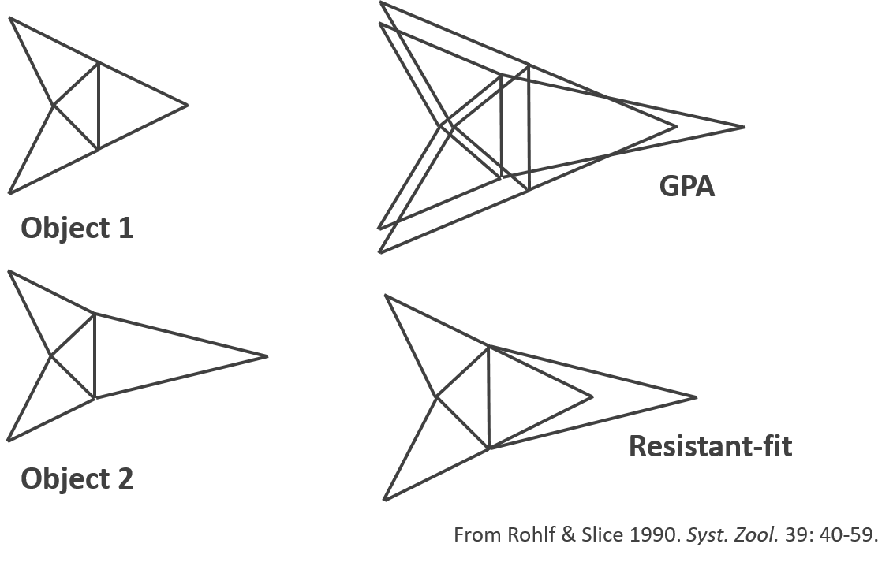  
```
---

### Resistant-Fit: Comments

+ Advantages:  
  + Method is robust, even when up to 50% of the landmarks are variable
	+ Makes intuitive sense, because shape variation is localized where it occurs

+ Disadvantages:  
  + Does not use a specific quantity for optimization, so the quality of  	 	the results cannot be assessed
  + No theoretical framework of shape space available, and statistical properties have not been fully explored
  + In empirical datasets, diagnosing the Pinocchio effect is very difficult (does one even have it?)

+ In practice, for most biological datasets, there is very little difference, so use GPA
---

### Superimposition: Summary

+ Raw landmark coordinates include non-shape information, which we need to account for in order to obtain shape variables
+ This is done through superimposition, which removes the effects of location, size and orientation in the data
+ **GPA is the preferred method**: intuitive criterion for optimization (LS); statistically robust; well known properties of resulting shape space

+ Superimposition (plus projection) creates the shape space where statistical hypotheses are tested
+ Because of standardization (location , size, rotation), the resulting shape space has fewer dimensions than the raw data:
  + $2p-4$ for 2D data
  + $3p-7$ for 3D data
---

### How Different Are Two Shapes?

+ No difference in shape: landmark coordinates completely coincident
+ **Difference** in shape: difference in landmark coordinates

```{r, echo = FALSE, fig.align = "center", out.width="70%"}
  include_graphics("LectureData/03.superimposition/TwoShapes.png")  
```

+ **Procrustes distance**: measures the amount of shape difference between two objects

$$D_{Proc}=\sqrt{\sum_{i,j}^{k,p}\left(\mathbf{Z}_{1.ij}-\mathbf{Z}_{2.ij}\right)^2}$$

+ This measures how 'far apart' two shapes are in shape space
  + The question is: what does shape space look like? 
---

### Shape Space 

.pull-left[
+ After GPA, each landmark configuration is a point in shape space
  + Each shape occupies a unique point in shape space
  + The of distribution of points in shape space is the consensus (the mean shape)
  + The metric defining shape space is  Procrustes distance $D_{Proc}$

$$D_{Proc}=\sqrt{\sum_{i,j}^{k,p}\left(\mathbf{Z}_{1.ij}-\mathbf{Z}_{2.ij}\right)^2}$$
+ **Shape space is curved!** $^1$ .left[.footnote[1: Example with 2,000 random (uniform) triangles. Note overabundance of shapes near 'north pole'.]]
]
.pull-right[

```{r echo=FALSE, fig.align = "center",  eval=TRUE,out.width="90%"}
n=2000
p=3
k=2
tri<- arrayspecs(matrix(runif(n*p*k),nrow=n),p=p,k=k)
tri.gpa <- gpagen(tri,Proj = FALSE, print.progress = FALSE)
pc.tri <- prcomp(two.d.array(tri.gpa$coords))$x
mult.pc <- ifelse(which.min(abs(range(pc.tri[,3])))==1,-1,1) #make'up-facing'

plot<-scatterplot3d(pc.tri[,1],pc.tri[,2],mult.pc*pc.tri[,3], asp=1, pch=21,bg="red", tick.marks = FALSE, box=FALSE,xlab = "", ylab = "", zlab = "")

```
]
---

### Tangent Space

+ Statistics in curved spaces become tricky
+ Solution: project to a linear space *tangent* to shape space (tangent to the mean shape, to minimize distortion)

```{r, echo = FALSE, fig.align = "center", out.width="40%"}
  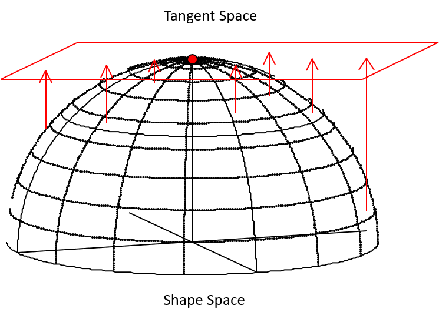  
```

+ How do we accomplish this? 
  + Orthogonal Projection (via Burnaby's equation)
  + Thin-plate spline

+ Methods turn out to be identical (next lecture)
