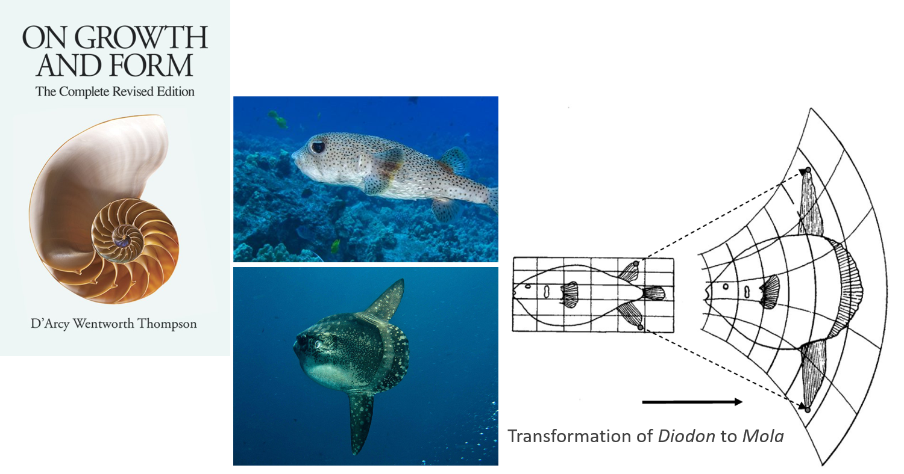
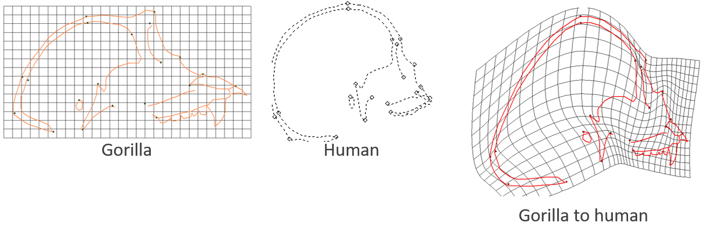
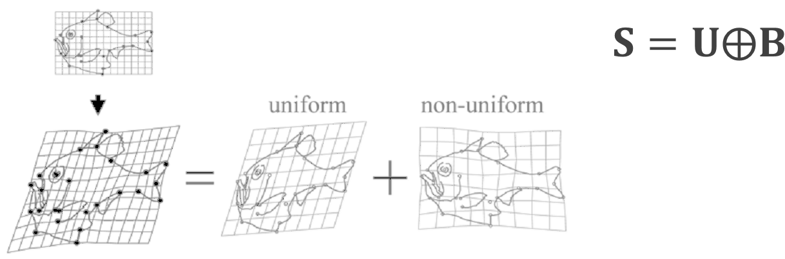
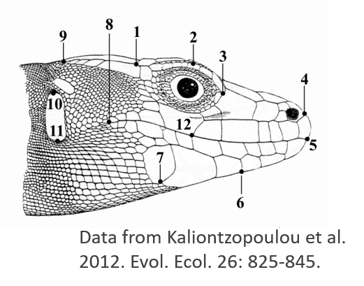
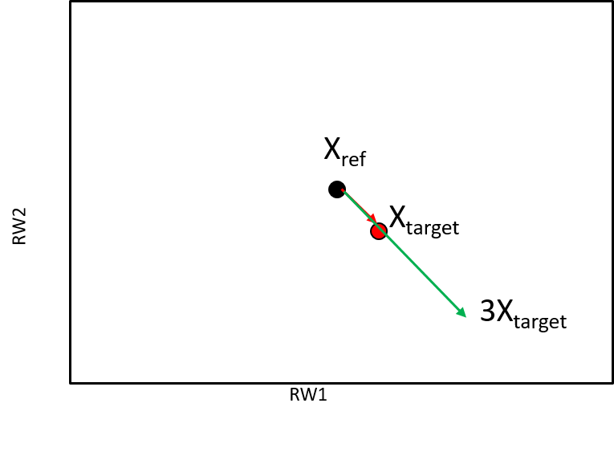

```{r setup, include=FALSE, echo = TRUE, tidy = TRUE}
library(knitr)
library(geomorph)
opts_chunk$set(echo = TRUE)

library(xaringanthemer)
style_mono_light()
```

### From GPA to Shape Data

.pull-left[
```{r echo=FALSE, eval=TRUE,fig.align = "center", out.height="80%"}
library(scatterplot3d)
lizards <- readland.nts('LectureData/04.shape.vars/lizards_LAT.nts')
links <- read.csv('LectureData/04.shape.vars/links.txt', header=FALSE, sep = " ")
liz.lab <- read.csv('LectureData/04.shape.vars/liz_groups.csv',header=TRUE, sep="\t")
col.gp <- rep("red",nrow(liz.lab))
col.gp[which(liz.lab$SEX=='M')] <- 'blue'

Y.gpa <- gpagen(lizards, print.progress = FALSE)

par(mfrow=c(1,2)) 
plotAllSpecimens(lizards, links = links)
plotAllSpecimens(Y.gpa$coords, links=links)
par(mfrow=c(1,1)) 
```
]

.pull-right[
+ In this lecture we:
  + Obtain variables we can use for analyses
  + Review the relative position of individuals in shape space
  + Visualize shape variation
]
---

### Shape Spaces from GPA
.pull-left[
+ After GPA, each landmark configuration is a point in shape space
  + Each shape occupies a unique point in shape space
  + The of distribution of points in shape space is the consensus (the mean shape)
  + The metric defining shape space is  Procrustes distance $D_{Proc}$

$$D_{Proc}=\sqrt{\sum_{i,j}^{k,p}\left(\mathbf{Z}_{1.ij}-\mathbf{Z}_{2.ij}\right)^2}$$
+ **Shape space is curved!** $^1$ .left[.footnote[1: Example with 2,000 random (uniform) triangles. Note overabundance of shapes near 'north pole'.]]
]
.pull-right[

```{r echo=FALSE, fig.align = "center",  eval=TRUE,out.width="90%"}
n=2000
p=3
k=2
tri<- arrayspecs(matrix(runif(n*p*k),nrow=n),p=p,k=k)
tri.gpa <- gpagen(tri,Proj = FALSE, print.progress = FALSE)
pc.tri <- prcomp(two.d.array(tri.gpa$coords))$x
mult.pc <- ifelse(which.min(abs(range(pc.tri[,3])))==1,-1,1) #make'up-facing'

plot<-scatterplot3d(pc.tri[,1],pc.tri[,2],mult.pc*pc.tri[,3], asp=1, pch=21,bg="red", tick.marks = FALSE, box=FALSE,xlab = "", ylab = "", zlab = "")

```
]
---

### Consequences of GPA

+ With GPA, specimen location, scale and rotation are standardized, resulting in redundant dimensions
  + $2p-4$ for 2D landmarks or $3p-7$ for 3D landmarks

+ Statistical Challenges:
  + Covariance matrices are singular, so parametric statistical hypothesis testing (model evaluation) cannot be completed (divide by zero)
  + Shape space is curved, and most standard statistics assume linear spaces

--

+ Solutions:
  + Data projection to a tangent space. This provides both a linear approximation to shape space and allows for redundant dimensions to be removed
   + Use RRPP (residual randomization in permutation procedures) for evaluating statistical hypotheses
---

### Kendall's Tangent Space Coordinates

+ Orthogonal projection of shapes to linear tangent space

$$\mathbf{Z}'=\mathbf{Z\left(I_{kp}-Z_c^T(Z_cZ_c^T)^{-1}Z_c\right)}$$

```{r, echo = FALSE, fig.align = "center",out.width="50%"}
include_graphics("LectureData/04.shape.vars/OrthProj.png")  
```
--

+ Specimen scores from projection are Kendall’s tangent space coordinates (Dryden and Mardia, 1993; Kent 1994)
+ Perform PCA and retain only 2p-4 (3D: 3p-7) shape variables with variation if desired $^1$

.footnote[1: Permutation via RRPP is now standard practice, so this step is not strictly necessary!]
---

### Kendall's Tangent Space Coordinates

+ Random uniform shapes *ARE* uniformally distributed in Tangent Space! $^1$ 

.footnote[1: Same set of 2,000 randomly generated triangles.]

```{r echo=FALSE, eval=TRUE,fig.align = "center", out.width="40%"}
plot(pc.tri[,1:2], asp=1, pch=21, bg="red")

```
---

### Shape Differences as Deformations

+ With Tangent Space we can view patterns of shape variation; what about visualzing individual shape differences? 
+ D'Arcy Thompson, in *On Growth and Form* (1917) visualized shape differences using transformation grids  
+ Simple mathematical models to represent complex morphological changes 

```{r, echo = FALSE, fig.align = "center", out.width="50%"}
  
```

+ Today we use the *Thin-Plate Spline* to generate such visualizations
---

### Shape Deformations: the Thin-Plate Spline

+ Based on D'Arcy Thompson's, Bookstein (1989) proposed using the thin-plate spline for providing a mathematically accurate representation of shape change (math was borrowed from engineering methods from 1980s)
+ Deformation of a *reference* to a *target* specimen
+ The coefficients of the fitted TPS model describe shape changes

```{r, echo = FALSE, fig.align = "center", out.width="50%"}
  
```

+ The TPS is an alternative way of projecting aligned shape coordinates to tangent space (different math, but same result: shown later)
---

### The Thin-Plate Spline

+ TPS is a smooth interpolation function (i.e., a doubly-differentiated equation)
+ It models the differences in landmark locations between the reference and target specimen for each coordinate dimension separately (x,y)

```{r, echo = FALSE, fig.align = "center", out.width="50%"}
include_graphics("LectureData/04.shape.vars/TPSConcept.png")  
```

+ General TPS Model for $1$ landmark: 
$$\tiny\begin{bmatrix} x^1\\y^1\end{bmatrix}=A\begin{bmatrix}1\\x\\y\end{bmatrix}+\sum_{i=1}^pw_iU(r_i)$$

where $\tiny{A}\begin{bmatrix}1\\x\\y\end{bmatrix}$ represents the affine (uniform) component and $\tiny\sum_{i=1}^pw_iU(r_i)$ represents to non-affine (non-uniform) component
---

### TPS Computations

+ 1: From the reference (consensus) estimate: $\mathbf{L}= \left[ \begin{array}{c|c} \mathbf{P} & \mathbf{Q}\\ \hline \mathbf{Q}^T & \mathbf{0} \\ \end{array} \right]$

--

+ where: $\mathbf{Q}= \begin{bmatrix} 1 & x_1 & y_1 \\ 1 & x_2 & y_2 \\ \vdots & \vdots & \vdots \\ 1 & x_p & y_p  \end{bmatrix}$  & $\mathbf{0}= \begin{bmatrix} 0 & 0 & 0 \\ 0 & 0 & 0 \\ 0 & 0 & 0 \end{bmatrix}$  & $\mathbf{P}=\tiny\begin{bmatrix} 0 & U(r_{12}) & U(r_{12}) & \dots & U(r_{1p}) \\ U(r_{21}) & 0 & U(r_{23}) & \dots & U(r_{2p}) \\ U(r_{31}) & U(r_{32}) & 0 & \dots & U(r_{3p}) \\ \vdots & \vdots & \vdots & \ddots & \vdots \\ U(r_{p1}) & U(r_{p2}) & U(r_{p3}) & \dots & 0 \end{bmatrix}$ 

--

+ Here, $\small\mathbf{Q}$ contains the coordinates of the reference and $\small\mathbf{P}$ is found as:  $\small{U(r_{ij})}=r_{ij}^2ln(r_{ij})$ with $\small{r_{ij}}$ as the distance between the $\small{i^{th}}$ and $\small{j^{th}}$ landmarks 
  + For 3D data, $\small{0}$ is $\small{4 \times 4}$. Also, for 3D data: $\small{U(r_{ij})}=|{r_{ij}}|$ 
---

### TPS Computations (Cont.)

+ 2: Obtain $\small\mathbf{L}^{-1}$.  Upper-left $p \times p$ block is the *Bending Energy Matrix* ( $\small\mathbf{L}_p^{-1}$)

--

+ 3: Perform eigenanalysis of $\small\mathbf{L}_p^{-1}$ to obtain **Principal Warps** which are the $p-3$ eigenvectors containing variation ( $p-4$ for 3D)

$$\small\mathbf{L}_p^{-1}=\mathbf{E\Lambda{E}^T}$$

--

+ 4: Estimate non-uniform shape variables (**Partial Warp Scores**) via projection onto principal warps $\small\mathbf{E}$:

$$\small\mathbf{W=\mathcal{V}(I_2\otimes{E})=\mathcal{V}\begin{bmatrix}\mathbf{E} & \mathbf{0} \\ \mathbf{0} & \mathbf{E} \end{bmatrix})}$$

where $\small\mathbf{\mathcal{V}=\mathcal{[V_x|V_y]}}$ with $\small\mathbf{\mathcal{V_x}=\mathbf{(X-\overline{X}_{ref})}}$ & $\small\mathbf{\mathcal{V_y}}=\mathbf{(Y-\overline{Y}_{ref})}$

--

+ Note, one can weight partial warp scores inversely by spatial scale as: 
$\small\mathbf{W}=\mathbf{\mathcal{V}(I_2\otimes{E\Lambda^{-\alpha/2}})}$

  + There are $2p-6$ partial warp scores ( $3p-12$ for 3D data)
---

### TPS Model: Uniform (Affine) Shape Estimation

+ Affine shape describes shape changes where parallel lines remain parallel
+ Affine shape found as the complement to non-affine
+ Total shape (from GPA) is the sum of affine and non-affine shape:
$$\small\mathbf{S=U\oplus{B}}$$

+ Computations $^1$  
  + Construct space orthogonal to non-affine shape component: $\small\mathbf{N=I_p-E(E^TE)^{-1}E^T}$
  + Project specimens: $\small\mathbf{\mathcal{V}(N\oplus{I_k})}$
  + Extract affine (uniform) dimensions through singular-value decomposition (SVD): $\small\mathbf{LSR^T=\mathcal{V}(N\oplus{I_k})}$  
  + There are $2$ uniform dimensions ( $5$ for 3D)

.footnote[1: From Rohlf and Bookstein 2003]
---

### Total Shape Variation

+ Shape variation includes **BOTH** uniform and non-uniform components

```{r, echo = FALSE, fig.align="center", out.width="70%"}
  
```

+ Together, the  Partial Warps + Uniform component scores comprise the total set of shape variables: $\small\mathbf{W}=\mathbf{V(I_2\otimes{E})|U}$
  + There are $2p-4$ shape variables for 2D data and $3p-7$ for 3D data
---

### TPS Model: Example

+ Model shape differences from a square to a kite (only non-uniform shape differences present)

```{r, echo = FALSE, fig.align = "center", out.width="40%"}
include_graphics("LectureData/04.shape.vars/SquareKite.png")  
```

$\small\mathbf{Z}_{sqr}=\begin{bmatrix} 0 & 0.5\\ -0.5 & 0\\ 0 & -0.5\\ 0.5 & 0 \end{bmatrix}$ and $\small\mathbf{Z}_{kite}=\begin{bmatrix} 0 & 0.375\\ -0.5 & 0.125\\ 0 & -0.625\\ 0.5 & 0.125 \end{bmatrix}$
---

### TPS Model: Example (Cont.)

+ Obtain: $\tiny\mathbf{L}= \left[ \begin{array}{c|c} \mathbf{P} & \mathbf{Q}\\  \hline \mathbf{Q}^T & \mathbf{0} \\ \end{array} \right]=\left[ \begin{array}{cccc|ccc} 0 & -0.173 & 0 & -0.173 & 1 & 0 & 0.5\\ -0.173 & 0 & -0.173 & 0 & 1 & -0.5 & 0 \\ 0 & -0.173 & 0 & -0.173 & 1 & 0 & -0.5\\  -0.173 & 0 & -0.173 & 0 & 1 & -0.5 & 0 \\ \hline 1 & 1 & 1 & 1 & 0 & 0 & 0 \\ 0 & -0.5 & 0 & 0.5 & 0 & 0 & 0 \\ 0.5 & 0 & -0.5 & 0 & 0 & 0 & 0 \\ \end{array} \right]$

--

+ Then calculate: $\tiny\mathbf{L^{-1}}=\left[ \begin{array}{cccc|ccc} 0.7271 & -0.7271 & 0.7271 & -0.7271 & 0.25 & 0 & 1\\ -0.7271 & 0.7271 & -0.7271 & 0.7271 & 0.25 & -1 & 0 \\ 0.7271 & -0.7271 & 0.7271 & -0.7271 & 0.25 & 0 & -1\\  -0.7271 & 0.7271 & -0.7271 & 0.7271 & 0.25 & 1 & 0 \\ \hline 0.25 & 0.25 & 0.25 & 0.25 & 0.087 & 0 & 0 \\ 0 & -1 & 0 & 1 & 0 & 0 & 0 \\ 1 & 0 & -1 & 0 & 0 & 0 & 0 \\ \end{array} \right]$

--

+ $\tiny\mathbf{L_p^{-1}}=\left[ \begin{array} 0.7271 & -0.7271 & 0.7271 & -0.7271 \\ -0.7271 & 0.7271 & -0.7271 & 0.7271 \\ 0.7271 & -0.7271 & 0.7271 & -0.7271 \\  -0.7271 & 0.7271 & -0.7271 & 0.7271 \\  \end{array} \right]$
---

### TPS Model: Example (Cont.)

+ Solve: $\small\mathbf{L}_p^{-1}=\mathbf{E\Lambda{E}^T}$

+ $\tiny\mathbf{L_p^{-1}}=\left[ \begin{array} 0.7271 & -0.7271 & 0.7271 & -0.7271 \\ -0.7271 & 0.7271 & -0.7271 & 0.7271 \\ 0.7271 & -0.7271 & 0.7271 & -0.7271 \\  -0.7271 & 0.7271 & -0.7271 & 0.7271 \\  \end{array} \right]=$

--

+ $\tiny\mathbf{E}=\left[ \begin{array} \mathbf{0.5} & 0.866 & 0 & 0 \\ \mathbf{-0.5} & 0.289 & 0 & -0.0816 \\ \mathbf{0.5} & -0.289 & 0.707 & -0.408 \\  \mathbf{-0.5} & 0.289 & -0.707 & 0.408 \\  \end{array} \right]$ & $\tiny\mathbf{\Lambda}=\left[ \begin{array} \mathbf{2.885} & 0 & 0 & 0 \\  0 & 0 & 0 & 0  \\  0 & 0 & 0 & 0 \\ 0 & 0 & 0 & 0 \\ \end{array} \right]$

--

+ Obtain shape variables: $\small\mathbf{W=VE}$   using:   $\tiny\mathbf{V_{kite}}=\begin{bmatrix} 0 & 0 & 0 & 0 & -1.25 & -1.25 & -1.25 & -1.25 \end{bmatrix}$

--

+ $\tiny\mathbf{W=VE}=\mathbf{V_{kite}}\begin{bmatrix} 0.5 & 0 \\ -0.5 & 0 \\ 0.5 & 0 \\ -0.5 & 0 \\  0 & 0.5 \\  0 & -0.5 \\  0 & 0.5 \\  0 & -0.5 \\   \end{bmatrix}=\begin{bmatrix} 0 \\ -0.25 \end{bmatrix}$

+ NOTE: Uniform shape variables, $\small\mathbf{U_1}=0$ & $\small\mathbf{U_2} = 0$ for this example
---

### Which Shape Variables to Use?

+ We now have 3 shape variable options: 
  + GPA-aligned coordinates
  + Kendall's Tangent Space coordinates (GPA + orthogonal projection)
  + TPS variables (partial warp scores + uniform shape) 

--

.pull-left[
```{r echo=FALSE, eval=TRUE,fig.align = "center", out.width="70%"}
Y.gpa2 <- gpagen(lizards, Proj = FALSE, print.progress = FALSE)
Kendall.d <- dist(two.d.array(Y.gpa$coords))
GPA.d <- dist(two.d.array(Y.gpa2$coords))

plot(GPA.d,Kendall.d)
```
]
.pull-right[
+ Plot of shape distances for *Podarcis* data obtained from GPA-shape space and Kendall's Tangent space.      + Correlation of 1.0 in this case (usually very, very high)

+ **AND** correlation between PWS+U vs. Tangent space is **ALWAYS** 1.0 (see Rohlf 1999)
]
---

### Shape Variables: Conclusions

+ Proc. Tangent coordinates & TPS shape variables yield identical results
  + They are simply rotations of one another

+ GPA-aligned coordinates (unprojected) are close, but not exact 
  + Difference due to curvature of shape space

--

+ **Use Kendall´s Tangent Space Coordinates** to represent shape
+ These are found from GPA+Orthogonal Projection

+ NOTE: Most current papers use tangent space coordinates, aka Procrustes residuals combined with resampling tests (to accommodate singular dimensions) 
  + TPS then, is frequently used to visualize shape differences
---

### Exploring Shape Variation

+ GM data are points in high-dimensional shape space
  + e.g. for $p=20$ & $k=3$, shape space comprises 53 dimensions
+ Our human brains are limited to perception in up to 3 dimensions
+ We need tools for visualizing and exploring shape variation in high-dimensional data spaces

+ Principal Components Analysis (PCA) is one such tool
---

### Principal Components Analysis (PCA)

+ PCA attempts to summarize the variation in high-dimensional data in as few dimensions as is possible
+ Mathematically consists of a rigid rotation of the data based on directions of variation, followed by projection to those new summary axes
+ First one finds the set of axes the describe progressively less variation in the data
+ Next, the data are rotated so that the main axis of variation (PC1) is horizontal
+ Subsequent axes are orthogonal to PC1
---

### PCA: Conceptual Visualization

+ This is what PCA does:

.pull-left[
```{r echo=FALSE, out.width="70%" }
bumpus<-read.csv("LectureData/04.shape.vars/bumpus.csv",header=T)
Y.2<-cbind(bumpus$TL,bumpus$AE)
Y.pc<-prcomp(Y.2)$x
plot(Y.2, pch=21, bg="red", xlab="Total Length", ylab="Alar Extent")
```
]
.pull-right[
```{r echo=FALSE, out.width="70%" }
plot(Y.pc, asp=1,pch=21, bg="red", xlab="PC1", ylab="PC2")
```
]
+ PCA has performed a rigid rotation of the original data, so that variation is aligned with the new (PC) axes

---

### PCA: Standard Computations

+ Principal component analysis (PCA) is two things: (1) a singular-value decomposition (SVD) of a symmetric matrix and (2) projection of mean-centered or standardized data onto eigenvectors from SVD. 

+ Using mean-centered data $(\small\mathbf{Z})$ we calculate: $\small\hat{\mathbf{\Sigma}}=\frac{\mathbf{Z}^{T}\mathbf{Z}}{n-1}$ 

+ We then decompose the covariance matrix via eigen-analysis (SVD): $^1$
.pull-left[
$$\small\hat{\mathbf{\Sigma}}=\mathbf{V} \mathbf{\Lambda} \mathbf{V}^T$$

+ This step identifies a set of orthogonal axes describing directions of variation. These are the columns of $\small\mathbf{U}$. Next we project the data onto these axes as: 

$$\small\mathbf{P} = \mathbf{Z}\mathbf{V}$$
]
.pull-right[

+ Here, $\small\mathbf{P}$ represent the set of projection scores (principal component scores) on each of the PC axes. These are used in the subsequent plot.

+ Finally, the percent variation explained by any principal component (column of $\mathbf{V}$) is: 
$\frac{\lambda_i}{tr\mathbf{\Lambda}}$
]
.footnote[
1: In some fields, the correlation matrix is used; particularly if variables are in different units or scale. (see Shape Statistics I lecture for details). 
]
---

### PCA: General Computations

+ An alternative (and more general) approach uses a singular-value decomposition (SVD) directly on $\small\mathbf{Z}$: $^1$ 

$$\small{\mathbf{Z}}=\mathbf{U} \mathbf{D} \mathbf{V}^T$$

+ Here, $\small\mathbf{D^2}$ expresses the percent-variation explained by each PC-axis, which are found as the right-singular vectors in $\small\mathbf{V}$.

+ PC scores are found as: 

$$\small\mathbf{P} = \mathbf{UD}$$
+ For multivariate continuous data, this yields identical results to the previous computations

.footnote[
1 : Eigenanalysis of the *inner product* $\small\mathbf{Z}^{T}\mathbf{Z}$ yields $\small\mathbf{V}$, while eigenanalysis of the *outer product* $\small\mathbf{Z}\mathbf{Z}^{T}$ yields $\small\mathbf{U}$

2: Yet another way to obtain the same ordination is via a decomposition (SVD) of the centered outer product (distance) matrix. This is called *Principal Coordinates Analysis* or multi-dimensional scaling

3: See Shape Statistics I lecture
]
---

### PCA of Shape Data: Relative Warps

+ SVD of shape variation

$$\small{\mathbf{W^*}}=\mathbf{U} \mathbf{D} \mathbf{V}^T$$

+ Here, $\small\mathbf{UD}$ are the PC scores (relative warp scores) of the shape data

--

+ NOTE: if **W** found as: $\small\mathbf{W}=\mathcal{V}\mathbf{(I_2\otimes{E\Lambda^{-\alpha/2}})}$ PCA=RWA is weighted by spatial scale of deformations of the ***non-affine*** shape variation

+ In this case
  + $\small\alpha = 0$: unweighted analysis
  + $\small\alpha < 0$: emphasizes small-scale variation
  + $\small\alpha > 0$: emphasizes large-scale variation

--

+ Careful! $\small\alpha\neq{0}$ distorts data space, so it changes the relationships between observations!
---

### RWA: Example

+ PCA of *Podarcis* data

.pull-left[
```{r echo=FALSE, fig.align = "center", out.width="80%" }
  
```
]
.pull-right[
```{r echo=FALSE, fig.align = "center", out.width="80%" }
par(mfcol = c(1, 2))
#  
plotAllSpecimens(Y.gpa$coords, links=links)
PCA <- gm.prcomp(Y.gpa$coords)
plot(PCA,pch = 21, bg=col.gp,cex = 2)
par(mfcol=c(1,1))
```
]
---

### RWA: Example (Cont.)

```{r echo=FALSE, fig.align = "center", out.width="50%" }
ref <- mshape(Y.gpa$coords)
p<-nrow(ref)
L.inv <- geomorph:::Ltemplate(ref)
BE <- svd(L.inv)
PrW.1 <- kronecker(diag(2),BE$u[,1:(p-3)]%*%diag(BE$d[1:(p-3)]^-(1/2)))
PrW.m1 <- kronecker(diag(2),BE$u[,1:(p-3)]%*%diag(BE$d[1:(p-3)]^-(-1/2)))

PW.1 <- two.d.array(simplify2array(lapply(1:dim(Y.gpa$coords)[3], 
                                          function(j) as.vector(Y.gpa$coords[,,j])%*%PrW.1)))

PW.m1 <- two.d.array(simplify2array(lapply(1:dim(Y.gpa$coords)[3], 
                                          function(j) as.vector(Y.gpa$coords[,,j])%*%PrW.m1)))

par(mfcol = c(2, 2))
plot(prcomp(two.d.array(Y.gpa$coords))$x,asp=1, pch=21, bg=col.gp, cex=2, main = "Orig: alpha = 0")
plot(prcomp(PW.1)$x,asp=1, pch=21, bg=col.gp, cex=2, main = "alpha = 1")
plot(prcomp(PW.m1)$x,asp=1, pch=21, bg=col.gp, cex=2, main = "alpha = -1")
par(mfcol=c(1,1))
```
---

### RWA: Thoughts

+ Ordination via PCA extremely useful for exploring variation in shape space

+ $\small\alpha\neq{0}$ in RWA allows emphasizing small- or large-scale deformations
  + However, $\small\alpha\neq{0}$ changes shape space, so we need to choose carefully
  + Additionally, only non-affine component of shape may be viewed when $\small\alpha\neq{0}$ (an incomplete view of shape variation)
  + In practice, there is generally no conceptual reason of biological relevance for emphasizing deformations at different spatial scales

+ $\small\alpha{=0}$ is preferred: no *a priori*, arbitrary emphasis on specific variables, and it allows the use of total shape space (i.e. PW scores + U)
---

### Visualizing Shape Differences

+ A major advantage of GMM over multivariate morphometrics is that the geometry of shape is retained throughout the analysis
+ Therefore, one should be able to visualize exactly how shapes differ from one another

+ As an interpolation function, TPS allows us to precisely map all points of one shape
to those of another shape, and visualize how they differ

+ With it one may visualize:
  + Differences between groups
  + Extremes of PC axes
  + How shape changes with size (allometry)
  + Shape evolution (differences between ancestor and descendent on a phylogeny)

---
### Visualizing Shape Differences: Example

- TPS of male vs. female *Podarcis*

```{r echo=FALSE, out.width="40%" }
male <- mshape(Y.gpa$coords[,,which(liz.lab$SEX=='M')])
female <- mshape(Y.gpa$coords[,,which(liz.lab$SEX=='F')])

```

.pull-left[
```{r echo=TRUE, out.width="80%" }
plotRefToTarget(male,female,links = links)
```
]
.pull-right[
```{r echo=TRUE, out.width="80%"}
plotRefToTarget(female,male,links = links)
```
]
---

### Magnifying Shape Differences

+ One can also magnify shape differences to aid biological interpretation 
+ The TPS is just a vector in shape space ( $Ref \rightarrow Target$), which can be extended in length

```{r, echo = FALSE, fig.align = "center", out.width="40%"}
  
```

---

### Magnifying Shape Differences: Example

+ TPS of male vs. female *Podarcis* (5X): differences in posterior region of skull more apparent

.pull-left[
```{r echo=TRUE, out.width="80%" }
plotRefToTarget(male,female, mag = 5, links = links)
```
]
.pull-right[
```{r echo=TRUE, out.width="80%"}
plotRefToTarget(female,male, mag = 5, links = links)
```
]

---

### Shape Variables: Conclusions

+ Produce shape variables through projection to tangent space:
  + **Kendall´s tangent space coordinates (Procrustes residuals [GPA+Projection])**

+ Explore shape variation through ordination in tangent space:
  + **PCA of shape data (aka Relative Warps)**

+ Visualize shape variation to make biological interpretations:
  + **Use TPS to produce deformation grids**
