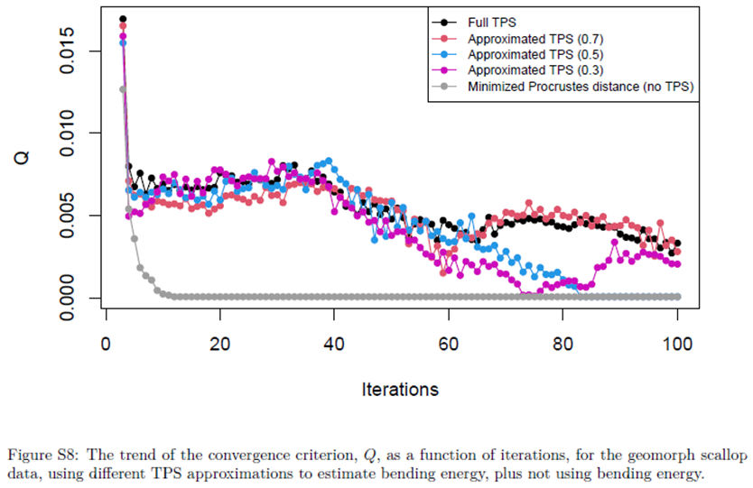

```{r setup, include=FALSE, echo = TRUE, tidy = TRUE}
library(knitr)
library(geomorph)
opts_chunk$set(echo = TRUE)
library(xaringanthemer)
style_mono_light()
```

### Generalized Procrustes Analysis 

+ Align objects to common coordinate system using superimposition (GPA)

$$\small\mathbf{Z}=\frac{1}{CS}\mathbf{(Y-\overline{Y})H}$$
```{r, echo = FALSE, fig.align = "center", out.width="40%"}
  include_graphics("LectureData/03.superimposition/OPA-steps.png")  
```

+ Works for both 2-D and 3-D landmarks data
+ *THE* fundamental approach for morphometrics
---

### The Problem with Curves I

+ Landmarks provide rigorous quantification of shape
+ Some objects have few landmarks, but have defined boundaries (curves) or surfaces

```{r, echo = FALSE, fig.align = "center", out.width="80%"}
include_graphics("LectureData/05.semilandmarks/semiland-motiv.png")  
```

+ How do we capture shape information from such structures? 
---

### The Problem with Curves II

+ Some objects contain multiple ‘types’ of morphometric data
+ Types typically analyzed separately

```{r, echo = FALSE, fig.align = "center", out.width="80%"}
include_graphics("LectureData/05.semilandmarks/Face.png")  
```

+ How do we quantify the overall shape of such structures? 
---

### Mathematically-Defined Points: Problems

+ Define landmark homology mathematically (e.g., equal spacing)
+ Often produces suggestive (but incorrect) results 

```{r, echo = FALSE, fig.align = "center", out.width="60%"}
include_graphics("LectureData/05.semilandmarks/RectangEx.png")  
```

--

+ Implied shape differences: $^1$

```{r, echo = FALSE, fig.align = "center",out.width="60%"}
include_graphics("LectureData/05.semilandmarks/RectangTPS.png")  
```

+ Can we estimate the shape difference without adding the twisting?

.footnote[
1: from Gunz et al. (2005) in *Modern morphometrics in physical anthropology.*] 
---

### Mathematically-Defined Points: Problems (Cont.)

+ Another example

```{r, echo = FALSE, fig.align = "center", out.width="70%"}
include_graphics("LectureData/05.semilandmarks/BarEx.png")  
```

--

+ Implied shape differences:

```{r, echo = FALSE, fig.align = "center", out.width="70%"}
include_graphics("LectureData/05.semilandmarks/BarTPS.png")  
```

+ Can we estimate the shape difference without adding the twisting?

---

### Semilandmarks and Procrustes Relaxation $^1$

+ Procrustes superimposition of 2D points and curves (Bookstein 1997)

+ Points along curves are ‘degenerate’ landmarks (semilandmarks)

+ Semilandmarks constrained to be on the curve (thus have $\small{\approx{1}}$ df)

.footnote[1: Bookstein (1997) *Med. Image Anal.*]
--

+ Digitize a set number of points along an outline, and allow them to ‘slide’ along curve to improve the fit of a specimen to a reference curve: minimize difference between them

--

+ Treat as points for standard landmark analysis (GPA+TPS)

---

### Procrustes Relaxation: Conceptual Procedure

+ Incorporate 'sliding' of semilandmarks into GPA algorithm

+ GPA algorithm with sliding landmarks: Procedure
  + 1: Translate and scale specimens
  
  + 2: LS rotation, find consensus

--

  + 3: **‘Slide’ landmarks along curve in some way**

  + 4: Perform GPA to obtain new consensus

  + 5: Iterate steps 2-5 to improve fit 

--

+ Two analytical issues:
  + What direction to slide?
  + How far to slide?
---
    
### What Direction to Slide?

```{r, echo = FALSE, fig.align = "center", out.width="30%"}
include_graphics("LectureData/05.semilandmarks/DirToSlide.png")  
```

+ Slide landmarks along curve

+ Adjacent points on curve define sliding directions: $\small{U}_{ij}=[(x_{j-1}-x_{j+1}),(y_{j-1}-y_{j+1})]$

--

+ Assemble into tangent direction matrix

$$\tiny\mathbf{U}=\begin{bmatrix} 0 & 0 & 0 \\ u_{2x} & 0 & 0\\ 0 & u_{3x} & 0 \\ 0 & 0 & u_{4x} \\ 0 & 0 & 0 \\ \hline 0 & 0 & 0 \\ u_{2y} & 0 & 0\\ 0 & u_{3y} & 0 \\ 0 & 0 & u_{4y} \\ 0 & 0 & 0 \\ \end{bmatrix}$$

+ Landmark positions after sliding found as: $\small\mathbf{y}^*=\mathbf{y^0-Ut}$

Note $\mathbf{y} = vec(\mathbf{Y})$
---

### How Far to Slide?

+ Most conservative approach: slide to minimize shape differences

+ Sliding defined by $\small\mathbf{t}$:	$\small\mathbf{y}^*=\mathbf{y^0-Ut}$

###### ( $\tiny\mathbf{Y^0}$ and $\tiny\mathbf{Y_{ref}}$  are assembled by $\small{x}$ then $\small{y}$ coordinates) 

+ Two criteria: bending energy $(\small{BE})$ & Procrustes distance $(\small{D}_{Proc})$ 
---

### How Far to Slide?

+ Most conservative approach: slide to minimize shape differences

+ Sliding defined by $\small\mathbf{t}$:	$\small\mathbf{y}^*=\mathbf{y^0-Ut}$

###### ( $\tiny\mathbf{Y^0}$ and $\tiny\mathbf{Y_{ref}}$  are assembled by $\small{x}$ then $\small{y}$ coordinates) 

+ Two criteria: bending energy $(\small{BE})$ & Procrustes distance ( $\small{D}_{Proc}$) 

+ 1: Slide landmarks to minimize $\small{BE}$ via **GLS**:   

$$\small\mathbf{t}=(\mathbf{U^T\mathcal{L}_p^{-1}U})^{-1}\mathbf{\mathcal{L}_p^{-1}U^T}(\mathbf{y^0-y_{ref}})$$ 

  + where $\small\mathbf{\mathcal{L}_p^{-1}}=\begin{bmatrix} \mathbf{L}_p^{-1} & 0 \\ 0 & \mathbf{L}_p^{-1} \end{bmatrix}$
---

### How Far to Slide?

+ Most conservative approach: slide to minimize shape differences

+ Sliding defined by $\small\mathbf{t}$:	$\small\mathbf{y}^*=\mathbf{y^0-Ut}$

###### ( $\tiny\mathbf{Y^0}$ and $\tiny\mathbf{Y_{ref}}$  are assembled by $\small{x}$ then $\small{y}$ coordinates) 
 
+ Two criteria: bending energy $(\small{BE})$ & Procrustes distance ( $\small{D}_{Proc}$) 

+ 1: Slide landmarks to minimize $\small{BE}$ via **GLS**:   

$$\small\mathbf{t}=(\mathbf{U^T\mathcal{L}_p^{-1}U})^{-1}\mathbf{\mathcal{L}_p^{-1}U^T}(\mathbf{y^0-y_{ref}})$$ 

  + where $\small\mathbf{\mathcal{L}_p^{-1}}=\begin{bmatrix} \mathbf{L}_p^{-1} & 0 \\ 0 & \mathbf{L}_p^{-1} \end{bmatrix}$

+ 2: Slide landmarks to minimize $\small{D}_{Proc}$:
$$\small\mathbf{t}=\mathbf{U^T}(\mathbf{y^0-y_{ref}})$$ 

###### Sliding by $\tiny{D}_{Proc}$ assumes independence of semilandmarks, as $\tiny(\mathbf{U^T\mathcal{L}_p^{-1}U})^{-1}\mathcal{L}_p^{-1}=\mathbf{I}$ (this is not realistic).
---

### Procrustes Relaxation: Flow of Computations

+ Sliding incorporated into GPA algorithm
  + 1: Translate and scale specimens

  + 2: LS rotation, obtain reference and $\small\mathbf{L}_p^{-1}$

--

  + 3: Calculate tangent directions $\small\mathbf{U}$  $$\small{U}_{ij}=[(x_{j-1}-x_{j+1}),(y_{j-1}-y_{j+1})]$$

--

  + 4: Slide landmarks along tangents using $\small{BE}$ or $\small{D}_{Proc}$
   $$\small\mathbf{t}=(\mathbf{U^T\mathcal{L}_p^{-1}U})^{-1}\mathbf{\mathcal{L}_p^{-1}U^T}(\mathbf{y^0-y_{ref}})$$
   $$\small\mathbf{t}=\mathbf{U^T}(\mathbf{y^0-y_{ref}})$$ 

--

  + 5: Perform GPA and obtain new reference.  (Note reconfigure each $\mathbf{Y^*}$ from $\mathbf{y^*}$.)

  + 6: Iterate 2 - 5 to improve fit (With BE, don't expect convergence...)
---
   
### Semilandmarks: Differing Approaches

+ Visual differences between $\small{BE}$ and $\small{D}_{Proc}$ sliding:

```{r, echo = FALSE, fig.align = "center", out.width="70%"}
include_graphics("LectureData/05.semilandmarks/SlidingCorpusEx.png")  
```

###### Mathematical comments: Using $BE$ is akin to a weighted regression, which accounts for spatial proximity (non-independence) of adjacent landmarks. This is a more reasonable model, as one uses semilandmarks *precisely* to represent curves by an adjacent set of points which are explicitly not independent
---

### Procrustes Relaxation: Refinements

+ Semilandmarks slide along tangent directions
+ But if slid too far they 'leave' the actual curve 
+ Solution is to project back to curve during GPA + sliding

```{r, echo = FALSE, fig.align = "center", out.width="70%"}
include_graphics("LectureData/05.semilandmarks/ProjToCurve.png")  
```
---

### Combining Points and Curves

```{r, echo = FALSE, fig.align = "center", out.width="30%"}
include_graphics("LectureData/05.semilandmarks/DirToSlide.png")  
```

+ One can allow landmarks to remain 'fixed' while semilandmarks slide (e.g. endpoints above)
+ Information incorporated into $\small\mathbf{U}$
+ Columns of $\small{0}$ represent landmarks that don't slide

$$\tiny\mathbf{U}=\begin{bmatrix} 0 & 0 & 0 & 0 & 0 \\ 0 & u_{2x} & 0 & 0& 0  \\ 0 & 0 & u_{3x} & 0 & 0 \\ 0 & 0 & 0 & u_{4x} & 0 \\ 0 & 0 & 0 & 0 & 0 \\ \hline 0 & 0 & 0 & 0 & 0 \\ 0 & u_{2y} & 0 & 0 & 0\\ 0 & 0 & u_{3y} & 0 & 0 \\ 0 & 0 & 0 & u_{4y} & 0 \\ 0 & 0 & 0 & 0 & 0  \end{bmatrix}$$

###### Note: with this notation, generalized inverses are required to complete GLS sliding (and process can be SLOW).  `geomorph` uses very clever algebra to eliminate redundancies in computations to speed this process up considerably
---

### Combining Landmarks and Curves: Example $^1$

+ Cranial profiles in *Homo*
+ External differences in frontal bones of archaic and modern humans are well-known
+ Archaic humans have ‘frontal flattening’ while modern human crania are more vertically rounded
+ Common anthropological interpretation:  more-rounded crania in modern humans due to enlargement of frontal lobes of brain  

+ Profiles of internal and external frontal bones were digitized from 5 mid-Pleistocene and Neanderthal crania, and 16 modern humans and compared

.footnote[1: Bookstein et al. (1999). *Anatomical Record*]
---

### Semilandmark Example: The Data

```{r, echo = FALSE, fig.align = "center", out.width="70%"}
include_graphics("LectureData/05.semilandmarks/Book99Example.png")  
```
---

### Semilandmark Example: The Data

```{r, echo = FALSE, fig.align = "center", out.width="60%"}
include_graphics("LectureData/05.semilandmarks/Book99Data.png")  
```
---

### Semilandmark Example: Results

+ Large differences in external profiles, but NO difference of internal profiles

```{r, echo = FALSE, fig.align = "center", out.width="70%"}
include_graphics("LectureData/05.semilandmarks/Book99Results.png")  
```
---

### Semilandmarks on 3D Curves

.pull-left[
+ Semilandmarks on 3D curves work identically, by defining tangent directions of $\small\Delta{x}$, $\small\Delta{y}$, and $\small\Delta{z}$

$$\tiny\mathbf{U}=\begin{bmatrix} 0 & 0 & 0 \\ u_{2x} & 0 & 0\\ 0 & u_{3x} & 0 \\ 0 & 0 & u_{4x} \\ 0 & 0 & 0 \\ \hline 0 & 0 & 0 \\ u_{2y} & 0 & 0\\ 0 & u_{3y} & 0 \\ 0 & 0 & u_{4y} \\ 0 & 0 & 0 \\ \hline 0 & 0 & 0 \\ u_{2z} & 0 & 0\\ 0 & u_{3z} & 0 \\ 0 & 0 & u_{4z} \\ 0 & 0 & 0  \end{bmatrix}$$
]
.pull-right[
+ Slide as before: 

$$\small\mathbf{t}=(\mathbf{U^T\mathcal{L}_p^{-1}U})^{-1}\mathbf{\mathcal{L}_p^{-1}U^T}(\mathbf{y^0-y_{ref}})$$
$$\small\mathbf{\mathcal{L}_p^{-1}}=\begin{bmatrix} \mathbf{L}_p^{-1} & 0 & 0 \\ 0 & \mathbf{L}_p^{-1} & 0 \\
0 & 0 & \mathbf{L}_p^{-1} \end{bmatrix}$$
  
$$\small\mathbf{t}=\mathbf{U^T}(\mathbf{y^0-y_{ref}})$$ 

]

---

### Semilandmarks on Surfaces

.pull-left[
+ 3D surface landmarks slide in the plane
+ Plane defined by PC1 & PC2 of surrounding points

```{r, echo = FALSE, fig.align = "center", out.width="75%"}
include_graphics("LectureData/05.semilandmarks/TangentPlane.png")  
```
]
.pull-right[
+ $\small\mathbf{U}$ has 2 sets of tangent directions 
  + Slide using $\small{BE}$ or $\small{D}_{Proc}$ as before

$$\tiny\mathbf{U}= \left[ \begin{array}{ccc|ccc} 0 & 0 & 0 & 0 & 0 & 0 \\ u_{2x} & 0 & 0 & w_{2x} & 0 & 0 \\ 0 & u_{3x} & 0 &  0 & w_{3x} & 0 \\ 0 & 0 & u_{4x} & 0 & 0 & w_{4x}  \\ 0 & 0 & 0 &  0 & 0 & 0\\ \hline 0 & 0 & 0 &  0 & 0 & 0\\ u_{2y} & 0 & 0 & w_{2y} & 0 & 0 \\ 0 & u_{3y} & 0 & 0 & w_{3y} & 0 \\ 0 & 0 & u_{4y} & 0 & 0 & w_{4y} \\ 0 & 0 & 0 &  0 & 0 & 0\\ \hline 0 & 0 & 0 &  0 & 0 & 0\\ u_{2z} & 0 & 0 & w_{2z} & 0 & 0\\ 0 & u_{3z} & 0 & 0 & w_{3z} & 0  \\ 0 & 0 & u_{4z} &  0 & 0 & w_{4z} \\ 0 & 0 & 0  & 0 & 0 & 0 \\ \end{array} \right]$$
]

###### NOTE: One can see that these matrices are becoming *VERY* large. That will lead to long computation time (though recall `geomorph` uses clever algorithms to speed this up! [ask Mike!])
---

### Defining Semilandmarks on Surfaces

+ Surface semilandmarks must retain positional correspondence, so how to digitize?

+ 1: ‘By hand’ (digitize same set of points from all surfaces)

--

+ 2: Semi-automate
  + Digitize many landmarks on surface
  + 'Thin' to a reasonable number (150-200) on 1st specimen
  + Match these to surface points of next specimen (using TPS)
  + Repeat

```{r, echo = FALSE, fig.align = "center", out.width="25%"}
include_graphics("LectureData/05.semilandmarks/DigitSurface.png")  
```

###### Note: permutation methods required for significance testing as $\small{p>>n}$
---

### Combining Points, Curves, and Surfaces

+ Landmarks and semilandmarks can all be combined
  + Digitize points
  + Digitize curve landmarks
  + Digitize surface landmarks

+ Define tangent directions and generate **U**
+ **GPA + Sliding**

```{r, echo = FALSE, fig.align = "center", out.width="40%"}
include_graphics("LectureData/05.semilandmarks/Scallop.png")  
```
---

### Complications: Shape Variables and Dimensionality

+ Sliding procedure results in redundant shape dimensions
  + Minimum: ~1 df lost per 2D/3D curve semilandmark; and ~2 df lost per 3D surface semilandmark (e.g., ~ $\small{2p-4-m}$ shape variables in 2D for $\small{m}$ = # semilandmarks)
  + However, usually many more dimensions lost, because adjacent semilandmarks encode redundant shape information

+ Causes *MAJOR* issues for statistical hypothesis testing using Procrustes residuals

--

+ Solutions: 
  + 1: PCA to ‘spin out’ redundant dimensions (remove dimensions with 0.0% variance)
  + 2: Use generalized inverses in computations
  + 3: **Use permutation procedures (RRPP) for significance testing** 
    
###### Note: #3 also required when the number of shape variables exceeds the number of specimens
---

### Semilandmarks: Snake Example

+ Examined head shape in snakes (83 species)
+ Focused on aquatic species in different families
+ Is there evidence of head shape convergence? 

```{r, echo = FALSE, fig.align = "center", out.width="60%"}
include_graphics("LectureData/05.semilandmarks/SnakeExample.png")  
```
---

### Semilandmarks: *Homo* Example

+ Examined 'Zuttiyeh’ fossil morphology as compared to other early hominids


```{r, echo = FALSE, fig.align = "center", out.width="70%"}
include_graphics("LectureData/05.semilandmarks/HomoExample.png")  
```
---

### Semilandmarks: Scallop Example

+ Scallop species display differing life habits
+ What patterns are observed at the macroevolutionary level?

```{r, echo = FALSE, fig.align = "center", out.width="70%"}
include_graphics("LectureData/05.semilandmarks/ScallopData.png")  
```
---

### Semilandmarks: Scallop Example (Cont.)

+ Recessors display unique morphology and directional evolution

```{r, echo = FALSE, fig.align = "center", out.width="70%"}
include_graphics("LectureData/05.semilandmarks/ScallopResults1.png")  
```
---

### Semilandmarks: Scallop Example (Cont.)

+ Gliders occupy morphological convergence

```{r, echo = FALSE, fig.align = "center", out.width="70%"}
include_graphics("LectureData/05.semilandmarks/ScallopResults2.png")  
```
---

### The Procrustes Paradigm

+ With landmarks and semilandmarks we arrive at a general solution for quantifying morphology
+ Quantitative information representing:
  + Discrete anatomical points
  + Curves (outlines) of structures
  + Surfaces of structures
+ **Can all be combined in a single analysis of shape variation**

```{r, echo = FALSE, fig.align = "center", out.width="55%"}
include_graphics("LectureData/05.semilandmarks/ProcParadigm.png")  
```

---

### Comments: The Iteration Issue

+ GPA convergence might be expected with minimized Procrustes distance but should not be expected with BE.  The criterion for measuring convergence is to measure total sums of squares among configurations, but the generalized least squares solutions can inflate variance. $^1$

```{r, echo = FALSE, fig.align = "center", out.width="55%"}
  
```

.footnote[1. From Supp. Info. of Baken et al. (2021). *MEE*]
---
  
### Caveats, comments, and Best practices

+ Projection of slid points back onto surfaces might not be a feasible step if there is no straightforward way to do this.  (Requires having points on a surface to find nearest neighbor.)

+ GPA convergence might be expected with minimized Procrustes distance but should not be expected with BE.  The criterion for measuring convergence is to measure total sums of squares among configurations, but the generalized least squares solutions can inflate variance.
  + One should consider alternative results from different sets of iterations.
+ Too many iterations can cause points to slide past each other, producing erroneous results.
+ Large data sets with many landmarks and semilandmarks can be computationally burdensome, especially using BE.
  + One possible solution is to use approximated BE.  This approach uses a subsample of fixed points.
  + Approximated BE might have better convergence than full BE. $^1$
+ This is an area of theoretical research much in need of revisiting.  The current state of development is rather unchanged for almost 20 years.
  + Other spatial processes?
  + Rotation based on fixed landmarks alone?
  + Different convergence criterion?
  + Best practices for auto-landmark placement?  

.footnote[1. Baken et al. (2021). *MEE*]
