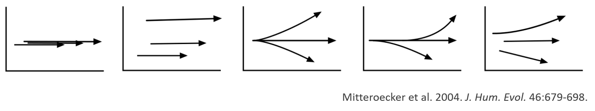
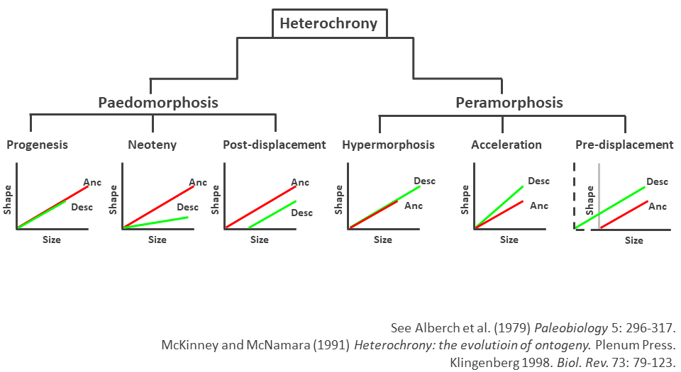

```{r setup, include=FALSE, echo = TRUE, tidy = TRUE}
library(knitr)
library(geomorph)
opts_chunk$set(echo = TRUE)

library(xaringanthemer)
style_mono_light()
```

### What is Allometry?

+ From greek:  $\small\acute\alpha\lambda\lambda\omicron$ (álo) = other, different  + $\small\mu\epsilon\tau\rho\acute\omega$ (metró) = to measure
+ Differences in body proportions of an organism
+ A departure from geometric similarity
+ The relationship between size and shape
---

### Why Is There Allometry?

+ Allometry occurs due to several reasons:
  + Physical (e.g. surface area/volume ratio)
  + Physiological
  + Biomechanical/functional
  + Selection (e.g. sexual selection and male ornaments)

```{r, echo = FALSE, fig.align = "center", out.width="70%"}
include_graphics("LectureData/07.allometry/AllomIntro.png")  
```
---

### Allometry: Basic Concepts

.pull-left[
+ What is allometry, and compared to what?
  + **Isometry**: no change in proportions
  + **Allometry**: change in proportions

+ Easily envisioned via single trait relative to size:

$$\small{log(Y)}=log(\beta)+\alpha{log(x)}$$

]
.pull-right[    
```{r, echo = FALSE, fig.align = "center", out.width="80%"}
include_graphics("LectureData/07.allometry/PosnegAllom.png")  
```
]

--

+ #### note: concepts of positive and negative allometry are only applicable to univariate traits relative to another trait! (for multivariate traits, allometry is a vector in multi-dimensional space where 'positive' and 'negative' as directions are not defined and have no meaning)

+ #### Also, it is mathematically impossible for all body parts to grow simultaneously faster (positive) or slower (negative) than total body size
---

### Types of Allometry

+ Allometric patterns may be observed at several levels of biological organization:
  + **Ontogenetic allometry**: Variation across individuals at differing stages or ages (e.g., growth allometry)
  + **Static allometry** : Variation across individuals in a single ontogenetic stage within a population or species
  + **Evolutionary allometry**: Variation across species

```{r, echo = FALSE, fig.align = "center",out.width="70%"}
include_graphics("LectureData/07.allometry/AllometryTypes.png")  
```
---

### Allometry in GM Data

+ Procrustes shape variables are independent of CS when no allometry is present
  + CS: mathematically independent of shape; biological allometric effects are still there!

.pull-left[
+ Here is isometry...

```{r, echo = FALSE, fig.align = "center",out.width="70%"}
include_graphics("LectureData/07.allometry/IsometryPlot.png")  
```
]

--

.pull-right[
+ and here is allometry

```{r, echo = FALSE, fig.align = "center",out.width="70%"}
include_graphics("LectureData/07.allometry/AllometryPlot.png")  
```
]

--

+ How do we assess such patterns?
+ We use linear models!

---

### Multivariate Linear Regression

+ To characterize allometric patterns, we fit a model of `shape~size` as:

$$\small\mathbf{Z}=\mathbf{X}\mathbf{\beta } +\mathbf{E}$$

--

+ We evaluate the allometry model $\small\mathbf{X}_{F}$ by comparing it to an intercept model $\small\mathbf{X}_{R}$:

$\tiny\mathbf{X}_R = \begin{bmatrix} 1\\ 1\\ 1\\ 1\\ 1\\ 1 \end{bmatrix}$  & $\tiny\mathbf{X}_F = \begin{bmatrix} 1 & 0.3 \\ 1 & 0.5 \\ 1 & 0.2 \\ 1 & 1.2 \\ 1 & 0.7 \\ 1 & 1.1 \end{bmatrix}$

--

Estimate | $\small\mathbf{X}_{R}$| $\small\mathbf{X}_{F}$
:----------- | :------------------- | :--------------------------
Coefficients |  $\tiny\hat{\mathbf{\beta_R}}=\left ( \mathbf{X}_R^{T} \mathbf{X}_R\right )^{-1}\left ( \mathbf{X}_R^{T} \mathbf{Z}\right )$ | $\tiny\hat{\mathbf{\beta_F}}=\left ( \mathbf{X}_F^{T} \mathbf{X}_F\right )^{-1}\left ( \mathbf{X}_F^{T} \mathbf{Z}\right )$ 
Predicted Values | $\small\hat{\mathbf{Z}}_R=\mathbf{X}_R\hat{\mathbf{\beta}}_R$ | $\small\hat{\mathbf{Z}}_F=\mathbf{X}_F\hat{\mathbf{\beta}}_F$
Model Residuals | $\small\hat{\mathbf{E}}_R=\mathbf{Z}-\hat{\mathbf{Z}}_R$ | $\small\hat{\mathbf{E}}_F=\mathbf{Z}-\hat{\mathbf{Z}}_F$
Model Residual Error    $(\small{SSE})$ | $\small\mathbf{S}_R=\hat{\mathbf{E}}_R^T\hat{\mathbf{E}}_R$ | $\small\mathbf{S}_F=\hat{\mathbf{E}}_F^T\hat{\mathbf{E}}_F$
---

### Assessing Significance: RRPP $^1$

.pull-left[
1: Fit $\small\mathbf{X}_{R}$ for each $\small\mathbf{X}_{F}$; Estimate $\small\hat{\mathbf{Z}}_{R}$ and $\small\mathbf{E}_{R}$

2: Permute, $\small\mathbf{E}_{R}$: obtain pseudo-values as: $\small\mathbf{\mathcal{Z}} = \mathbf{\hat{Z}}_{R} + \mathbf{E}_{R}$

3: Fit $\small\mathbf{X}_{F}$ using $\small\mathbf{\mathcal{Z}}$: obtain coefficients and summary statistics

4: Calculate $\small{F}$-value in every random permutation (observed case counts as one permutation)
]
.pull-right[
5: For $\small{n}$ permutations, $\small{P} = \frac{n(F_{random} \geq F_{obs})}{n}$

6: Calculate *effect size* as a standard deviate of the observed value in a normalized distribution of random values (helps for comparing effects within and between models); i.e.:
$$\small{z} = \frac{
\log\left( F\right) - \mu_{\log\left(F\right)}
} {
 \sigma_{\log\left(F\right)}
}$$
where $\small\mu_{\log\left(F\right)}$ and $\sigma_{\log\left(F\right)}$ are the expected value and standard deviation from the sampling distribution, respectively.
]

.footnote[
1: Collyer et al. *Heredity.* (2015); Adams & Collyer. *Evolution.* (2016); Adams & Collyer. *Evolution.* (2018)

2: For details see Shape Statistics II
]
---

### Regression: Example

.pull-left[
Does body shape covary with size in *Pecos* pupfish? 

```{r, echo = FALSE, fig.align = "center",out.width="80%"}
include_graphics("LectureData/07.allometry/Pupfish Motivation.png")  
``` 

This is a hypothesis of *Allometry* (shape~size covariation)
]
.pull-right[
```{r eval=TRUE, echo=TRUE, out.width="40%"}
data(pupfish)
pupfish$logSize <- log(pupfish$CS)
pupfish$Group <- interaction(pupfish$Pop, pupfish$Sex)

fit <- procD.lm(coords ~ logSize, data = pupfish, print.progress = FALSE) 
round(anova(fit)$table, 4)
```

Great, but how does one visualize this multivariate allometry??
]
---

### Visualizing Multivariate Allometry

.pull-left[
+ need to summarize size-related variation in shape
+ Use some rotation/projection method

```{r, echo = FALSE, fig.align = "center",out.width="80%"}
include_graphics("LectureData/07.allometry/MultiAllomPlot.png")  
```
]

--

.pull-right[
+ Several (complementary) solutions:

+ Regression scores (Drake and Klingenberg 2008): projection of shape data on the allometric line
$$\small\mathbf{s}=\mathbf{Z\beta^T(\beta^T\beta)^{-1/2}}$$

+ PC1 of predicted values (Adams and Nistri 2010): PC rotation of Ŷ to summarize variation across the shape-size relationship

$$\small\mathbf{P_1}=svd(\mathbf{\hat{Z}})=svd(\mathbf{X(\tilde{X}^T\tilde{X})^{-1}(\tilde{X}^T\tilde{Z})})$$
]
---

### Visualizing Multivariate Allometry (Cont.)

+ And now some shape predictions

.pull-left[
```{r, echo = TRUE, fig.align = "center",out.width="80%"}
M <- mshape(pupfish$coords)
preds <- shape.predictor(fit$GM$fitted, x= pupfish$logSize, Intercept = TRUE, 
                         predmin = min(pupfish$logSize), 
                         predmax = max(pupfish$logSize)) 
```

]
.pull-right[
```{r, echo = TRUE, fig.align = "center",out.width="80%"}
par(mfrow=c(1,2))
plotRefToTarget(M, preds$predmin, mag=1)
mtext("Regression Min")
plotRefToTarget(M, preds$predmax, mag=1)
mtext("Regression Max")
par(mfrow=c(1,1))
```
]

---

### Allometry Example: *Podarcis*

+ Effects of human-mediated disturbance (urbanization) on *Podarcis* lizards
  + 5 urban and 5 rural populations
	+ 359 individuals
	+ 28 bilateral landmarks

+ How does environmental disturbance influence development?
+ Are size-shape relationships modified in urban populations?

```{r, echo = FALSE, fig.align = "center",out.width="60%"}
include_graphics("LectureData/07.allometry/LizardLatImage.png")  
```
---

### Allometry Example: *Podarcis*

.pull-left[
```{r, echo = FALSE, fig.align = "center",out.width="80%"}
lizards <- readland.tps('LectureData/07.allometry/symm.shape2.tps', warnmsg = FALSE)
liz.lab <- read.csv('LectureData/07.allometry/ind.info.txt',header=TRUE, sep=",")
col.gp <- rep("black",nrow(liz.lab))
col.gp[which(liz.lab$type=='U')] <- 'red'
Y.gpa <- gpagen(lizards, print.progress = FALSE)
CS <- liz.lab$cs
type <- as.factor(liz.lab$type)
gdf <- geomorph.data.frame(Y.gpa, CS = CS, type = type)

plotAllSpecimens(Y.gpa$coords)
```
]
.pull-right[
```{r, echo = TRUE, fig.align = "center",out.width="40%"}
fit <- procD.lm(Y.gpa$coords~CS*type, data = gdf, print.progress = FALSE)
anova(fit)$table
``` 
]
---

### Allometry Example: *Podarcis* (Cont.)

```{r, echo = FALSE, fig.align = "center",out.width="50%"}
PCA <- gm.prcomp(Y.gpa$coords)
plot(PCA,pch = 21, bg=col.gp,cex = 2)
legend("topleft", levels(gdf$type), pch = 21, pt.bg = unique(col.gp))
```
---

### *Podarcis* Allometry: Visualization 
```{r, echo = FALSE, fig.align = "center",out.width="50%"}
par(mfrow=c(1,2)) 
plot(fit, type = "regression", predictor = gdf$CS, 
     reg.type = "RegScore", pch=19, col = col.gp)
legend("topleft", levels(gdf$type), pch = 21, pt.bg = unique(col.gp))
mtext("Regression Scores")
plot(fit, type = "regression", predictor = gdf$CS, 
     reg.type = "PredLine", pch=19, col = col.gp)
legend("topleft", levels(gdf$type), pch = 21, pt.bg = unique(col.gp))
mtext("Predicted Lines")
par(mfrow=c(1,1)) 
```
---

### *Podarcis* Allometry: Visualization (Cont.)

.pull-left[
```{r, echo = TRUE, fig.align = "center",out.width="80%"}
shape.gps <- coords.subset(fit$GM$fitted,type)
CS.R <- gdf$CS[which(type=="R")]
CS.U <-   gdf$CS[which(type=="U")]
mn <- Map(function(x) mshape(x),shape.gps)

predsR <- shape.predictor(shape.gps$R,x = CS.R, Intercept = TRUE,
                          predmin = min(CS.R),
                          predmax = max(CS.R))
predsU <- shape.predictor(shape.gps$U,x = CS.U, Intercept = TRUE,
                          predmin = min(CS.U),
                          predmax = max(CS.U))
M <- mshape(Y.gpa$coords)
```

]
.pull-right[
```{r, echo = FALSE, fig.align = "center",out.width="80%"}
par(mfrow=c(2,2))
plotRefToTarget(M,predsR$predmin, mag = 2)
mtext("Rural Min: X2")
plotRefToTarget(M,predsR$predmax, mag = 2)
mtext("Rural Max: X2")
plotRefToTarget(M,predsU$predmin, mag = 2)
mtext("Urban Min: X2")
plotRefToTarget(M,predsU$predmax, mag = 2)
mtext("Urban Max: X2")
par(mfrow=c(1,1))
```
]
---

### Post-Hoc Tests

+ Use randomization methods to test custom hypotheses
+ Do urban populations show higher deviations from their group’s trajectory? – a sign of developmental instability

```{r, echo = FALSE, fig.align = "center",out.width="40%"}
include_graphics("LectureData/07.allometry/LizUrbRur.png")  
```
---

### Size-Shape Space

+ Size effects often dominate shape variation, especially in ontogenetic series
+ However, when other factors are present, PC1 does not necessarily relate directly to size-dependent variation (at least not to all of it)
+ Usual statistical methods do not capture subtle ontogenetic modifications in trajectories

```{r, echo = FALSE, fig.align = "center",out.width="80%"}
  
```

+ Examine allometric variation in **size-shape space**
---

### Size-Shape Space

+ Derived from the PCA of shape variables + $\small{ln}(Csize)$
  + 1: Calculate shape variables and $\small{ln}(Csize)$, and join them in a single data matrix
  + 2: Calculate PCA of this matrix ( $\small{SSPC1}$)
  + 3: Generate the **common allometric component** (CAC): the common size-shape regression coefficient, after mean-centering shapes by group $\small\mathbf{Z}_{c}$
  + 4: Calculate the **residual shape component**: SVD of data orthogonal to CAC
  + 5: Visualize allometry as (CAC vs. SSPC1)   & (CAC vs. RSC1)

$$\small\alpha=(\mathbf{Z}_{c}^T\mathbf{CS})/\mathbf{(CS^TCS)}$$
$$\small{CAC}=\mathbf{Z}_{c}\alpha$$             where $$\small\alpha=\alpha\sqrt{(\alpha^T\alpha)}$$
---

### Size-Shape Space: Example

```{r, echo = FALSE, fig.align = "center",out.width="70%"}
include_graphics("LectureData/07.allometry/Mitteroecker-04.png")  
```
---

### note: CAC Scores vs. Regression Scores $^1$

+ $\small{CAC}$: regression under a common slope after group mean-centering
+ Regression scores (**s**): shape data projected on the regression line with size
+ When a single group is considered, $\small{CAC}$ and **s** are **identical**!
+ Both are projections of mean-centered data on size/shape regression (and are equivalent to PLS1 scores of a PLS of shape on size)

$$\small\alpha=(\mathbf{Z}_{c}^T\mathbf{CS})/\mathbf{(CS^TCS)}$$
$$\small{CAC}=\mathbf{Z}_{c}\alpha$$     $$\small\alpha=\alpha\sqrt{}(\alpha^T\alpha)$$
$$\small\mathbf{s}=\mathbf{Z\beta^T(\beta^T\beta)^{-1/2}}$$

.footnote[See Adams et al. 2013. *Hystrix* 24: 7-14.] 
---

### Allometry: Other Tests $^1$

+ Many biological hypotheses are related to the comparison of ontogenetic allometries

+ Allometric trajectories are not only about their slope, or variation around it

.footnote[1: See Shape Statistics II lecture for discussion of PTA as a general method for comparing all types of trajectories, including ontogenetic/allometric trajectories (i.e. Collyer and Adams 2007; Adams and Collyer 2009; Collyer and Adams 2013)]

--

+ Do they have similar starting points or ending points?

+ Are ontogenetic trajectories similar? (parallelism)

+ Do ontogenetic trajectories converge?

+ Do ontogenetic trajectories diverge?

--

+ We need quantitative methods to test such hypotheses

+ Take advantage of the toolkit of resampling methods

---

### Allometric Convergence and Divergence $^1$

+ Convergence: shape is more similar at the end of the trajectory, than at the beginning

+ A simple approach: test angular difference between trajectories

.footnote[1: Adams and Nistri. (2010) *BMC. Evol. Biol.*]
--

  + 1: Obtain allometric vectors $(\small\mathbf{\hat{Z}}_{start} - \small\mathbf{\hat{Z}}_{end})$  for groups
  + 2: normalize vectors (divide by their length so they are unit length) and find the cross-product between pairs of vectors; i.e, $r_{ij} = \mathbf{\beta}_i^T \mathbf{\beta}_j$
  +  3: Obtain test measure: $\theta = \cos^{-1}(r_{ij})$
  + 4: RRPP with appropriate null model to test $\theta$

+ **Convergence** when $\theta$ is significant and vectors tend toward a similar shape
+ **Divergence** when $\theta$ is significant and vectors tend toward a different shape
+ **Parallelism** when $\theta$ is not significant and/or effect size is small
  + Can also test absolute difference in vector lengths to determine if one group has greater ontogenetic shape change than another
    
---

### Evolutionary Convergence: *Hydromantes* Example

+ Ontogenetic series for 8 species of *Hydromantes*
+ These salamanders live in caves and they climb extensively on the walls as adults
+ Foot shape is a trait with functional relevance
+ How does foot shape change across ontogeny?

```{r, echo = FALSE, fig.align = "center",out.width="80%"}
include_graphics("LectureData/07.allometry/HydromantesEx.png")  
```
---

### Evolutionary Convergence: *Hydromantes* Example (Cont.)

```{r, echo = FALSE, fig.align = "center",out.width="75%"}
include_graphics("LectureData/07.allometry/HydroRes1.png")  
```
---

### Evolutionary Convergence: *Hydromantes* Example (Cont.)

```{r, echo = FALSE, fig.align = "center",out.width="75%"}
include_graphics("LectureData/07.allometry/HydroRes2.png")  
```
---

### Comparing Allometric Trajectories: Pupfish Example

+ **Question**: Do your groups have parallel allometries?
+ **Question**: Do your groups have unique allometries?
+ **Question**: Which groups have different allometries, and how do they differ?

```{r, echo = TRUE, fig.align = "center",  out.width = "30%"}
data(pupfish)
plotAllSpecimens(pupfish$coords)
```
---

### Comparing Allometric Trajectories: Pupfish Example (Cont.)

.pull-left[
```{r, echo = FALSE, fig.align = "center",  out.width = "50%"}
pupfish$logSize <- log(pupfish$CS)
pupfish$Group <- interaction(pupfish$Pop, pupfish$Sex)
```

```{r, echo = TRUE, fig.align = "center", out.width = "50%"}
fit.common <- procD.lm(coords ~ logSize + Group, 
                     data = pupfish, print.progress = FALSE) 
fit.unique <- procD.lm(coords ~ logSize * Group, 
                     data = pupfish, print.progress = FALSE)  
```

+ now let's do a homogeneity of slopes test
]

.pull-right[
```{r, echo = TRUE, fig.align = "center",  out.width = "50%"}
anova(fit.unique, fit.null = fit.common, print.progress = FALSE)
```
+ Suggests allometric slopes are parallel 
]

---

### Comparing Allometric Trajectories: Pupfish Example (Cont.)

+ Allometric plots
  + We can see by plotting the prediction lines for both that a unique-allometries model is not practical

```{r, echo = FALSE, fig.align = "center",  out.width = "50%"}
par(mfcol = c(1,2))
plot(fit.common, type = "regression", predictor = pupfish$logSize, 
     reg.type = "PredLine", pch=19, col = pupfish$Group)
legend("topleft", legend = unique(pupfish$Group), pch = 21, pt.bg = unique(pupfish$Group))
mtext("Common Slopes")
plot(fit.unique, type = "regression", predictor = pupfish$logSize, 
     reg.type = "PredLine", pch=19, col = pupfish$Group)
legend("topleft", legend = unique(pupfish$Group), pch = 21, pt.bg = unique(pupfish$Group))
mtext("Unique Slopes")
```
---

### Comparing Allometric Trajectories: Pupfish Example (Cont.)

+ Hypothesis tests: vector lengths

.scrollable[
```{r, echo = TRUE, fig.align = "center",  out.width = "50%"}
PW.u <- pairwise(fit.unique, groups = pupfish$Group,
               covariate = log(pupfish$CS), print.progress = FALSE)
summary(PW.u, test = "dist")

```
]
---

### Comparing Allometric Trajectories: Pupfish Example (Cont.)

+ Hypothesis tests: angles between vectors

.scrollable[
```{r, echo = TRUE, fig.align = "center",  out.width = "50%"}
summary(PW.u, test = "VC", angle.type = "deg") 
```
]
---

### Comparing Allometric Trajectories: Pupfish Example (cont.)

+ Conclusion: allometries do not significantly diverge.  But concluding they are parallel allows one to compare means, accounting for common allometric variation

.scrollable[
```{r, echo = TRUE, fig.align = "center",  out.width = "50%"}
PW.c <- pairwise(fit.common, groups = pupfish$Group,
               print.progress = FALSE)
summary(PW.c, test = "dist") 
```
]
---

### Empirical Example: Cranial Ontogeny in Crocodilians

+ Phylogenetic relationships have long been under debate
+ What information can we extract from cranial ontogeny?

```{r, echo = FALSE, fig.align = "center",out.width="75%"}
include_graphics("LectureData/07.allometry/CrocRes1.png")  
```
---

### Empirical Example: Cranial Ontogeny in Crocodilians (Cont.)

+ Some groups follow different ontogenetic paths
+ There is ontogenetic convergence, where adults are more similar than juveniles

```{r, echo = FALSE, fig.align = "center",out.width="75%"}
include_graphics("LectureData/07.allometry/CrocRes2.png")  
```
---

### A Comment on Heterochrony
+ Evolutionary changes in the rate or timing of developmental sequences
  + i.e. changes in ontogenetic trajectories
+ Can be evaluated via allometric/ontogenetic investigations

```{r, echo = FALSE, fig.align = "center",out.width="70%"}
  
```
---

### Allometry: Summary

+ Shape usually changes with size – allometry is a common pattern in biological data
+ We need to account for it when testing hypotheses about shape
+ Many biological hypotheses related directly to allometric variation
+ **Visualization**: 
  + RegScore (**s**) vs. Csize (Drake and Klingenberg 2008)
  + PredLine $\small{P_1}$ vs. Csize (Adams and Nistri 2010)
  + CAC, RSC, Csize (Mitteroecker et al. 2004)

+ **Comparison of ontogenies**: - MANCOVA
  + Convergence & divergence (Adams and Nistri 2010)
  + Orientation (Piras et al. 2010)

+ Heterochrony and related topics also of interest
