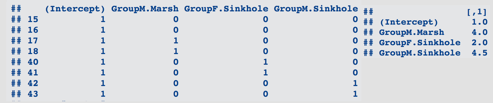
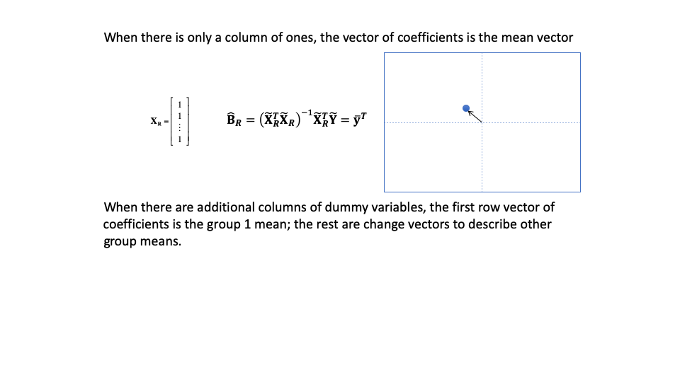
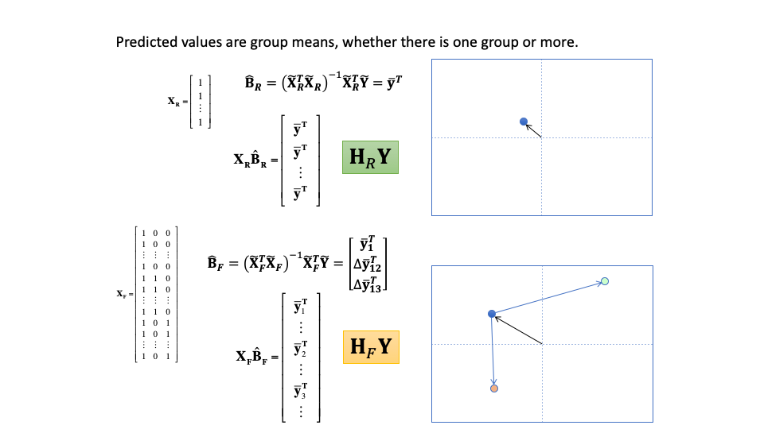
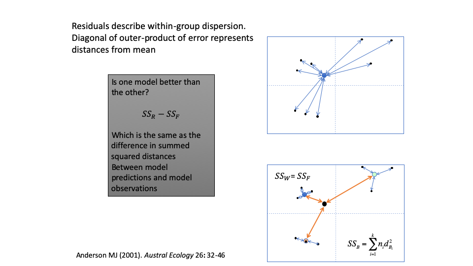
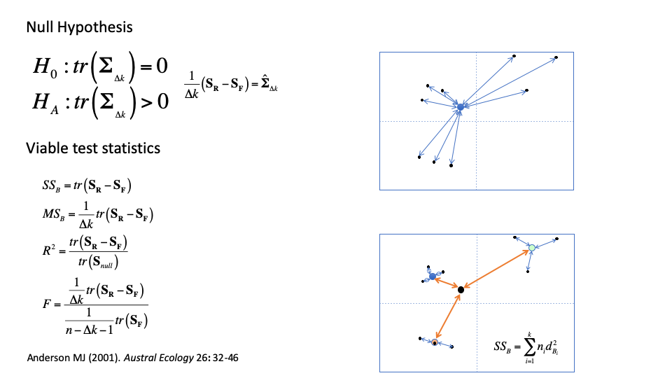

```{r setup, include=FALSE}
library(knitr)
knitr::opts_chunk$set(echo = FALSE)
```

# Vectors are Points in Space
```{r, echo = FALSE, out.width="100%"}
include_graphics("LectureData/07.groupdifferences/points/Slide1.png")  
```

# Vectors are Points in Space (Cont.)
```{r, echo = FALSE, out.width="100%"}
include_graphics("LectureData/07.groupdifferences/points/Slide2.png")  
```

# Vectors are Points in Space (Cont.)
```{r, echo = FALSE, out.width="100%"}
include_graphics("LectureData/07.groupdifferences/points/Slide3.png")  
```

# Vectors are Points in Space (Cont.)
```{r, echo = FALSE, out.width="100%"}
include_graphics("LectureData/07.groupdifferences/points/Slide4.png")  
```

# Vectors are Points in Space (Cont.)
```{r, echo = FALSE, out.width="100%"}
include_graphics("LectureData/07.groupdifferences/points/Slide5.png")  
```

# Vectors are Points in Space (Cont.)
```{r, echo = FALSE, out.width="100%"}
include_graphics("LectureData/07.groupdifferences/points/Slide6.png")  
```

# Vectors are Points in Space (Cont.)
```{r, echo = FALSE, out.width="100%"}
include_graphics("LectureData/07.groupdifferences/points/Slide7.png")  
```


# Overview:

- Shapes are points in space
- Design matrices for grouping variables (factors)
- Linear models for group shape differences
- Example single-factor (one-way) analysis
- Posthoc comparisons
- Factorial models
- Sequential sums of squares and cross-products
- Other types of sums of squares and cross-products
- Factorial model example
- Randomized residual permutation procedure
- Overview of hypothesis tests for linear models


# The General Linear Model
$$\huge \mathbf{Y}=\mathbf{X}\mathbf{\beta } +\mathbf{E}$$

Component | Dimension | Description
:------- | :----------- | :--------------
$\mathbf{Y}$ | $n \times p$ | Data matrix with $n$ observations for $p$ variables
$\mathbf{X}$ | $n \times k$ | Linear model design matrix with $n$ observations for $k$ parameters
$\mathbf{\beta}$ | $k \times p$ | Matrix of coefficients expressing change in values for the $k$ model parameters for each of $p$ variables
$\mathbf{E}$ | $n \times p$ | Matrix of residuals (error) for $n$ observations for $p$ variables

Like any area of statistics, the coefficients for a linear model (which has parameters for variable change associated with some hypothetical process) are generally unknown but exist in a population, and are, therefore, estimated from a sample.  We can solve this algebraically as the solution that would be true if there was no error in the model (i.e., $\mathbf{E}$ = 0).  The goal is to solve for $\mathbf{\beta}$.  **We will accomplish this goal by first recognizing some important properties of general linear models (LM)**.

# The General Linear Model: Least Squares

The goal of LM is to find a solution for which the estimated value of a data vector, given a vector of predictors, is expected to be true,

$$\mathbb{E}\left( \mathbf{y}^T | \mathbf{x}^T\right) = \mathbf{\mu}_{ \mathbf{y} | \mathbf{x}}$$

The term, **Least Squares** (LS), references the fact that coefficients estimated from the model design, $\mathbf{X}$, will minimize the sum squared error between observed data and expected values.  

LS calculation of coefficients starts with first standardizing the design matrix by the expected covariance of the data, $\mathbf{\Omega}$.  This is done via

$$\mathbf{\Omega}^{-1}\mathbf{X}$$

If there is no expected covariance structure, then $\mathbf{\Omega}$ is $\mathbf{I}$, and because $\mathbf{I}^{-1} = \mathbf{I}$, no change in $\mathbf{X}$ would be required.  Note that $\mathbf{\Omega}$ is an $n \times n$ symmetric matrix.

# The General Linear Model: Coefficients

Solving for the coefficients via LS:
$$\mathbf{Y}=\mathbf{X}\mathbf{\beta } $$
$$\left(\mathbf{\Omega}^{-1} \mathbf{X} \right)^T \mathbf{Y} = \left(\mathbf{\Omega}^{-1} \mathbf{X} \right)^T\mathbf{X}\mathbf{\beta } $$
$$\mathbf{X}^T \mathbf{\Omega}^{-1} \mathbf{Y} =\mathbf{X}^T \mathbf{\Omega}^{-1}  \mathbf{X}\mathbf{\beta } $$

$$\left( \mathbf{X}^T \mathbf{\Omega}^{-1}  \mathbf{X}\right)^{-1}
\mathbf{X}^T \mathbf{\Omega}^{-1} \mathbf{Y} =
\left( \mathbf{X}^T \mathbf{\Omega}^{-1}  \mathbf{X}\right)^{-1}
\mathbf{X}^T \mathbf{\Omega}^{-1}  \mathbf{X}\mathbf{\beta } = \mathbf{I\beta}$$


$$\hat{\mathbf{\beta }} = 
\left( \mathbf{X}^T \mathbf{\Omega}^{-1}  \mathbf{X}\right)^{-1}
\mathbf{X}^T \mathbf{\Omega}^{-1} \mathbf{Y} $$

The ^ reminds us that this is a matrix of estimated values.  This is the **generalized least squares (GLS)** solution.  If $\mathbf{\Omega} = \mathbf{I}$, then the solution simplifies to 

$$\hat{\mathbf{\beta }} = 
\left( \mathbf{X}^T   \mathbf{X}\right)^{-1}
\mathbf{X}^T  \mathbf{Y} $$

which is the ordinary **least squares (OLS)** solution.

One might notice that because of the various matrix inversions, this can be computationally intensive and if $\mathbf{\Omega} = \mathbf{I}$, it would be easier to use the OLS solution.  It is also possible to use the OLS for GLS calculations through an algebraic short-cut.

# The General Linear Model: Simplified Coefficient Estimation

The simpler method of coefficient estimation is found through a transformation (projection) matrix, to transform the data and model design prior to the algebraic steps.

Step 1: Perform eigen analysis on $\mathbf{\Omega}$ and obtain a set of eigenvectors, $\mathbf{U}$ and eigenvalues, $\mathbf{W}$.

Step 2: Generate an $n \times n$ transformation matrix as

$$\mathbf{T} = \left( \mathbf{UW}^{-1/2} \mathbf{U}^T \right)^{-1}$$
Step 3: Project both data and model design matrix onto $\mathbf{T}$.

$$\mathbf{\tilde{Y}} = \mathbf{TY}$$

$$\mathbf{\tilde{X}} = \mathbf{TX}$$

Step 4: Perform OLS estimation of coefficients using transformed values

$$\hat{\mathbf{\beta }}=\left ( \mathbf{\tilde{X}}^{T} \mathbf{\tilde{X}}\right )^{-1}\left ( \mathbf{\tilde{X}}^{T} \mathbf{\tilde{Y}}\right )$$

##### Note that $\mathbf{T}$ is often referred to as,  $\mathbf{P}$, as it is a projection matrix.  Later we refer to a matrix of projected principal component scores as $\mathbf{P}$, so we use $\mathbf{T}$ here for "transformation" rather than projection.

# The General Linear Model: Simplified Coefficient Estimation (Cont.)

The important condition is that 

$$\hat{\mathbf{\beta }} = 
\left( \mathbf{X}^T \mathbf{\Omega}^{-1}  \mathbf{X}\right)^{-1}
\mathbf{X}^T \mathbf{\Omega}^{-1} \mathbf{Y} =
\left ( \mathbf{\tilde{X}}^{T} \mathbf{\tilde{X}}\right )^{-1}\left ( \mathbf{\tilde{X}}^{T} \mathbf{\tilde{Y}}\right )
$$
However, these two methods are not the same in terms of exchangeable units under the null hypothesis for resampling procedures, a topic we address later.

Coefficients are the tools for making predictions from the linear model, namely

$$\mathbf{\hat{y}} = \mathbf{x\hat{\beta}}$$
is an estimated vector of values for variables of, $\mathbf{Y}$, given the predictors in $\mathbf{x}$.  

If performed for all representations in $\mathbf{X}$, we get a matrix of **fitted** values

$$\mathbf{\hat{Y}} = \mathbf{X\hat{\beta}}$$
and expanding this equation

$$\hat{\mathbf{Y}}=\mathbf{X}\hat{\mathbf{\beta }}=\mathbf{X}\left ( \mathbf{\tilde{X}}^{T} \mathbf{\tilde{X}}\right )^{-1} \mathbf{\tilde{X}}^{T} \mathbf{\tilde{Y}} = \mathbf{H\tilde{Y}}$$

# The General Linear Model: Fitted Values 

$$\hat{\mathbf{Y}}=\mathbf{X}\hat{\mathbf{\beta }}=\mathbf{X}\left ( \mathbf{\tilde{X}}^{T} \mathbf{\tilde{X}}\right )^{-1} \mathbf{\tilde{X}}^{T} \mathbf{\tilde{Y}} = \mathbf{H\tilde{Y}}$$
The matrix, $\mathbf{H}$ is an $n\times n$ projection matrix.  Notice that this is a projection matrix for transformed data.  If we prefer to work with the original data, we can let  $\mathbf{H}' = \mathbf{HT}$, be a projection matrix that accounts for both the linear model and transformation, then $\hat{\mathbf{Y}} = \mathbf{H}'\mathbf{Y}$.  This means that a linear model can be thought of as a means to project data into a tangent space that best describes a hypothetical pattern (associated with a process), including accounting for a hypothetical covariance structure.

$\mathbf{H}^{'}$ is positive-definite and idempotent.  If it is symmetric, then it produces an **orthogonal projection** (typical with OLS).  If it is not symmetric, it produces an **oblique projection** (typical with GLS).

As a Reminder, if no covariance structure is used, $\mathbf{\Omega} = \mathbf{I}$, thus, $\mathbf{H}^{'} = \mathbf{H}$, and $\mathbf{H}$ is an orthogonal projection matrix.

# The General Linear Model: Residuals

The unexplained component of the data is the matrix of residuals, $\mathbf{E}$, found as
$$\mathbf{E} = \mathbf{Y} - \hat{\mathbf{Y}}=\mathbf{Y} - \mathbf{H}'\mathbf{Y} =\left(\mathbf{I}-\mathbf{H}'\right)\mathbf{Y}$$
$\left(\mathbf{I}-\mathbf{H}'\right)$ is also a projection matrix, meaning the residuals are a projection of $\mathbf{Y}$ into a different tangent space, where attributes of the points can be examined, especially with reference to the fitted value projections.  

Therefore, the general linear model finds projections of data as fitted values and residuals, $\mathbf{H}'\mathbf{Y}$ and $\left(\mathbf{I}-\mathbf{H}'\right)\mathbf{Y}$, respectively.  We will learn how and why this is important in just about every subsequent lecture.

$\left(\mathbf{I}-\mathbf{H}'\right)$ is positive-definite and idempotent.  If it is symmetric, then it produces an **orthogonal projection** (typical with OLS).  If it is not symmetric, it produces an **oblique projection** (typical with GLS).

As a Reminder, if no covariance structure is used, $\mathbf{\Omega} = \mathbf{I}$, thus, $\left(\mathbf{I}-\mathbf{H}'\right) = \left(\mathbf{I}-\mathbf{H}\right)$, and $\left(\mathbf{I}-\mathbf{H}\right)$ is an orthogonal projection matrix.

# SSCP and Covariance matrices

Projection of data into tangent spaces of their model predictions (fit) and error (dispersion of residuals) allows one to determine if there are latent patterns in the data, as predicted by the parameters in the design matrix, and hopefully no pattern in the residuals (if assumptions are upheld).  The best way to do this is via PCA on covariance matrices.  PCA finds the axes of greatest variation in the projections, which allows a low-dimensional visual interpretation of even high-dimensional spaces.

To calculate a model (residual) covariance matrix, first calculate the sums of squares and cross-products ($SSCP$) via a cross-product of the residuals.

Residuals $SSCP$

$$\mathbf{S} =  \left(\Omega^{-1}\mathbf{E}\right)^T \Omega^{-1} \mathbf{E}$$

And the covariance matrices is 

$$\mathbf{\hat{\Sigma}}_{\mathbf{E}} = \left( n-1\right)^{-1} \mathbf{S}$$

Note that any covariance structure must be accounted for in order for the residual $SSCP$ to be independent.

# Henceforth, for simplicity:

$$\mathbf{\hat{Y}} = \mathbf{H}\mathbf{\tilde{Y}}$$

$$\mathbf{\tilde{E}} =\left(\mathbf{I}-\mathbf{H}\right)\mathbf{\tilde{Y}}$$

In words, **fitted values** are obtained from a model projection of transformed data (untransformed if there is no model covariance).  **Modified residuals** are obtained also from a projection of transformed data (unmodified if there is no model covariance).

#### We can compare two model projections as:

$$\mathbf{\Delta\hat{Y}} = \left(\mathbf{H}_2 - \mathbf{H}_1 \right)\mathbf{\tilde{Y}}$$

or

$$\mathbf{\Delta\tilde{E}} = \left(\left(\mathbf{I}-\mathbf{H}_1\right) - \left(\mathbf{I}-\mathbf{H}_2 \right) \right) \ \mathbf{\tilde{Y}} = \left(\mathbf{H}_2 - \mathbf{H}_1 \right)\mathbf{\tilde{Y}}$$

In other words, the difference in model projections is a projection of a data, defined as $\mathbf{\Delta{H}}$.  (How does changing the model affect our ability to estimate the data, $\mathbf{Y}$?)

### Thus, a model difference is henceforth defined as:

$$\mathbf{\Delta{H}}\mathbf{\tilde{Y}}$$


# A Tale of Two Linear Models


### Mike's Linear Model Axiom

*Other than to consider total dispersion in a data set, a linear model analysis always considers at least two models.*

Much of life is like this - the absolute definition of a state is difficult or meaningless, but the relative difference in states provides meaning to both.  (For example, if today is 3 degrees warmer than yesterday, we know something about the weather both today and yesterday, but finding an absolute meaning of temperature is not helpful.)  Whether a linear model is a good or poor model for how data are dispersed requires a comparison (especially to a null model).


# Linear Model Comparisons 

### An example

```{r, echo = FALSE, out.width="100%"}
include_graphics("LectureData/07.groupdifferences/pupfish.example.png")  
```


# How Design Matrices Model Responses for Different Groups

Developing an intuition for how design matrices are constructed helps researchers better understand the analytical methods they are using.

There are different ways to construct model design matrices.  We will use the most traditional way, which is how **R** works.

The best way to illustrate this is with an example.

```{r echo = TRUE, include = TRUE}
library(geomorph)
data("pupfish")
# Make a new data frame with ony 8 fish (subjects 15-18, 40-43)
select <- c(15:18, 40:43)
df <- data.frame(logSize = log(Pupfish$CS),
                 Sex = Pupfish$Sex, 
                 Pop = Pupfish$Pop,
                 Group = interaction(Pupfish$Sex, Pupfish$Pop))
df <- data.frame(df[select, ])
```


# How Design Matrices Model Responses for Different Groups (cont.)

Let's make up a fictional response, just for illustrative purposes:

```{r echo = TRUE, include = TRUE}
y <- c(0, 2, 6, 4, 3, 3, 4, 7 )
y
```

# Design Matrices: Factors

Factors (categorical variables) require multiple variables for the various levels of the factor.  

```{r echo = TRUE, include = TRUE}

model.matrix(~ Group, data = df)

```


# Design Matrices: Factors (cont.)

#### Key points


Let's revisit this description from before (next slide)


# Vectors are Points in Space
```{r, echo = FALSE, out.width="100%"}
include_graphics("LectureData/07.groupdifferences/points/Slide1.png")  
```

# Vectors are Points in Space (Cont.)
```{r, echo = FALSE, out.width="100%"}
include_graphics("LectureData/07.groupdifferences/points/Slide2.png")  
```

# Vectors are Points in Space (Cont.)
```{r, echo = FALSE, out.width="100%"}
include_graphics("LectureData/07.groupdifferences/points/Slide3.png")  
```

# Vectors are Points in Space (Cont.)
```{r, echo = FALSE, out.width="100%"}
include_graphics("LectureData/07.groupdifferences/points/Slide4.png")  
```

# Vectors are Points in Space (Cont.)
```{r, echo = FALSE, out.width="100%"}
include_graphics("LectureData/07.groupdifferences/points/Slide5.png")  
```

# Vectors are Points in Space (Cont.)
```{r, echo = FALSE, out.width="100%"}
include_graphics("LectureData/07.groupdifferences/points/Slide6.png")  
```

# Vectors are Points in Space (Cont.)
```{r, echo = FALSE, out.width="100%"}
include_graphics("LectureData/07.groupdifferences/points/Slide7.png")  
```

# Design Matrices: Factors

Factors (categorical variables) require multiple variables for the various levels of the factor.  

```{r echo = TRUE, include = TRUE}

model.matrix(~1, data = df)
model.matrix(~ Group, data = df)

```

# Design Matrices: Factors (cont.)

The point is that means can be described as vectors from the origin or from a first mean.  Let's see how this works with the **R** example

```{r echo = TRUE, include = TRUE}

X0 <- model.matrix(~ 1, data = df)
Xg <- model.matrix(~ Group + 1, data = df) 

B0 <- solve(crossprod(X0)) %*% crossprod(X0, y) # find the overall mean of y
Bg <- solve(crossprod(Xg)) %*% crossprod(Xg, y) # find group means 

B0 # the overall mean
mean(y)
```

# Design Matrices: Factors (cont.)


```{r echo = TRUE, include = TRUE}
Bg
```

The way to interpret these coefficients is to change an intercept equal to the first value by the amount indicated by the subsequent coefficients.

Note that in R, one can do this

```{r echo = TRUE, include = TRUE}
by(y, df$Group, mean)
```
#### Wait!  These values are different!

# Design Matrices: Factors (cont.)

Remember that fitted values are found as $\mathbf{\hat{Y}} = \mathbf{X\hat{\beta}}$.  Remember also *run amok computational demon*!

```{r, echo = FALSE, out.width="100%"}
  
by(y, df$Group, mean)
```

# Geometric Interpretation of Model Effects

```{r, echo = FALSE, out.width="100%"}
  
```

# Geometric Interpretation of Model Effects (cont.)

```{r, echo = FALSE, out.width="100%"}
include_graphics("LectureData/07.groupdifferences/stats/Slide2.png")  
```

# Geometric Interpretation of Model Effects (cont.)

```{r, echo = FALSE, out.width="100%"}
  
```

# Geometric Interpretation of Model Effects (cont.)

```{r, echo = FALSE, out.width="100%"}
include_graphics("LectureData/07.groupdifferences/stats/Slide4.png")  
```

# Geometric Interpretation of Model Effects (cont.)

```{r, echo = FALSE, out.width="100%"}
  
```

# Geometric Interpretation of Model Effects (cont.)

```{r, echo = FALSE, out.width="100%"}
include_graphics("LectureData/07.groupdifferences/stats/Slide6.png")  
```

# Geometric Interpretation of Model Effects (cont.)

```{r, echo = FALSE, out.width="100%"}
  
```

# ANOVA

Analysis of variance is used for determining the *significance* of group differences (whether group means are a better estimate of shape than the grand mean).  For shape data, using randomization of residuals in a permutation procedure (RRPP) is the best way to go (Collyer et al. 2015; Adams & Collyer 2016, 2018)

The equation for RRPP:

$$\mathbf{\mathcal{Y}} = \mathbf{\hat{Y}} + \mathbf{E}_{\left[s,\right]}^*$$

In words, random pseudo-values are generated by holding the transformed fitted values of a (**reduced**) model constant and randomizing only the transformed residuals.  The subscript of the transformed residuals indicates that the rows of the matrix are shuffled, according to $s$, which is a randomized form of the sequence, $1,2,3,...,n$.

###### Collyer et al. *Heredity.* (2015); Adams & Collyer. *Evolution.* (2016); Adams & Collyer. *Evolution.* (2018)

# RRPP and Empirical Null Sampling Distributions

1. Perform RRPP (randomize residuals many permutations).  
2. Calculate $F$-value in every random permutation (observed case counts as one permutation)
3. For $N$ permutations, $P = \frac{N(F_{random} \geq F_{obs})}{N}$
4. Calculate *effect size* as a standard deviate of the observed value in a normalized distribution of random values (helps for comparing effects within and between models); i.e.,
$$z = \frac{
\log\left( F\right) - \mu_{\log\left(F\right)}
} {
 \sigma_{\log\left(F\right)}
}$$
where $\mu_{\log\left(F\right)}$ and $\sigma_{\log\left(F\right)}$ are the expected value and standard deviation from the sampling distribution, respectively (Collyer et al. 2015; Adams and Collyer 2016, 2018).

###### Collyer et al. *Heredity.* (2015); Adams & Collyer. *Evolution.* (2016); Adams & Collyer. *Evolution.* (2018)

# ANOVA (cont.)

Returning to our previous example

```{r echo = TRUE, include = TRUE}

fit <- procD.lm(y ~ Group, data = df, print.progress = FALSE)
anova(fit)

```

- Group $SS$ is the sum of squared distances between means.
- Residual $SS$ is the sum of squared distances between observations and their means.
- Total $SS$ is the sum of squared distances between observations and the **grand** mean.
- The rest is a determination if the mean squared distances differ significantly.

# ANOVA (cont.)

#### Using a better example: body shape 

```{r echo = TRUE, include = TRUE}

pupfish$Group <- interaction(Pupfish$Sex, Pupfish$Pop)
fit <- procD.lm(coords ~ Group, data = pupfish, print.progress = FALSE)
anova(fit)

```

# ANOVA (cont.)

#### Using a better example: body shape 

```{r echo = TRUE, include = TRUE, out.width="100%"}

plot(fit, type = "PC", pch = 21, bg = pupfish$Group)
legend("topright", levels(pupfish$Group), pch = 21, pt.bg = 1:4)
```
```{r echo = FALSE, include = TRUE, out.width="100%"}
include_graphics("LectureData/07.groupdifferences/pupfish.example.png") 
```

# Design Matrices: Factors (cont.)

```{r, echo = FALSE, out.width="100%"}
include_graphics("LectureData/07.groupdifferences/monty.png")  
```

# Design Matrices: Factorial Models

#### Not really!  Now for something not at all different!

```{r echo = TRUE, include = TRUE}

Xf <- model.matrix(~ Sex * Pop, data = df) 
Bf <- solve(crossprod(Xf)) %*% crossprod(Xf, y) 

Xf
Bf
```

# Design Matrices: Factorial Models (Cont.)

Note the redundancy

```{r echo = TRUE, include = TRUE}

Xg %*% Bg
Xf %*% Bf
```

# Design Matrices: Factorial Models (Cont.)

So why bother with a more complicated model design matrix?

Because these do not make sense unless this **factorial** design was used

```{r echo = TRUE, include = TRUE}

model.matrix(~ Sex, data = df)
model.matrix(~ Sex + Pop, data = df)
```


# Design Matrices: Factorial Models (Cont.)

So why bother with a more complicated model design matrix?

The two models before were sub-models of this full one

```{r echo = TRUE, include = TRUE}

Xf
```

# Design Matrices: Factorial Models (Cont.)

With a factorial model, $SS$ can be partitioned (with type I $SS$) for more effects, and greater inference is possible.


```{r echo = TRUE, include = TRUE}
fitg <- procD.lm(y ~ Group, data = df, iter = 999, SS.type = "I", print.progress = FALSE)
fitf <- procD.lm(y ~ Sex * Pop, data = df, iter = 999, SS.type = "I", print.progress = FALSE)

anova(fitg)
anova(fitf)
```


# A More Practical Example (from before)

```{r echo = TRUE, include = TRUE}
fitPup <- procD.lm(coords ~ Sex * Pop, data = pupfish, iter = 999, SS.type = "I", print.progress = FALSE)
anova(fitPup)
```

# A More Practical Example (from before, Cont.)

```{r echo = TRUE, include = TRUE}
plot(fitPup, type = "PC", pch = 21, bg = pupfish$Group)
legend("topright", levels(pupfish$Group), pch = 21, pt.bg = 1:4)
```


#### Conclusion (with visual help): The interaction between $Sex$ and $Population$ was significant, which indicated sexual dimorphism varied between populations.  There is greater sexual dimorphism in the Marsh population compared to the Sinkhole population.

# Design Matrices: Factorial Models (Cont.)

One last comment about the factorial model design,

```{r, echo = FALSE, out.width="100%"}
include_graphics("LectureData/07.groupdifferences/factorialX.png")  
```


# Multiple Model Effects

It  might be apparent with the previous example, or any other example with which one might familiar, that there is often more than a null model and a full model.  There might be different **effects** that could be considered for different sets of parameters.  In the pupfish example, we might ask whether $Sex$ or $Population$ contribute more to the dispersion in means.  We might also wonder if the $Sex$ effect varies between populations.

Not to worry!  The model comparison approach can be done in sequence for different model effects.  There are only a few little twists with which to be concerned.

#### Preliminaries:
1. Let **null** refer to the model with only an intercept and whose purpose is to estimate an overall mean.
2. Let **reduced** refer to a model with limited parameters, which serves as a basis for comparison.
3. Let **full** refer to a model with all parameters of the reduced model, plus parameters for an effect of interest.

In the initial pupfish example, the null and reduced models were the same; the full model had parameters to estimate four group means.  We are going to use the same model now to consider partial effects associated with the dispersion of the four means.


# Multiple Model Effects (Type I SS)

In the pupfish example, we could have the following set of model comparisons to estimate different effects

Effect | Reduced | Full | Purpose
:----- | :------- | :------- | :-------------
Sex | Null | Null + Sex | Determine if Sex mean difference is "significant" compared to an overall mean
Pop | Null + Sex | Null + Sex + Pop | Determine if population differences are significant, after accounting for general difference between males and females
Sex:Pop | Null + Sex + Pop | Null + Sex + Pop + Sex:Pop | Determine if sexual dimorphism varies between populations, after accounting for general difference in sex and population.
Full model | Null | Null + Sex + Pop + Sex:Pop | Ascertain if the model is significant (if not, the other parts should not be considered significant either)

Estimating $SS$ between models for the first three model comparisons is called **Sequential (Type I) $SS$** estimation.  We start with a null model and build up to the fullest model.

# Multiple Model Effects (Type II SS)

In the pupfish example, we could have the following set of model comparisons to estimate different effects

Effect | Reduced | Full | Purpose
:----- | :------- | :------- | :-------------
Sex | Null + Pop | Null + Pop + Sex | Determine if Sex mean difference is "significant", after accounting for population mean difference
Pop | Null + Sex | Null + Sex + Pop | Determine if population differences are significant, after accounting for general difference between males and females
Sex:Pop | Null + Sex + Pop | Null + Sex + Pop + Sex:Pop | Determine if sexual dimorphism varies between populations, after accounting for general difference in sex and population.
Full model | Null | Null + Sex + Pop + Sex:Pop | Ascertain if the model is signficant (if not, the other parts should not be considered significant either)

Estimating $SS$ between models for the first three model comparisons is called **Conditional (Type II) $SS$** estimation.  We analyze effects with respect to other effects, but do not include interactions with targeted effects.  For example, with three factors, A, B, and C.  The effect A would have a reduced model of B, C, and B:C.  The full model would add A to these.  The effect A:B, would have a reduced model of A, B, C, and B:C, and the full model would add A:B to these. 

# Multiple Model Effects (Type III SS)

In the pupfish example, we could have the following set of model comparisons to estimate different effects

Effect | Reduced | Full | Purpose
:----- | :------- | :------- | :-------------
Sex | Null + Pop + Pop:Sex| Null + Pop + Sex + Pop:Sex| Determine if Sex mean difference is "significant", after accounting for all other effects
Pop | Null + Sex + Pop:Sex| Null + Sex + Pop + Pop:Sex| Determine if population differences are significant, after accounting for all other effects.
Sex:Pop | Null + Sex + Pop | Null + Sex + Pop + Sex:Pop | Determine if sexual dimorphism varies between populations, after accounting for general difference in sex and population.
Full model | Null | Null + Sex + Pop + Sex:Pop | Ascertain if the model is signficant (if not, the other parts should not be considered significant either)

Estimating $SS$ between models for the first three model comparisons is called **Marginal (Type III) $SS$** estimation.  Whereas Type I $SS$ evaluates the importance of effects through inclusion, Type III $SS$ evaluates the importance of effects through exclusion.

# Example: Types of SS

```{r echo = TRUE, include = TRUE}
fit1 <- procD.lm(coords ~ Pop * Sex, data = pupfish, iter = 999, SS.type = "I", print.progress = FALSE)
fit2 <- procD.lm(coords ~ Pop * Sex, data = pupfish, iter = 999, SS.type = "II", print.progress = FALSE)
fit3 <- procD.lm(coords ~ Pop * Sex, data = pupfish, iter = 999, SS.type = "III", print.progress = FALSE)

anova(fit1)
anova(fit2)
anova(fit3)
```

# Multiple Model Effects (comments)

- $F$-values for multiple model effects use the residual $MS$ for the fullest model, under most circumstances.  (There are cases where this is not true, if we have random effects.  This is a topic for a different workshop, but *geomorph* functions can handle this.)
- Only Sequential addition of model terms ensures that the summation of various $SS$ for effects is the same as the whole model $SS$.
- With Type I $SS$ one has to consider the order of variables; this is not the case with Types II and III $SS$.
- Model design might determine which method to use.  Types II and III $SS$ are sometimes recommended for imbalanced designs or many two-way interactions.
- In general, significant effects will be significant, regardless of method, but if there is multi-collinearity among independent variables, Type II $SS$ can reveal it (Type I $SS$ might suggest the first effect added is meaningful compared to others).


# Digging deeper: Pairwise Comparisons (more on interactions)

Let's return to the pupfish body shape example.

An astute observer might start to wonder which pupfish means are different form each other?  

One thing of which to be aware, models with interactions provide so much more opportunity than simpler single-factor models.  Recall that these models produce the same means:


```{r echo = TRUE, include = TRUE}

fitg <- procD.lm(coords ~ Group, data = pupfish, print.progress = FALSE, iter = 999)
fitf <- procD.lm(coords ~ Pop * Sex, data = pupfish, print.progress = FALSE, iter = 999)
fitg
fitf
```

Let's see, however, how pairwise hypothesis tests differ between them.

# Pairwise Comparisons

There are two statistics for pairwise comparisons that might be of interest.  Recall that any estimated value is a vector.  A vector has two attributes: length and direction.  With two or more vectors, these attributes are related.  Anyone who has studied trigonometry can attest that two vectors originating from the same point (origin) describe a triangle.  The vectors are orientated with an angle between them, and 
the vector between vector endpoints is also a vector with a direction and length (distance).  The following figure illustrates this.

```{r, echo = FALSE, out.width="100%"}
include_graphics("LectureData/07.groupdifferences/vectors.png")  
```

The attributes, vector length (distance, $d$) and angle ($\theta$), can function as test statistics. These statistics have an expected value of 0 under a null hypothesis. (Vector correlation can also be a test statistic, but it has an expected value of 1 for parallel vectors, which is a bit awkward.)

# Pairwise Comparisons (Cont.)

Here is the beautiful thing!  I mean this is really, really awesome!

When performing RRPP, we have thousands of random outcomes of coefficients (vectors).  These might represent different slopes or ways to estimate vectors between means.  Therefore, we inherently have distributions of these geometric statistics.  **There is no need for a post-hoc, manufactured test!  We can simply generate** *in situ* **distributions from the resampling experiment!**

```{r echo = TRUE, include = TRUE}

PWG <- pairwise(fitg, groups = pupfish$Group)
PWF <- pairwise(fitf, groups = pupfish$Group)

PWG
PWF
```

For any pairwise test, there is a null model.  Let's see the null models for these pairwise tests:

```{r echo = TRUE, include = TRUE}

reveal.model.designs(fitg)
reveal.model.designs(fitf)
```

# Pairwise Comparisons, Example 

Now we have choices!  For example,

```{r echo = TRUE, include = TRUE}

summary(PWG, test.type = "dist") # "dist" for distance between vectors
```

# Pairwise Comparisons, Example (Cont.)

Now we have choices!  For example,

```{r echo = TRUE, include = TRUE}

summary(PWF, test.type = "dist") # "dist" for distance between vectors
```

# Pairwise Comparisons, Example (Cont.)

Note that in this example, we used `test.type = "dist"` because it makes sense to look at the differences among means in terms of how spread out they are in the data space.  Also notice the similarities and differences between the two tests:

```{r, echo = FALSE, out.width="100%"}
include_graphics("LectureData/07.groupdifferences/pairwise1.png")  
```

# Pairwise Comparisons, Example (Cont.)

The latter test makes sense, if we look again at the PC plot 

```{r echo = TRUE, include = TRUE}
plot(fitf, type = "PC", pch = 21, bg = pupfish$Group)
legend("topright", levels(pupfish$Group), pch = 21, pt.bg = 1:4)
```

The first test tells use means are different.  The second test tells use that despite population differences in shape and despite sexual dimorphism, in general, the sexual dimorphism in the Marsh population is greater than the sexual dimorphism in the sinkhole population.

# Pairwise Comparisons, Example (Cont.)

What about comparing slopes among groups that might have different patterns of covariation?  

##### We will explore that in the allometry lecture
##### We will also explore ANCOVA designs as lab examples

# Summary

- Group shape differences via linear models
- ANOVA means comparing two models in a systematic way
  + SS types: I, II, III
- RRPP makes ANOVA possible
- RRPP also means pairwise statistics are inherently generated
- Pairwise statistics are geometric attributes

- More on pairwise approaches in *Trajectory Analysis* and *Allometry*
