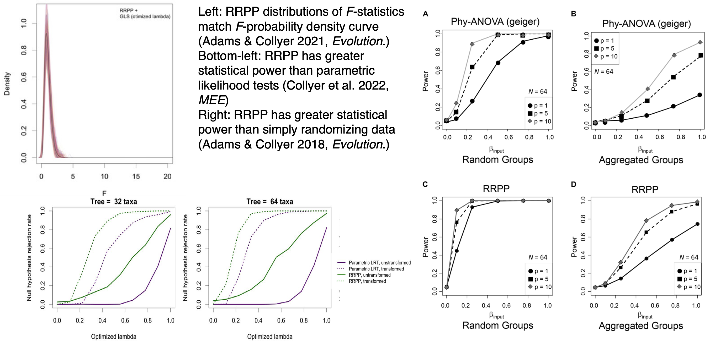

```{r setup, include=FALSE}
library(knitr)
library(Matrix)
library(RRPP)
library(geomorph)
library(scatterplot3d)
knitr::opts_chunk$set(echo = FALSE)

library(xaringanthemer)
style_mono_light()

```

### Overview:

+ Revisit RRPP for linear models
+ Common test statistics
+ Simple model evaluation
  + RRPP and exchangeable units under the null hypothesis
+ Multi-model evaluation
  + Nested models
    + Exchangeable units under null hypotheses
    + Types of sums of squares and cross-products
  + Non-nested models
    + Likelihood
    + AIC
+ The ability of RRPP to test better hypotheses
  + Trajectory analysis
  + Disparity analysis
+ The common thread in all statistical analyses.

---

### Recall, the general linear model provides

+ Estimation of coefficients, $\hat{\boldsymbol{\beta}}$
+ Fitted values, based on estimate coefficients, $\hat{\mathbf{Z}} = \mathbf{X}\hat{\boldsymbol{\beta}}$.  (Residuals can also be found as $\mathbf{E} =\mathbf{Z} - \hat{\mathbf{Z}}$.)
+ Covariance matrices for residual variation:

$$\hat{\boldsymbol{\Sigma}}_{residuals} = (n-k)^{-1}\mathbf{\tilde{E}}^T\mathbf{\tilde{E}}$$

+ Covariance matrices for the effect of adding model parameters to a null model.

$$\hat{\boldsymbol{\Sigma}}_{effect} = (k-1)^{-1}(\hat{\mathbf{Z}}_{alt}-\hat{\mathbf{Z}}_{null})^T(\hat{\mathbf{Z}}_{alt}-\hat{\mathbf{Z}}_{null})$$
**Because linear models describe hypothetical explanations for variation in shape data, it is generally of interest to test null hypotheses for putative models.**  There are various ways to do this, but any method is a *proxy* for a true distribution of possible random outcomes of a statistic calculated from covariance matrices.

The best way to to generate random distributions of statistics is to randomize residuals (from null models) in a permutation procedure (RRPP).

---
.center[

# Part I. Hypothesis testing with RRPP 

## The general concept for testing linear model hypotheses.

]

---

### Hypothesis testing for linear model effects

A null hypothesis test is one that tests the independence of alternative model projections.  Null and alternative hypotheses can be thought of as this series of dichotomies (becoming increasingly more technical):

|Null hypothesis | Alternative hypothesis|
|----|----|
|A null model and alternative model are approximately equally viable for explaining the variation in a data set. | The alternative model is an improvement over the null model for explaining variation in a data set.|
|The residual covariance matrices are similar between null and alternative models. | The residual covariance matrices are different between null and alternative models, and the variances along the diagonal of the alternative model covariance matrix are smaller.|
|A statistic based on the covariance matrix for the effect of adding parameters to the null model to obtain the alternative model is not unlike what one would expect by chance. | A statistic based on the covariance matrix for the effect of adding parameters to the null model to obtain the alternative model is rare in a sampling distribution.
| $S \approx 0$ | $S > 0$|

Every test of a null hypothesis must have a process of generating randomness under the null hypothesis.  For the case of linear models, RRPP is a good way to approximate true sampling distributions.

---
### Exchangeable units under a null hypothesis

***Have you ever wondered what parametric distributions are all about?***  You might have a comfort with them but have you thought about the pursuit of them?  They are a good proxy under certain conditions for probability distributions of random outcomes of a process applied to a null model (set of conditions that allow an observed statistics to exist but do not influence it).

One might realize that there are a finite set of random possibilities, at least based on a sample of data, but enumerating all possibilities is perhaps not possible, or at least excruciating.

Parametric probability density functions that can be integrated are one way to have a proxy for the true sampling distribution.  **Resampling procedures** are another.  The latter means to resample data from a sample as if the stratigraphic bounds inherent in the data are removed, for the purpose of simulating random outcomes sampling from a single population. 

Unfortunately, resampling procedures have tended to historically involve either randomizing data or sampling data with replacement (a bootstrap technique).  Although statistical research has been done to identify how to resample data, many applications just default to a simple randomizing of data, as if this is either appropriate or sufficient.

---

### Exchangeable units under a null hypothesis

Nevertheless, there is a simple way to consider the appropriateness of resampling techniques $^1$.  Resampling techniques are best if they have

|Attribute|Meaning|
|------|-----------|
|First-moment exchangeability| The mean of the sample is the same with every permutation of the sample|
|Second-moment exchangeability| The covariance matrix of the sample is the same in every random permutation of the sample.|

For example, if we have 10 specimens from a phylogenetic clade with two ecotypes, we find the mean specimen shape as a null model and mean ecotype shapes as an alternative model, we might use a randomization procedure that randomly assigns specimens to ecotype and re-estimates the ecotype means many times.  **For OLS estimation, this method has first- and second-moment exchangeability,**  Why?  Because the overall mean and covariance matrix for the null model are the same in every random permutation.

.footnote[
1. Commenges. (2003). *Journal of Nonparametric Statistics*.
]
---

### Exchangeable units under a null hypothesis

However, specimens are species values form a clade, so a GLS solution that accounts for phylogenetic relatedness should be used, assuming shapes are not independent.  **.red[For GLS estimation, this method lacks first- and second-moment exchangeability!]**  The GLS mean and covariance structure will change in every permutation if the specimens and their phylogenetic covariances become mismatched.

.blue[Through a bit of research, we have found that] **.blue[randomization of transformed null model residuals]** .blue[is the best, universal solution for maintaining (approximately) first- and second-moment exchangeability for most linear model designs.]

We have also found that when the conditions are appropriate that parametric probability density function assumptions are apt, randomization of (transformed) residuals in a permutation procedure (RRPP) produces the same distributions as parametric functions.

Henceforth, only RRPP statistical solutions will be presented.

---

### Randomization of residuals in a permutation procedure (RRPP) $^1$

**The steps for RRPP, performed in every permutation**

1: Fit a *null* linear model, and calculate both transformed fitted values and transformed residuals.  (Recall that is OLS estimation is used, the fitted values and residuals are not transformed.)

2: Permute, $\small\mathbf{\tilde{E}}_{0}$: obtain pseudo-values as: $\small\mathbf{\mathcal{Z}} = \mathbf{\tilde{H}_{0}{\tilde{Z}}}_{0} + \mathbf{E}_{0}^*$

3: Fit $\small\mathbf{X}_{alt}$ using $\small\mathbf{\mathcal{Z}}$: obtain coefficients, fitted values, residuals, residual covariance matrix, and the covariance matrix for adding parameters to $\small\mathbf{X}_{0}$ to get $\small\mathbf{X}_{alt}$.  We can call this later covariance matrix, $\hat{\boldsymbol{\Sigma}}_{effect}^*$, where the $^*$ superscript indicates this is a random value from a large set of random values.

4: Calculate some statistic, $S$, consistently from either every  $\hat{\boldsymbol{\Sigma}}_{residuals}^*$ or $\hat{\boldsymbol{\Sigma}}_{effect}^*$ matrix estimated in every RRPP permutation.

.footnote[
1: Collyer et al. *Heredity.* (2015); Adams & Collyer. *Evolution.* (2016); Adams & Collyer. *Evolution.* (2018)
]
---

### Randomization of residuals in a permutation procedure (RRPP) $^1$

**Steps for calculating statistics from RRPP**

5: For $\small{n}$ permutations, $\small{P} = \frac{(S^* \geq S_{obs})}{n}$

6: Calculate *effect size* as a standard deviate of the observed value in a normalized distribution of random values (helps for comparing effects within and between models); i.e.:
$$\small{Z} = \frac{
\theta_{obs} - \mu_{\theta}
} {
 \sigma_{\theta}
}$$
where $\mu$ and $\sigma$ are the expected value and standard deviation from the sampling distribution of the normalized distribution, $\theta$, respectively.

**.red[We will entertain what type of statistic]** *.red[S]* **.red[could be, next.]**

.footnote[
1: Collyer et al. *Heredity.* (2015); Adams & Collyer. *Evolution.* (2016); Adams & Collyer. *Evolution.* (2018)
]
---

.center[

# Part II. Common Test Statistics

## This is a reference section.

]
---

### Viable test statistics for evaluating null hypotheses

The following will be a pretty long list/table of possible statistics that can be estimated with RRPP.  

The purpose is not to become quickly comfortable with them but to see that there are various statistics that can be used for various purposes.

Examples will indicate statistics used and this list (**also in the appendix**) can be quickly referenced.

Focus more so on RRPP, what the null model is, how residuals are randomized, and how the opportunity to calculate these statistics is made.
---

### Viable test statistics for evaluating null hypotheses

|Statistic|Calculation|Type|OLS OK|GLS OK| Comment|
|---|-----|---|--|--|-------|
| $SS$ | $\small SS = trace(\mathbf{S}_{effect})$ | ANOVA| Yes | No | For OLS estimation, the total $SS$ is consistent in every permutation.  Not the case for GLS estimation.|
| $R^2$ | $\small R^2 = \frac{trace(\mathbf{S}_{effect})}{trace(\mathbf{S}_{total})}$ | ANOVA| Yes | No | For OLS estimation, the total $SS$ is consistent in every permutation.  Not the case for GLS estimation.  $\mathbf{S}_{total}$ is the SSCP for residuals of the estimated mean.|
| $MS$ | $\small MS = (k-1)^{-1}trace(\mathbf{S}_{effect})$ | ANOVA| Yes | No | For OLS estimation, the total $SS$ is consistent in every permutation.  Not the case for GLS estimation.|
| $F$ | $\small F = \frac{(k-1)^{-1}trace(\mathbf{S}_{effect})}{(n-k)^{-1}trace(\mathbf{S}_{residuals})}$ | ANOVA| Yes | Yes | Even if the total $SS$ changes across permutations, as a ratio, this statistic will accommodate the changes.  $\mathbf{S}_{residuals}$ is the SSCP for residuals in the alternative model. |

---

### Viable test statistics for evaluating null hypotheses

|Statistic|Calculation|Type|OLS OK|GLS OK| Comment|
|---|-----|---|--|--|-------|
| Roy's maximum $\lambda$ | $\lambda_{Roy} = \max(\lambda_i)$ | MANOVA | Yes | Yes | Eigenvalues are obtained from eigenanalysis of $\mathbf{S}_{residuals}^{-1} \mathbf{S}_{effect}$|
| Wilks' $\lambda$ | $\lambda_{Wilks} = \prod(\frac{1}{1+ \lambda_i}) = \frac{\lvert\mathbf{S}_{effect}\rvert}{\lvert\mathbf{S}_{effect} + \mathbf{S}_{residuals}\rvert}$ | MANOVA | Yes | Yes | Eigenvalues are obtained from eigenanalysis of $\mathbf{S}_{residuals}^{-1} \mathbf{S}_{effect}$|
| Pillai's trace | $trace_{Pillai} = \sum(\frac{1}{1+ \lambda_i})$ | MANOVA | Yes | Yes | Eigenvalues are obtained from eigenanalysis of $\mathbf{S}_{residuals}^{-1} \mathbf{S}_{effect}$|
| Hotelling-Lawley trace| $trace_{HT} = \sum(\lambda_i)$ | MANOVA | Yes | Yes | Eigenvalues are obtained from eigenanalysis of $\mathbf{S}_{residuals}^{-1} \mathbf{S}_{effect}$|

*Note that $p \leq n-1$ is required because of matrix inversion, and in some cases, unless $p << n$, results could be spurious.*
---

### Viable test statistics for evaluating null hypotheses

|Statistic|Calculation|Type|OLS OK|GLS OK| Comment|
|---|-----|---|--|--|-------|
| $\log$-likelihood | $\small L(\hat{\boldsymbol{\Sigma}}_{residuals} \vert \mathbf{V}) =$ $-\frac{Np}{2} log(2\pi)$ $- \frac{1}{2} log(\lvert\mathbf{V}\rvert)$ $-\frac{1}{2} vec(\mathbf{E}) ^T \mathbf{\Omega}^{-1}vec(\mathbf{E})$ | Likelihood| Yes | Yes | $\mathbf{V} = \hat{\boldsymbol{\Sigma}}_{residuals} \otimes \mathbf{\Omega}$.  This does not explicitly test a hypothesis but calculating the log-likelihood allows hypothesis testing.  **The best use for multivariate data is to obtain an effect size $(Z)$ for the log-likelihood via RRPP.**|
| Two-sample $Z$-test | $\small Z_{12} = \frac{\lvert(\theta_1 - \mu_1) - (\theta_2 - \mu_2)\rvert}{\sqrt{\sigma_1^2 + \sigma_2^2}}$ | Likelihood| Yes | Yes | This test allows one to compare effect sizes for log-likelihoods from two RRPP distributions.  $\mu$ and $\sigma$ refer to expected value and standard deviation of $\theta$ (normalized RRPP distributions of log-likelihoods), respectively.  ***There is no explicit reason that the null model has to be be nested within the alternative model.***|

---

### Viable test statistics for evaluating null hypotheses

|Statistic|Calculation|Type|OLS OK|GLS OK| Comment|
|---|-----|---|--|--|-------|
| Coefficient $d$ | $d_{\mathbf{b}} =(\mathbf{b}^T\mathbf{b})^{1/2}$ | RRPP primary| Yes | Yes | Let $\mathbf{b}^T$ be a vector of $\hat{\boldsymbol{\beta}}$  Via RRPP, it is possible to test the null hypothesis that coefficients equal 0.|
| Pairwise $d$ | $d_{12} = \left[(\mathbf{x}_1^T\hat{\boldsymbol{\beta}} - \mathbf{x}_2^T\hat{\boldsymbol{\beta}})^T (\mathbf{x}_1^T\hat{\boldsymbol{\beta}} - \mathbf{x}_2^T\hat{\boldsymbol{\beta}})\right]^{1/2}$ | RRPP primary| Yes | Yes | Determines if two estimates (like group means) among several are meaningfully different (in shape).|

---

### Viable test statistics for evaluating null hypotheses

|Statistic|Calculation|Type|OLS OK|GLS OK| Comment|
|---|-----|---|--|--|-------|
| Vector MD | $\small MD = \lvert d_{12_A} - d_{12_B}\rvert$ | RRPP secondary| Yes | Yes | For two groups, $A$ and $B$, contrast the difference between consistent estimates for states 1 and 2.  **This can only be done with RRPP.**|
| Vector Correlation or Angle | $\small VC = \frac{\mathbf{v}_A^T\mathbf{v}_B}{\lvert\lvert \mathbf{v}_A\rvert\rvert \lvert\lvert \mathbf{v}_B\rvert\rvert}$ $\small \theta = \cos^{-1}VC$ | RRPP secondary| Yes | Yes | For two groups, $A$ and $B$, find the vector correlation or angular difference between vectors that consistently estimate changes from state 1 to state 2, or slopes associated with a covariate.  **This can only be done with RRPP.**  Note that $\mathbf{v}$ means $(\mathbf{x}_1^T\hat{\boldsymbol{\beta}} - \mathbf{x}_2^T\hat{\boldsymbol{\beta}})$ and $\lvert\lvert \mathbf{v}\rvert\rvert$ is the length of $\mathbf{v}$.|
|Trajectory MD| $\small MD = \lvert \sum d_A - \sum d_B \rvert$ | RRPP secondary| Yes | Yes | For two groups, $A$ and $B$, find the difference in *path distances* connecting estimates from state 1 to state 2 to state 3 to ... **This can only be done with RRPP.**  This is a component of **trajectory analysis.**

---

### Viable test statistics for evaluating null hypotheses

|Statistic|Calculation|Type|OLS OK|GLS OK| Comment|
|---|-----|---|--|--|-------|
| Trajectory Correlation or Angle | $\small VC = \frac{\mathbf{v}_A^T\mathbf{v}_B}{\lvert\lvert \mathbf{v}_A\rvert\rvert \lvert\lvert \mathbf{v}_B\rvert\rvert}$ $\small \theta = \cos^{-1}VC$ | RRPP secondary| Yes | Yes | For two groups, $A$ and $B$, find the vector correlation or angular difference between first PC vectors found separately for each group.  **This can only be done with RRPP.**  
| Trajectory Shape (Procrustes distance)| $PD = \left[(\mathbf{z}_A-\mathbf{z}_B)^T(\mathbf{z}_A-\mathbf{z}_B)\right]^{1/2}$ |RRPP secondary| Yes | Yes | For two groups, $A$ and $B$, find the Procrustes distance between two vectors of estimates, $\mathbf{z}_A$ and $\mathbf{z}_B$, which were obtained from GPA on trajectory points.  **This can only be done with RRPP.**  
| Any logical statistic | You define |RRPP| Maybe | Maybe| RRPP is most appropriate for exploring new frontiers.

---

### Viable test statistics for evaluating null hypotheses

**General comments**

+ ANOVA statistics are based on dispersion of points in the multivariate space.  **Because a distance between point estimates in the space is univariate, regardless of the dimensions of the space, the number of variables $(p)$ is irrelevant.**  However, the covariances among variables of the data space do not influence the statistics.

+ MANOVA and likelihood statistics are based on covariance matrix determinants.  **Because a determinant is singular if variables exceed observations, these statistics can be limited to cases of "long" rather than "wide" data sets.**  However, in certain cases they can have more statistical power because of their innate ability to consider covariance structure.

+ RRPP-specific statistics tend to be more informative as descriptive statistics.  **Because RRPP can be a proxy for the true sampling distributions of statistics that have no parametric probability density function, RRPP is uniquely qualified to test certain hypotheses.**  ANOVA or MANOVA statistics often "go along for the ride" but are unneeded if good specific test statistics can be used.

+ Coefficient-specific test statistics generally offer little appeal, as statistics summarizing several coefficients as *effects* are easier to appreciate.  But coefficients, themselves, can be informative.
---

### RRPP Statistical Properties (a small glance)

```{r, echo = FALSE, fig.height = 6}

```
---


.center[

# Part III. Simple Linear Model Evaluation

## Models that have a single effect

]
---

### Linear Model Examples

A series of linear model examples will be presented, first using `geomorph::pupfish` data.  For these examples, OLS estimation is used, so no transformation is required; i.e., $\mathbf{\tilde{Z}} = \mathbf{Z}$, $\mathbf{\tilde{X}} = \mathbf{X}$, and $\mathbf{\tilde{E}} = \mathbf{E}$. An example will also be provided to highlight GLS estimation, using the `geomorph::plethspecies` data.


.pull-left[

```{r, echo = FALSE, out.width="100%"}
include_graphics("LectureData/07.groupdifferences/pupfish.example.png")  
```
]
.pull-right[
For each example, expect the following:

1. Purpose 
2. Description of $\mathbf{X}$
3. Estimation of $\hat{\boldsymbol{\beta}}$
4. Description of what $\hat{\boldsymbol{\beta}}$ informs
5. Null and alternative hypotheses
6. Hypothesis test results, with interpretations
]

---

### Linear regression example

1. Purpose: Test the allometric relationship between body size and body shape.
2. $\mathbf{X}_{alt}$ is an $n \times 2$ matrix with first vector a vector of 1s and second vector the log of centroid size, $\log{CS}$

**Let's set everything up!**

```{r, echo = TRUE}
library(geomorph)
data("pupfish")
system.time(fit <- procD.lm(coords ~ log(CS), data = pupfish,
                iter = 9999))

```

Yup, that is 10,000 RRPP permutations in less than 1 second.  We will understand what happened soon.
---

### Linear regression example

1. Purpose: Test the allometric relationship between body size and body shape.
2. $\mathbf{X}_{alt}$ is an $n \times 2$ matrix with first vector a vector of 1s and second vector the log of centroid size, $\log{CS}$

**Look at $\mathbf{X}_{alt}$**

```{r, echo = TRUE, eval = FALSE}
model.matrix(fit)
```

```{r, echo = FALSE}
DT::datatable(
  fit$LM$X,
  fillContainer = FALSE, options = list(pageLength = 5, width = 200)
)

```
---

### Linear regression example

3. Coefficients
.med[
```{r, echo = TRUE}
coef(fit)[, 1:4]
```
]

The coefficient provide an intercept and slope for each shape variable.  Thus, the row vectors of $\hat{\boldsymbol{\beta}}$ are $\mathbf{b}_0^T$, a vector of intercepts, and $\mathbf{b}_1^T$, a vector of slopes.  We can explicitly test their length to ascertain if the multivariate slope -- the change in shape associated with size -- is significant.

.med[
$$H_0:d_{slope} = 0$$
$$H_{A}:d_{slope} > 0$$
$$\alpha = 0.05$$
]

.remark-code[.red[Look at the second row of the coefficients above.  The sign of the values does not matter.  It's the square of the values and whether they are quite different from 0 that confirms a significant amount of shape change associated with size change.]]
---


### Linear regression example

3. Coefficients

```{r, echo = FALSE}
fit <- procD.lm(coords ~ log(CS), data = pupfish,
                iter = 9999, turbo = FALSE)
```


.med[
```{r, echo = TRUE}
coef(fit, test = TRUE)
```
]

We would allow with 95% confidence that a vector length of 0.047 could be obtained by chance.  Beyond this, we reject the null hypothesis that there is no shape change associated with size change.  The observed vector length of 0.11 is much larger than 0.57, such that the observed value is 4.14 $SD$ greater than expect by chance.


---


### Linear regression example

3. Coefficients, via ANOVA statistics

.med[
```{r, echo = TRUE}
anova(fit, effect.type = "SS")
```
]

We reject the null hypothesis that there is no shape change associated with size change.  The $SS$ statistic has an effect size of $Z>4$ and a $P$-value much lower than $\alpha$.  **Notice the $Z$-score is exactly the same as the previous test!**

---


### Linear regression example

3. Coefficients, via ANOVA statistics

.med[
```{r, echo = TRUE}
anova(fit, effect.type = "Rsq")
```
]

We reject the null hypothesis that there is no shape change associated with size change.  The $R^2$ statistic has an effect size of $Z>4$ and a $P$-value much lower than $\alpha$.  **Notice the $Z$-score is exactly the same as the previous test!**

---


### Linear regression example

3. Coefficients, via ANOVA statistics

.med[
```{r, echo = TRUE}
anova(fit, effect.type = "MS")
```
]

We reject the null hypothesis that there is no shape change associated with size change.  The $MS$ statistic has an effect size of $Z>4$ and a $P$-value much lower than $\alpha$.  **Notice the $Z$-score is exactly the same as the previous test!**

---

### Linear regression example

3. Coefficients, via ANOVA statistics

.med[
```{r, echo = TRUE}
anova(fit, effect.type = "F")
```
]

We reject the null hypothesis that there is no shape change associated with size change.  The $F$ statistic has an effect size of $Z>4$ and a $P$-value much lower than $\alpha$.  **Notice the $Z$-score is approximately the same as the previous test!**

---

### Linear regression example

3. Coefficients, via ANOVA statistics

.med[
```{r, echo = TRUE}
fitm <- manova.update(fit, 
                      print.progress = FALSE) # this can take a while 
summary(fitm, test = "Roy")
```
]

We reject the null hypothesis that there is no shape change associated with size change.  The $\lambda_{Roy}$ statistic has an effect size of $Z>7$ and a $P$-value much lower than $\alpha$.  **Notice the $Z$-score is larger than when using a dispersion statistic.**

---


### Linear regression example

3. Coefficients, via ANOVA statistics

.med[
```{r, echo = TRUE}
summary(fitm, test = "Pillai")
```
]

We reject the null hypothesis that there is no shape change associated with size change.  The $trace_{Pillai}$ statistic has an effect size of $Z>5$ and a $P$-value much lower than $\alpha$.  **Notice the $Z$-score is larger than when using a dispersion statistic.  Notice also that MANOVA stats can have more varied effect sizes.**

---


### Let's stop here for a moment and come up for air!

Basically we learned via any statistic that there is significant size-shape allometry!  Did it matter which statistic we used?

**What is more important is to understand that the null model estimated just the mean shape.  (The linear model design was a vector of 1s.)  The residuals from this model were randomized 10,000 times.  (The observed case is one random permutation).  Regardless of statistic, we generated 10,000 linear models and ask how rare was the observed case for a statistic calculated for all 10,000 random permutations.**

We will just keep doing this until it makes sense.

---

### Linear regression example

3. Coefficients, interpretations

**This is the more important part!!**  We will find a small fish and large fish and visualize how shape changes.  This is easier to do with `picknplot.shape`, which will be demonstrated in lab.

.med[.center[
```{r, echo = TRUE, fig.height=4}
plotAllometry(fit, size = pupfish$CS, logsz = TRUE,
              method = "RegScore")
```
]]

---

### Linear regression example

3. Coefficients, interpretations

**This is the more important part!!**  We will find a small fish and large fish and visualize how shape changes.  This is easier to do with `picknplot.shape`, which will be demonstrated in lab.

**Predicting shape for smallest and largest fish, $\mathbf{x}^T\hat{\boldsymbol{\beta}}$**
.pull-left[.med[
$\mathbf{x}^T\hat{\boldsymbol{\beta}} = \begin{bmatrix} 1 & \min CS \\  \end{bmatrix} \hat{\boldsymbol{\beta}}$
```{r, echo = TRUE}
crossprod(c(1, min(pupfish$CS)), coef(fit))
```
]]

.pull-right[.med[
$\mathbf{x}^T\hat{\boldsymbol{\beta}} = \begin{bmatrix} 1 & \max CS \\  \end{bmatrix} \hat{\boldsymbol{\beta}}$
```{r, echo = TRUE}
crossprod(c(1, max(pupfish$CS)), coef(fit))
```
]]

---
.pull-left[.med[
### Linear regression example

3. Coefficients, interpretations


```{r, echo = TRUE}
par(mfcol = c(1, 2))
ref <- mshape(pupfish$coords)
smallfish <- arrayspecs(
  crossprod(c(1, min(log(pupfish$CS))),
            coef(fit)), p = 56, k = 2)[,,1]
largefish <- arrayspecs(
  crossprod(c(1, max(log(pupfish$CS))),
            coef(fit)), p = 56, k = 2)[,,1]
```
]]

.pull-right[.med[
```{r, echo = TRUE, fig.height = 4}
plotRefToTarget(ref, smallfish)
plotRefToTarget(ref, largefish)
```
]]
---

### Linear regression example

**Conclusions**
+ Allometric shape variation is significant, $P = 0.0001$. Choose any statistic and associated $Z$... Allometric shape variation is also has a large effect size.
+ As fish increase in size, they become more deep-bodied, and their eye size increases at a slower rate than their body size.

---

Before another pupfish example...

### Linear regression example, GLS coefficient estimation

1. Purpose: Test the allometric relationship between body size and body shape in plethodontid salamander **species**.
2. $\mathbf{X}_{alt}$ is an $n \times 2$ matrix with first vector a vector of 1s and second vector the log of centroid size, $\log{CS}$

We can set this up two ways:

...med[
```{r, echo = TRUE}
data("plethspecies")
GPA <- gpagen(plethspecies$land, print.progress = FALSE)
library(ape)
Omega <- vcv(plethspecies$phy)
fit.ols <- procD.lm(coords ~ log(Csize), data = GPA)
fit.gls <- procD.lm(coords ~ log(Csize), data = GPA, Cov = Omega)
```
]
---

Before another pupfish example...

### Linear regression example, GLS coefficient estimation

Side-by-side comparison of coefficients

.pull-left[.med[
```{r, echo = TRUE}
coef(fit.ols)[,1:4]
```
]]

.pull-right[.med[
```{r, echo = TRUE}
coef(fit.gls)[,1:4]
```
]]

Side-by-side comparison of ANOVA

.pull-left[.small[.pre[
```{r, echo = TRUE}
anova(fit.ols)
```
]]]

.pull-right[.small[.pre[
```{r, echo = TRUE}
anova(fit.gls)
```
]]]
---

Before another pupfish example...

### Linear regression example, GLS coefficient estimation

Note that the `procD.pgls` function can perform the same analysis with input of a class `phylo` object (tree) rather than a covariance matrix.  

What this example shows is the GLS estimation gets us to the same place, without assuming observations are independent.  The statistics changed a little (but allometry was not significant).  There might be cases where a significant effect **BECAUSE** of phylogenetic relatedness is rendered non-significant after accounting for the non-independence of observations.

Now let's move onto different types of effects.
---

### Shape differences among groups, example

1. Purpose: Test whether males and females, or fish from sinkhole ponds or marshes have different shapes
2. $\mathbf{X}_{alt}$ is an $n \times 4$ matrix with first vector a vector of 1s and the next three vectors are ***dummy variables***.

.med[
```{r, echo = TRUE}
group <- interaction(pupfish$Sex, pupfish$Pop)
group
system.time(fit <- procD.lm(coords ~ group, data = pupfish,
                iter = 9999))

```
]

---

### Shape differences among groups, example

**Look at $\mathbf{X}_{alt}$**

```{r, echo = TRUE, eval = FALSE}
model.matrix(fit)
```

```{r, echo = FALSE}
DT::datatable(
  fit$LM$X,
  fillContainer = FALSE, options = list(pageLength = 5, width = 200)
)

```
---


### Shape differences among groups, example

1. Purpose: Test whether males and females, or fish from sinkhole ponds or marshes have different shapes≥
2. $\mathbf{X}_{alt}$ is an $n \times 4$ matrix with first vector a vector of 1s and the next three vectors are ***dummy variables***.
3. Coefficients

```{r, echo = TRUE}
coef(fit)[, 1:4]
```

But what does this mean??

Let's explore that in a 2-dimensional PC space, for simplicity

---


### Shape differences among groups, example


```{r, echo = FALSE}
P <- gm.prcomp(pupfish$coords)$x[, 1:2]
fitt <- lm.rrpp(P ~ group)
cf <- coef(fitt)
cf
```
.pull-left[
```{r, echo = FALSE, fig.height=5}
plot(c(-0.05, 0, 0.05), c(-0.05, 0, 0.05), asp = 1, type = "n",
xlab = "PC 1", ylab = "PC 2")
abline(h = 0, lty = 3)
abline(v = 0, lty = 3)
points(cf[1,1], cf[1,2], pch = 16)
arrows(0, 0, cf[1,1], cf[1,2], pch = 16)
```
]

---


### Shape differences among groups, example


```{r, echo = FALSE}

cf
```
.pull-left[
```{r, echo = FALSE, fig.height=5}
plot(c(-0.05, 0, 0.05), c(-0.05, 0, 0.05), asp = 1, type = "n",
xlab = "PC 1", ylab = "PC 2")
abline(h = 0, lty = 3)
abline(v = 0, lty = 3)
points(cf[1,1], cf[1,2], pch = 16)
arrows(0, 0, cf[1,1], cf[1,2], pch = 16)
```
]

.pull-right[
```{r, echo = FALSE, fig.height=5}
plot(c(-0.05, 0, 0.05), c(-0.05, 0, 0.05), asp = 1, type = "n",
xlab = "PC 1", ylab = "PC 2")
abline(h = 0, lty = 3)
abline(v = 0, lty = 3)
points(cf[1,1] , cf[1,2], pch = 16)
points(cf[1,1] +cf[2,1], cf[1,2] +cf[2,2], pch = 16, col = 2)
arrows(cf[1,1], cf[1,2], cf[1,1] + cf[2,1], cf[1,2] +cf[2,2], col = 2)
```
]
---


### Shape differences among groups, example


```{r, echo = FALSE}

cf
```
.pull-left[
```{r, echo = FALSE, fig.height=5}
plot(c(-0.05, 0, 0.05), c(-0.05, 0, 0.05), asp = 1, type = "n",
xlab = "PC 1", ylab = "PC 2")
abline(h = 0, lty = 3)
abline(v = 0, lty = 3)
points(cf[1,1], cf[1,2], pch = 16)
arrows(0, 0, cf[1,1], cf[1,2], pch = 16)
```
]

.pull-right[
```{r, echo = FALSE, fig.height=5}
plot(c(-0.05, 0, 0.05), c(-0.05, 0, 0.05), asp = 1, type = "n",
xlab = "PC 1", ylab = "PC 2")
abline(h = 0, lty = 3)
abline(v = 0, lty = 3)
points(cf[1,1] , cf[1,2], pch = 16)
points(cf[1,1] +cf[2,1], cf[1,2] +cf[2,2], pch = 16, col = 2)
arrows(cf[1,1], cf[1,2], cf[1,1] + cf[2,1], cf[1,2] +cf[2,2], col = 2)
points(cf[1,1] +cf[3,1], cf[1,2] +cf[3,2], pch = 16, col = 4)
arrows(cf[1,1], cf[1,2], cf[1,1] + cf[3,1], cf[1,2] +cf[3,2], col = 4)

```
]

---


### Shape differences among groups, example


```{r, echo = FALSE}

cf
```
.pull-left[
```{r, echo = FALSE, fig.height=5}
plot(c(-0.05, 0, 0.05), c(-0.05, 0, 0.05), asp = 1, type = "n",
xlab = "PC 1", ylab = "PC 2")
abline(h = 0, lty = 3)
abline(v = 0, lty = 3)
points(cf[1,1], cf[1,2], pch = 16)
arrows(0, 0, cf[1,1], cf[1,2], pch = 16)
```
]

.pull-right[
```{r, echo = FALSE, fig.height=5}
plot(c(-0.05, 0, 0.05), c(-0.05, 0, 0.05), asp = 1, type = "n",
xlab = "PC 1", ylab = "PC 2")
abline(h = 0, lty = 3)
abline(v = 0, lty = 3)
points(cf[1,1] , cf[1,2], pch = 16)
points(cf[1,1] +cf[2,1], cf[1,2] +cf[2,2], pch = 16, col = 2)
arrows(cf[1,1], cf[1,2], cf[1,1] + cf[2,1], cf[1,2] +cf[2,2], col = 2)
points(cf[1,1] +cf[3,1], cf[1,2] +cf[3,2], pch = 16, col = 4)
arrows(cf[1,1], cf[1,2], cf[1,1] + cf[3,1], cf[1,2] +cf[3,2], col = 4)

points(cf[1,1] +cf[4,1], cf[1,2] +cf[4,2], pch = 16, col = 8)
arrows(cf[1,1], cf[1,2], cf[1,1] + cf[4,1], cf[1,2] +cf[4,2], col = 8)

```
]
---

### Shape differences among groups, example

What have we learned?

The coefficients tell us that (1) the first group assumes the intercept location, and then (2) each other coefficient indicates the change in shape expected for a different group, **from the first group's location**.  With 3 coefficients, we can explain the differences in location of groups 2-4, from 1.  (*This is why $k-1$  $df$ are all that is needed to explain group shape variation, after a mean has been established.*)

If we only had the intercept, we would only have one overall mean.  Adding parameters meant the overall mean became rather the group 1 mean.

There are four levels in $\mathbf{X}_{alt}$:

|Group | $\mathbf{x}^T$|
|----|----|
|Females, Marsh | $1 0 0 0$|
|Males, Marsh | $1 1 0 0$|
|Females, Sinkhole | $1 0 1 0$|
|Females, Sinkhole | $1 0 0 1$|
---

### Shape differences among groups, example

What have we learned?

These dummy variables turn on and off the coefficients.  For every individual fish, the first coefficient is "turned on".  Then either none (Females from Marsh) are turned on or one other vector of coefficients, if changing to a different group.

.pull-left[

$$\begin{bmatrix} 1 & 0 & 0 & 0 \\ 1 & 1 & 0 & 0 \\ 1 & 0 & 1 & 0 \\ 1 & 0 & 0 & 1 \\\end{bmatrix}$$
.small[
```{r, echo = TRUE}
unique(model.matrix(fit))
```
]
]

.pull-right[ .med[
```{r, echo = TRUE}
coef(fit)[, 1:2]
```
]]

The **.red[intercept]** establishes the location of the first group mean.  The three **.blue[slopes]** establish how to change that mean to find the locations of the other group means.  The **.green[dummy variables]** make sure the change is 0 or 1 units.

---

### Shape differences among groups, example

1. Purpose: Test whether males and females, or fish from sinkhole ponds or marshes have different shapes≥
2. $\mathbf{X}_{alt}$ is an $n \times 4$ matrix with first vector a vector of 1s and the next three vectors are ***dummy variables***.
3. Coefficients
4. Hypothesis tests

|Style|Null hypothesis|Alternative hypothesis|
|---|----|-------|
|Statistic| $S = 0$ | $S > 0$ |
|Concept | $H_0: \mu_1 = \mu_2 = ...$ | $H_A: \mu_1 \neq \mu_2$ or $\mu_1 \neq \mu_3$ or $\mu_2 \neq \mu_2...$|
|In words | No group means are different | At least one group means differs from one other group mean.|

The statistic, $S$, can be one of $SS$, $R^2$, $MS$, $F$, $\lambda_{Roy}$, $\lambda_{Wilks}$, etc.  Note, however, that with ANOVA statistics, $=$ or $\neq$ considers .red[difference between locations in multivariate data space].  With MANOVA statistics, $=$ or $\neq$ considers .blue[differences between the covariance structures of residual covariance matrices].

We will just do one ANOVA, using $F$ statistics and one MANOVA, using $\lambda{Roy}$ statistics.  ***Note that there are internal methods for dealing with the fact that $p > n$.  The function finds the appropriate number of PCs to use in lieu of Procrustes coordinates.**

---

### Shape differences among groups, example

.pull-left[.pre[.med[
```{r, echo = TRUE}
anova(fit)

```
]]]

.pull-right[.pre[.med[
```{r, echo = TRUE}
fitm <- manova.update(fit, print.progress = FALSE)
summary(fitm)
```
]]]


.center[

With either approach, group shape differences are significant and effect sizes are large.  **So now what?**
]

**Test the null hypothesis:** $\lvert d_{12} \rvert = 0$, for every pairwise comparison.

---

### Shape differences among groups, example

.pre[
```{r, echo = TRUE}
PW <- pairwise(fit, groups = group)
summary(PW)
```
]

---

### Shape differences among groups, example

Conclusions?

Every shape mean appears to be unique, as each is significantly different from every other.

**But this is not the full story!**  What comes next is rather important.

**TECHNICAL NOTE**

Henceforth to keep things simple, we will present primarily hat matrices, e.g., 

$$\mathbf{H}_{mean},$$
$$\mathbf{H}_{allometry},$$
$$\mathbf{H}_{group:means},$$
recalling the $\mathbf{H}$ matrices find fitted values based on suites of parameters.  To test is group means are divergent, as in the last example, is a test of $\mathbf{H}_{mean}$ versus $\mathbf{H}_{group:means}$.


---


.center[

# Part IV. Multiple Model Comparisons

## Or, what to do when a single model might have multiple effects?  

]
---

### Here is something that could make you crazy

.med[

```{r, echo = TRUE}
fit.null <- procD.lm(coords ~ 1, data = pupfish)
fit1 <- procD.lm(coords ~ group, data = pupfish)
```
]

Note the consistency with application here:
.pull-left[.small[
```{r, echo = TRUE}
anova(fit1)
```
]]

.pull-right[.small[
```{r, echo = TRUE}
anova(fit.null, fit1, print.progress = FALSE)
```
]]

---

### Here is something that could make you crazy


.med[

```{r, echo = TRUE}
fit.null <- procD.lm(coords ~ 1, data = pupfish)
fit1 <- procD.lm(coords ~ group, data = pupfish)
fit2 <- procD.lm(coords ~ Sex * Pop, data = pupfish)
```
]

Note the redundancy here:

.pull-left[.small[
```{r, echo = TRUE}
anova(fit.null, fit1, print.progress = FALSE)
```
]]

.pull-right[.small[
```{r, echo = TRUE}
anova(fit.null, fit2, print.progress = FALSE)
```
]]


---

### Here is something that could make you crazy


.med[

```{r, echo = TRUE, eval = FALSE}
fit.null <- procD.lm(coords ~ 1, data = pupfish)
fit1 <- procD.lm(coords ~ group, data = pupfish)
fit2 <- procD.lm(coords ~ Sex * Pop, data = pupfish)
```
]

Note the non-redundancy here:
.pull-left[.small[
```{r, echo = TRUE}
anova(fit1)
```
]]

.pull-right[.small[
```{r, echo = TRUE}
anova(fit2)
```
]]

### What just happened??
---

### Multi-model comparisons

Biological hypotheses would be boring if they were always $\mathbf{H}_{mean}$ versus $\mathbf{H}_{something}$.

There are often multiple hypotheses for multiple levels of organization or multiple phenomena that could be considered.  Sometimes the organization is hierarchical, like female and male fish that could differ in shape, living in habitats that might impose also difference in shape.  Sometimes separate explanations might be relevant, like fish vary in shape as they vary with size or they vary in shape between habitats.

Ultimately, if we add every possible factor for variation in our data to a model, there exists some finite number of smaller, *nested* models that could be considered.

.remark-code[What the previous result showed is that groups comprised other groups: sex and population from which fish were sampled.  We can have various sub-models that can be compared in certain ways.]

---
### Multi-model comparisons

+ Let $\mathbf{H}_{mean}$ always be THE null model
+ Let $\mathbf{H}_{reduced}$ be any model that serves as a null model for another alternative model.  It could be the null model or one that is lacking parameters compared to the alternative.
+ Let $\mathbf{H}_{full}$ be any model that is compared to a reduced model, having some parameters that the reduced model lacks.
+ Let the parameters that differ between $\mathbf{H}_{full}$ and $\mathbf{H}_{reduced}$ constitute a **.blue[TERM]** and let the coefficients estimated by the term constitute an **.red[EFFECT]**.

|Term |Type I $\mathbf{H}_{reduced}$ | Type I $\mathbf{H}_{full}$ | Type II $\mathbf{H}_{reduced}$ | Type II $\mathbf{H}_{full}$ | Type III $\mathbf{H}_{reduced}$ | Type III $\mathbf{H}_{full}$ |
|---|---|---|---|---|---|---|
|**Sex**|.blue[Mean]|.blue[Sex]|.red[Pop]|.red[Pop + Sex]|.green[Pop + Pop:Sex]| .green[Sex + Pop + Pop:Sex]|
|**Pop**|.blue[Sex]|.blue[Pop + Sex]|.red[Sex]|.red[Pop + Sex]|.green[Sex + Pop:Sex]| .green[Sex + Pop + Pop:Sex]|
|**Pop:Sex**|.blue[Sex + Pop]|.blue[Sex + Pop + Pop:Sex]|.red[Sex + Pop]|.red[Pop + Sex + Pop:Sex]|.green[Pop + Sex]| .green[Sex + Pop + Pop:Sex]|

.center[
#### Meaning: .blue[Sequential] .red[Conditional] .green[Marginal]
]

---
### Multi-model comparisons

An ANOVA table with multiple lines is just a multiple-model comparison.

.med[
```{r, echo = TRUE}
fit1 <- procD.lm(coords ~ Sex * Pop,
                data = pupfish,
                SS.type = "I")
anova(fit1)
```
]

---
### Multi-model comparisons

An ANOVA table with multiple lines is just a multiple-model comparison.

.med[
```{r, echo = TRUE}
fit2 <- procD.lm(coords ~ Sex * Pop,
                data = pupfish,
                SS.type = "II")
anova(fit2)
```

]
---
### Multi-model comparisons

An ANOVA table with multiple lines is just a multiple-model comparison.

.med[
```{r, echo = TRUE}
fit3 <- procD.lm(coords ~ Sex * Pop,
                data = pupfish,
                SS.type = "III")
anova(fit3)
```
]

---
### Multi-model comparisons

.pull-left[.med[
Logic has to dictate which type of SSCP philosophy to use, or whether to just compare the models one wishes to compare, without using all permutations of model comparisons.

For example

```{r, echo = TRUE, eval = FALSE}

fit.pop <- procD.lm(coords ~ Pop, data = pupfish)
fit.all <- procD.lm(coords ~ Pop * Sex, data = pupfish)
anova(fit.pop, fitl.all)

```
]]
.pull-right[

**Some things to keep in mind**

+ Only in the case of Type I SSCPs the sum of the effect $SS$ is the same as the total $SS$ (residual $SS$ of the null model).
+ With Type I SSCPs, the **order of terms matters!**  If one changes the order they change the effect, because the reduced models have changed.
+ Order does not matter with Type II or Type III SSCPs.
+ Type III SSCPs might not seem to make a lot of sense on inspection but can be very helpful with linear mixed models (combination of fixed and random effects) $^1$.
]

.footnote[Mixed effects in a linear model are beyond the scope of this workshop, but we could probably help someone with such needs in lab time.]
---
### Multi-model comparisons, not involving hypothesis tests

For ANOVA, MANOVA, and likelihood ratio tests, models must be nested

What if the one you want to test are not nested?  Or what if you are not explicitly interested in the significance of model effects but just wish to evaluate which models explain the most variation with the fewest parameters?
---
### Multi-model comparisons, not involving hypothesis tests

Let's start by considering a panoply of possible models for the pupfish data.  Our candidate models look like this:

|Model|Terms|Purpose|
|---|------|------------|
|`fit0`|Mean| Baseline null model.|
|`fit1`| $\log CS$ | General allometry.|
|`fit2`|Sex | Sexual dimorphism.|
|`fit3`|Pop | Ecological shape divergence.|
|`fit4`| $\log CS$ + Sex| Sexual dimorphism, accounting for allometry.|
|`fit5`| $\log CS$ + Pop| Ecological divergence, accounting for allometry.|
---
### Multi-model comparisons, not involving hypothesis tests

Let's start by considering a panoply of possible models for the pupfish data.  Our candidate models look like this:

|Model|Terms|Purpose|
|---|------|------------|
|`fit6`| $\log CS$ + Sex + $\log CS$:Sex| Sexual dimorphism in allometry allometry.|
|`fit7`| $\log CS$ + Pop + $\log CS$:Pop| Ecological allometric divergence.|
|`fit8`|Pop + Sex + Pop:Sex | Interacting sexual dimorphism and ecological divergence.|
|`fit9`| $\log CS$ + Pop + Sex + Pop:Sex | Interacting sexual dimorphism and ecological divergence, accounting for allometry.|
|`fit10`| $\log CS$ + (Pop + Sex + Pop:Sex): $\log CS$| Interacting sexual dimorphism and ecological divergence in allometries.|


```{r, echo = FALSE}

fit0 <- procD.lm(coords ~ 1, data = pupfish, iter = 999)
fit1 <- procD.lm(coords ~ log(CS), data = pupfish, iter = 999)
fit2 <- procD.lm(coords ~ Sex, data = pupfish, iter = 999)
fit3 <- procD.lm(coords ~ Pop, data = pupfish, iter = 999)
fit4 <- procD.lm(coords ~ log(CS) + Sex, data = pupfish, iter = 999)
fit5 <- procD.lm(coords ~ log(CS) + Pop, data = pupfish, iter = 999)
fit6 <- procD.lm(coords ~ log(CS) * Sex, data = pupfish, iter = 999)
fit7 <- procD.lm(coords ~ log(CS) * Pop, data = pupfish, iter = 999)
fit8 <- procD.lm(coords ~ Sex * Pop, data = pupfish, iter = 999)
fit9 <- procD.lm(coords ~ log(CS) + Sex*Pop, data = pupfish, iter = 999)
fit10 <- procD.lm(coords ~ log(CS) * Sex*Pop, data = pupfish, iter = 999)
```


---
### Multi-model comparisons, not involving hypothesis tests

.med[
```{r, echo = TRUE}
modComp1 <- model.comparison(fit1, fit2, fit3, fit4, fit5, 
fit6, fit7, fit8, fit9, fit10, type = "cov.trace")
modComp2 <- model.comparison(fit1, fit2, fit3, fit4, fit5, 
fit6, fit7, fit8, fit9, fit10, type = "logLik", tol = 0.01)
```
]

```{r, echo = FALSE}
modComp1$names <- modComp2$names <- paste("fit", 1:10, sep = "")
```

.pull-left[.med[
```{r, echo = TRUE}
summary(modComp1)
```
]]

.pull-right[.med[
```{r, echo = TRUE}
summary(modComp2)
```
]]


---
### Multi-model comparisons, not involving hypothesis tests


.pull-left[.med[
```{r, echo = TRUE, fig.height = 4}
plot(modComp1)
```
]]

.pull-right[.med[
```{r, echo = TRUE, fig.height = 4}
plot(modComp2)
```
]]
---
### Multi-model comparisons, not involving hypothesis tests

**Comments:**

Be weary of AIC scores or the likelihoods that generate them when calculated at the limit of possible data dimensions, because $p > n$.

The trace of a residual covariance matrix will be smaller if the model explains more variation.  Plotting it against the same parameter penalty used in AIC can be helpful for finding a .blue[parsimonious model].
---

# RRPP extensions, a preview

The analyses we have mostly done are analyses that are typical, facilitated by RRPP

There are cases where RRPP offers the ability to find new statistical paradigms.  

With the pupfish data, we will briefly explore three such cases before leaving these for a more formal treatment in **Lecture 14 RRPP Extensions**.

---

### RRPP extensions: comparing allometric slopes, or other linear regressions, among groups

First we have to fit a model that allows estimating of unique allometric trends.

.med[
```{r, echo = TRUE}
fit <- procD.lm(coords ~ log(CS) * group, data = pupfish)
anova(fit)
```
]

---

### RRPP extensions: comparing allometric slopes, or other linear regressions, among groups

Test the null hypotheses: $\theta_{12} = \theta_{13}=...$, where $\theta$ is the angle between group allometric vectors.

.med[.scrollable[
```{r, echo = TRUE}
PW <- pairwise(fit, groups = group, covariate = log(pupfish$CS))
summary(PW, test.type = "VC", angle.type = "deg")
          
```
]]

---

### RRPP extensions: comparing morphological disparity among groups

First we have to fit a model that allows estimating group means.  ANOVA would just be a distraction

.med[
```{r, echo = TRUE}
fit <- procD.lm(coords ~ group, data = pupfish)
```
]

---

### RRPP extensions: comparing morphological disparity among groups
Test the null hypotheses: $\sigma^2_{1} = \sigma^2_{2}=...$, where $\sigma^2$ is variance of points scattered around a group mean.  This is a measure of how variable in shape each group is.

.pull-left[.med[.pre[
```{r, echo = TRUE}
PW <- pairwise(fit, groups = group) 
summary(PW, test.type = "var")
          
```
]]]

.pull-right[
The statistic used is $\lvert \hat{\sigma}^2_{1} - \hat{\sigma}^2_{2} \rvert$.

**RRPP allows calculation of secondary statistics like these in every random permutation.**

The residuals are residuals of the group means, not the overall mean.
]

---

### RRPP extensions: trajectory analysis

Test the null hypothesis: $\lvert (\boldsymbol{\mu}_{A_1} - \boldsymbol{\mu}_{A_2}) - (\boldsymbol{\mu}_{A_1} - \boldsymbol{\mu}_{A_2})| = 0$

Test the null hypothesis: $\theta_{(\boldsymbol{\mu}_{A_1} - \boldsymbol{\mu}_{A_2}) : (\boldsymbol{\mu}_{A_1} - \boldsymbol{\mu}_{A_2})} = 0$

For the pupfish data, this is a test for whether sexual dimorphism vectors -- vectors between male and female means -- differ in length and direction, respectively.  In other words, do the two populations have different patterns of sexual dimorphism?

---

### RRPP extensions: trajectory analysis

.pull-left[.med[
```{r, echo = TRUE}
fit <- procD.lm(coords ~ Pop * Sex, data = pupfish)
TA <- trajectory.analysis(fit, groups = pupfish$Pop, 
                          traj.pts = pupfish$Sex)
summary(TA, attribute = "MD")
```
]]

.pull-right[
.med[
```{r, echo = TRUE}

summary(TA, attribute = "TC", angle.type = "deg")
```
]]

---

### RRPP extensions: trajectory analysis

**Comments**

+ Sexual dimorphism can be thought of as a trajectory in the data space for two or more groups.  It is a trajectory with two points, in this case.  Other trajectories (e.g., developmental stages) can have more than two points.
+ When there are more than two points, the attribute, shape, is also viable and can be tested for differences among groups.
+ **RRPP allows calculation of secondary statistics like these in every random permutation.**
+ The residuals are residuals of a model with main effect (Pop and Sex) but lacking interactions.  Trajectory analysis focuses only on the interactions.

Trajectory analysis and analysis of disparity will be discussed in more detail in **Lecture 14: RRPP Extensions**. 

---

### The common threads in statistical analysis of shape

There have been a few common threads that pervade the analysis of GM data
1. GM data are always multivariate and can be highly multivariate.  (An exception might be analysis of differences in centroid size among groups).
2. Shape analyses involve aligning data to some kind of matrix or vector, $\mathbf{A}^T\mathbf{Z}$.
  + That alignment can be decomposed with SVD: PCA, PLS, PACA
  + That alignment can be compared to alternative alignments: GLM
3. Statistical analysis means attaining a distribution of random alignments
  + The analysis might ascertain the location of the observed alignment in the distribution: PLS
  + The analysis might ascertain the location of an alignment comparison in the distribution: GLM (ANOVA, MANOVA)
  + The analysis might ascertain the location of a comparison of predictions made by the alignment (pairwise comparisons)

+ **In all cases, $\mathbf{A}^T\mathbf{Z}$ is the starting point.  $\mathbf{Z}$ is the matrix of shape data.  Understanding what $\mathbf{A}$ is helps inform what the analysis intends to do.**
+ **In all cases that a $P$-value or $Z$-score is needed, RRPP is the workhorse for that.**


