```{r setup, include=FALSE, echo = TRUE, tidy = TRUE}
library(knitr)
library(geomorph)
opts_chunk$set(echo = TRUE)
```

# What is Allometry?

- From greek:  $\small\acute\alpha\lambda\lambda\omicron$ (álo) = other, different  + $\small\mu\epsilon\tau\rho\acute\omega$ (metró) = to measure
- Differences in body proportions of an organism
- A departure from geometric similarity
- The relationship between size and shape

>* Why?
* How? Types of allometry and hypothesis testing
* Visualizing allometric trends: summarizing multivariate patterns
* Custom tests: using permutations to approach biological questions


# Why Allometry?

- Allometry occurs due to several reasons:
    - Physical (e.g. surface area/volume ratio)
    - Physiological
    - Biomechanical/functional
    - Selection (e.g. sexual selection and male ornaments)

```{r, echo = FALSE, out.width="80%"}
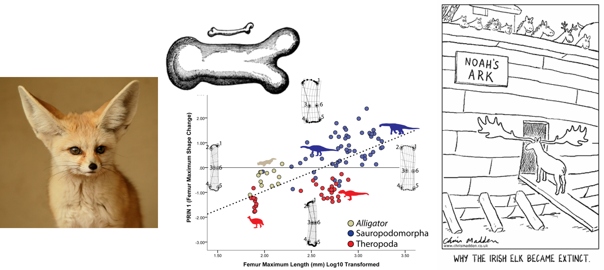  
```

# Allometry: Basic Concepts

- What is allometry, and compared to what?
    - **Isometry**: no change in proportions
    - **Allometry**: change in proportions

- Easily envisioned via single trait relative to size:

$\small{log(Y)}=log(\beta)+\alpha{log(x)}$
    
```{r, echo = FALSE, out.width="50%"}
include_graphics("LectureData/09.allometry/PosNegAllom.png")  
```

> #####Note: concepts of positive and negative allometry are only applicable to univariate traits! (for multivariate traits, allometry is a vector in multi-dimensional space where 'positive' and 'negative' as directions are not defined and have no meaning)

> ###### Also, it is mathematically impossible for all body parts to grow simultaneously faster (positive) or slower (negative) than total body size

# Types of Allometry

- Allometric patterns may be observed at several levels of biological organization:
    - **Ontogenetic allometry**: throughout growth (e.g. understanding energy allocation)
    - **Static allometry** : within a single life stage (e.g. ornaments and sexual selection)
    - **Evolutionary allometry**: across species (e.g. adaptive shape changes) 

```{r, echo = FALSE, out.width="80%"}
include_graphics("LectureData/09.allometry/AllometryTypes.png")  
```

# Allometry in GM Data

- Shape: “the geometric properties of an object after standardizing the effects of location, scale and rotation”
- Procrustes shape variables are independent of CS when no allometry is present
- CS: mathematically independent of shape; biological allometric effects are still there!

Here is isometry...

```{r, echo = FALSE, out.width="40%"}
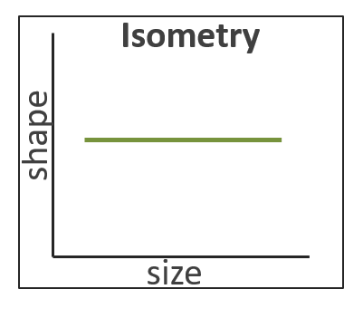  
```

# Allometry in GM Data

- Shape: “the geometric properties of an object after standardizing the effects of location, scale and rotation”
- Procrustes shape variables are independent of CS when no allometry is present
- CS: mathematically independent of shape; biological allometric effects are still there!

Here is isometry...         and here is allometry

```{r, echo = FALSE, out.width="40%"}
par(mfrow=c(1,2)) 
  
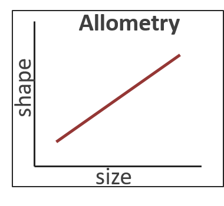  
par(mfrow=c(1,1)) 
```

>- But how do we assess such patterns? 

>- We use linear models!

# Multivariate Linear Regression

To characterize allometric patterns, we fit a model of `shape~size` as:

$$\small\mathbf{Y}=\mathbf{X}\mathbf{\beta } +\mathbf{E}$$

# Multivariate Linear Regression

To characterize allometric patterns, we fit a model of `shape~size` as:

$$\small\mathbf{Y}=\mathbf{X}\mathbf{\beta } +\mathbf{E}$$

We evaluate the allometry model $\small\mathbf{X}_{F}$ by comparing it to an intercept model $\small\mathbf{X}_{R}$:

$\tiny\mathbf{X}_R = \begin{bmatrix} 1\\ 1\\ 1\\ 1\\ 1\\ 1 \end{bmatrix}$  & $\tiny\mathbf{X}_F = \begin{bmatrix} 1 & 0.3 \\ 1 & 0.5 \\ 1 & 0.2 \\ 1 & 1.2 \\ 1 & 0.7 \\ 1 & 1.1 \end{bmatrix}$

# Multivariate Linear Regression

To characterize allometric patterns, we fit a model of `shape~size` as:

$$\small\mathbf{Y}=\mathbf{X}\mathbf{\beta } +\mathbf{E}$$

We evaluate the allometry model $\small\mathbf{X}_{F}$ by comparing it to an intercept model $\small\mathbf{X}_{R}$:

$\tiny\mathbf{X}_R = \begin{bmatrix} 1\\ 1\\ 1\\ 1\\ 1\\ 1 \end{bmatrix}$  & $\tiny\mathbf{X}_F = \begin{bmatrix} 1 & 0.3 \\ 1 & 0.5 \\ 1 & 0.2 \\ 1 & 1.2 \\ 1 & 0.7 \\ 1 & 1.1 \end{bmatrix}$

Estimate | $\small\mathbf{X}_{R}$| $\small\mathbf{X}_{F}$
:----------- | :------------------- | :--------------------------
Coefficients |  $\tiny\hat{\mathbf{\beta_R}}=\left ( \mathbf{X}_R^{T} \mathbf{X}_R\right )^{-1}\left ( \mathbf{X}_R^{T} \mathbf{Y}\right )$ | $\tiny\hat{\mathbf{\beta_F}}=\left ( \mathbf{X}_F^{T} \mathbf{X}_F\right )^{-1}\left ( \mathbf{X}_F^{T} \mathbf{Y}\right )$ 
Predicted Values | $\small\hat{\mathbf{Y}}_R=\mathbf{X}_R\hat{\mathbf{\beta}}_R$ | $\small\hat{\mathbf{Y}}_F=\mathbf{X}_F\hat{\mathbf{\beta}}_F$
Model Residuals | $\small\hat{\mathbf{E}}_R=\mathbf{Y}-\hat{\mathbf{Y}}_R$ | $\small\hat{\mathbf{E}}_F=\mathbf{Y}-\hat{\mathbf{Y}}_F$
Model Residual Error    ($\small{SSE}$) | $\small\mathbf{S}_R=\hat{\mathbf{E}}_R^T\hat{\mathbf{E}}_R$ | $\small\mathbf{S}_F=\hat{\mathbf{E}}_F^T\hat{\mathbf{E}}_F$

# Assessing Significance: RRPP

1: Fit $\small\mathbf{X}_{R}$ for each $\small\mathbf{X}_{F}$; Estimate $\small\hat{\mathbf{Y}}_{R}$ and $\small\mathbf{E}_{R}$

2: Permute, $\small\mathbf{E}_{R}$: obtain pseudo-values as: $\small\mathbf{\mathcal{Y}} = \mathbf{\hat{Y}}_{R} + \mathbf{E}_{R}$

3: Fit $\small\mathbf{X}_{F}$ using $\small\mathbf{\mathcal{Y}}$: obtain coefficients and summary statistics

4: Calculate $\small{F}$-value in every random permutation (observed case counts as one permutation)

5: For $\small{N}$ permutations, $\small{P} = \frac{N(F_{random} \geq F_{obs})}{N}$

6: Calculate *effect size* as a standard deviate of the observed value in a normalized distribution of random values (helps for comparing effects within and between models); i.e.:
$$\small{z} = \frac{
\log\left( F\right) - \mu_{\log\left(F\right)}
} {
 \sigma_{\log\left(F\right)}
}$$
where $\small\mu_{\log\left(F\right)}$ and $\sigma_{\log\left(F\right)}$ are the expected value and standard deviation from the sampling distribution, respectively.

###### Collyer et al. *Heredity.* (2015); Adams & Collyer. *Evolution.* (2016); Adams & Collyer. *Evolution.* (2018)

# Regression: Example

Does body shape covary with size in *Pecos* pupfish? 

```{r, echo = FALSE, out.width="40%"}
include_graphics("LectureData/06.covariation/Pupfish Motivation.png")  
``` 

This is a hypothesis of *Allometry* (shape~size covariation)

```{r eval=TRUE, echo=TRUE, out.width="40%"}
data(Pupfish)
Pupfish$logSize <- log(Pupfish$CS)
fit <- procD.lm(coords ~ logSize, SS.type = "I", 
                data = Pupfish, print.progress = FALSE, iter = 999) 
anova(fit)
```

>- But how does one visualize multivariate allometry??

# Visualizing Multivariate Allometry

* Need to summarize size-related variation in shape
* Use some rotation/projection method

```{r, echo = FALSE, out.width="40%"}
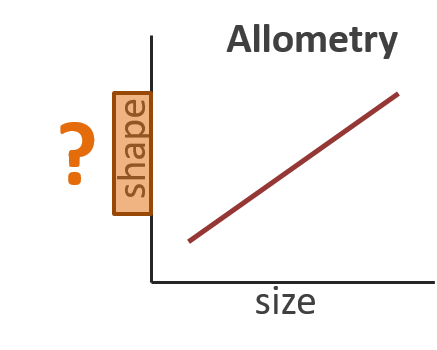  
```

Several (complementary) solutions:

>* Regression scores (Drake and Klingenberg 2008): projection of shape data on the allometric line
$$\small\mathbf{s}=\mathbf{Y\beta^T(\beta^T\beta)^{-1/2}}$$

>* PC1 of predicted values (Adams and Nistri 2010): PC rotation of Ŷ to summarize variation across the shape-size relationship
$$\small\mathbf{P_1}=svd(\mathbf{\hat{Y}})=svd(\mathbf{X(\tilde{X}^T\tilde{X})^{-1}(\tilde{X}^T\tilde{Y})})$$

# Visualization: Example

- Effects of human-mediated disturbance (urbanization) on *Podarcis* lizards
    - 5 urban and 5 rural populations
	  - 359 individuals
	  - 28 bilateral landmarks

- How does environmental disturbance influence development?
- Are size-shape relationships modified in urban populations?

```{r, echo = FALSE, out.width="80%"}
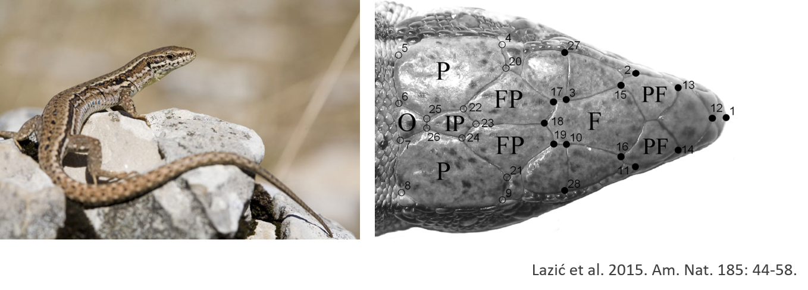  
```

# Allometry Example: *Podarcis*

```{r, echo = FALSE, out.width="40%"}
lizards <- readland.tps('LectureData/09.allometry/symm.shape2.tps', warnmsg = FALSE)
liz.lab <- read.csv('LectureData/09.allometry/ind.info.txt',header=TRUE, sep=",")
Y.gpa <- gpagen(lizards, print.progress = FALSE)
CS <- liz.lab$cs
type <- liz.lab$type
gdf <- geomorph.data.frame(Y.gpa, CS = CS, type = type)

plotAllSpecimens(Y.gpa$coords)

fit <- procD.lm(Y.gpa$coords~CS*type, data = gdf, print.progress = FALSE)

anova(fit)
``` 

# Allometry Example: *Podarcis* (Cont.)

```{r, echo = FALSE, out.width="80%"}
res <- plotTangentSpace(Y.gpa$coords, groups = type, warpgrids = FALSE)
```

# Visualization 
```{r, echo = FALSE, out.width="80%"}
par(mfrow=c(1,2)) 
plotAllometry(fit, size = gdf$CS, logsz = FALSE, method = "RegScore", pch=21, bg=gdf$type)
mtext("Regression Scores")

plotAllometry(fit, size = gdf$CS, logsz = FALSE, method = "PredLine", pch=21, bg=gdf$type)
mtext("Predicted Lines")
par(mfrow=c(1,1)) 
```


# Post-Hoc Tests

- Use randomization methods to test custom hypotheses
- Do urban populations show higher deviations from their group’s trajectory? – a sign of developmental instability

```{r, echo = FALSE, out.width="40%"}
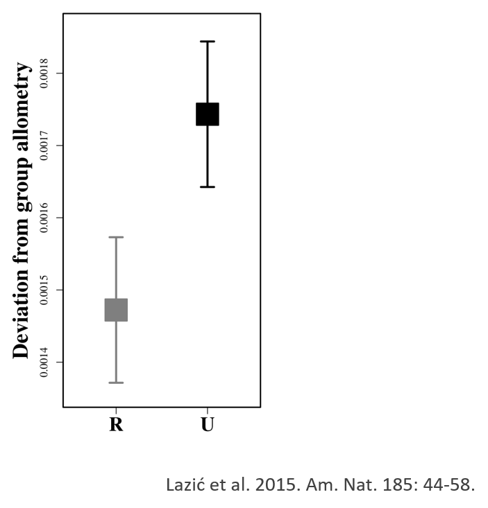  
```

# Size-Shape Space

- Size effects often dominate shape variation, especially in ontogenetic series
- However, when other factors are present, PC1 does not necessarily relate directly to size-dependent variation (at least not to all of it)
- Usual statistical methods do not capture subtle ontogenetic modifications in trajectories

```{r, echo = FALSE, out.width="80%"}
include_graphics("LectureData/09.allometry/SizeShapeConcept.png")  
```

- Examine allometric variation in **size-shape space**

# Size-Shape Space

- Derived from the PCA of shape variables + $\small{ln}(Csize)$
    - 1: Calculate shape variables and $\small{ln}(Csize)$, and join them in a single data matrix
    - 2: Calculate PCA of this matrix ($\small{SSPC1}$)
    - 3: Generate the **common allometric component** (CAC): the common size-shape regression coefficient, after mean-centering shapes by group $\small\mathbf{Y}_{cent}$
    - 4: Calculate the **residual shape component**: SVD of data orthogonal to CAC
    - 5: Visualize allometry as (CAC vs. SSPC1)   & (CAC vs. RSC1)

$$\small\alpha=(\mathbf{Y}_{cent}^T\mathbf{CS})/\mathbf{(CS^TCS)}$$
$$\small{CAC}=\mathbf{Y}_{cent}\alpha$$             where $$\small\alpha=\alpha\sqrt{}(\alpha^T\alpha)$$

# Size-Shape Space: Example

```{r, echo = FALSE, out.width="100%"}
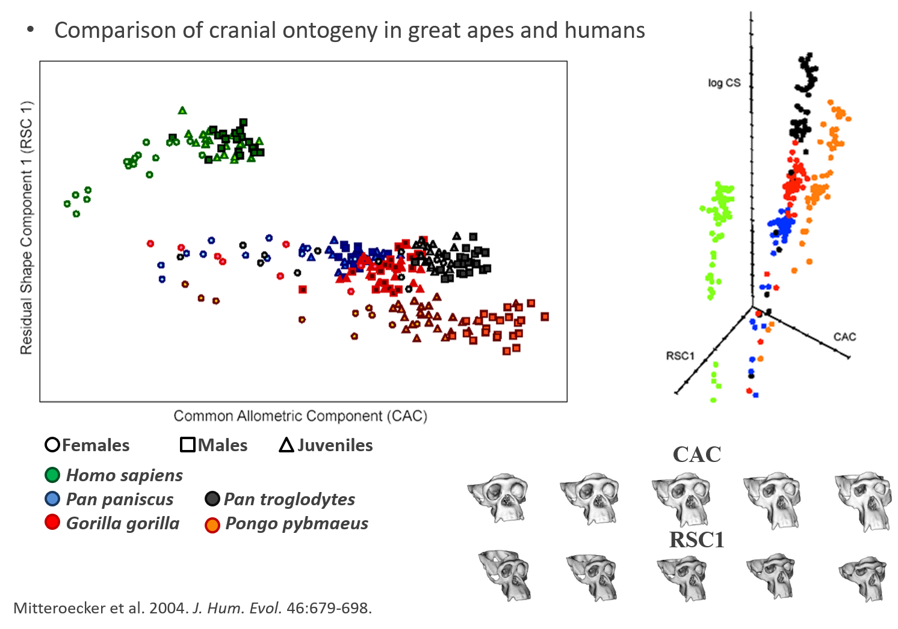  
```

# Note: CAC Scores vs. Regression Scores

- $\small{CAC}$: regression under a common slope after group mean-centering
- Regression scores ($\small{s}$): shape data projected on the regression line with size
- When a single group is considered, $\small{CAC}$ and $\small{s}$ are **identical**!
- Both are projections of mean-centered data on size/shape regression

$$\small\alpha=(\mathbf{Y}_{cent}^T\mathbf{CS})/\mathbf{(CS^TCS)}$$
$$\small{CAC}=\mathbf{Y}_{cent}\alpha$$     $$\small\alpha=\alpha\sqrt{}(\alpha^T\alpha)$$
$$\small\mathbf{s}=\mathbf{Y\beta^T(\beta^T\beta)^{-1/2}}$$

###### See Adams et al. 2013. Hystrix 24: 7-14. 

# Allometry: Other Tests

- Many biological hypotheses are related to the comparison of ontogenetic allometries
- Allometric trajectories are not only about their slope, or variation around it

# Allometry: Other Tests

- Many biological hypotheses are related to the comparison of ontogenetic allometries
- Allometric trajectories are not only about their slope, or variation around it
- E.g. they have a starting and ending point
- Are ontogenetic trajectories similar? (parallelism)
- Do ontogenetic trajectories converge?
- Do ontogenetic trajectories diverge?

# Allometry: Other Tests

- Many biological hypotheses are related to the comparison of ontogenetic allometries
- Allometric trajectories are not only about their slope, or variation around it
- E.g. they have a starting and ending point
- Are ontogenetic trajectories similar? (parallelism)
- Do ontogenetic trajectories converge?
- Do ontogenetic trajectories diverge?
- We need quantitative methods to test such hypotheses
- Take advantage of the toolkit of resampling methods

###### See also PTA for a general method for comparing all types of trajectories, including ontogenetic/allometric trajectories (i.e. Collyer and Adams 2007; Adams and Collyer 2009; Collyer and Adams 2013)

# Allometric Convergence and Divergence

- Convergence: shape is more similar at the end of the trajectory, than at the beginning
- A simple approach: test angular difference between trajectories

# Allometric Convergence and Divergence

- Convergence: shape is more similar at the end of the trajectory, than at the beginning
- A simple approach: test angular difference between trajectories
    - 1: Obtain allometric vectors - $\small\mathbf{\hat{Y}}_{start}$ & $\small\mathbf{\hat{Y}}_{end}$ - for groups
    - 2: Normalize vectors (divide by their length so they are unit length) and find the cross-product between pairs of vectors; i.e, $r_{ij} = \mathbf{\beta}_i^T \mathbf{\beta}_j$
    - 3: Obtain test measure: $\theta = \cos^{-1}(r_{ij})$
    - 4: RRPP with appropriate null model to test $\theta$

- **Convergence** when $\theta$ is significant and vectors tend toward a similar shape
- **Divergence** when $\theta$ is significant and vectors tend toward a different shape
- **Parallelism** when $theta$ is not significant and/or effect size is small
- Can also test absolute difference in vector lengths to determine if one group has greater onotogenetic shape change than another
    
###### Adams and Nistri. (2010) *BMC. Evol. Biol.*

# Evolutionary Convergence: Example

* Ontogenetic series for 8 species of *Hydromantes*
* These salamanders live in caves and they climb extensively on the walls as adults
* Foot shape is a trait with functional relevance
* How does foot shape change across ontogeny?

```{r, echo = FALSE, out.width="80%"}
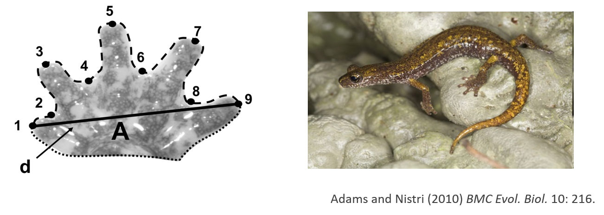  
```

# Evolutionary Convergence: Example (Cont.)

```{r, echo = FALSE, out.width="80%"}
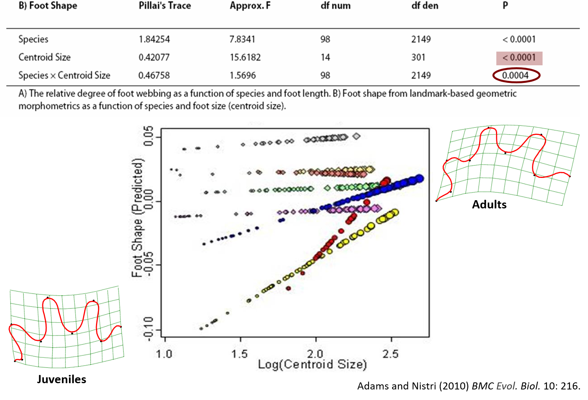  
```

# Evolutionary Convergence: Example (Cont.)

```{r, echo = FALSE, out.width="80%"}
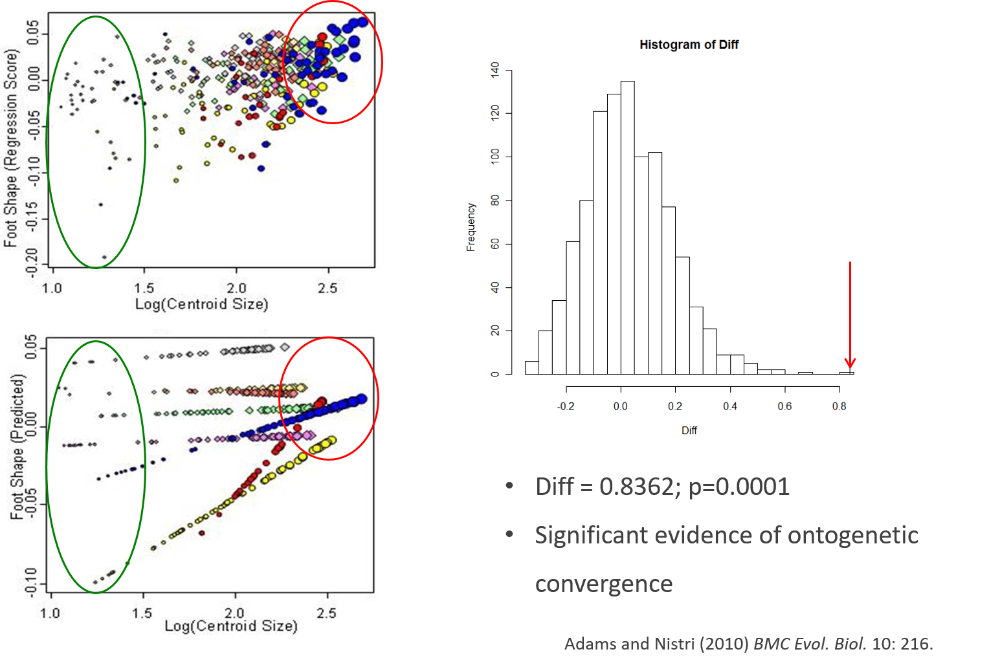  
```

# Comparing allometric trajectories: geomorph example

- **Question**: Do your groups have parallel allometries?
- **Question**: Do your groups have unique allometries?
- **Question**: Which groups have different allometries, and how do they differ?

#### Example: pupfish data

```{r, include=TRUE}
data(pupfish)
plotAllSpecimens(pupfish$coords)

```

# Comparing allometric trajectories: geomorph example (cont.)

#### Example: pupfish data

```{r, include=TRUE}
pupfish$logSize <- log(pupfish$CS)
pupfish$Group <- interaction(pupfish$Pop, pupfish$Sex)
fit.common <- procD.lm(coords ~ logSize + Group, 
                     data = pupfish, print.progress = FALSE) 
fit.unique <- procD.lm(coords ~ logSize * Group, 
                     data = pupfish, print.progress = FALSE)  

```

# Comparing allometric trajectories: geomorph example (cont.)

#### Example: pupfish data

Homogeneity of slopes test

```{r, include=TRUE}

anova(fit.unique, fit.null = fit.common, print.progress = FALSE)
```

Results suggest that allometric slopes are parallel. 
We can see by plotting the prediction lines for both that a unique-allometries model is not practical.

# Comparing allometric trajectories: geomorph example (cont.)

#### Example: pupfish data

Allometric plots

```{r, include=TRUE, out.width="100%"}

par(mfcol = c(1,2))
plotAllometry(fit.common, pupfish$CS, logsz = TRUE, method = "PredLine", pch = 21,
              bg = pupfish$Group)
plotAllometry(fit.unique, pupfish$CS, logsz = TRUE, method = "PredLine", pch = 21,
              bg = pupfish$Group)

```

```{r, include = FALSE}
par(mfcol = c(1, 1))
```

# Comparing allometric trajectories: geomorph example (cont.)

#### Example: pupfish data

Hypothesis tests: vector lengths

```{r, include=TRUE}

PW <- pairwise(fit.unique, groups = pupfish$Group,
               covariate = log(pupfish$CS), print.progress = FALSE)
summary(PW, test = "dist")

```

# Comparing allometric trajectories: geomorph example (cont.)

#### Example: pupfish data

Hypothesis tests: angles between vectors

```{r, include=TRUE}

summary(PW, test = "VC", angle.type = "deg") 
```

# Comparing allometric trajectories: geomorph example (cont.)

#### Example: pupfish data

Conclusion: allometries do not significantly diverge.  But concluding they are parallel allows one to compare means, accounting for common allometric variation.

```{r, include=TRUE}

PW <- pairwise(fit.common, groups = pupfish$Group,
               print.progress = FALSE)

summary(PW, test = "dist") 
```


# Empirical Example: Cranial Ontogeny in Crocodilians

- Phylogenetic relationships have long been under debate
- What information can we extract from cranial ontogeny?

```{r, echo = FALSE, out.width="80%"}
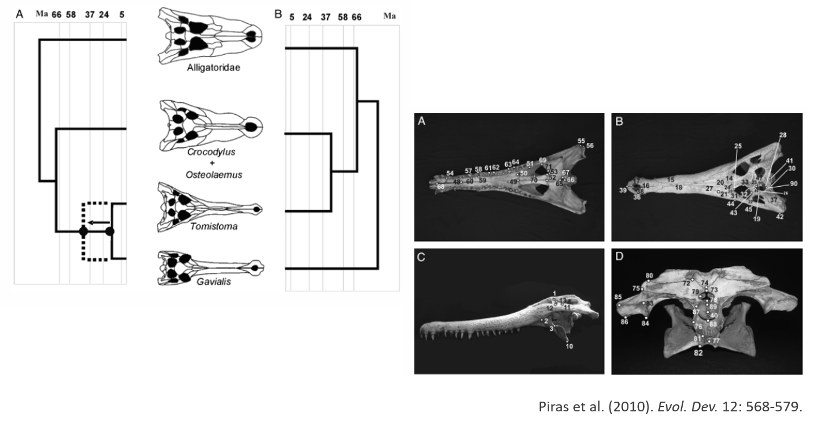  
```

# Empirical Example: Cranial Ontogeny in Crocodilians (Cont.)

- Some groups follow different ontogenetic paths
- There is ontogenetic convergence, where adults are more similar than juveniles


```{r, echo = FALSE, out.width="80%"}
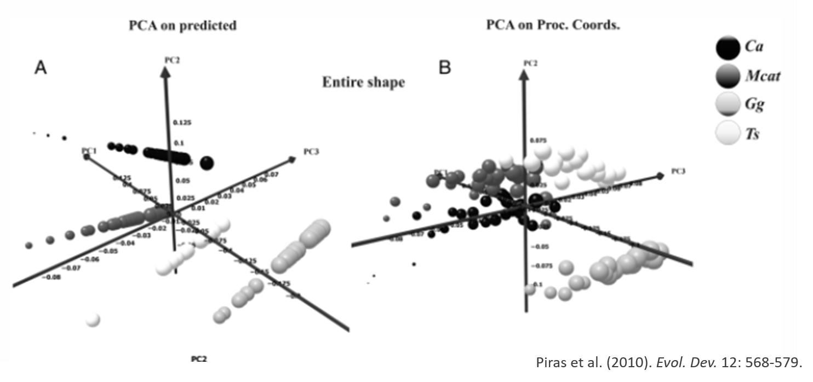  
```

# A Comment on Heterochrony

- Evolutionary changes in the rate or timing of developmental sequences
    - i.e. changes in ontogenetic trajectories
- Can be evaluated via allometric/ontogenetic investigations

```{r, echo = FALSE, out.width="80%"}
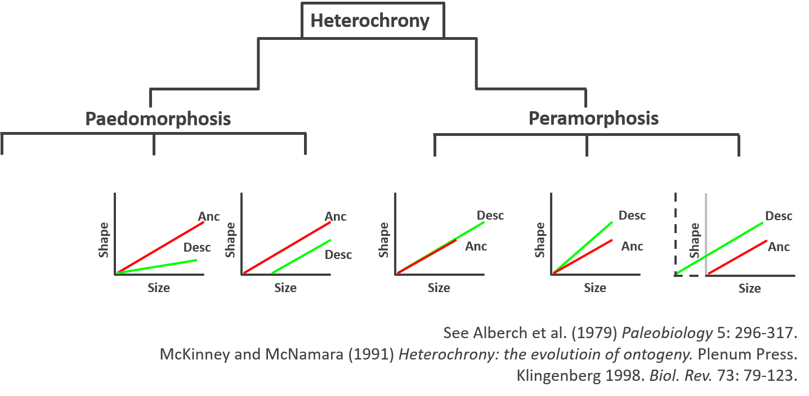  
```

# Allometry: Summary

- Shape usually changes with size – allometry is a common pattern in biological data
- We need to account for it when testing hypotheses about shape
- Many biological hypotheses related directly to allometric variation
- **Visualization**: 
    - RegScore ($\small{s}$) vs. Csize (Drake and Klingenberg 2008)
    - PredLine $\small{P_1}$ vs. Csize (Adams and Nistri 2010)
    - CAC, RSC, Csize (Mitteroecker et al. 2004)

- **Comparison of ontogenies**: - MANCOVA
    - Convergence & divergence (Adams and Nistri 2010)
    - Orientation (Piras et al. 2010)

- Heterochrony and related topics also of interest
