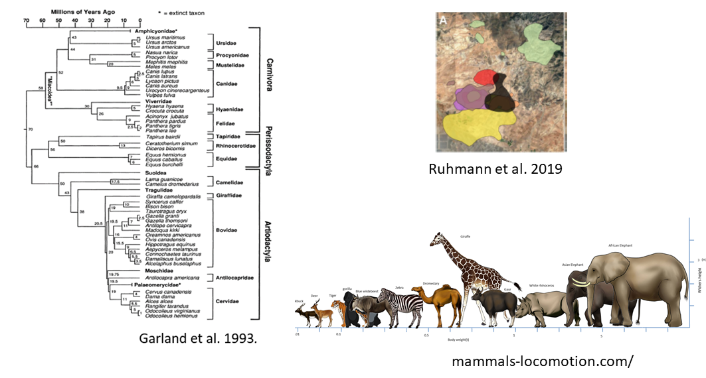
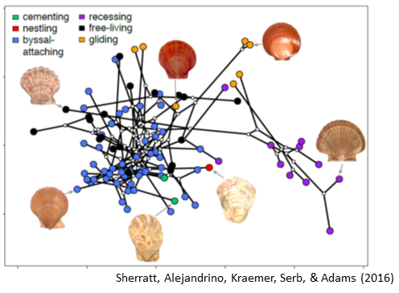
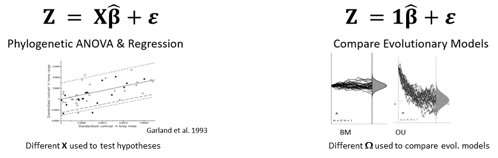
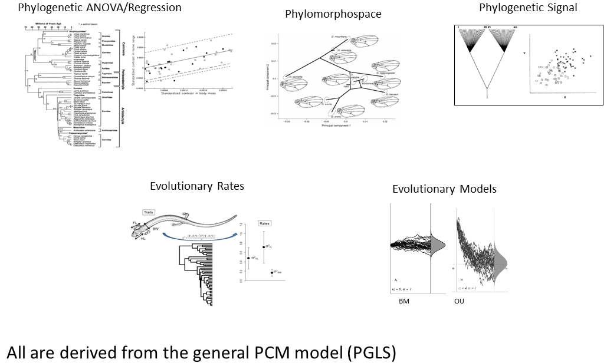
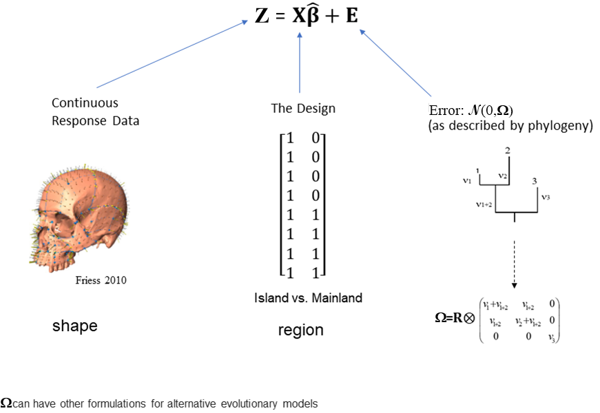

```{r setup, include=FALSE, echo = TRUE, tidy = TRUE}
library(knitr)
library(ape)
library(phytools)
library(geomorph)
library(kableExtra)
library(geiger)
opts_chunk$set(echo = TRUE)

library(xaringanthemer)
style_mono_light()
```

### Lecture Outline 

+ On Correlated Observations and Errors
+ Multivariate Phylogenetic Comparative Methods
  1. Phylogenetic Least Squares (ANOVA/Regression/Covariation)
  2. Phylogenetic Signal
  3. Phylogenetic Ordination
  4. Comparing Evolutionary Models
---

### Motivation: Correlated Observations

+ Imagine the following scenario:
  + We assemble a large database of data for many mammal species to ask:
+ Is home range size predicted by body size?

.pull-left[
```{r, echo = FALSE, out.width="90%", fig.align='center'}
  
```
]
.pull-right[
+ We might consider using a linear model to investigate: $\mathbf{Z = X\beta + \epsilon}$

+ But what potential problem do we face?
]

--

+ The observations are not independent (species are related by a phylogeny)!
  
---

### Comparative Biology Tradition

+ To study adaptation, biologists look comparatively across taxa, and examine trait correlations

+ Species values commonly utilized

.pull-left[
```{r, echo = FALSE, fig.align = "center", out.width="90%"}
include_graphics("lectureData/09.pcm/PCM-Metab.png")

```
]

.pull-right[
```{r, echo = FALSE, fig.align = "center",  out.width="90%"}
include_graphics("lectureData/09.pcm/PCM-PrimateCoev.png")

```
]
--

+ But this has the same problem: the observations are not independent!

+ To resolve this, **Phylogenetic Comparative Methods** are required
---

### Phylogenetic Comparative Methods (PCMs)

+ PCMs condition the data on the phylogeny under an evolutionary model (i.e., account for the phylogeny during the analysis)

+ Empirical Goal: Evaluate evolutionary hypotheses while accounting for (phylogenetic) non-independence

```{r, echo = FALSE, out.width="30%", fig.align = "center"}
  
```

+ This requires a phylogeny, and an evolutionary model of how trait variation is expected to accumulate

--

+ But to understand PCMs more deeply, let's first  go back to something familiar: linear models
---

### Linear Models Revisited

- Statistical linear models describe patterns in data with both a deterministic component (the relationships between variables) *AND* a process for how we expect stochastic variation (random error) to be generated $^1$

+ The Linear Model: $\mathbf{Z}=\mathbf{X}\mathbf{\beta } +\mathbf{\epsilon}$

.footnote[1: For a refreshing perspective on correlated errors in biology see Ives (2022). *Methods Ecol. Evol.*]
--

   + $\mathbf{X\beta}$ describes the predicted values $(\hat{\mathbf{Z}})$ given the independent variables $(\mathbf{X})$

   + $\mathbf{\epsilon}$ captures the stochastic error in the processes generating $\mathbf{Z}$

--

+ To this point (and in most statistics courses) we tend to focus on the deterministic component $(\mathbf{X\beta})$ and whether our model is an adequate description of variation in $\mathbf{Z}$ (i.e., by minimizing $\mathbf\epsilon$)

--

- But what about $\mathbf{\epsilon}$? What does it really represent and contain?

---

### Thinking about the Error: $\large\mathbf{\epsilon}$

.pull-left[
+ When fitting linear models, we describe $\mathbf{\epsilon}$ as the 'error'
  + It is that portion of $\mathbf{Z}$ not explained by the model: $\hat{\mathbf{Z}}=\mathbf{X\beta}$ $(+\mathbf{\epsilon})$

+ Statistically, $\mathbf{\epsilon}$ follows a distribution which describes how we expect the error to be distributed

+ For the linear models used thus far, $\mathbf{\epsilon}$ is modeled as (assumed to be) *iid* $^1$. These are ordinary least squares (OLS) models

.footnote[1: *iid*: independent, identically distributed error. This is where the common 'assumptions' of the OLS linear model are embodied.]
]

--

.pull-right[
+ In essence, the random errors are modeled as if drawn independently from a normal distribution: $\epsilon \small\sim\mathcal{N}(0,\sigma^2)$ 

```{r echo=FALSE, out.width = "50%", fig.align='center'}
x <- seq(-4, 4, length=100)
y <- dnorm(x)
plot(x,y, type = "l", lwd = 4, axes = FALSE)
```
]

---

### Visualizing $\large\mathbf{\epsilon}$ as a Matrix

+ When random error is iid, this means that elements of $\epsilon$ are drawn from the same normal distribution: $\epsilon\small\sim\mathcal{N}(0,\sigma^2)$

.pull-left[
+ Viewed as a matrix, the Gaussian error is: $\sigma^2\mathbf{\Omega}$, where $\sigma^2$ is the error variance and $\mathbf{\Omega}$ describes the relationships among observations

```{r echo=FALSE, out.width = "80%", fig.align='center'}
kbl(diag(4), booktabs=TRUE)
```

]

--

.pull-right[
- The diagonal elements of $\mathbf\Omega$ describe differences in the expected variance for each observation. Here they are all '1', which represents *identically distributed* 
- The off-diagonal elements of $\mathbf\Omega$ describe expected covariation (correlation) between pairs of observations. Here they are '0', signifying *independent* observations

- However, we can make the situation (and thus $\mathbf\Omega$) more complex
]

##### NOTE: In the PCM literature, $\mathbf\Omega$ is often termed **C** or $\mathbf\Sigma$. In this workshop we use $\mathbf\Omega$ so as not to confuse this matrix with a trait covariance matrix $\mathbf\Sigma$.
---

### Modeling $\large\mathbf{\epsilon}$ with Heterogeneous Variance 

+ Imagine taking repeated caliper measurements of body size on 4 specimens

  + Error is expected to be proportionately greater when measuring smaller individuals (it is harder to measure smaller specimens as accurately)   

--

+ This means the *expected* variance differs among observations

```{r echo=FALSE, out.height = "30%", fig.align='center'}
e <- diag(c(2.7, 2.1, 1.8, 1.2)); rownames(e) <- colnames(e) <- c("smallest", "next", "next","largest")
kbl(e, booktabs=TRUE)
```

+ Now $\mathbf\Omega$ models independent observations with **heterogeneous** random variance (i.e., $\sigma^2$ varies across observations)
---

### Modeling $\large\mathbf{\epsilon}$ with Correlated Observations 

+ Now imagine we measure 2 species from each of two genera

  + We expect that values are more similar between congeneric species (due to phylogenetic relatedness)
  
+ This means the *expected* covariance is not always zero

.pull-left[
```{r, echo = FALSE, out.width="40%", fig.align='center'}
phy <- stree(4,type = "balanced")
plot(phy, font = 3)
tiplabels(bg=NULL, adj = c(1,.5), frame = "none", cex = 3)
```
]

--

.pull-right[
```{r, echo = FALSE, out.width="100%", fig.align='center'}
e <- diag(4);e[1,2] <- e[2,1] <- e[4,3] <- e[3,4] <- 0.7 
rownames(e) <- colnames(e) <- c("t1", "t2", "t3","t4")
kbl(e, booktabs=TRUE) 
```
]

+ Now $\mathbf\Omega$ models random variation in **non-independent** observations

--

+ For actual data, two questions remain: 
  1. How do we generate $\mathbf\Omega$?
  2. What do we do with it? 
---

### Generating Object Covariance Matrices $\large(\mathbf\Omega)$

+ $\mathbf\Omega$ is an $N\times N$ matrix describing the expected covariation of the random errors among observations 
  + If $\epsilon$ is iid, then $\mathbf\Omega$ is an identity matrix 
  + If $\epsilon$ is NOT iid, then $\mathbf\Omega$ displays some other pattern, which was caused by 'something'

+ Biology informs us of what that something is (phylogeny, space, time)

--

+ In this case, generating $\mathbf\Omega$ requires knowledge of the relationships among observations, and a model of how trait variation is expected to accumulate

+ Let's look at this for the case of a phylogeny, and what are termed phylogenetic comparative methods (PCMs)

  + But first, we will describe the model of evolutionary change (Brownian motion)
---

### Brownian Motion and PCMs

.pull-left[
+ Brownian motion is a useful *NULL* model of trait change
  + Trait changes are independent from time step to time step
  + Results in: $\Delta\mu = 0$  and $\sigma^2_{taxa} \uparrow \propto time$

]
.pull-right[
```{r echo = FALSE, eval=TRUE, out.width="80%",  results='hide', fig.align = "center"}
 nsim <- 100
  t <- 0:100  # time
  sig2 <- 0.005
  X <- matrix(rnorm(n = nsim * (length(t) - 1), sd = sqrt(sig2)), nsim, length(t) - 1)
  X <- cbind(rep(0, nsim), t(apply(X, 1, cumsum)))
  plot(t, X[1, ], xlab = "time", ylab = "phenotype", ylim = c(-2, 2), type = "l")
  apply(X[2:nsim, ], 1, function(x, t) lines(t, x), t = t)
```
+ We can use this to intuit the expected covariation among species on a phylogeny
]
---

### From Brownian Motion to $\large\mathbf\Omega$

+ Imagine a trait evolving through time
  + From the root of the phylogeny, its value changes following a BM process
  + When speciation occurs, traits in each species evolve via BM
  
.pull-left[
```{r echo = FALSE, eval=TRUE, out.width="50%",  results='hide', fig.align = "center"}
t <- 100  # total time
n <- 4  # total taxa
set.seed(2)
tree <- pbtree(n=n, scale = t)
plot(tree)
set.seed(NULL)
```
]

.pull-right[
```{r echo = FALSE, eval=TRUE, out.width="50%",  results='hide', fig.align = "center"}
set.seed(4)
sig2 <- 0.005
## simulate evolution along each edge
X <- lapply(tree$edge.length, function(x) c(0, cumsum(rnorm(n = x, sd = sqrt(sig2)))))
## reorder the edges of the tree for pre-order traversal
cw <- reorder(tree)
## now simulate on the tree
ll <- tree$edge.length + 1
for (i in 1:nrow(cw$edge)) {
  pp <- which(cw$edge[, 2] == cw$edge[i, 1])
  if (length(pp) > 0) 
    X[[i]] <- X[[i]] + X[[pp]][ll[pp]] else X[[i]] <- X[[i]] + X[[1]][1]
}
## get the starting and ending points of each edge for plotting
H <- nodeHeights(tree)
## plot the simulation
plot(H[1, 1], X[[1]][1], ylim = range(X), xlim = range(H), xlab = "time", ylab = "phenotype")
for (i in 1:length(X)) lines(H[i, 1]:H[i, 2], X[[i]])
## add tip labels if desired
yy <- sapply(1:length(tree$tip.label), function(x, y) which(x == y), y = tree$edge[, 2])
yy <- sapply(yy, function(x, y) y[[x]][length(y[[x]])], y = X)
text(x = max(H), y = yy, tree$tip.label)
set.seed(NULL)
```
]

+ The result is that traits *tend* to be more similar in more closely related species
  + Using BM, we can estimate $\mathbf\Omega$
---

### Phylogenetic Covariance Matrices $(\large\mathbf\Omega)$

+ Under Brownian motion, the ***expected*** amount of change in trait values is proportional to time
  + Species evolve 'together' on their parental branch until they speciate
  + Thus, the more time before they speciate, the more similar their traits are expected to be (less time evolving separately means less opportunity to diverge)

+ This gives us the expected object covariance $(\mathbf\Omega)$ under Brownian motion $^1$ 

```{r, echo = FALSE, out.width = "60%",fig.align='center'}
include_graphics("LectureData/09.pcm/PCM-PhyCovMat.png")  
```

.footnote[1: Other evolutionary models, such as OU, could also be used.]
---

### Phylogenetic Covariance Matrices $(\large\mathbf\Omega)$: Example

+ What is the expected covariation for species related by a phylogeny under BM? 

.pull-left[
```{r, echo = FALSE, out.width="50%", fig.align='center'}
phy <- pbtree(n=5, scale = 1)
plot(phy)
tiplabels(phy$tip.label,bg=NULL, adj = c(1,.5), frame = "none", cex = 3)
```
]

.pull-right[
```{r, echo = FALSE, out.width="80%", fig.align='center'}
v <- vcv.phylo(phy)
kbl(v, booktabs=TRUE, digits=2)
```
]

+ Now we have $\mathbf\Omega$ for our species

+ The next question is, what do we do with it?
---

### From Ordinary Least Squares to Generalized Least Squares

+ Linear models with iid error: $\epsilon\small\sim\mathcal{N}(0,\sigma^2)$, are called **Ordinary Least Squares** methods

  + These include all the methods we have discussed previously
  + ANOVA, regression, ANCOVA, factorial ANOVA, multiple regression, pairwise comparisons, trajectory analysis, are part of this paradigm

--

+ With $\mathbf\Omega$ we move from iid to correlated error

+ Linear models with correlated error: $\epsilon\small\sim\mathcal{N}(0,\sigma^2\mathbf\Omega)$, are called **Generalized Least Squares** methods
  + With GLS, we can perform versions of ANOVA, regression, ANCOVA, multiple regression, pairwise comparisons, trajectory analysis, etc.
  + These are the **SAME** statistical models as before, but now account for the correlations among observations as described by $\mathbf\Omega$
  + Because $\mathbf\Omega$ describes covariation of the errors, we must adjust our linear model algebra to accommodate it

+ **Phylogenetic Comparative Methods (PCMs)** are GLS approaches  
---

### PCMs: General Model

+ Most PCMs use GLS model: $\mathbf{Z}=\mathbf{X}\mathbf{\beta} +\mathbf{\epsilon}$
  + $\mathbf{X\beta}$ describes the predicted values $(\hat{\mathbf{Z}})$ given the independent variable $(\mathbf{X})$
  + $\epsilon\sim\mathcal{N}(0,\sigma^2\mathbf\Omega)$ captures the stochastic error in the processes generating $\mathbf{Z}$ given $\mathbf\Omega$

+ Model design $(\small\mathbf{X})$ describes the type of analysis $^1$

```{r, echo = FALSE, out.height ="35%", out.width = "65%", fig.align = "center"}
  
```

+ The Phylogenetic Comparative Method Toolkit is a set of procedures for evaluating different hypotheses

.footnote[1: reviewed in: Adams and Collyer (2018;2019)]
---

### PCMs: An Incomplete Historical Walk

+ The conceptual development of PCMs

```{r, echo = FALSE, fig.align = "center", out.width="85%"}
include_graphics("lectureData/09.pcm/PCM-MethodRoad.png")  
```
---

### Phylogenetic Comparative Method Toolkit

```{r, echo = FALSE, out.width = "80%", fig.align = "center"}
  
```
---

### 1: Phylogenetic Least Squares: Regression (Concept)

+ Evaluate $\mathbf{Z}=\mathbf{X}\mathbf{\beta } +\mathbf{\epsilon}$ in a phylogenetic context

+ The workhorse of PCMs
      
```{r, echo = FALSE, fig.align = "center", out.width="90%"}
include_graphics("lectureData/09.pcm/PCM-PhyloRegGarland.png")  
```
---

### 1: Phylogenetic Least Squares: Regression and ANOVA

.pull-left[
+ $\mathbf{Z}=\mathbf{X}\mathbf{\beta } +\mathbf{\epsilon}$, where $\epsilon \small\sim\mathcal{N}(0,\sigma^2\mathbf\Omega)$

+ Parameter estimation: $^1$ $\hat{\mathbf\beta}=(\mathbf{X^T\Omega^{-1}X)^{-1}(X^T\Omega^{-1}Z})$.  

+ Also expressed as: $\hat{\mathbf\beta}=(\tilde{\mathbf{X}}^T\tilde{\mathbf{X}})^{-1}(\tilde{\mathbf{X}}^T\mathbf{\tilde{Z}})$ 
]

.footnote[

1: Using Dean's favorite equation! 

2: Grafen (1989). *Phil. Trans. Roy. Soc.*]
--
.pull-right[
+ Model evaluation steps:

$\hat{\mathbf\beta}$ | $\hat{\mathbf{Z}}$ | Residuals | $SSE$
:----- | :----- | :----- | :-----  
$\small\hat{\mathbf\beta_F}$ | $\small\mathbf{X}_R\hat{\mathbf\beta}_R$ | $\small(\mathbf{Z}-\hat{\mathbf{Z}}_F)$ | $\small\hat{\mathbf{E}}_F^T\hat{\mathbf{E}}_F$
$\small\hat{\mathbf\beta_R}$ | $\small\mathbf{X}_F\hat{\mathbf\beta}_F$ | $\small(\mathbf{Z}-\hat{\mathbf{Z}}_R)$ | $\small\hat{\mathbf{E}}_R^T\hat{\mathbf{E}}_R$

+ Obtain $F$ and compare to RRPP empirical sampling distribution to assess significance
]

+ EVERYTHING is the same as before, only the phylogeny is incorporated in the analysis!
---

### 1: A Visual of Phylogenetic Least Squares

```{r, echo = FALSE, out.width = "70%", fig.align = "center"}
  
```
---

### 1: Phylogenetic Least Squares Regression: Example

+ Is there evolutionary allometry of head shape (does shape covary with size across species while accounting for phylogeny)?

.pull-left[
```{r echo = FALSE, eval=TRUE, fig.align = "center", out.width = "80%"}
plethtree <- read.tree('LectureData/09.pcm/plethtree.tre')
plethland <- readland.tps('LectureData/09.pcm/PlethodonLand.tps',specID = "ID",
                          warnmsg = FALSE)
Y.gpa <- gpagen(plethland, print.progress = FALSE)
M <- mshape(Y.gpa$coords)
svl <- Y.gpa$Csize

shape <- Y.gpa$coords
gps <- read.csv('LectureData/09.pcm/PlethGps.csv', header=TRUE, row.names=1)

shape.test <- treedata(phy = plethtree, data = two.d.array(shape), warnings = TRUE)
#match(plethtree$tip.label,rownames(two.d.array(shape)))

data.matched <- treedata(phy = plethtree, data = gps, warnings=FALSE)
  elev <- as.factor(data.matched$data); names(elev) <- row.names(data.matched$data)

gdf <- geomorph.data.frame(shape=shape, svl=svl,elev = elev, plethtree=plethtree)

links <- matrix(c(4,3,2,1,1,6,7,8,9,10,1,1,11,5,5,4,2,3,7,8,9,10,11,9,10,1),
                ncol=2,byrow=FALSE)
plot(ladderize(plethtree),edge.width=3)
axisPhylo(1)
mtext("Phylogeny")
```

]
.pull-right[
```{r echo = FALSE, eval=TRUE, fig.align = "center", out.width = "80%"}
par(mfrow=c(1,2))
plotAllSpecimens(shape,links=links)
mtext("Shape Data")
hist(svl, main = "")
mtext("SVL")
par(mfrow=c(1,1))
```
]
---

### 1: Phylogenetic Least Squares Regression: Example (Cont.)

+ Yes, there is significant evolutionary allometry across the *Plethodon* phylogeny

.scrollable[
```{r eval = TRUE, echo = TRUE}
pgls.reg <- procD.pgls(f1 = shape~svl, phy=plethtree, data=gdf, print.progress = FALSE)
summary(pgls.reg)
```
]

---

### 1: Phylogenetic Least Squares Regression: Visualization

+ Now let's visualize these results

.pull-left[.small[
```{r echo = TRUE, eval = TRUE, out.width = "70%", fig.align = "center"}
plot.out <- plot(pgls.reg, type = "regression", 
                 predictor = svl, reg.type = "RegScore", pch=19, col = "black")
abline(lm(plot.out$RegScore~svl))
```
]]

.pull-right[.small[
```{r echo = TRUE, fig.align = "center", eval=TRUE, out.width="90%"}
preds <- shape.predictor(pgls.reg$GM$pgls.fitted, 
  x= svl, Intercept = TRUE, predmin = min(svl), predmax = max(svl))
```

```{r echo = FALSE, fig.align = "center", eval=TRUE, out.width="70%"}
par(mfrow=c(2,1))              
plotRefToTarget(M, preds$predmin, mag=3)
mtext("small X3")
plotRefToTarget(M, preds$predmax, mag=3)
 mtext("large X3")
 par(mfrow=c(1,1))              
```
]]
---

### 1: Phylogenetic Least Squares ANOVA: Example

+ Does head shape in *Plethodon* differ between high and low elevation species? 

.pull-left[
```{r echo = FALSE, eval=TRUE, fig.align = "center", out.width = "80%"}
plot(ladderize(plethtree),edge.width=3)
axisPhylo(1)
mtext("Phylogeny")
```

]
.pull-right[
```{r echo = FALSE, eval=TRUE, fig.align = "center", out.width = "80%"}
plotAllSpecimens(shape,links=links)
mtext("Shape Data")
```
]
---

### 1: Phylogenetic Least Squares ANOVA: Example (Cont.)

+ No, head shape does not differ across elevational groups when phylogeny is considered

.scrollable[
```{r eval = TRUE, echo = TRUE}
pgls.aov <- procD.pgls(f1 = shape~elev, phy=plethtree, data=gdf, print.progress = FALSE)
summary(pgls.aov)
```
]

---

### 1: Phylogenetic Least Squares ANOVA: Visualization

+ Now let's visualize these results

.pull-left[.small[
```{r echo = TRUE, eval = TRUE, out.width = "70%", fig.align = "center"}
plot.res <- gm.prcomp(shape,phy=plethtree)
plot(plot.res,phylo = FALSE, pch=21, bg=gdf$elev, cex=2)
legend("topleft", pch=21, pt.bg = unique(gdf$elev), legend = levels(gdf$elev))
```
]]

.pull-right[.small[
```{r echo = FALSE, fig.align = "center", eval=TRUE, out.width="90%"}
Low <- c(1) # design for low elevation
High <- c(0) # design for high elevation
```

```{r echo = TRUE, fig.align = "center", eval=TRUE, out.width="90%"}
preds <- shape.predictor(arrayspecs(pgls.aov$pgls.fitted, 11,2), x= pgls.aov$X[,-1],
           Intercept = TRUE, Low = Low, High = High)   
```

```{r echo = FALSE, fig.align = "center", eval=TRUE, out.width="70%"}
par(mfrow=c(2,1))              
plotRefToTarget(M, preds$Low, mag=1, links=links)
mtext("Low Elevation: 1X")
plotRefToTarget(M, preds$High, mag=1, links=links)
mtext("High Elevation: 1X")
 par(mfrow=c(1,1))              
```
]]
---

### 1: Phylogenetic ANOVA: Group Aggregation

+ How groups are distributed on the phylogeny can make a difference: Adams and Collyer. *Evol.* (2018)

```{r, echo = FALSE, fig.align = "center", out.width = "70%"}
include_graphics("lectureData/09.pcm/PCM-PhyANOVA-Groups.png")
```

+ Too few group 'state' changes across phylogeny results in lower power
---

### 1: Phylogenetic Least Squares: Implementations

+ Three implementations are found in the literature

```{r, echo = FALSE, fig.align = "center", out.width = "90%"}
include_graphics("lectureData/09.pcm/PGLS-Implementations.png")
```

+ All yield equivalent results if performed properly

---

### 1B: Phylogenetic Partial Least Squares $^1$

+ A related approach assesses the covariation between blocks of variables while accounting for phylogenetic non-independence

.pull-left[
+ PLS of evolutionary covariance (i.e., rate) matrix
  1. Calculate: $\mathbf{R}=\frac{(\mathbf{Z}-E(\mathbf{Z}))^{T}\mathbf\Omega^{-1}(\mathbf{Z}-E(\mathbf{Z}))}{N-1}$
  2. Decompose:  $\small\mathbf{R}_{12}=\mathbf{U}_{12}\mathbf{D}\mathbf{V}^{T}_{12}$
  3. Obtain $r_{PLS}$ from correlation of singular values, $\mathbf{P}_1$ and $\mathbf{P}_2$
  4. Significance evaluated using RRPP
]

.footnote[
1: Adams and Felice. *PLoS One* (2014); Adams and Collyer. *Syst. Biol.* (2018)

2: Use of PICs yields same $r_{PLS}$ (Klingenberg and Marugan-Loban. *Syst. Biol.* 2013); but significance tests based on permuting PICs is incorrect (see Adams and Collyer 2015. Evolution).
]
--

.pull-right[
+ This may be obtained directly from the phylo-transformed data: 
  1. Decompose: $\tilde{\mathbf{Z}}_1^T\tilde{\mathbf{Z}}_2=\mathbf{U}_{12}\mathbf{D}\mathbf{V}^{T}_{12}$
  2. Obtain $r_{PLS}$ from correlation of singular values, $\mathbf{P}_1$ and $\mathbf{P}_2$ from phylogenetically-transformed data
  3. Significance evaluated using RRPP 
  
]  

---

### 1B: Phylogenetic Partial Least Squares: Example

+ Is there phenotypic integration between the cranium and mandible in *Plethodon* salamanders? 

.scrollable[
```{r echo = TRUE, fig.align = "center", eval=TRUE,out.width="80%"}
land.gps<-c("A","A","A","A","A","B","B","B","B","B","B")
PLS.Y <- phylo.integration(A = gdf$shape, partition.gp = land.gps, phy= plethtree, print.progress = FALSE)
summary(PLS.Y)
```
]
---

### 1B: Phylogenetic Partial Least Squares: Visualization

+ Now let's visualize these results

```{r echo = TRUE, eval = TRUE, out.width = "40%", fig.align = "center"}
plot(PLS.Y)
```

---

### 2: Phylogenetic Signal 

+ The degree to which phenotypic similarity associates with phylogenetic relatedness

```{r echo = FALSE, fig.align = "center", eval=TRUE,out.width="70%"}
include_graphics("lectureData/09.pcm/PCM-PhySigFels85.png")
```
---

### 2: Phylogenetic Signal Summary Measures

+ Kappa statistic: Blomberg et al. *Evol.* (2003)

$$\small{K=\frac{(\mathbf{Z}-E(\mathbf{Z}))^T(\mathbf{Z}-E(\mathbf{Z}))}{(\mathbf{Z}-E(\mathbf{Z}))^T\mathbf\Omega^{-1}(\mathbf{Z}-E(\mathbf{Z}))}/\frac{tr(\mathbf\Omega)-N(\mathbf{1}^T\mathbf{\Omega1})^{-1}}{N-1}}$$

--

+ $\lambda$ statistic: Pagel *Nature* (1999)

$$\small{logL=log(\frac{(\mathbf{Z}-E(\mathbf{Z}))^T\mathbf\Omega^\lambda{^{-1}}(\mathbf{Z}-E(\mathbf{Z})))}{\sqrt{(2\pi)^{Np}\times|\mathbf\Omega^\lambda|}}}$$
  + Branch-length scaling during ML fit of data to phylogeny

--

+ Both are for univariate response data only!
---

### 2: Multivariate Phylogenetic Signal $^1$

+ A multivariate generalization of *Kappa* has been proposed: $\small{K}_{mult}$
  + Approach based on the distance-covariance equivalency
  + Uses distances between species in the original and phylo-transformed dataspaces

$$K_{mult}=\frac{\mathbf{D}_{\mathbf{Z},E(\mathbf{Z})}^{T}\mathbf{D}_{\mathbf{Z},E(\mathbf{Z})}}{\mathbf{PD}_{\tilde{\mathbf{Z}},0}^{T}\mathbf{PD}_{\tilde{\mathbf{Z}},0}}/\frac{tr(\mathbf\Omega)-N(\mathbf{1}^{T}\mathbf{\Omega1})^{-1}}{N-1}$$


  + $\small\mathbf{D}_{\mathbf{Z},E(\mathbf{Z})}$ is the distance from each object to the phylogenetic mean
  + $\small\mathbf{PD}_{\tilde{\mathbf{Z}},0}$ is the distance between each object in the phylogenetically-transformed space (found as: $\small\tilde{\mathbf{Z}}=\mathbf{P}(\mathbf{Z-E(\mathbf{Z})})$) and the origin

--

This is the same as: 

$$K_{mult}=\frac{tr\left((\mathbf{Z}-E(\mathbf{Z}))^T(\mathbf{Z}-E(\mathbf{Z})\right)}{tr\left((\mathbf{Z}-E(\mathbf{Z}))^T\mathbf\Omega^{-1}(\mathbf{Z}-E(\mathbf{Z}))\right)}/\frac{tr(\mathbf\Omega)-N(\mathbf{1}^T\mathbf{\Omega1})^{-1}}{N-1}$$

.footnote[1: Adams (2014). *Syst. Biol.*]
---

### 2: Multivariate Phylogenetic Signal: Example

Does head shape in in *Plethodon* display phylogenetic signal? 

.pull-left[
```{r echo = TRUE, eval=TRUE,out.width="40%"}
PS.shape <- physignal(A=shape,phy=plethtree,iter=999, print.progress = FALSE)
summary(PS.shape)
```

]
.pull-right[
```{r echo = TRUE, fig.aling = "center", eval=TRUE,out.width="80%"}
plot(PS.shape)
```
]
---

### 2: Phylogenetic Signal: An Effect Size $^1$

+ Optimizing $\Omega$ by $\lambda$ in the equation of $Kappa$ provides a direct link between the two statistics $^2$
+ This formulation lends itself nicely to evaluation via RRPP

  + RRPP many times, obtaining $logL$

  + Calculate Effect size as: 
  
  $$\small{Z=\frac{\theta_{obs}-\mu_\theta}{\sigma_\theta}}$$
  where $\theta_{obs}=f(logL_\Omega)$

.footnote[
1: See Collyer et al. (2022) *Methods Ecol. Evol.*

2: Blomberg et al. (2003) *Evol.*
]  
--

+ One can now compare effect sizes to evaluate the strength of phylogenetic signal across datasets:

$$\small{Z_{12}=\frac{(\theta_{obs_1}-\mu_{\theta_1})-(\theta_{obs_2}-\mu_{\theta_2})}{\sqrt{\sigma^2_{\theta_1}+\sigma^2_{\theta_2}}}}$$
---

### 2: Comparing Phylogenetic Signal: Example
.pull-left[
```{r echo = FALSE, fig.align = "center", eval=TRUE,out.width="80%"}
include_graphics("lectureData/09.pcm/ComparePhySignal.png")
```
]
.pull-right[
```{r echo = FALSE, fig.align = "center", eval=TRUE,out.width="80%"}
include_graphics("lectureData/09.pcm/ComparePhySignal2.png")
```

Greater phylogenetic signal in SA:V ratios!
]

##### From Collyer et al. (2022). *Methods Ecol. Evol.*
---

### 3: Phylogenetic Ordination

+ Ordinations that incorporate phylogenetic relatedness

+ Intent is to provide visual insights into macroevolutionary patterns

+ Three approaches: 

--


1. Phylomorphspace: project phylogeny into PCA space (using ancestral states)

2. Phylogenetic PCA (pPCA): account for phylogeny in PCA computations
  
  + Rotates data 'away' from phylogenetic signal (i.e., $pPC_1$ is uncorrelated with phylogenetic signal)

3. Phylogenetically-Aligned Components Analysis (PACA)

  + Rotates data 'towards' phylogenetic signal (i.e., $PACA_1$ maximizes phylogenetic signal)
---

### 3: Phylogenetic Ordination $^1$

+ Recall the general ordination equation (Shape Statistics I lecture): 

$$\mathbf{I}^T_{n \times n} \mathbf{Z}=\mathbf{UDV}^T$$

where: $\mathbf{A}$ = $\mathbf{I}_{n \times n}$.  This is PCA, and finds the principal directions of variation in the data independent of any other association.

.footnote[1: See Collyer and Adams (2021). *Methods Ecol. Evol.*]

--

.pull-left[.small[
But what if we do: 

$$\mathbf{T^T_\Omega}\mathbf{Z} =\mathbf{UDV}^T$$

where: $\mathbf{A}=\mathbf{T_\Omega}$ and $\mathbf\Omega=\mathbf{TT^T}$. Data is aligned to directions independent of phylogenetic signal (the least phylogenetic signal in the first component).

]]

--

.pull-right[.small[

Or if instead we perform: 

$$\mathbf{\Omega}^T\mathbf{Z} = \mathbf{UDV}^T$$

where $\mathbf{A}=\mathbf{\Omega}$. Data is aligned to directions that maximize phylogenetic signal (most phylogenetic signal in the first few components).
]]

--

Mathematically the difference between these phylogenetic ordination procedures is that they align the data relative to different matrices in $\mathbf{A}$. 
---

### 3: Phylogenetic Ordination: Phylomorphospace (PCA)

+ Phylomorphospace is a PCA with the phylogeny superimposed (via projection of ancestral states)

$$\mathbf{I}^T_{n \times n} \mathbf{Z}=\mathbf{UDV}^T$$
.scrollable[
```{r echo = TRUE, fig.align = "center", eval=TRUE,out.width="80%"}
plot.pca <- gm.prcomp(shape,phy=plethtree)
plot(plot.pca,phylo = TRUE, pch=21, bg=gdf$elev, cex=2, phylo.par = list(tip.labels = FALSE, node.labels = FALSE) )
legend("topleft", pch=21, pt.bg = unique(gdf$elev), legend = levels(gdf$elev))
```
]
---

### 3: Phylogenetic Ordination: Phylogenetic PCA (pPCA)

+ Aligns data to directions independent of phylogenetic signal

$$\mathbf{T^T_\Omega}\mathbf{Z} =\mathbf{UDV}^T$$

.scrollable[
```{r echo = TRUE, fig.align = "center", eval=TRUE,out.width="80%"}
plot.ppca <- gm.prcomp(shape,phy=plethtree, GLS = TRUE, transform = FALSE)
plot(plot.ppca,phylo = TRUE, pch=21, bg=gdf$elev, cex=2, phylo.par = list(tip.labels = FALSE, node.labels = FALSE) )
legend("topleft", pch=21, pt.bg = unique(gdf$elev), legend = levels(gdf$elev))
```
]
---

### 3: Phylogenetic Ordination: Phylogenetically Aligned Components (PACA)

+ Aligns data to directions that maximize phylogenetic signal

$$\mathbf{\Omega^T}\mathbf{Z} =\mathbf{UDV}^T$$

.scrollable[
```{r echo = TRUE, fig.align = "center", eval=TRUE,out.width="80%"}
plot.paca <- gm.prcomp(shape,phy=plethtree, align.to.phy = TRUE)
plot(plot.paca,phylo = TRUE, pch=21, bg=gdf$elev, cex=2, phylo.par = list(tip.labels = FALSE, node.labels = FALSE) )
legend("topleft", pch=21, pt.bg = unique(gdf$elev), legend = levels(gdf$elev))
```
]
---

### 3: Phylogenetic Ordination: Side By Side

```{r echo = FALSE, fig.align = "center", eval=TRUE,out.width="50%"}
par(mfrow=c(1,3))

plot(plot.pca,phylo = TRUE, pch=21, bg=gdf$elev, cex=2, phylo.par = list(tip.labels = FALSE, node.labels = FALSE), main = "Phylomorphospace" )
legend("topleft", pch=21, pt.bg = unique(gdf$elev), legend = levels(gdf$elev))

plot(plot.ppca,phylo = TRUE, pch=21, bg=gdf$elev, cex=2, phylo.par = list(tip.labels = FALSE, node.labels = FALSE), main = "pPCA" )
legend("topleft", pch=21, pt.bg = unique(gdf$elev), legend = levels(gdf$elev))

plot(plot.paca,phylo = TRUE, pch=21, bg=gdf$elev, cex=2, phylo.par = list(tip.labels = FALSE, node.labels = FALSE), main = "PACA" )
legend("topleft", pch=21, pt.bg = unique(gdf$elev), legend = levels(gdf$elev))
par(mfrow=c(1,1))

```
---

### 3: Phylogenetic Ordination: Comments

+ Methods provide contrasting views of the data
  + Phylomorphospace is a 'pure' view of the space
  + pPCA and PACA rotate relative to the phylogeny (albeit differently)

```{r echo = FALSE, fig.align = "center", eval=TRUE,out.width="60%"}
include_graphics("lectureData/09.pcm/pPCA-PACA.png")
```

+ Utilizing several may be helpful

---

### 4: Comparing Evolutionary Models

+ What evolutionary model best describes trait variation? 

.pull-left[

+ Models fit as: $\mathbf{Z=1\beta+\epsilon}$, where $\epsilon\small\sim\mathcal{N}(0,\sigma^2\mathbf\Omega)$

  + Differing evolutionary models are embodied in different $\mathbf\Omega$

```{r echo = FALSE, eval=TRUE, out.width = "60%",results='hide',fig.align = "center"}
par(mfrow=c(1,2))
 nsim <- 100
  t <- 0:100  # time
  sig2 <- 0.005
  X <- matrix(rnorm(n = nsim * (length(t) - 1), sd = sqrt(sig2)), nsim, length(t) - 1)
  X <- cbind(rep(0, nsim), t(apply(X, 1, cumsum)))
  plot(t, X[1, ], xlab = "time", ylab = "phenotype", ylim = c(-2, 2), type = "l",
       main = "Brownian Motion Trait Evolution")
  apply(X[2:nsim, ], 1, function(x, t) lines(t, x), t = t)
  
   OU.sim <- function(n, theta, alpha, sigma,x0){
    dw  <- rnorm(n, 0)
    x <- c(x0)
    for (i in 2:(n+1)) {
      x[i]  <-  x[i-1] + alpha*(theta-x[i-1]) + sigma*dw[i-1]
    }
    return(x);
  }
  OU1.sim2 <- replicate(100, OU.sim(n=100, theta=0.25, alpha=0.25, sigma=0.03, x0=0.75), simplify=FALSE)
  plot(OU1.sim2[[1]],xlab = "time", ylab = "phenotype", ylim = c(0,1), type = "l",
       main = "Ornstein-Uhlenbeck Trait Evolution")
    for(i in 2:100){lines(OU1.sim2[[i]])}
par(mfrow=c(1,1))
```
]

--

.pull-right[

+ Model comparisons of:

1. Evolutionary rate models: BM1, BMM, etc.
2. Evolutionary 'mode' models: BM1, OU1, OUM, etc.

+ Major issue: multivariate generalizations for some evolutionary model comparisons remain underdeveloped (see Adams and Collyer (2018;2019))
]
---

### 4: Comparing Evolutionary Rates Among Clades

Is there evidence for multiple evolutionary rates on the phylogeny? 

```{r echo = FALSE, eval=TRUE,out.width="40%", fig.align = "center"}
include_graphics("lectureData/09.pcm/PCM-BM1BMM.png")
```

+ Fit data to phylogeny under single-rate and multi-rate models, where 
$$\small\log{L}=-\frac{np}{2}ln{2\pi}-\frac{n}{2}ln{\begin{vmatrix}{(\mathbf{\sigma^2\Omega})}\end{vmatrix}}-\frac{1}{2}tr{(\mathbf{Z}-E(\mathbf{Z}))^{T}(\mathbf{\sigma^2\Omega})^{-1}(\mathbf{Z}-E(\mathbf{Z}))}$$
Perform LRT, AIC, simulation, or permutation-based (RRPP) evaluation

---
### 4: Comparing Multivariate Evolutionary Rates Among Clades 

+ Approach has been extended to multivariate traits (using distance-based procedure of Adams 2014)
+ $\sigma^2_{mult}=\mathbf{PD}_{\tilde{\mathbf{Z}},0}^{T}\mathbf{PD}_{\tilde{\mathbf{Z}},0}/N-1$
  + RRPP used for model evaluation

--

Does head shape in high-elevation *Plethodon* species evolve more rapidly than in low-elevation species?
.scrollable[.small[
.pull-left[
```{r eval = TRUE, echo = TRUE, fig.align = "center", out.height = "50%"}
ER<-compare.evol.rates(A=gdf$shape, phy=plethtree,gp=gdf$elev,iter=999, method = 'permutation',print.progress = FALSE)
summary(ER)
```
]
.pull-right[
```{r eval = TRUE, echo = FALSE, fig.align = "center", out.height = "30%"}
plot(ER)
```
]]]
---

### 4: Comparing Evolutionary Rates Among Traits

+ Is there evidence that one trait evolves faster than another? 

.pull-left[

+ Calculate evolutionary rate matrix: 

$$\small{\mathbf{R}=\frac{(\mathbf{Z}-E(\mathbf{Z}))^{T}\mathbf\Omega^{-1}(\mathbf{Z}-E(\mathbf{Z}))}{N-1}=\left( \begin{array}{ccc} \sigma^2_{1} & \sigma^2_{1,2} & \sigma^2_{1,3} \\ \sigma^2_{2,1} & \sigma^2_{2} & \sigma^2_{2,3} \\ \sigma^2_{3,1} & \sigma^2_{3,2} & \sigma^2_{3} \end{array} \right)}$$

+ Obtain $\small{logL}$: 
$$\small\log{L}=-\frac{np}{2}ln{2\pi}-\frac{n}{2}ln{\begin{vmatrix}{(\mathbf{R\otimes{\Omega}})}\end{vmatrix}}-\frac{1}{2}tr{(\mathbf{Z}-E(\mathbf{Z}))^{T}(\mathbf{R\otimes{\Omega}})^{-1}(\mathbf{Z}-E(\mathbf{Z}))}$$
]

.footnote[
1: Adams (2013). *Syst. Biol.*; Denton and Adams (2015). *Evol.*

]
--
.pull-right[
+ Estimate $\small\mathbf{R}_C$ and $\small{logL}_C$ where diagonal of $\mathbf{R}$ is constrained to be equal:  

$$\small\mathbf{R}_C=\left( \begin{array}{ccc} \sigma^2_{p} &  &  \\ \sigma^2_{2,1} & \sigma^2_{p} &  \\ \sigma^2_{3,1} & \sigma^2_{3,2} & \sigma^2_{p} \end{array} \right)$$
+ Compare $\small{logL}_C$ against $\small{logL}$
]

---

### 4: Comparing Evolutionary Rates Among Traits: Example

```{r echo = FALSE, fig.align = "center", eval=TRUE,out.width="80%"}
include_graphics("lectureData/09.pcm/Hydromantes.png")
```
---

### 4: Comparing Evolutionary Rates Among Multivariate Traits

+ Approach has been extended to multivariate traits (using distance-based procedure of Adams 2014)
+ $\sigma^2_{mult}=\mathbf{PD}_{\tilde{\mathbf{Z}},0}^{T}\mathbf{PD}_{\tilde{\mathbf{Z}},0}/N-1$
  + Rate-ratio used as test measure: $R=\frac{max(\sigma^2_{mult})}{min(\sigma^2_{mult})}$
  + Permutation tests used for statistical evaluation

.scrollable[.small[
.pull-left[
```{r eval = TRUE, echo = TRUE, fig.align = "center", out.height = "50%"}
EMR <- compare.multi.evol.rates(A=gdf$shape, phy=plethtree, gp=c(rep(1,5),rep(2,6)), print.progress = FALSE)
summary(EMR)
```
]
.pull-right[
```{r eval = TRUE, echo = FALSE, fig.align = "center", out.height = "30%"}
plot(EMR)
```
]]]
---

### 4: Comparing Multivariate Evolutionary Rates: Other Approaches $^1$

+ Likelihood-based model comparisons comparing rates for multivariate data have also been proposed

+ logL (various authors): Methods work so long as $N>>p$. 

  +  When this is not the case, $|\mathbf{R\otimes\Omega}|$ is singular, and the logL cannot be completed. 

.footnote[1: see Adams and Collyer (2018;2019)]
--

+ PCL (Pairwise Composite Likelihood: Goolsby 2016)

  + Method obtains set of logL for pairs of traits and sums them

  + Method has high type I error rate which differs by the rotation of the data!

---

### 4: Comparing Evolutionary Models: Evolutionary 'Modes'

+ Compare models that describe the manner in which trait variation accumulates over evolutionary time

+ BM1, BMM, OU (Ornstein-Uhlenbeck), Early Burst (EB), ACDC, etc.

+ Fit data to phylogeny under differing evolutionary models and compare fit (LRT, AIC, simulation, RRPP, etc.)

```{r echo = FALSE, eval=TRUE, out.width="30%",  results='hide'}
  plot(t, X[1, ], xlab = "time", ylab = "phenotype", ylim = c(-2, 2), type = "l",
       main = "Brownian Motion Trait Evolution")
  apply(X[2:nsim, ], 1, function(x, t) lines(t, x), t = t)
  plot(OU1.sim2[[1]],xlab = "time", ylab = "phenotype", ylim = c(0,1), type = "l",
       main = "Ornstein-Uhlenbeck Trait Evolution")
    for(i in 2:100){lines(OU1.sim2[[i]])}
```
---

### 4: Comparing Evolutionary 'Modes': Univariate Example

+ How did *Anolis* body size groups evolve?
  + 5 models: BM, $\small{OU}_1$, $\small{OU}_3$ $\small{OU}_4$ (3 group+anc), $\small{OU}_{LP}$ (3 gp + history of colonization)

```{r echo = FALSE, eval=TRUE, fig.align = "center", out.width="80%"}
include_graphics("lectureData/09.pcm/AnoleBSEvol.png")
```

+ $\small{OU}_{LP}$ (3 gp + col. hist.) best explains body size evolution
---

### 4: Comparing Evolutionary 'Modes': Multivariate Data

+ Several methods proposed for comparing multivariate evolutionary models: $logL_{mult}$, $PCL$, $\sum{logL_{indiv}}$

+ Unfortunately, *nearly all* current implementations for multivariate OU models display high misspecification rates

```{r echo = FALSE, eval=TRUE,fig.align = "center", out.width="80%"}
include_graphics("lectureData/09.pcm/MultiOUProblems.png")
```

+ More analytical development needed here
---

### 4: Comparing Evolutionary 'Modes': Recent Developments

+ New developments in $logL_{mult}$
+ Bartoszek et al. (2024) updated algorithms in *mvSlouch* $^1$

```{r echo = FALSE, eval=TRUE,fig.align = "center", out.width="40%"}
include_graphics("lectureData/09.pcm/2024-MvSlouch.png")
```

+ Misspecification levels now appropriate, and method rotation invariant

+ Provides a path forward for multivariate OU models (though still requires $n>p$ and no redundant dimensions)


.footnote[1: took our suggestions to heart!]
---

### Phylogenetic Comparative Methods: Conclusions

+ Phylogenetic comparative methods provide useful tools to account for phylogenetic non-independence among observations

+ Hypotheses one can evaluate with shape data include:

  + phylogenetic ANOVA
  
  + Phylogenetic regression

  + Phylogenetic covariation (PLS)
  
  + Phylogenetic ordination (PCA, pPCA, PACA)

  + Phylogenetic signal (development regarding $\lambda_{mult}$  ongoing)

  + Comparing evolutionary rates 
    
  + Comparing evolutionary modes (some advance: requires more analytical development)

