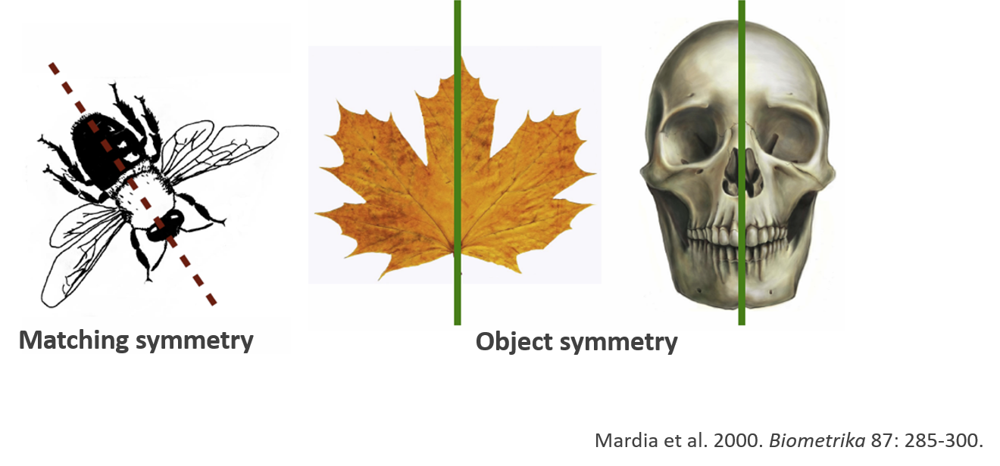
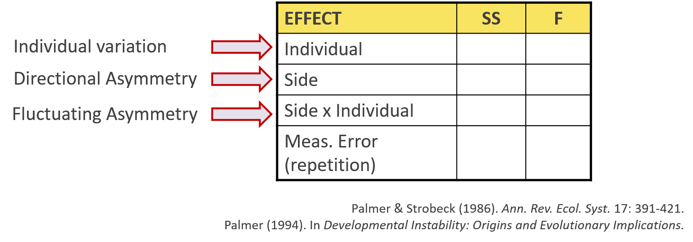
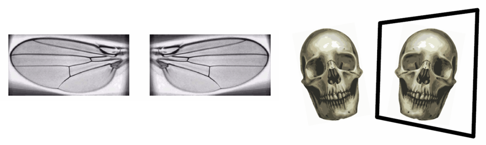
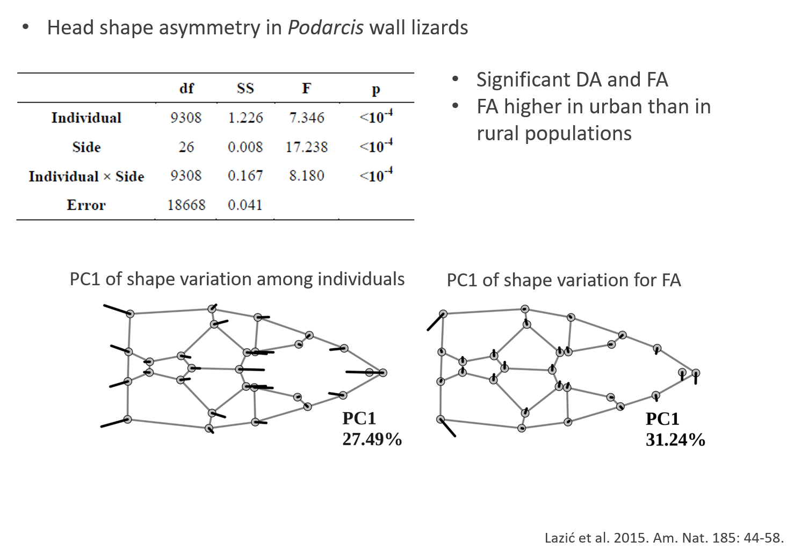
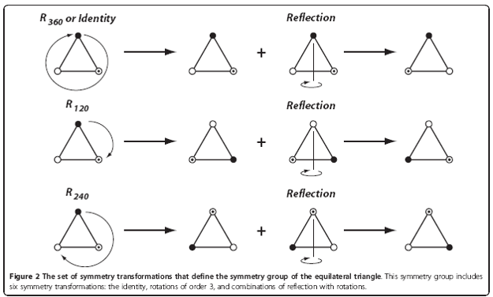
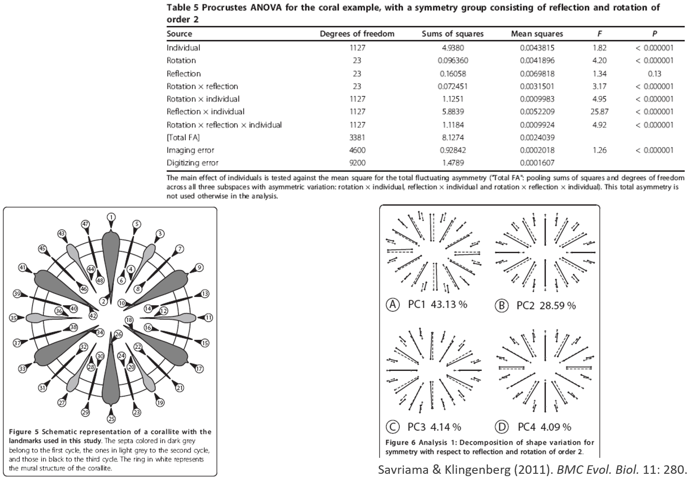

```{r setup, include=FALSE, echo = TRUE, tidy = TRUE}
library(knitr)
library(geomorph)
library(scatterplot3d)
opts_chunk$set(echo = TRUE)
library(xaringanthemer)
style_mono_light()
```

```{css, echo=FALSE}
pre {
  max-width: 100%;
  overflow-x: scroll;
}
.scrollable {
  height: 80% !important;
  overflow-y: auto !important;

} 

.remark-slide-content {
  font-size: 20px;
  padding: 20px 80px 20px 80px;
}
.remark-code, .remark-inline-code {
  background: #f0f0f0;
}
.remark-code {
  font-size: 20px;
}
.huge .remark-code { /*Change made here*/
  font-size: 200% !important;
}

.med .remark-code { /*Change made here*/
  font-size: 75% !important;
}

.small .remark-code { /*Change made here*/
  font-size: 50% !important;
}

.small2 .remark-code { /*Change made here*/
  font-size: 45% !important;
}

.tiny .remark-code { /*Change made here*/
  font-size: 35% !important;
}
```


### Within-subject shape variation

+ For most statistical applications, an assumption of **independent observations** is implicit.  This generally means that a research subject (specimen, organism, species) has a single landmark configuration from which its shape can be compared to others.

+ Some studies (usually experimental in nature) require multiple measurements (digitizations) per subject.  If multiple measurements are made, they cannot be treated as independent observations.

+ The *Phylogenetic Comparative Methods* lecture addressed non-independent observations one way (generalized least squares estimation, GLS).  This lecture will focus on (some of) the cases where non-independence is more so because of **repeated shape measures**.

+ A simple but not universal way to remember the subtle difference is that non-independence because of inherit relatedness among subjects is a challenge for **estimation** (requires GLS estimation).  Non-independence because of repeated measures is a challenge for **evaluation** (requires alteration of inferential methods).  Both challenges can arise in the same data set.

---

### Within-subject shape variation (cont.) and Overview

+ There are particularly two cases for which repeated shape measures on the same research subjects are common:
  + Shape analysis on (typically) bilaterally symmetric organisms, requiring two landmark configurations of left and right structures, or one configuration that could be divided into left and right sub-configurations.  Analyses typically assess the **symmetry** found between left and right pairs of configurations, and evaluate whether there is a pattern of **asymmetry**.
--

  + Shape analysis concerned with the precision of shape estimation, and whether there are inherent tendencies to digitize configurations in different way on the same research subjects.  Such experimental designs and their analyses seek to understand the propensity for **measurement error**.
  
--

+ Other cases that require repeated shape measurements could be imagined:
   + Ontogenetic shape variation (if the same landmark configuration could be digitized on the same organisms over developmental time).  This would be a special case of allometry.
   + Dose-response experiments that evaluate shape change over time after an experimental treatment.
   + Hierarchical analyses that involve, e.g., multiple individuals within species, as well as many species, with the subject level equal to species.

--

+ However, these other cases really just are different reasons for similar data analysis, using a **within-subject RRPP** pohilosophy.

---


### Symmetry and Asymmetry

+ Many objects are built symmetrically

+ Paired structures and serially homologous body parts are organized in a symmetric way

--

+ Bilateral symmetry: structures arranged in either side of the body mid-line (axis of symmetry)

+ Symmetry poses some challenges for morphometric data analysis

---

### Types of Bilateral Symmetry

- Two main types of bilateral symmetry:
- **Matching symmetry**: pairs of structures are found across the mid-line of the object (e.g. insect wings, tetrapod limbs etc)
- **Object symmetry**: single structure with internal structural symmetry (e.g. structures in vertebrate skull)

```{r, echo = FALSE, fig.align = "center", out.width="100%"}
  
```

---

### The Problem with Symmetrical Objects

+ Landmark positions are not independent in symmetric objects
+ Lack of statistical independence for paired landmarks
+ Some dimensions of shape space have little variance
+ SSCP matrices become singular (or nearly so)
  + This causes issues with parametric statistical hypothesis-testing methods ('divide' by zero or nearly so)
    
```{r, echo = FALSE, fig.align = "center", out.width="40%"}
include_graphics("LectureData/10.asymmetry/SymmLizard.png")  
```  

--

+ The problem becomes more acute as objects become more symmetrical!

---

### The Problem with Symmetrical Objects (Cont.)

+ The data in reality have fewer dimensions, so use less data. How?
  + Digitize only half structure
  + Reflect structure and take the average: make a symmetrical structure
+ Using only $\frac{1}{2}$ structure has challenges:
  + Does not represent entire shape
  + Can introduce assymetries because the midline is not 'anchored' during the analysis 

+ Solution: use **entire structure** and **RRPP** for statistical evaluation!

###### As we've seen this week, RRPP, combined with robust summary test statistics, does not require inverting (nearly) singular covariance matrices, so model evaluation is not compromised by this issue.
---

### Symmetric Objects: Example

+ Note the large number of shape dimensions with no variation. Much of this is due to bilateral symmetry!

.pull-left[
```{r echo=FALSE, fig.align = "center", eval=TRUE, out.width="80%"}
lizards <- readland.tps('LectureData/07.allometry/symm.shape2.tps', warnmsg = FALSE)
liz.lab <- read.csv('LectureData/07.allometry/ind.info.txt',header=TRUE, sep=",")
Y.gpa <- gpagen(lizards, print.progress = FALSE)
CS <- liz.lab$cs
type <- liz.lab$type
gdf <- geomorph.data.frame(Y.gpa, CS = CS, type = type)
plotAllSpecimens(Y.gpa$coords)
```
]
.pull-right[.small[
```{r}
res <- prcomp(two.d.array(Y.gpa$coords))
summary(res)
```
]]

---

### The Biology of Asymmetry

+ Different types of asymmetry are thought to have a biological meaning

+ **Directional asymmetry**: consistent difference skewed towards one of the sides (at the population level); thought to reflect difference in use, e.g. fiddler crabs feeding vs. fighting displays

```{r, echo = FALSE, fig.align = "center", out.width="40%"}
  
``` 

--

+ **Fluctuating asymmetry**: thought to reflect instability during development (genetic, environmental etc)

+ Long debate about the meaning of FA
---

### Types of Symmetry

+ Perfect symmetry is rare in biology; objects nearly always have some degree of asymmetry

+ Three main types of asymmetry have been described, based on the statistical distribution of asymmetry in the population

--

+ **1: Directional**: consistent $\small{(R-L)}$ differences with one side always larger than the other: $\small{\overline{(R-L)}\neq0}$

+ **2: Fluctuating**: small random $\small{(R-L)}$ deviations with $\small{\overline{(R-L)}=0}$

+ **3: Antisymmetry**: consistent $\small{(R-L)}$ differences, but larger side random

```{r, echo = FALSE, fig.align = "center", out.width="70%"}
include_graphics("LectureData/10.asymmetry/SymmTypesHist.png")  
``` 
---

### Analysis of Symmetry: General Procedure

+ The presence of various types of asymmetry may be evaluated using one of several  factorial ANOVA designs

+ Traits need to be quantified multiple  times, so that measurement error may be quantified

+ This allows one to evaluate if the (normally small) differences between sides are actually “real” or due to measurement error (ME)

--

+ ANOVA then often set up as:

```{r, echo = FALSE, fig.align = "center", out.width="70%"}
  
``` 
---

### Extensions to GM Shape Data 

```{r, echo = FALSE,fig.align = "center",  out.width="70%"}
  
```

+ **Procedure**
  + 1: Digitize right and left structures (or R and L sides), possibly multiple times for ME
  + 2: Reflect one side to match the other (and relabel landmarks for object symmetry)
  + 3: GPA + projection to tangent space
  + 4: Factorial ANOVA – SS for Individual, SS Side (DA), SS Side x Individual (FA) 
  + 5: Assess model factors via permutation approaches

###### Klingenberg & McIntyre (1998). *Evolution.*; Klingenberg et al. (2002). *Evolution.*
---

### Decomposition of Asymmetry Component

+ One can approach the problem more theoretically (rather than 'procedurally')
  + ANOVA effects represent Sums of Squares, which correspond to various asymmetry components
  + Therefore, decomposing SST (total shape variation) obtained via $\small{D}_{Proc}$ provides variance components for both DA and FA

$$\small{SST}=\sum^n_1{D}^2_{(X_i,Y_i)}=nD^2_{(\overline{X},\overline{Y})}+\sum^n_1{D}^2_{(X_i-\overline{X},Y_i-\overline{Y})}$$

--

+ where: $\small{nD}^2_{(\overline{X},\overline{Y})}$ represents the **Directional Asymmetry** component

+ and: $\small\sum^n_1{D}^2_{(X_i-\overline{X},Y_i-\overline{Y})}$ represents the **Fluctuating Asymmetry** component

###### Mardia et al. (2000). *Biometrika*.
---

### Matching Symmetry: Example

```{r, echo = FALSE, fig.align = "center", out.width="60%"}
include_graphics("LectureData/10.asymmetry/MatchExWings.png")  
``` 
---

### Matching Symmetry: Example 2
.med[
```{r, echo = TRUE, fig.align = "center", out.width="60%"}
data(mosquito)
Y.gpa <- gpagen(mosquito$wingshape, print.progress = FALSE)
plot(Y.gpa)
```
]
---

### Matching Symmetry: Example 2 (Cont.)

.scrollable[.med[
```{r, echo = TRUE, fig.align = "center", out.width="80%"}

mosquito.sym <- bilat.symmetry(A = Y.gpa, ind = mosquito$ind, side=mosquito$side, 
                           object.sym = FALSE, print.progress = FALSE)

summary(mosquito.sym)
```
]]

---

### Matching Symmetry: Example 2 (Cont.)
.scrollable[
```{r, echo = TRUE, fig.align = "center", out.width="80%"}
plot(mosquito.sym, warpgrids = TRUE)
```
]
---

### Object Symmetry: Example

```{r, echo = FALSE, fig.align = "center", out.width="80%"}
  
``` 
---

### Object Symmetry: Example 2
.scrollable[.med[
```{r, echo = TRUE, fig.align = "center", out.width="60%"}
data('lizards')
Y.gpa <- gpagen(lizards$coords, print.progress = FALSE)
plot(Y.gpa)
```
]]
---

### Object Symmetry: Example 2 (Cont.)
.scrollable[
```{r, echo = TRUE, fig.align = "center", out.width="80%"}
lizard.sym <- bilat.symmetry(A = Y.gpa, ind = lizards$ind, replicate = lizards$rep,
                           object.sym = TRUE, land.pairs = lizards$lm.pairs, print.progress = FALSE)
summary(lizard.sym)
```
]
---

### Object Symmetry: Example 2 (Cont.)
.scrollable[
```{r, echo = TRUE, fig.align = "center", out.width="80%"}
plot(lizard.sym, warpgrids = TRUE)
```
]
---

### Other Types of Asymmetry

+ Many other types of (a)symmetry are present in biological data
+ How can we quantify asymmetry for these structures?

```{r, echo = FALSE, fig.align = "center", out.width="70%"}
include_graphics("LectureData/10.asymmetry/HigherSymm.png")  
``` 
---

### Symmetry Groups

+ One can approach the problem by defining **Symmetry Groups**
+ Symmetry groups: transformations that leave the data invariant
+ e.g.: bilateral symmetry = reflection across the midline

```{r, echo = FALSE, fig.align = "center", out.width="40%"}
  
``` 

+ Symmetry groups define transformations such that there are invariances in those symmetric 'dimensions'
+ These groups describe the ways in which symmetry can be defined, and thus quantified for more complex structures (e.g., radial symmetry)

###### Savriama and Klingenberg. (2011). *BMC Evol. Biol.*
---

### Symmetry: Extended Protocol

.pull-left[
+ For bilateral asymmetry: transformation = reflection
+ For other types, decompose asymmetry to the components defining the symmetry type based on the appropriate symmetry groups

+ Example: Rotational Symmetry
  + Digitize all p components 
  + GPA + projection
  + Decompose shape variation into symmetry components, quantify and evaluate
]

.pull-right[
```{r, echo = FALSE, fig.align = "center", out.width="50%"}
include_graphics("LectureData/10.asymmetry/RadialSymm.png")  
``` 
]
###### Savriama and Klingenberg. (2011). *BMC Evol. Biol.*

---

### Complex Symmetry: Example

+ Symmetry Analysis in corals

```{r, echo = FALSE, fig.align = "center", out.width="70%"}
  
``` 

---

### Symmetry: Summary

+ Symmetry causes redundancy in shape data 
+ Can account for symmetry effects analytically 
+ Asymmetry: biological significance
+ FA: developmental instability
+ DA: adaptation?
+ Use ANOVA procedures to separate variation within (asymmetry) and among individuals
+ Extensions to different types of symmetry

---

### Important Notes!

+ An implicit (but not required) assumption in the previous analyses was that Type I SSCP was appropriate.  This is a good idea because analysis first accounts for variation at the subject level, then at the side level after accounting for individual variation, then at the individual:side level after accounting for both individual and side variation.

--

+ This might make sense for symmetry analyses.  The experimental design (all symmetry analyses are experiments in the sense that fixed treatments are applied to each subject for left and right measurements, even if the study is observational) seeks to understand **the amount and nature of asymmetry in comparison to measurement error (ME)**.  

--

+ For such analyses, ME is noise.  It helps to have a basis for asymmetry between left and right sides by having an understanding of how variable the left or right side would be if digitized twice or more; i.e., a baseline for expected digitizing noise.

---

### Important Notes!

+ But what if the replicated measures for ME also have a pattern?  
  + Digitizations between two different people
  + Digitizations using different scanners
  + Digitizations made without a random ordering of observations; e.g., all left sides digitized first then all right sides.

--

+ Sometimes a pattern of shape change within subjects should be analyzed.
+ Maybe a preliminary experiment to ascertain whether multiple researchers, devices, or digitizing protocol introduces a bias or prejudice.

---

### Measurement Error (ME): An example of within-subject shape analysis

.pull-left[
+ ME first discussed for shape analysis in 1998. $^1$
+ ME revisited 2016-2017, but no new developments were made (just an emphasis for why it is important and how it could be done).  $^{2-3}$
+ There was a "spirited" debate on Morphmet in November, 2022, about measurement error (some of you might recall) and it became clear that the topic needed to be modernized.
+ The prevailing issue (as we see it) was that most people were using techniques that basically measured: replicate variation / subject variation.  (More specifically, statistics like intraclass correlations.)
]
.pull-right[
+ **This is a problem because if one samples diversely shaped subjects (e.g., many species rather than many individuals within one species), one could labor under the delusion that ME is small, simply because between-subject variation is large.**
+ **This is also a problem because it treats all ME as random (noise), even if systematic digitizing prejudices are inherent in the data.**

+ The following is our fixing of these problems, just published this year.  $^4$.
]

.footnote[

$^1$ Arnqvist, G., & Mårtensson, T. (1998); $^2$ Fruciano, C. (2016); $^3$ Fruciano, C., et al. (2017); $^4$ Collyer, M.L., & Adams, D.C. (2024).
]

---

### Measurement Error (ME) via within-subject RRPP

+ ANOVA/MANOVA components (can be done with either an ANOVA or MANOVA framework):

| Source | Based on | Comment
|:------- | :----------- | :-----------------------------
|Subjects| Sampling of different research subjects| Choosing diverse subjects is a good thing, and cannot arbitrarily influence analysis of ME.|
|Systematic ME|Replicates|This is variation that is **systematic**, perhaps because of digitizer, timing, or some other method that could introduce a **digitizing prejudice**.|
|Systematic ME:Groups|Strata for subject sampling|*An optional* component if it is known that subjects are sampled from different groups that might have different shapes.  This allows one to evaluate if systematic ME is associated with certain groups or differs among groups.|
|Random ME|Residual variation|Differences between replicates but do not have a replicated pattern.  This is **noise**.  Total ME (systematic + random) is not noise.|

+ This might look like a symmetry/asymmetry analysis (subjects = individuals, systematic ME = side), but that is not quite right.  Rather, Groups = side would be more appropriate and in symmetry/asymmetry, ME = systematic + random ME.  Also, the inferential methods are different (more in a moment).

---

### Measurement Error (ME) via within-subject RRPP (Cont.)

The following is a simplified summary:

+ Statistics and statistics to avoid:

  + $\eta^2$; e.g., $\eta^2_{Syst.ME} = \frac{SS_{Syst.ME}}{SS_{Total.ME}}$ but not $R^2_{Syst.ME} = \frac{SS_{Syst.ME}}{SS_{Total}}$.  The latter can be really small just because subject variation is large.  **This has been historically evaluated, but is misleading.**
  
  + Signal (Systematic ME) to Noise (Random ME) ratio $(SNR)$; e.g., $SNR = \frac{SS_{Syst.ME}}{SS_{Random.ME}}$.
  
  + The former is like a relative risk, varying between 0 and 1; the latter is like an odds ratio, expressing how many more times prevalent is systematic ME than random ME.
  
  + Intraclass correlation coefficient $(ICC)$; e.g., $ICC = \frac{MS_S-MS_W}{MS_S + (r-1)MS_W}$, for variance $(MS)$ among subjects $(S)$ and within subjects $(W)$, for $r$ replicates, **should be avoided!**.  $ICC$ measures how reliable subjects are for measurement and can be inflated by sampling more diverse subjects; it does not measure any sysematic pattern among replicates.
  
---

### Measurement Error (ME) via within-subject RRPP (Cont.)

+ The important aspect of ME analysis is how RRPP is utilized.  Analysis of ME components is performed by restricting RRPP to be within subjects.  **This means that inter-subject variation is held constant over every RRPP permutation!**  No confounding of subject and ME effects.

+ Type II SSCP is used for ME effects (accounts for inter-subject variation, but does not conflate it with ME effects.)
+ Type III SSCP is used for subjects test.  This is not really a focus of the analysis, but it can be done to know how variable subject shapes were.

+ $SNR$ eigenvectors (eigenvectors of the inverse of the random ME SSCP times the systematic ME SSCP) can be used to visualize ME issues.

+ All statistical properties are vetted in detail in Collyer and Adams (2024).

---

### Measurement Error (ME) Example: how to do it in `geomorph`

Using simulated data from Collyer and Adams (2024)

.scrollable[

```{r}

data(fishy)
fishy$coordsarray <- arrayspecs(fishy$coords, p = 11, k = 2)  #make 3D array

# Example two digitization replicates of the same research subjects
rep1 <- matrix(fishy$coords[1,], 11, 2, byrow = TRUE)
rep2 <- matrix(fishy$coords[61,], 11, 2, byrow = TRUE)
plot(rep1, pch = 16, 
     col = gray(0.5, alpha = 0.5), cex = 2, asp = 1,
     xlab = "x", ylab = "y")
points(rep2, pch = 16, col = gray(0.2, alpha = 0.5), cex = 2, asp = 1)

```
]

---

### Measurement Error (ME) Example: how to do it in `geomorph` (Cont.)

**Analysis unconcerned with groups from which subjects are sampled**

.scrollable[
```{r}
ME1 <- gm.measurement.error(
  coords = "coordsarray",
  subjects = "subj",
  replicates = "reps",
  data = fishy)

anova(ME1)
plot(ME1)
```
]
---


### Measurement Error (ME) Example: how to do it in `geomorph` (Cont.)

**Analysis concerned with groups from which subjects are sampled**.  Some groups have longer tails.

.scrollable[
```{r}
ME2 <- gm.measurement.error(
  coords = "coordsarray",
  subjects = "subj",
  replicates = "reps",
  groups = "groups",
  data = fishy)
  
anova(ME2)
plot(ME2)
```
]
---
### Measurement Error (ME) Example: how to do it in `geomorph`

Comments:

+ Data were simulated to have a *digitizing prejudice* such that longer-tailed fish were digitized in a way that exacerbates their tail lengths (as if a person might tend to make longer-tailed fish have long tails as an instinct).

+ The analysis was able to determine that not only was there a significant systmatic ME, but it was differently pronounced among groups from which fish were sampled.

+ Perhaps not obvious in this example (but explored in Collyer and Adams 2024) is that the same digitizing prejudice applied to specimens from different groups can produce a significant `Systematic ME:Groups` effect.
  + A systematic digitizing prejudice $\neq$ a systematic shape difference!
  + For example, a digitizer that tends to make tails longer, both for short- and long-tailed species, will induce larger relative tail growth for the short-tailed species than the long-tailed species.

+ The analysis is able to reveal both a magnitude and directional shape change for specific subjects.  See next example.

---

### Measurement Error (ME) Example: Re-evaluating Fruciano et al. (2017)

+ Background:The original study was conducted to examine the effects of combining landmark data from multiple observers and scanning devices. 

+ 3D landmark data obtained from the crania of 23 marsupial species. 
+ Three types of surface scans, each by two observers
+ 23 species, two clades and an outgroup, 24 landmarks digitized on each, six replicates.
---

