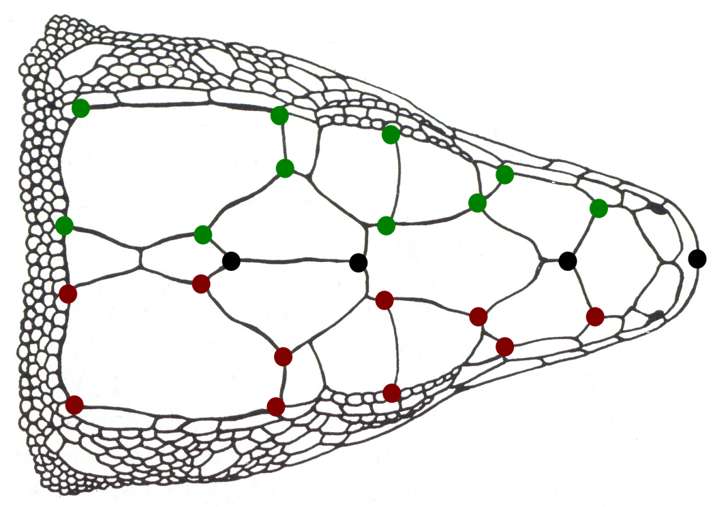
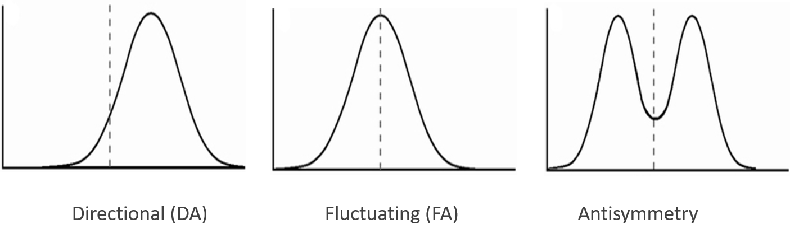
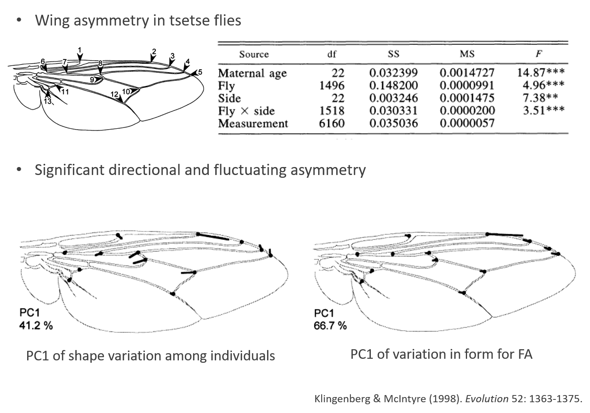
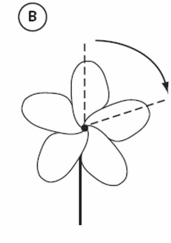
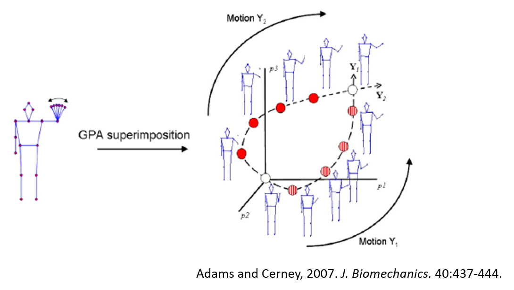

```{r setup, include=FALSE, echo = TRUE, tidy = TRUE}
library(knitr)
library(geomorph)
library(scatterplot3d)
opts_chunk$set(echo = TRUE)
```

# Symmetry and Asymmetry

- Many objects are built symmetrically
- Paired structures and serially homologous body parts are organized in a symmetric way

>- Bilateral symmetry: structures arranged in either side of the body mid-line (axis of symmetry)

>- Symmetry poses some challenges for morphometric data analysis

# Types of Bilateral Symmetry

- Two main types of bilateral symmetry:
- **Matching symmetry**: pairs of structures are found across the mid-line of the object (e.g. insect wings, tetrapod limbs etc)
- **Object symmetry**: single structure with internal structural symmetry (e.g. structures in vertebrate skull)

```{r, echo = FALSE, out.width="100%"}
include_graphics("LectureData/11.asymmetry/SymmTypes.png")  
```

# The Problem with Symmetrical Objects

- Landmark positions are not independent in symmetric objects
- Lack of statistical independence for paired landmarks
- Some dimensions of shape space have little variance
- SSCP matrices become singular (or nearly so)
    - This causes issues with parametric statistical hypothesis-testing methods ('divide' by zero)
    
```{r, echo = FALSE, out.width="40%"}
  
```  

>- The problem becomes worse as objects become more symmetric!

# The Problem with Symmetrical Objects

- The data in reality have less dimensions, so use less data. How?
    - Digitize only half structure
    - Reflect structure and take the average: make a symmetrical structure

>- Problem: using only $\small\frac{1}{2}$ structure can introduce asymmetry, because the midline is not “anchored” as such

>- Solution: use **entire structure** and **RRPP** for statistical evaluation!

>-
###### As we've seen this week, RRPP, combined with robust summary test statistics, does not require inverting (nearly) singular covariance matrices, so model evaluation is not compromised by this issue.

# Symmetric Objects: Example

- Note the large number of shape dimensions with no variation. Much of this is due to bilateral symmetry!

```{r echo=FALSE, eval=TRUE, out.width="40%"}
lizards <- readland.tps('LectureData/09.allometry/symm.shape2.tps', warnmsg = FALSE)
liz.lab <- read.csv('LectureData/09.allometry/ind.info.txt',header=TRUE, sep=",")
Y.gpa <- gpagen(lizards, print.progress = FALSE)
CS <- liz.lab$cs
type <- liz.lab$type
gdf <- geomorph.data.frame(Y.gpa, CS = CS, type = type)
plotAllSpecimens(Y.gpa$coords)

#res <- prcomp(two.d.array(Y.gpa$coords))
#summary(res)
```

```{r, echo = FALSE, out.width="60%"}
include_graphics("LectureData/11.asymmetry/PCASymmLizards.png")  
``` 

# The Biology of Asymmetry

- Different types of asymmetry are thought to have a biological meaning

- **Directional asymmetry**: consistent difference skewed towards one of the sides (at the population level); thought to reflect difference in use, e.g. fiddler crabs feeding vs. fighting displays

```{r, echo = FALSE, out.width="60%"}
include_graphics("LectureData/11.asymmetry/FiddlerCrab.png")  
``` 

>- **Fluctuating asymmetry**: thought to reflect instability during development (genetic, environmental etc)
>- Long debate about the meaning of FA

# Types of Symmetry

- Perfect symmetry is rare in biology; objects nearly always have some degree of asymmetry
- Three main types of asymmetry have been described, based on the statistical distribution of asymmetry in the population

>- **1: Directional**: consistent $\small{(R-L)}$ differences with one side always larger than the other: $\small{\overline{(R-L)}\neq0}$
>- **2: Fluctuating**: small random $\small{(R-L)}$ deviations with $\small{\overline{(R-L)}=0}$
>- **3: Antisymmetry**: consistent $\small{(R-L)}$ differences, but larger side random

```{r, echo = FALSE, out.width="90%"}
  
``` 

# Analysis of Symmetry: General Procedure

- The presence of various types of asymmetry may be evaluated using one of several  factorial ANOVA designs
- Traits need to be quantified multiple  times, so that measurement error may be quantified
- This allows one to evaluate if the (normally small) differences between sides are actually “real” or due to measurement error (ME)

>- ANOVA then often set up as:
>-
```{r, echo = FALSE, out.width="90%"}
include_graphics("LectureData/11.asymmetry/AnovaDesign.png")  
``` 

# Extensions to GM Shape Data 

```{r, echo = FALSE, out.width="90%"}
include_graphics("LectureData/11.asymmetry/ReflectObjects.png")  
```

- **Procedure**
    - 1: Digitize right and left structures (or R and L sides), possibly multiple times for ME
    - 2: Reflect one side to match the other (and relabel landmarks for object symmetry)
    - 3: GPA + projection to tangent space
    - 4: Factorial ANOVA – SS for Individual, SS Side (DA), SS Side x Individual (FA) 
    - 5: Assess model factors via permutation approaches

###### Klingenberg & McIntyre (1998). *Evolution.*; Klingenberg et al. (2002). *Evolution.*

# Decomposition of Asymmetry Component

- One can approach the problem more theoretically (rather than 'procedurally')
    - ANOVA effects respresent Sums of Squares, which correspond to various asymmetry components
    - Therefore, decomposing SST (total shape variation) obtained via $\small{D}_Proc$ provides variance components for both DA and FA

$$\small{SST}=\sum^n_1{D}^2_{(X_i,Y_i)}=nD^2_{(\overline{X},\overline{Y})}+\sum^n_1{D}^2_{(X_i-\overline{X},Y_i-\overline{Y})}$$

>- where: $\small{nD}^2_{(\overline{X},\overline{Y})}$ represents the **Directional Asymmetry** component

>- and: $\small\sum^n_1{D}^2_{(X_i-\overline{X},Y_i-\overline{Y})}$ represents the **Fluctuating Asymmetry** component

###### Mardia et al. (2000). *Biometrika*.

# Matching Symmetry: Example

```{r, echo = FALSE, out.width="90%"}
  
``` 

# Object Symmetry: Example

```{r, echo = FALSE, out.width="90%"}
include_graphics("LectureData/11.asymmetry/ObjExLizards.png")  
``` 

# Other Types of Asymmetry

- Many other types of (a)symmetry are present in biological data
- How can we quantify asymmetry for these structures?

```{r, echo = FALSE, out.width="90%"}
include_graphics("LectureData/11.asymmetry/HigherSymm.png")  
``` 

# Symmetry Groups

- One can approach the problem by defining **Symmetry Groups**

- Symmetry groups: transformations that leave the data invariant

- e.g.: bilateral symmetry = reflection across the midline

```{r, echo = FALSE, out.width="60%"}
include_graphics("LectureData/11.asymmetry/SymmGroups.png")  
``` 

- Symmetry groups define transformations such that there are invariances in those symmetric 'dimensions'

- These groups describe the ways in which symmetry can be defined, and thus quantified for more complex structures (e.g., radial symmetry)

###### Savriama and Klingenberg. (2011). *BMC Evol. Biol.*

# Symmetry: Extended Protocol

- For bilateral asymmetry: transformation = reflection
- For other types, decompose asymmetry to the components defining the symmetry type based on the appropriate symmetry groups

# Symmetry: Extended Protocol

- For bilateral asymmetry: transformation = reflection
- For other types, decompose asymmetry to the components defining the symmetry type based on the appropriate symmetry groups

```{r, echo = FALSE, out.width="20%"}
  
``` 

- Example: Radial Symmetry
    - Digitize all p components 
    - GPA + projection
    - Decompose shape variation into symmetry components, quantify and evaluate
    
###### Savriama and Klingenberg. (2011). *BMC Evol. Biol.*

# Complex Symmetry: Example

- Symmetry Analysis in corals

```{r, echo = FALSE, out.width="90%"}
include_graphics("LectureData/11.asymmetry/CoralSymmetry.png")  
``` 

# A Note on Geometric Transformations

- Any captured shape difference that follows a geometric rule can be modelled using the Procrustes paradigm
- We can account for undesired effects
- We can model shapes and other effects separately

>- Articulations frequently cause this kind of effects
>- Shape effects + positional effects

```{r, echo = FALSE, out.width="90%"}
include_graphics("LectureData/11.asymmetry/ArticConcept.png")  
``` 

# Geometric Transformations: Articulations

For articulated structures, several solutions exist
    - Fixing the angle in all specimens through a mathematical transformation
    - Separating the subsets to analyse separately, etc. 
    
```{r, echo = FALSE, out.width="90%"}
include_graphics("LectureData/11.asymmetry/ArticMath.png")  
``` 

###### Adams. (1999). *Evol. Ecol. Res.*

# Articulation Standardization: Example

- Standardize some data for relative jaw position

```{r echo=FALSE, eval=TRUE, out.width="40%"}
library(geomorph)
data(plethodon)
Y.gpa <- gpagen(plethodon$land, print.progress = FALSE)

rand.jaw <-Y.gpa$coords
for (i in 1:dim(Y.gpa$coords)[[3]]){
  tmp <- fixed.angle(Y.gpa$coords,art.pt=1, angle.pts.1 = 5, angle.pts.2 = 6, 
                     rot.pts = c(2,3,4,5),angle = -1*runif(1,min=0,max=40),degrees=TRUE)
  rand.jaw[,,i] <- tmp[,,i]
}
gpa.rand <- gpagen(rand.jaw, print.progress = FALSE)$coords

jaw.fixed <- fixed.angle(gpa.rand,
                     art.pt=1, angle.pts.1 = 5, 
                     angle.pts.2 = 6, rot.pts = c(2,3,4,5))

gpa.fixed <- gpagen(jaw.fixed, print.progress = FALSE)$coords

plotAllSpecimens(gpa.rand, links = plethodon$links)
mtext("Jaws Random Angles")
plotAllSpecimens(gpa.fixed, links = plethodon$links)
mtext("Jaws Standardized to Common Angle")
```

# Another Note on Geometric Transformations

- Considering 'fixing' articulation angles in reverse results in a different pattern **motion analysis**
    - For shape devoid of movement, one fixes the angle.
    - For quantifying movement, one compares shapes across the motion path interested

- The latter forms a *trajectory* that describes the motion path
- It is represented by a sequence of shapes (a trajectory) in shape space 

```{r, echo = FALSE, out.width="60%"}
  
``` 

###### NOTE: see Phenotypic Trajectory Analysis lecture for analytical details

# Symmetry: Summary

- Symmetry causes redundancy in shape data 
- Can account for symmetry effects analytically 
- Asymmetry: biological significance
- FA: developmental instability
- DA: adaptation?
- Use ANOVA procedures to separate variation within (asymmetry) and among individuals
- Extensions to different types of symmetry
- Geometric transformations in general: any effect that follows a geometric rule can be taken into account, partialed out, or targeted in the Procrustes framework

