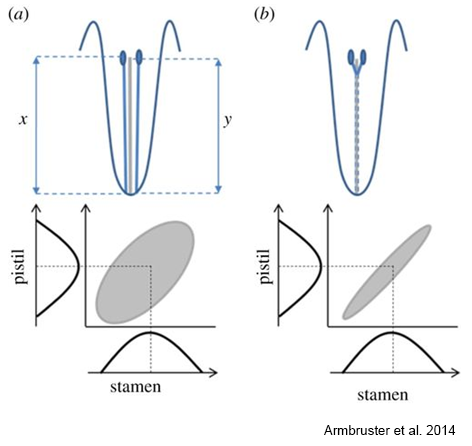
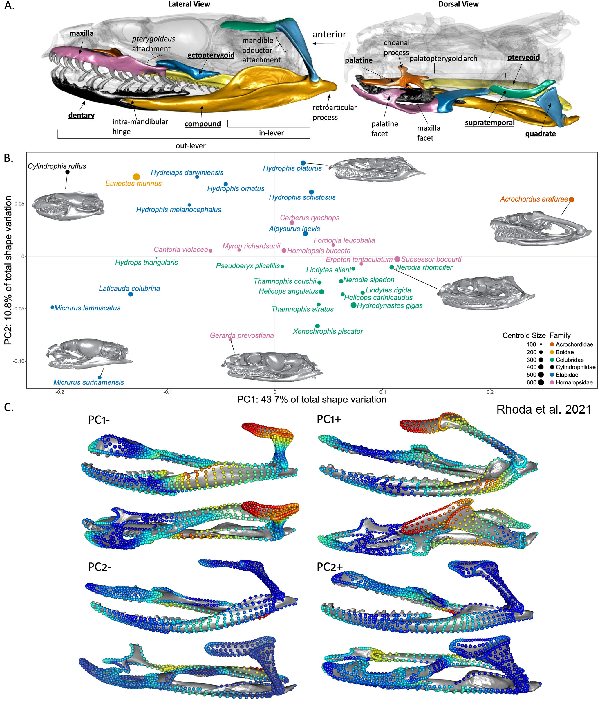
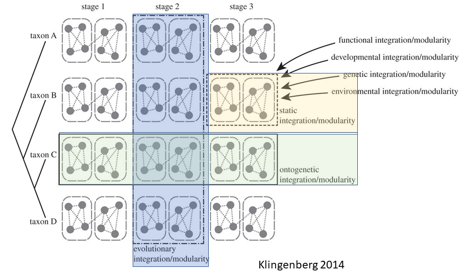
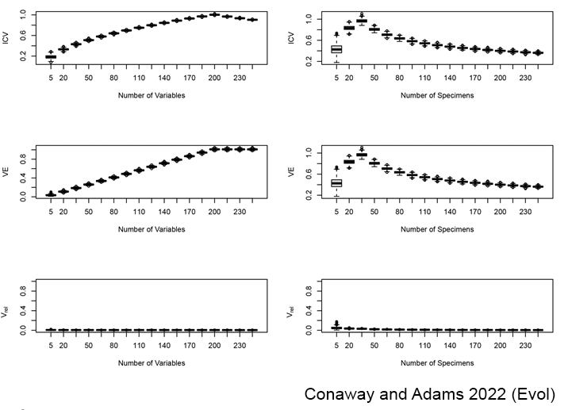
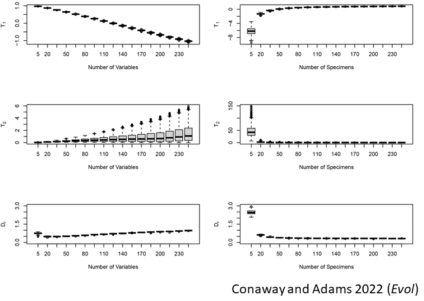
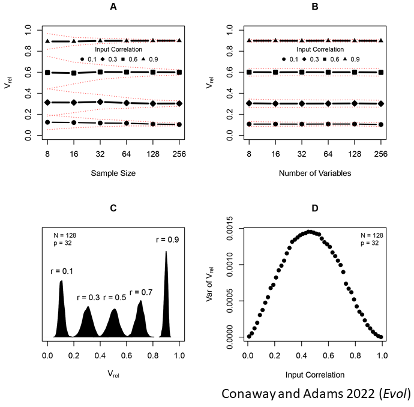
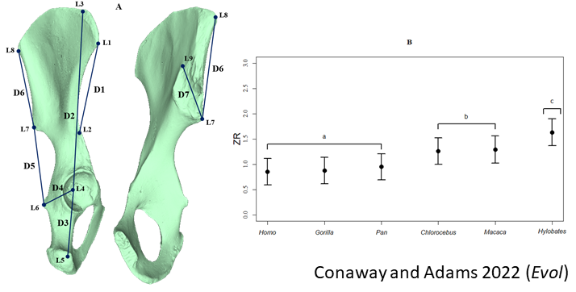
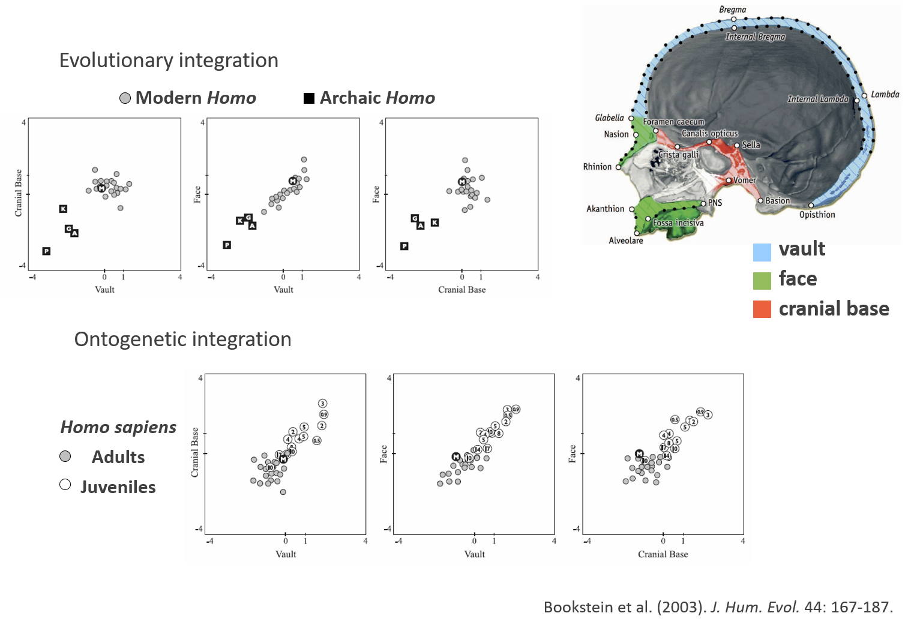
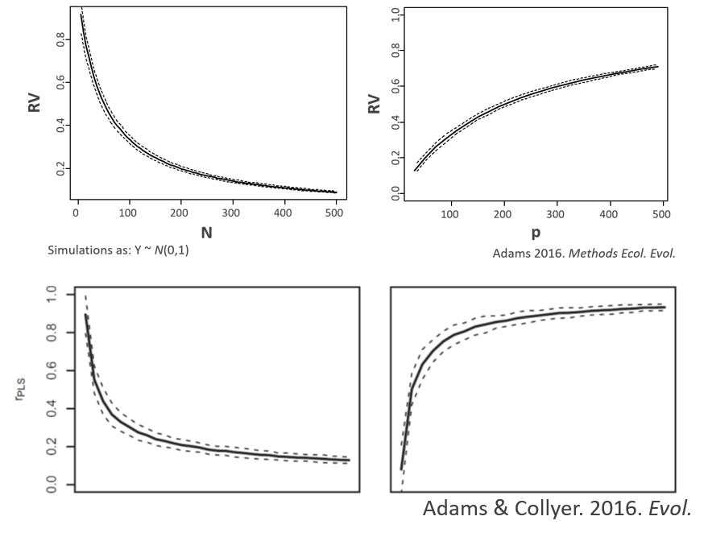

```{r setup, include=FALSE, echo = TRUE, tidy = TRUE}
library(knitr)
library(geomorph)
library(mvtnorm)
library(car)
library(kableExtra)
opts_chunk$set(echo = TRUE)

library(xaringanthemer)
style_mono_light()
```

### Trait Covariation

+ Organisms are composed of recognizable parts
+ These parts are to some extent correlated
+ Why is this the case?

```{r, echo = FALSE, fig.align = "center", out.width="70%"}
include_graphics("LectureData/12.integr.mod/ConceptPic.png")  
```
---

### Trait Covariation: Integration $^1$

+ Trait correlations arise when biological factors elicit concomitant changes in more than one trait
+ Factors at multiple overlapping levels affect trait covariation 
  + Developmental
  + Ontogenetic
  + Functional/Biomechanical
  + Evolutionary

+ These associations lead to the **integration** among different body parts

.footnote[1: Olson and Miller. (1958). *Morphological Integration.*]
---

### Integration

+ Integration describes how characters are correlated with each other
+ Correlations that are stronger among some subsets of traits than between others (Olson and Miller 1958)
+ Cohesion among traits that result from interactions of biological processes (Klingenberg 2008)

```{r, echo = FALSE, fig.align = "center", out.width="40%"}
  
```

---

### Trait Covariation: Modularity

+ Trait covariation is sometimes unevenly dispersed across traits

+ This results in integration that is concentrated within subsets of traits

+ These subsets of traits are less correlated with other subsets

+ Such patterns are termed **Modularity**

--

+ **Other definitions:**

  + The relative degree of connectivity among traits (Klingenberg 2008)

  + A complex of characters that serve a functional role, are tightly integrated, and are relatively independent from other such units (Wagner 1996)

  + Maximal subset of traits for which pairs of traits within the subset of mutually informative, conditional on all other traits under consideration  (Magwene 2001)
---

### Modularity

+ Modular structure in snakes 
```{r, echo = FALSE, fig.align = "center", out.width="40%"}
  
```

---

### Levels of Integration and Modularity

+ Both integration and modularity may be observed at different biological levels, and be explained by different biological processes
  + Levels mirror those evaluated for allometric patterns: static, ontogenetic, evolutionary

```{r, echo = FALSE, fig.align = "center", out.width="70%"}
  
```

---

### Quantifying Integration and Modularity: Conceptual Considerations

+ Patterns of trait covariation (integration and modularity) have been explored in different ways

+ Different approaches are appropriate for different hypotheses

+ Some considerations when embarking on a trait covariation study are:
  + Does one evaluate overall patterns of integration or integration among subsets of traits? 
  + What is the expected pattern when neither integration nor modularity is present?
  + Is modularity the 'contrary' of integration, or can both simultaneously be present?
  + What is the appropriate $H_0$ for evaluating integration? Modularity, disintegration, random integration, other? 
  + What is the appropriate $H_0$ for evaluating modularity: Integration, random modularity, other? 
  + Does $H_0$ differ when testing overall integration versus integration among subsets? $^1$

.footnote[1: As we will see, the empirical answer to the last few questions is found via RRPP]
---

### Methods for Evaluating Integration and Modularity

+ Here we review some methods for evaluating patterns of integration and modularity
  + 1: Methods for evaluating and comparing overall integration
  + 2: Methods for evaluating and comparing integration among subsets of traits
  + 3: Methods for evaluating and comparing modularity
---

### 1: Overall Integration

+ Is there integration (covariaton) in a set of traits? 

+ Most approaches based on exploring patterns in the trait covariance matrix:

$$\hat{\mathbf\Sigma} = \mathbf{Y_c^T}\mathbf{Y_c}/ (n-1)$$

--

Using our shape data notation: 

$$\hat{\mathbf\Sigma} = \mathbf{Z^T}\mathbf{Z}/ (n-1)$$

where $\mathbf{Z}$ is an $n \times pk$ matrix of Procrustes coordinates

--

+ Identify large pairwise correlations in $\small{R}$ (Van Valen 1965)

+ Identify clusters of traits using cluster analysis (Cheverud 1982)

+ Factor analysis for identifying sets of correlated traits (Zelditch 1987)
  
+ Methods attempted to identify whether integration was present, but usually without *a priori* hypotheses regarding integrated subsets
---

### 1: Quantifying Overall Integration

+ Integrated traits are correlated (covary)
  + Eigenvalues of $\hat{\Sigma}$ describe the degree of covariation
  + Thus, the dispersion of $\lambda_p$ for a set of $p$ traits is one way to describe their integration
  
```{r echo=FALSE, fig.align = "center", eval=TRUE, out.width="35%"}
n=1000
p=2
sigma5 <- matrix(.5,p,p); diag(sigma5) <- 1
sigma0 <- matrix(.0,p,p); diag(sigma0) <- 1
x0 <- scale(rmvnorm(n,sigma = sigma0))
x5 <- scale(rmvnorm(n,sigma = sigma5))
out0 <- prcomp(x0)
out5 <- prcomp(x5)

p=5
iter = 100
S5 <- matrix(.5,p,p); diag(S5) <- 1
S0 <- matrix(.0,p,p); diag(S0) <- 1

cor5.eig <- lapply(1:iter, function(j) eigen(cor(scale(rmvnorm(n,sigma = S5))))$values)
cor0.eig <- lapply(1:iter, function(j) eigen(cor(scale(rmvnorm(n,sigma = S0))))$values)

par(mfrow=c(2,2))
plot(x5,pch=21, cex=.5,xlim = c(-4,4),ylim = c(-4,4), 
     xlab = "Y1", ylab = "Y2",main = "A",xaxt='n', yaxt='n', asp=1)
ellipse(center = colMeans(x5), center.pch = FALSE, shape = cov(x5),
        radius = sqrt(qchisq(.95, df=2)), col = 'black')

scl <- out5$sdev*2.4 #works. Don't know why
arrows(-out5$rotation[1,1]*scl[1],-out5$rotation[2,1]*scl[1],
       out5$rotation[1,1]*scl[1],out5$rotation[2,1]*scl[1],
       lwd=2,length = 0)
arrows(-out5$rotation[1,2]*scl[2],-out5$rotation[2,2]*scl[2],
       out5$rotation[1,2]*scl[2],out5$rotation[2,2]*scl[2],
       lwd=2,length = 0)
legend("topright",legend = "Input Correlation ~ 0.5",bty = "n",)

plot(x0,pch=21,  cex=.5,xlim = c(-4,4),ylim = c(-4,4), 
     xlab = "Y1", ylab = "Y2",main = "B",xaxt='n', yaxt='n', asp=1)
ellipse(center = colMeans(x0), center.pch = FALSE, shape = cov(x0),
        radius = sqrt(qchisq(.95, df=2)), col = 'black')
scl <- out0$sdev*2.4 #works. Don't know why
arrows(-out0$rotation[1,1]*scl[1],-out0$rotation[2,1]*scl[1],
       out0$rotation[1,1]*scl[1],out0$rotation[2,1]*scl[1],
       lwd=2,length = 0)
arrows(-out0$rotation[1,2]*scl[2],-out0$rotation[2,2]*scl[2],
       out0$rotation[1,2]*scl[2],out0$rotation[2,2]*scl[2],
       lwd=2,length = 0)
legend("topright",legend = "Input Correlation ~ 0.0",bty = "n",)

plot(cor5.eig[[1]],type="n",ylim = c(0,5),xlab="Eigenvalue",
     main = "C",ylab = expression(lambda))
legend("topright",legend = "Input Correlation ~ 0.5",bty = "n",)
for (j in 1:iter){lines(cor5.eig[[j]])}
plot(cor0.eig[[1]],type="n",ylim = c(0,5),xlab="Eigenvalue",
     main = "D",ylab = expression(lambda))
legend("topright",legend = "Input Correlation ~ 0.0",bty = "n",)
for (j in 1:iter){lines(cor0.eig[[j]])}

par(mfrow=c(1,1))
```

##### From Conaway and Adams 2022 (*Evol*)
---

### 1: Quantifying Overall Integration: Some Methods

+ Many measures for summarizing the dispersion of $\lambda_p$ have been proposed

Index | Equation | Source
:------- | :----------- | :--------------
ICV | $\frac{\sigma_\lambda}{\overline{\lambda}}$ | Shirai and Marroig, 2010
VE | $\sum(\lambda_i-\overline{\lambda})^2/p$| Wagner, 1984
$V_{rel}$ | $\frac{\sum(\lambda_i-\overline{\lambda})^2}{p(p-1)\overline{\lambda}^2}$ | Pavlicev et al. 2009
$T_1$ | $1-\frac{\sum{\sqrt{\lambda_i}}}{p\sqrt{\lambda_1}}$ | van Valen, 1974
$T_2$ | $1-\frac{\sum{\lambda_i}}{p(\lambda_1)}$ | van Valen, 1974
$D_r$ | $\frac{\sqrt[2R_e]{\prod{\lambda_{R_e}}}}{\sqrt{1/\pi{R_e}}}$ | O'Keefe et al., 2022

+ Which one to use? 
---

### 1: Overall Integration: Which Method to Use?

+ Only $V_{rel}$ remains stable across $n$ and $p$

.pull-left[
```{r, echo = FALSE, fig.align = "center", out.width="95%"}
  
```
]

.pull-right[
```{r, echo = FALSE, fig.align = "center", out.width="95%"}
  
```
]
---

### 1: An Effect Size for $V_{rel}$

.pull-left[
+ $V_{rel}$ recovers known input levels of covariation
+ But variance unequal across input levels 
+ Can't compare across datasets

```{r, echo = FALSE, fig.align = "center", out.width="70%"}
  
```
]

--

.pull-right[
+ Conversion to an effect size alleviates problem!
+ Rescale: $V_{rel}^*=2V_{rel}-1$  
+ Convert to $Z$-score: $Z_{Vrel}=\frac{1}{2}ln (\frac{1+V_{rel}^*}{1-V_{rel}^*})$

```{r, echo = FALSE, fig.align = "center", out.width="70%"}
include_graphics("LectureData/12.integr.mod/2022ConawayFig4.png")  
```
]

##### NOTE: redundant dimensions removed prior to estimating $V_{rel}$: See Conaway and Adams 2022 (Evol.)
---

### 1: Comparing Overall Integration

+ One can compare overall integration across datasets using $Z_{Vrel}$
+ Statistically compare integration levels as: $\hat{Z}_{12}=\frac{\lvert{Z_1-Z_2}\rvert}{\sqrt{\sigma^2_{Z_1}+\sigma^2_{Z_2}}}$


```{r, echo = FALSE, fig.align = "center", out.width="70%"}
  
```

---

### 1: Comparing Overall Integration: Example

Compare overall integration in shape shape across *Plethodon* species 
.scrollable[
```{r echo=TRUE, fig.align = "center", eval=TRUE, out.width="40%"}
data("plethodon")
Y.gpa <- gpagen(plethodon$land, print.progress = FALSE)
#Separate data by species
coords.gp <- coords.subset(Y.gpa$coords, plethodon$species)

#Z_Vrel by species
Vrel.gp <- Map(function(x) integration.Vrel(x), coords.gp) 
compare.ZVrel(Vrel.gp$Jord, Vrel.gp$Teyah)

```
]

---

### 1B: Overall Integration Across Spatial Scales $^1$

+ One can also examine the integration across geometric scales

+ Because landmarks are spatially related, one possible 'null' for integration could be whether the same pattern is observed across spatial scales 

+ Examining shape variance relative to spatial scale provides some guidance (i.e., regression of $\sigma^2_{PW}$ vs. Bending Energy)

+ Self-similarity of integration across scales is found when: $\small\beta= -1$

+ Deviations in slope from this value provide useful heuristics regarding global integration
  + $\small\beta= -1$: self-similarity
  + $\small\beta> -1$: global integration
  + $\small\beta< -1$: "disintegration"

.footnote[1: Bookstein (2015) *Evol. Biol.*]
---

### 1B: Overall Spatial Integration: Example

.scrollable[
```{r echo=TRUE, fig.align = "center", out.width="80%"}
data(plethodon) 
Y.gpa<-gpagen(plethodon$land, print.progress = FALSE)    #GPA-alignment    

globalIntegration(Y.gpa$coords) #not spatially integrated
```
]

---

### 2: Integration Among Subsets of Traits

+ Sometimes, we wish to know whether there there are associations among *sets* of traits (e.g., between limb traits and head traits)

+ This addresses whether these biological units (subsets of traits) are integrated with one another $^1$

+ One may evaluate such hypotheses using tests of **Multivariate Association** 

+ Two approaches have been used: the RV coefficient and Partial Least Squares

<sup>1: In the literature, subsets of traits are often referred to as 'blocks' or 'modules'</sup>
---

### 2: Integration Among Subsets of Traits (Cont.)

+ But first recall: 
    + One can combine traits from the two subsets and estimate a combined covariance matrix: $\hat{\mathbf{\Sigma}}$
    + $\small\hat{\mathbf{\Sigma}}$ can be considered a partitioned matrix, where different sub-components describe covariation within blocks or between blocks of variables

.pull-left[
```{r, echo = FALSE, fig.align = "center", out.width="80%"}
include_graphics("LectureData/06.covariation/CovMatParts2.png")  
```
]

.pull-right[
$\small\mathbf{S}_{11}$: covariation of variables in $\small\mathbf{Z}_{1}$

$\small\mathbf{S}_{22}$: covariation of variables in $\small\mathbf{Z}_{2}$

$\small\mathbf{S}_{21}=\mathbf{S}_{12}^{T}$: covariation between $\small\mathbf{Z}_{1}$ and $\small\mathbf{Z}_{2}$

$\small\mathbf{S}_{21}=\mathbf{S}_{12}^{T}$ is the multivariate equivalent of $\small\sigma_{21}$ 
]
---

### 2: Integration Among Subsets: The RV Coefficient

+ Escoffier's RV Coefficient characterizes covariation between subsets relative to covaration within subsets

$$RV=\frac{tr(\mathbf{S}_{12}\mathbf{S}_{21})}{\sqrt{tr(\mathbf{S}_{11}\mathbf{S}_{11})tr(\mathbf{S}_{22}\mathbf{S}_{22})}}$$
+ The RV coefficient is *analogous* to $\small{r}^{2}$ but it is not a strict mathematical generalization $^1$

+ $RV$ (like $r^{2}$) is a ratio of between-block relative to within-block variation 
  + Range of $\mathbf{RV}$:  $\small{0}\rightarrow{1}$
  + Significance is assessed via permutation

<sup>1: Technically, $RV$ is a ratio of squared covariances, not variances as in $r^2$: see Bookstein 2016</sup>

---

### 2: Integration Among Subsets: Partial Least Squares

+ Another way to summarize the covariation between blocks is via Partial Least Squares (PLS)

+ *Decomposing* the information in $\small\mathbf{S}_{12}$ to find rotational solution (direction) that describes greatest covariation between $\small\mathbf{Z}_{1}$ and $\small\mathbf{Z}_{2}$

$$\small\mathbf{S}_{12}=\mathbf{UD{V}}^T$$

+ Ordination scores found by projection of centered data on vectors $\small\mathbf{U}$ and $\small\mathbf{V}$

$$\small\mathbf{P}_{1}=\mathbf{Z}_{1}\mathbf{U}$$

$$\small\mathbf{P}_{2}=\mathbf{Z}_{2}\mathbf{V}$$

+ The first columns of $\small\mathbf{P}_{1}$ and $\small\mathbf{P}_{2}$ describe the maximal covariation between $\small\mathbf{Z}_{1}$ and $\small\mathbf{Z}_{2}$

+ The correlation between $\small\mathbf{P}_{11}$ and $\small\mathbf{P}_{21}$ is the PLS-correlation

$$\small{r}_{PLS}={cor}_{P_{11}P_{21}}$$

+ Significance is assessed via permutation

###### Bookstein et al. (2003). *J. Hum. Evol.*
---

### 2: Integration using RV: Example

.pull-left[
+ *Pecos* pupfish
+ Is there an association between head shape and body shape?

```{r, echo = FALSE, fig.align = "center", out.width="80%"}
include_graphics("LectureData/06.covariation/Pupfish Motivation.png")  
```
]

.pull-right[
```{r echo=TRUE, fig.align = "center", out.width="80%"}
data(pupfish)
Y.gpa <- gpagen(pupfish$coords, print.progress = FALSE)
shape <- two.d.array(Y.gpa$coords)
head <- c(4, 10:17, 39:56)
all <- 1:56
body <- all[-head]
land.gps<-rep('b',56); land.gps[c(4,10:17,39:56)]<-'a' # for PLS
y <- two.d.array(Y.gpa$coords[head, , ])
x <- two.d.array(Y.gpa$coords[body, , ])
y<-scale(y,center=TRUE, scale=FALSE)
x<-scale(x,center=TRUE, scale=FALSE)
S12 <- crossprod(x,y)/(dim(x)[1] - 1)
S11 <- var(x)
S22 <- var(y)
RV <- sum(colSums(S12^2))/sqrt(sum(S11^2)*sum(S22^2))
```

$$\small{RV}=\frac{tr(\mathbf{S}_{12}\mathbf{S}_{21})}{\sqrt{tr(\mathbf{S}_{11}\mathbf{S}_{11})tr(\mathbf{S}_{22}\mathbf{S}_{22})}}=0.607$$

$$\small\sqrt{RV}=0.779$$
]
---

### 2: Integration using PLS: Example

.pull-left[
```{r echo=TRUE, fig.align = "center", out.width="80%"}
PLS <- two.b.pls(y,x, iter=999, print.progress = FALSE)
summary(PLS)
```
$\tiny{RV}=\frac{tr(\mathbf{S}_{12}\mathbf{S}_{21})}{\sqrt{tr(\mathbf{S}_{11}\mathbf{S}_{11})tr(\mathbf{S}_{22}\mathbf{S}_{22})}}=0.607$ and $\tiny\sqrt{RV}=0.779$

$\small{r}_{PLS}={cor}_{P_{11}P_{21}}=0.917$
]

.pull-right[
.scrollable[
```{r echo=TRUE, fig.align = "center", out.width="80%"}
plot(PLS)
```
]
]
---

### 2: Evaluating Multivariate Associations

+ We now have two potential test measures of multivariate correlation

$$\small{RV}=\frac{tr(\mathbf{S}_{12}\mathbf{S}_{21})}{\sqrt{tr(\mathbf{S}_{11}\mathbf{S}_{11})tr(\mathbf{S}_{22}\mathbf{S}_{22})}}$$

$$\small{r}_{PLS}={cor}_{P_{11}P_{21}}$$
+  Is one approach preferable over the other?
---

### 2: Permutation Tests for Multivariate Association

+ Test statistics: $\small\hat\rho=\sqrt{RV}$ and $\small\hat\rho={r}_{PLS}$
  + H~0~: $\small\rho=0$ 
  + H~1~: $\small\rho>0$ 

+ Use RRPP to generate empirical sampling distribution for each (note: row-permutation)

```{r echo=FALSE, fig.align = "center", out.width="80%"}
ind <- geomorph:::perm.index(nrow(x), iter=999, seed=NULL)
y.rand <-lapply(1:1000, function(j) as.matrix(y[ind[[j]],]))
pls.rand<-unlist(lapply(1:1000, function(j) geomorph:::pls(x=x,y=y.rand[[j]])))
S12 <- lapply(1:1000, function(j) crossprod(x,y.rand[[j]])/(dim(x)[1] - 1)) 
RV.rand <- sqrt(unlist(lapply(1:1000, function(j) sum(colSums(S12[[j]]^2))/sqrt(sum(S11^2)*sum(S22^2))) ))
```

```{r echo = FALSE, fig.align = "center", out.width = "30%"}
par (mfcol=c(1,2))
hist(RV.rand, main="RV Distribution",xlim=c(0,1))
segments(RV.rand[1], 0, RV.rand[1], 100,lwd=2) 
hist(pls.rand, main="PLS Distribution",xlim=c(0,1))
segments(pls.rand[1], 0, pls.rand[1], 100,lwd=2)  
```

+ For the pupfish dataset, both are significant at p = 0.001
---

### 2: Permutation Tests for RV and r~PLS~: Example

Compare permutation distributions with one another (minus observed in this case)

```{r echo = FALSE, eval=TRUE, fig.align = "center", out.width="40%"}
plot(RV.rand[-1], pls.rand[-1], xlim=c(0,.65), ylim=c(0,.65), xlab="sqrt(RV)", ylab="r-pls")
abline(a=0,b=1, col="red",lwd=2)
```

+ All things considered, *r~PLS~* performs better 
---

### 2: Integration using PLS: Example 2

+ Cranial integration for pairs of modules in *Homo*

```{r, echo = FALSE, fig.align = "center", out.width="70%"}
  
```
---

### 2B: Comparing Integration Across Datasets

+ One may wish to compare integration among subsets across datasets
+ Cannot do so directly with $RV$ or $r_{PLS}$ as both vary with $n$ and $p$

```{r, echo = FALSE, fig.align = "center", out.width="50%"}
  
```

+ We require appropriate effect sizes for comparison
---

### 2B: Comparing Integration Across Datasets (Cont.) $^1$

+ Conversion of $R_{PLS}$ to an effect size alleviates the concern

$$\mathbf{Z}=\frac{r_{PLS_{obs}}-\mu_{r_{PLS_{rand}}}}{\sigma_{r_{PLS_{rand}}}}$$

```{r, echo = FALSE, fig.align = "center", out.width="50%"}
include_graphics("LectureData/12.integr.mod/Z-PLS-WithN-P.png")  
```

+ Statistical comparisons of effect sizes are then possible:

$$\hat{Z}_{12}=\frac{\lvert{Z_1-Z_2}\rvert}{\sqrt{\sigma^2_{Z_1}+\sigma^2_{Z_2}}}$$

.footnote[1: Adams and Collyer (2016). *Evol.*]
---

### 2B: Comparing Integration Across Datasets: Example

+ Are the modules of lizard heads equally integrated across environments?
+ Does this integration change ontogenetically?

```{r, echo = FALSE, fig.align = "center", out.width="50%"}
include_graphics("LectureData/12.integr.mod/CompareIntegr_example.png")  
```

+ Yes it does!
---

### 2B: Comparing Integration Across Datasets: Example 2

+ Example using the pupfish data

```{r, echo = TRUE, fig.align = "center", out.width="50%"}
# Compare morphological integration between pupfish head and body shapes
data(pupfish) # GPA previously performed
group <- factor(paste(pupfish$Pop, pupfish$Sex, sep = "."))

# Subset 3D array by group, returning a list of 3D arrays
  tail.LM <- c(1:3, 5:9, 18:38)
  head.LM <- (1:56)[-tail.LM]
tail.coords <- pupfish$coords[tail.LM,,]
head.coords <- pupfish$coords[head.LM,,]

tail.coords.gp <- coords.subset(tail.coords, group)
head.coords.gp <- coords.subset(head.coords, group)
```
---

### 2B: Comparing Integration Across Datasets: Example 2 (Cont.)

.scrollable[
```{r, echo = TRUE, fig.align = "center", out.width="50%"}
# Obtain Integration for groups
integ.tests <- Map(function(x,y) integration.test(x, y, iter=499, 
                print.progress = FALSE), head.coords.gp, tail.coords.gp)
# Compare Integration
compare.pls(integ.tests)
```
]

---

### 3: From Integration to Modularity

+ Sometimes, patterns of integration are not uniform across an organism

+ Instead, integration is 'concentrated' in subsets of traits 

+ In turn, these tratis are relatively independent of other sets of traits that are also inter-correlated

+ This pattern is termed 'Modularity'

--

+ The question is: How does one identify (and then statistically evaluate!) modular structure?
---

### 3: Identifying Modules: Conditional Independence

+ Detect significant correlations, while accounting for correlations with other traits

+ Procedure
  + Calculate $\small{R}$ for a set of traits
  + Find inverse $\small{R}^{-1}$ (elements of which are $\small{\Omega_{ij}}$)
  + Rescale $\small{R}^{-1}$ to **partial** correlations: $\small{\rho_{ij}=\frac{-\Omega_{ij}}{\sqrt{\Omega_{ii}\Omega_{jj}}}}$
  + Evaluate partial correlations: $\small{-nln(1-\rho^2_{ij})\approx\chi^2}$			for all $\small{\rho_{ij}}$.  Set non-significant values to zero
  + Remaining $\small{\rho_{ij}}$ describe correlations among integrated traits 
    
+ Graphically, this is equivalent to ‘pruning’ links between traits
+ Method ‘exploratory’ in that modules are not known *a priori* 
---

### 3: Identifying Modules: Conditional Independence: Example

+ Sewall Wright's 'chickenbone' dataset

```{r, echo = FALSE, fig.align = "center", out.width="70%"}
include_graphics("LectureData/12.integr.mod/Magwene-Chickenbone.png")  
```
---

### 3: Identifying Modularity

+ Modularity addresses a question complementary to that of integration

+ Modules: tightly integrated sets of traits, which are relatively independent from other such sets

```{r, echo = FALSE, out.width="70%"}
include_graphics("LectureData/12.integr.mod/ModulCovBtwn.png")  
```
---

### 3: Quantifying Modularity: $CR$ Coefficient $^1$

+ As shown previously, the $RV$ coefficient (though frequently used) is not constant across $n$ and $p$

+ Instead use the covariance ratio:

$$CR=\frac{tr(\mathbf{S}_{12}\mathbf{S}_{21})}{\sqrt{tr(\mathbf{S}^*_{11}\mathbf{S}^*_{11})tr(\mathbf{S}^*_{22}\mathbf{S}^*_{22})}}$$

+ where $\mathbf{S}^*_{11}$ &  $\mathbf{S}^*_{22}$ represent the within-module covariance matrices with $0$ along the diagonal

+ The $CR$ coefficient does *NOT* vary with *n* and *p*:

```{r, echo = FALSE, fig.align = "center", out.width="50%"}
include_graphics("LectureData/12.integr.mod/CRPattern.png")  
```

.footnote[1: Adams (2016). *Methods Ecol. Evol.*]
---

### 3: $CR$ Coefficient: Statistical Properties

+ The $CR$ coefficient displays appropriate statistical properties

```{r, echo = FALSE, fig.align = "center", out.width="60%"}
include_graphics("LectureData/12.integr.mod/CRStatProp.png")  
```
---

### 3: $CR$ Coefficient: Examples

```{r, echo = FALSE, fig.align = "center", out.width="80%"}
include_graphics("LectureData/12.integr.mod/CRExamples.png")  
```
---

### 3: Evaluating Modularity: Example 2

```{r, echo = TRUE, fig.align = "center", out.width="80%"}
data(pupfish) 
Y.gpa<-gpagen(pupfish$coords, print.progress = FALSE)    #GPA-alignment    
# landmarks on the body vs. operculum
land.gps<-rep('a',56); land.gps[39:48]<-'b'
modularity.test(Y.gpa$coords,land.gps,CI=FALSE,print.progress = FALSE)
```
---

### 3B: Comparing Modularity Across Datasets $^1$

+ One might be interested in evaluating alternative modular hypotheses for the same dataset...
+ ... or ask whether one group exhibits higher modular signal than another

+ Again, an effect size (*Z*-score) is useful for this purpose

.footnote[1: Adams and Collyer (2019). *Evol.*]
--

+ Convert $CR$ to an effect size: 

$$\mathbf{Z}=\frac{r_{CR_{obs}}-\mu_{r_{CR_{rand}}}}{\sigma_{r_{CR_{rand}}}}$$

+ Compare effect sizes as: 

$$\hat{Z}_{12}=\frac{\lvert{Z_1-Z_2}\rvert}{\sqrt{\sigma^2_{Z_1}+\sigma^2_{Z_2}}}$$

---

### 3B: Comparing Modularity Across Datasets: example

+ Which is the most supported modular division for the mouse mandible?
+ Do some species exhibit higher modularity than others?

```{r, echo = FALSE, fig.align = "center", out.width="35%"}
include_graphics("LectureData/12.integr.mod/Fig6.png")  
```

---

### 3B: Comparing Modularity Across Datasets: Example 2

+ Example using the pupfish data

```{r, echo = TRUE, fig.align = "center", out.width="50%"}
# Compare modularity between pupfish head and body shapes
data(pupfish) 
Y.gpa<-gpagen(pupfish$coords, print.progress = FALSE)    #GPA-alignment    
# landmarks on the body vs. operculum
land.gps<-rep('a',56); land.gps[39:48]<-'b'

# Pupfish groups (of observations)
group <- factor(paste(pupfish$Pop, pupfish$Sex, sep = "."))
coords.gp <- coords.subset(Y.gpa$coords, group)
```
---

### 3B: Comparing Modularity Across Datasets: Example 2 (Cont.)

.scrollable[
```{r, echo = TRUE, fig.align = "center", out.width="50%"}
# Modularity tests per group
modul.tests <- Map(function(x) modularity.test(x, land.gps,print.progress = FALSE), coords.gp) 
# Compare modularity
compare.CR(modul.tests, CR.null = FALSE)
```
]

---

### Integration and Modularity: Perspectives

+ Integration and modularity are of relevance for many E&E questions

+ All approaches decompose information in $\hat{\mathbf{\Sigma}}$

+ Require methods that are robust to $n$ and $p$

+ Effect sizes of test statistics are most useful, and can be compared
  + Overall integration for a set of traits: $Z_{Vrel}$
  + Integration among subsets: $Z_{r_{PLS}}$
  + Modularity among subsets: $Z_{CR}$

+ RRPP provides analytical tool for statistical evaluation and comparison of patterns

