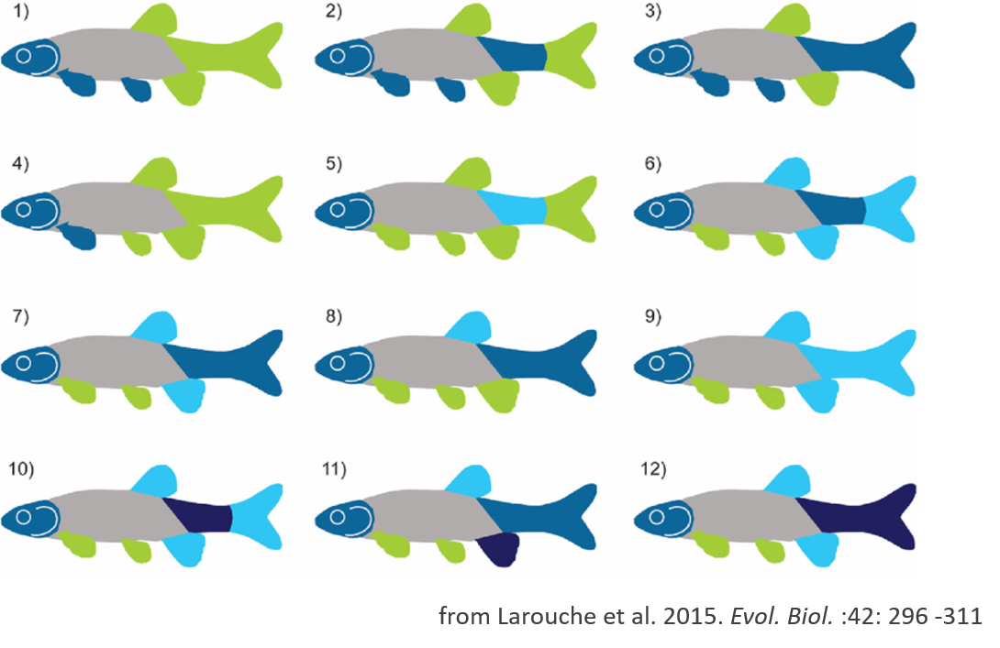
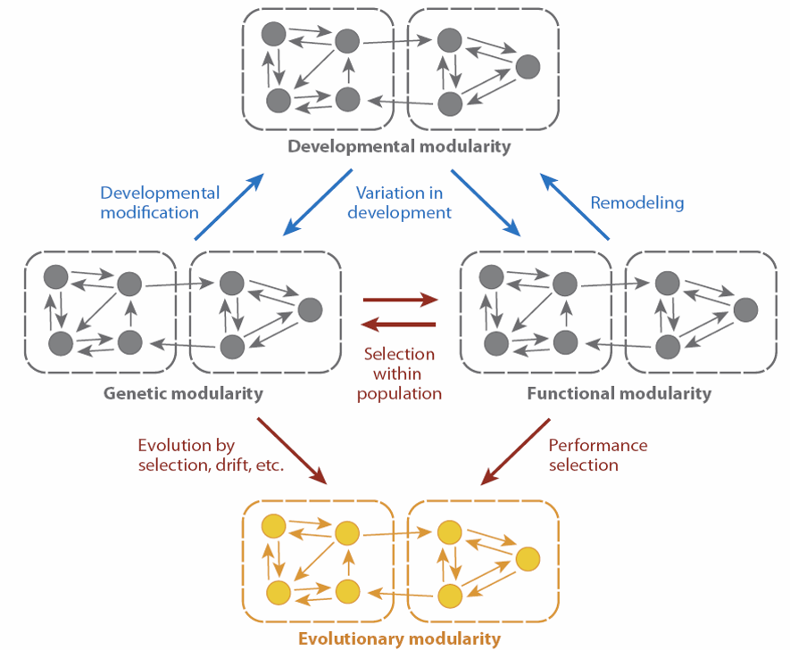
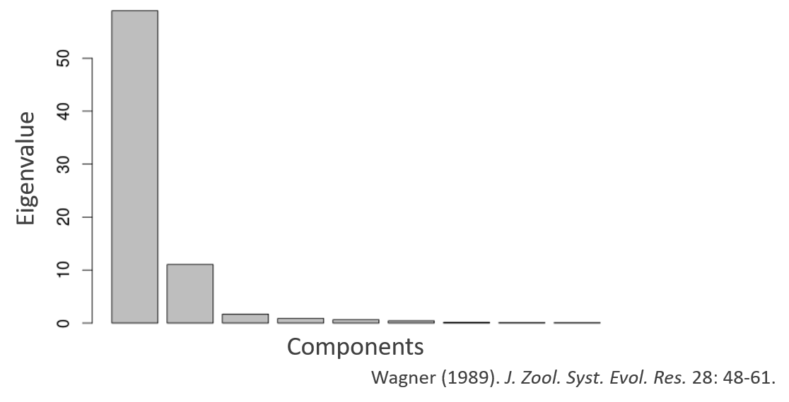
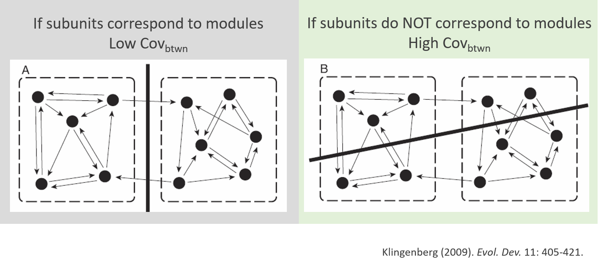
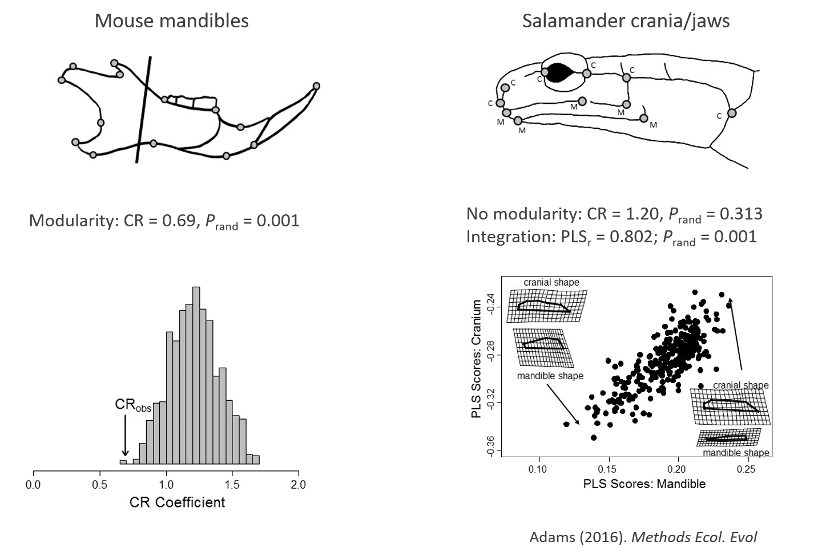
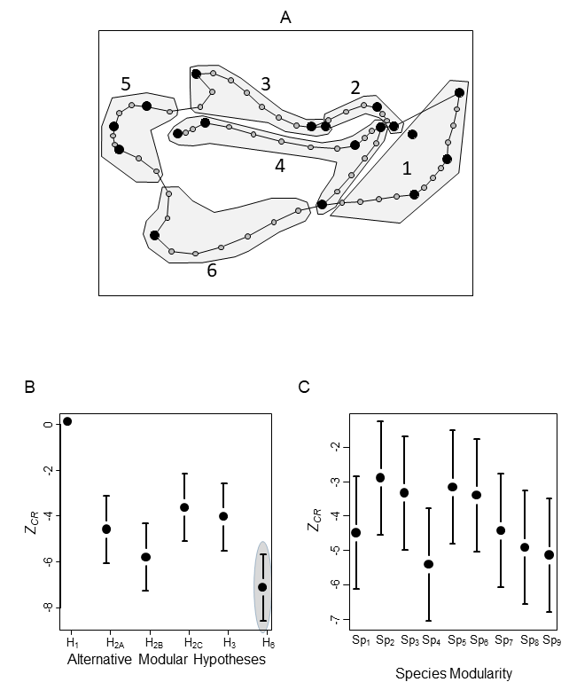

```{r setup, include=FALSE, echo = TRUE, tidy = TRUE}
library(knitr)
library(geomorph)
library(scatterplot3d)
opts_chunk$set(echo = TRUE)
```

# Integration and Modularity: Basic Concepts

- Organisms are composed of recognizable parts
- These parts are to some extent correlated
- WHY?

```{r, echo = FALSE, out.width="80%"}
  
```

# Integration and Modularity: Basic Concepts

- Developmental, ontogenetic, functional, evolutionary associations between traits

```{r, echo = FALSE, out.width="80%"}
include_graphics("LectureData/13.integr.mod/ConceptTypesIntegMechanisms.png")  
```

- With time, these associations lead to the **integration** among different body parts

- Biological systems can also exhibit a **modular** structure: where some traits are highly correlated with one another, and are less correlated with other sets of structures

###### Olson and Miller. (1958). *Morphological Integration.*

# Integration

- Integration describes how characters are correlated with each other

- Correlations that are stronger among some subsets of traits than between others (Olson and Miller 1958)

- Cohesion among traits that result from interactions of biological processes (Klingenberg 2008)

- Traits that are mutually informative of one another, conditional on all other traits under examination (Magwene 2001)

# Integration

- Integration describes how characters are correlated with each other

- Correlations that are stronger among some subsets of traits than between others (Olson and Miller 1958)

- Cohesion among traits that result from interactions of biological processes (Klingenberg 2008)

- Traits that are mutually informative of one another, conditional on all other traits under examination (Magwene 2001)

- Methodologically: goal is to identify “exceptional” correlations relative to some model

# Modularity

- A complementary concept to integration

- Describes sets of characters that exhibit higher correlations among them than they do with other sets: 
    - i.e., one has sets of integrated traits that are less correlated between sets

>- **Other definitions:**

>- The relative degree of connectivity among traits (Klingenberg 2008)

>- A complex of characters that serve a functional role, are tightly integrated, and are relatively independent from other such units (Wagner 1996)

>- Maximal subset of traits for which pairs of traits within the subset of mutually informative, conditional on all other traits under consideration  (Magwene 2001)

# Levels of Modularity

- Integration and modularity may be observed at different biological levels, and be explained by different biological processes

```{r, echo = FALSE, out.width="80%"}
  
```

###### Klingenberg. (2008). *Ann. Rev. Ecol. Evol. Syst.*

# Integration and Modularity: Conceptual Considerations

- The concept of integration has been explored in different ways

- May sometimes become difficult to grasp

- What is the “contrary” of integration? Modularity? Or “disintegration”?

- Which is the null hypothesis towards which to test for integration or modularity?

>- Several different approaches

>- Global patterns vs. pre-determined modules 

# Assessing Patterns for Blocks of Traits

- Two complementary questions

- Methodologies are all related to correlations within vs. between subsets of traits

- Inverse procedures for assessing integration vs. modularity

- In both cases different methods are available depending on whether one has an initial idea of the subsets of associated traits

# Evaluating Integration

- Early methods:
    - Identify large pairwise correlations in $\small{R}$ (Van Valen 1965)
    - Identify clusters of traits using cluster analysis (Cheverud 1982)
    - Factor analysis for identifying sets of correlated traits (Zelditch 1987)

>- Methods were largely exploratory, trying to identify whether integration occurred (without a priori hypotheses about integrated parts)

# 1: Conditional Independence

- Detect significant correlations, while accounting for correlations with other traits

- Procedure
    - Calculate $\small{R}$ for a set of traits
    - Find inverse $\small{R}^{-1}$ (elements of which are $\small{\Omega_{ij}}$)
    - Rescale $\small{R}^{-1}$ to **partial** correlations: $\small{\rho_{ij}=\frac{-\Omega_{ij}}{\sqrt{\Omega_{ii}\Omega_{jj}}}}$
    - Evaluate partial correlations: $\small{-Nln(1-\rho^2_{ij})\approx\chi^2}$			for all $\small{\rho_{ij}}$.  Set non-significant values to zero
    - Remaining $\small{\rho_{ij}}$ describe correlations among integrated traits 

# 1: Conditional Independence

- Detect significant correlations, while accounting for correlations with other traits

- Procedure
    - Calculate $\small{R}$ for a set of traits
    - Find inverse $\small{R}^{-1}$ (elements of which are $\small{\Omega_{ij}}$)
    - Rescale $\small{R}^{-1}$ to **partial** correlations: $\small{\rho_{ij}=\frac{-\Omega_{ij}}{\sqrt{\Omega_{ii}\Omega_{jj}}}}$
    - Evaluate partial correlations: $\small{-Nln(1-\rho^2_{ij})\approx\chi^2}$			for all $\small{\rho_{ij}}$.  Set non-significant values to zero
    - Remaining $\small{\rho_{ij}}$ describe correlations among integrated traits 
    
- Graphically, this is equivalent to ‘pruning’ links between traits
- Method ‘exploratory’ in that modules are not known *a priori* 

# 1: Conditional Independence: Example

- Sewall Wright's 'chickenbone' dataset

```{r, echo = FALSE, out.width="80%"}
include_graphics("LectureData/13.integr.mod/Magwene-Chickenbone.png")  
```

# 2: Integration Among Hypothesized Modules

- In some cases, we have biological hypotheses of putative modules, and wish to know whether they are correlated (integrated) with one another

- This test may be accomplished via **Multivariate Association** measures

- Two approaches may be (and have been) used: the RV coefficient and Partial Least Squares 

# 2: Integration Among Hypothesized Modules

- In some cases, we have biological hypotheses of putative modules, and wish to know whether they are correlated (integrated) with one another

- This test may be accomplished via **Multivariate Association** measures

- Two approaches may be (and have been) used: the RV coefficient and Partial Least Squares 

- But first recall (from Covariation lecture): 
    - One combines the traits from the two blocks (putative modules), from which the covariance matrix may be estimated: $\small\hat{\mathbf{\Sigma}}$
    - $\small\hat{\mathbf{\Sigma}}$ can be considered a partitioned matrix, where different sub-components describe covariation within blocks or between blocks of variables

```{r, echo = FALSE, out.width="40%"}
include_graphics("LectureData/06.covariation/CovMatParts2.png")  
```

$\small\mathbf{S}_{11}$: covariation of variables in $\small\mathbf{Y}_{1}$

$\small\mathbf{S}_{22}$: covariation of variables in $\small\mathbf{Y}_{2}$

$\small\mathbf{S}_{21}=\mathbf{S}_{12}^{T}$: covariation between $\small\mathbf{Y}_{1}$ and $\small\mathbf{Y}_{2}$

$\small\mathbf{S}_{21}=\mathbf{S}_{12}^{T}$ is the multivariate equivalent of $\small\sigma_{21}$ 
    
# 2: Integration Among Modules: The RV Coefficient

- Escoffier's RV Coefficient utilized the components of $\small\hat{\mathbf{\Sigma}}$ in the following manner: 

$$\small{RV}=\frac{tr(\mathbf{S}_{12}\mathbf{S}_{21})}{\sqrt{tr(\mathbf{S}_{11}\mathbf{S}_{11})tr(\mathbf{S}_{22}\mathbf{S}_{22})}}$$
Range of $\small\mathbf{RV}$:  $\small{0}\rightarrow{1}$

###### Note: 'tr' signifies trace (sum of diagonal elements)

The RV coefficient is *analogous* to $\small{r}^{2}$ but it is not a strict mathematical generalization


$\small{r}^{2}=\frac{\sigma^{2}_{xy}}{\sigma^{2}_{x}\sigma^{2}_{y}}$ vs. $\small{RV}=\frac{tr(\mathbf{S}_{12}\mathbf{S}_{21})}{\sqrt{tr(\mathbf{S}_{11}\mathbf{S}_{11})tr(\mathbf{S}_{22}\mathbf{S}_{22})}}$

The numerator of $\small{r}^{2}$ & $\small{RV}$ describes the covariation between $\small\mathbf{Y}_{1}$ & $\small\mathbf{Y}_{2}$

The denominator of $\small{r}^{2}$ & $\small{RV}$ describes variation within $\small\mathbf{Y}_{1}$ & $\small\mathbf{Y}_{2}$

Thus, $\small{RV}$ (like $\small{r}^{2}$) is a ratio of between-block relative to within-block variation 

- Significance is assessed via permutation

# 2: Integration Among Modules: The RV Coefficient

- Escoffier's RV Coefficient utilized the components of $\small\hat{\mathbf{\Sigma}}$ in the following manner: 

$$\small{RV}=\frac{tr(\mathbf{S}_{12}\mathbf{S}_{21})}{\sqrt{tr(\mathbf{S}_{11}\mathbf{S}_{11})tr(\mathbf{S}_{22}\mathbf{S}_{22})}}$$
Range of $\small\mathbf{RV}$:  $\small{0}\rightarrow{1}$

###### Note: 'tr' signifies trace (sum of diagonal elements)

The RV coefficient is *analogous* to $\small{r}^{2}$ but it is not a strict mathematical generalization


$\small{r}^{2}=\frac{\sigma^{2}_{xy}}{\sigma^{2}_{x}\sigma^{2}_{y}}$ vs. $\small{RV}=\frac{tr(\mathbf{S}_{12}\mathbf{S}_{21})}{\sqrt{tr(\mathbf{S}_{11}\mathbf{S}_{11})tr(\mathbf{S}_{22}\mathbf{S}_{22})}}$

The numerator of $\small{r}^{2}$ & $\small{RV}$ describes the covariation between $\small\mathbf{Y}_{1}$ & $\small\mathbf{Y}_{2}$

The denominator of $\small{r}^{2}$ & $\small{RV}$ describes variation within $\small\mathbf{Y}_{1}$ & $\small\mathbf{Y}_{2}$

Thus, $\small{RV}$ (like $\small{r}^{2}$) is a ratio of between-block relative to within-block variation 

- Significance is assessed via permutation

However, because each $\small\mathbf{S}$ is a covariance matrix, the sub-components of $\small\mathbf{RV}$ are **squared** variances and covariances: not variances as in $\small{r}^{2}$: $\tiny\text{hence, range of  } \mathbf{RV}={0}\rightarrow{1}$ 

##### It is not at all obvious what a 'squared covariance' represents in a statistical sense, as variances are already summed squared deviations from the mean (see Bookstein. *Evol. Biol.* 2016)

# 2: Integration Among Modules: Partial Least Squares

Another way to summarize the covariation between blocks is via Partial Least Squares (PLS)

*Decomposing* the information in $\small\mathbf{S}_{12}$ to find rotational solution (direction) that describes greatest covariation between $\small\mathbf{Y}_{1}$ and $\small\mathbf{Y}_{2}$

$$\small\mathbf{S}_{12}=\mathbf{U\Lambda{V}}^T$$

Ordination scores found by projection of centered data on vectors $\small\mathbf{U}$ and $\small\mathbf{V}$

$$\small\mathbf{P}_{1}=\mathbf{Y}_{1}\mathbf{U}$$

$$\small\mathbf{P}_{2}=\mathbf{Y}_{2}\mathbf{V}$$

The first columns of $\small\mathbf{P}_{1}$ and $\small\mathbf{P}_{2}$ describe the maximal covariation between $\small\mathbf{Y}_{1}$ and $\small\mathbf{Y}_{2}$

The correlation between $\small\mathbf{P}_{11}$ and $\small\mathbf{P}_{21}$ is the PLS-correlation

$$\small{r}_{PLS}={cor}_{P_{11}P_{21}}$$

Significance is assessed via permutation

###### Bookstein et al. (2003). *J. Hum. Evol.*

# Integration using RV: Example 1

*Pecos* pupfish (shape obtained using geometric morphometrics)


```{r, echo = FALSE, out.width="40%"}
include_graphics("LectureData/06.covariation/Pupfish Motivation.png")  
```

Is there an association between head shape and body shape?

# Integration using RV: Example 1

*Pecos* pupfish (shape obtained using geometric morphometrics)


```{r, echo = FALSE, out.width="40%"}
include_graphics("LectureData/06.covariation/Pupfish Motivation.png")  
```

Is there an association between head shape and body shape?

```{r echo=FALSE, out.width="80%"}
data(pupfish)
Y.gpa <- gpagen(pupfish$coords, print.progress = FALSE)
shape <- two.d.array(Y.gpa$coords)
head <- c(4, 10:17, 39:56)
all <- 1:56
body <- all[-head]
land.gps<-rep('b',56); land.gps[c(4,10:17,39:56)]<-'a' # for PLS
y <- two.d.array(Y.gpa$coords[head, , ])
x <- two.d.array(Y.gpa$coords[body, , ])
y<-scale(y,center=TRUE, scale=FALSE)
x<-scale(x,center=TRUE, scale=FALSE)
S12 <- crossprod(x,y)/(dim(x)[1] - 1)
S11 <- var(x)
S22 <- var(y)
RV <- sum(colSums(S12^2))/sqrt(sum(S11^2)*sum(S22^2))
```

$$\small{RV}=\frac{tr(\mathbf{S}_{12}\mathbf{S}_{21})}{\sqrt{tr(\mathbf{S}_{11}\mathbf{S}_{11})tr(\mathbf{S}_{22}\mathbf{S}_{22})}}=0.607$$

$$\small\sqrt{RV}=0.779$$

# Integration using PLS: Example 1

```{r, echo = FALSE, out.width="40%"}
include_graphics("LectureData/06.covariation/Pupfish Motivation.png")  
```

$\tiny{RV}=\frac{tr(\mathbf{S}_{12}\mathbf{S}_{21})}{\sqrt{tr(\mathbf{S}_{11}\mathbf{S}_{11})tr(\mathbf{S}_{22}\mathbf{S}_{22})}}=0.607$ and $\tiny\sqrt{RV}=0.779$

$\small{r}_{PLS}={cor}_{P_{11}P_{21}}=0.916$

```{r echo=FALSE, out.width="80%"}
PLS <- two.b.pls(y,x, iter=999, print.progress = FALSE)
#summary(PLS)
plot(PLS)
```

# Evaluating Multivariate Associations

We now have two potential test measures of multivariate correlation

$$\small{RV}=\frac{tr(\mathbf{S}_{12}\mathbf{S}_{21})}{\sqrt{tr(\mathbf{S}_{11}\mathbf{S}_{11})tr(\mathbf{S}_{22}\mathbf{S}_{22})}}$$

$$\small{r}_{PLS}={cor}_{P_{11}P_{21}}$$

#### Is one approach preferable over the other?

# Permutation Tests for Multivariate Association

Test statistics: 

$\small\hat\rho=\sqrt{RV}$ and $\small\hat\rho={r}_{PLS}$

H~0~: $\small\rho=0$ 

H~1~: $\small\rho>0$ 

RRPP Approach: 

1: Represent $\small\mathbf{Y}_{1}$ and $\small\mathbf{Y}_{2}$ as deviations from mean (H~0~)

2: Estimate $\small\hat\rho=\sqrt{RV}_{obs}$ and $\small\hat\rho={r}_{PLS_{obs}}$

3: Permute rows of $\small\mathbf{Y}_{2}$, obtain $\small\hat\rho=\sqrt{RV}_{rand}$ and $\small\hat\rho={r}_{PLS_{rand}}$

4: Repeat many times to generate sampling distribution

# Permutation Tests for RV and r~PLS~: Example

Test statistics: 

$\small\hat\rho=\sqrt{RV}$ and $\small\hat\rho={r}_{PLS}$

H~0~: $\small\rho=0$ 

H~1~: $\small\rho>0$ 

```{r echo=FALSE, out.width="80%"}
ind <- geomorph:::perm.index(nrow(x), iter=999, seed=NULL)
y.rand <-lapply(1:1000, function(j) as.matrix(y[ind[[j]],]))
pls.rand<-unlist(lapply(1:1000, function(j) geomorph:::pls(x=x,y=y.rand[[j]])))
S12 <- lapply(1:1000, function(j) crossprod(x,y.rand[[j]])/(dim(x)[1] - 1)) 
RV.rand <- sqrt(unlist(lapply(1:1000, function(j) sum(colSums(S12[[j]]^2))/sqrt(sum(S11^2)*sum(S22^2))) ))
```

```{r echo = FALSE, out.width = "50%"}
par (mfcol=c(1,2))
hist(RV.rand, main="RV Distribution",xlim=c(0,1))
segments(RV.rand[1], 0, RV.rand[1], 100,lwd=2) 
hist(pls.rand, main="PLS Distribution",xlim=c(0,1))
segments(pls.rand[1], 0, pls.rand[1], 100,lwd=2)  
```

For the pupfish dataset, both are significant at p = 0.001

# Permutation Tests for RV and r~PLS~: Example

Test statistics: 

$\small\hat\rho=\sqrt{RV}$ and $\small\hat\rho={r}_{PLS}$

H~0~: $\small\rho=0$ 

H~1~: $\small\rho>0$ 

Compare permutation distributions with one another (minus observed in this case)

```{r eval=TRUE,out.width="70%"}
plot(RV.rand[-1], pls.rand[-1], xlim=c(0,.65), ylim=c(0,.65), xlab="sqrt(RV)", ylab="r-pls")
abline(a=0,b=1, col="red",lwd=2)
```

#### All things considered, *r~PLS~* performs better. 


# Integration using PLS: Example 2

- Cranial integration for pairs of modules in *Homo*

```{r, echo = FALSE, out.width="80%"}
include_graphics("LectureData/13.integr.mod/PLS-Bookstein03.png")  
```

# 3: Global Integration

- How tightly integrated is a structure in an overall sense?

- Does not consider subsets of the structure, but rather the whole

# 3: Global Integration

- How tightly integrated is a structure in an overall sense?

- Does not consider subsets of the structure, but rather the whole

- High integration is expressed as high global correlation among traits

- The scaled variance of eigenvalues (SVE) can be used as a measure of global integration

```{r, echo = FALSE, out.width="80%"}
  
```

# 3: Global Integration: Conceptual Considerations

- A major, yet previously unaddressed question concerning global integration was: “Integrated” as opposed to what? 

- That is, what is the null model against which the pattern is being compared?

- All previous approaches consider a lack of correlation to be the null, which is a poor null model

>- The reason this is a poor null is that for biological data, phenotypic traits (or landmarks) that are closer together are bound to covary to some extent, i.e. landmarks that are closer together are expected to exhibit higher covariances than those that are further apart

>- Thus, the 'null' for global integration should be some pattern of covariance based on spatial proximity

>- One can quantify this pattern by examining the relationship between the variance of non-uniform shape variation (variance of PWs) and their bending energy 

###### Bookstein. (2015). *Evol. Biol.*

# 3: Global Integration and Self-Similarity

- For variance in non-uniform shape variation versus variance in BE, the expected value of this relationship is: $\small\beta= -1$

- For this value, shape patterns are maintained across spatial scales

- This is called self-similarity and it can be used as the $H_0$ to examine the degree of integration of biological data

- Deviations in slope from this value provide useful heuristics regarding global integration
    - $\small\beta= -1$: self-similarity
    - $\small\beta> -1$: global integration
    - $\small\beta< -1$: "disintegration""

```{r echo=FALSE, out.width="80%"}
data(plethodon) 
Y.gpa<-gpagen(plethodon$land, print.progress = FALSE)    #GPA-alignment    

globalIntegration(Y.gpa$coords)
```

# 4: Assessing Modularity

- Modularity addresses a question complementary to that of integration

- Modules: tightly integrated sets of traits, which are relatively independent from other such sets

- In terms of covariation patterns: look for subunits of characters with high within-unit covariation, and little covariation with other subunits

```{r, echo = FALSE, out.width="80%"}
include_graphics("LectureData/13.integr.mod/ModularityConcept.png")  
```

# 4: Assessing Modularity

- We can identify modules by examining the covariance structure of the data

- Divide structure to subunits and calculate the covariation between them

```{r, echo = FALSE, out.width="80%"}
  
```

# 4: Assessing Modularity: $\small{RV}$ Coefficient

- One could consider using the $\small{RV}$ coefficient to evaluate modularity, where small $\small{RV}$ values signify greater modularity

- However, the $\small{RV}$ coeffiicent varies systematically with both *n* and *p*, meaning the 'expected' value representing modularity is arbitrary!

```{r, echo = FALSE, out.width="80%"}
include_graphics("LectureData/06.covariation/RV-WithN-P.png")  
```

With random MVN data, $\small\mathbf{RV}$ varies with both *n* and *p*!  

>- Not a useful measure of modularity (or integration!)

###### Adams. (2016). *Methods Ecol. Evol.*

# 4: Assessing Modularity: $\small{CR}$ Coefficient

- An alternative is to use the covariance ratio:

$$\small{CR}=\frac{tr(\mathbf{S}_{12}\mathbf{S}_{21})}{\sqrt{tr(\mathbf{S}^*_{11}\mathbf{S}^*_{11})tr(\mathbf{S}^*_{22}\mathbf{S}^*_{22})}}$$

- where $\small\mathbf{S}^*_{11}$ &  $\small\mathbf{S}^*_{22}$ represent the within-module covariance matrices with $\small{0}$ along the diagonal

# 4: Assessing Modularity: $\small{CR}$ Coefficient

- An alternative is to use the covariance ratio:

$$\small{CR}=\frac{tr(\mathbf{S}_{12}\mathbf{S}_{21})}{\sqrt{tr(\mathbf{S}^*_{11}\mathbf{S}^*_{11})tr(\mathbf{S}^*_{22}\mathbf{S}^*_{22})}}$$

- where $\small\mathbf{S}^*_{11}$ &  $\small\mathbf{S}^*_{22}$ represent the within-module covariance matrices with $\small{0}$ along the diagonal

-  The $\small{CR}$ coefficient does *NOT* vary with *n* and *p*:

```{r, echo = FALSE, out.width="60%"}
include_graphics("LectureData/13.integr.mod/CRPattern.png")  
```

- Under MVN data, $\small\mathbf{CR}$ remains **CONSTANT** at ~ 1.0 with both *n* and *p*!  

# $\small{CR}$ Coefficient: Statistical Properties

- The $\small{CR}$ coefficient displays appropriate statistical properties

```{r, echo = FALSE, out.width="80%"}
include_graphics("LectureData/13.integr.mod/CRStatProp.png")  
```

# $\small{CR}$ Coefficient: Examples

```{r, echo = FALSE, out.width="80%"}
  
```

# 5: Comparing Patterns Across Datasets

- It may be of interest to know whether the 'degree' of integration (or modularity) is greater in one dataset as compared to another

- How can one evaluate such patterns?

# 5: Comparing Patterns Across Datasets

- It may be of interest to know whether the 'degree' of integration (or modularity) is greater in one dataset as compared to another

- How can one evaluate such patterns?

- One cannot directly compare $\small{RV}$ or $\small{r}_{PLS}$ patterns because both vary with *n* and *p*

```{r, echo = FALSE, out.width="60%"}
include_graphics("LectureData/13.integr.mod/RV.PLS.n.p.png")  
```

# 5: Comparing Patterns Across Datasets

- However, converting $\small{r}_{PLS}$ to an *Effect Size* (Z-score)  eliminates trends with *n* and *p*, allowing meaningful comparisons.

```{r, echo = FALSE, out.width="50%"}
include_graphics("LectureData/06.covariation/Z-PLS-WithN-P.png")  
```

where: $\small\mathbf{Z}=\frac{r_{PLS_{obs}}-\mu_{r_{PLS_{rand}}}}{\sigma_{r_{PLS_{rand}}}}$

###### Adams and Collyer. (2016). *Evol.*

# 5: Comparing Integration Across Datasets: example

- Are different modules of the lizard head equally integrated across environments?
- Does integration change ontogenetically?

```{r, echo = FALSE, out.width="50%"}
include_graphics("LectureData/13.integr.mod/CompareIntegr_example.png")  
```

# 5: Comparing Modularity Across Datasets

- One might be interested in evaluating alternative modular hypotheses for the same dataset...
- ... or ask whether one group exhibits higher modular signal than another
- Again, Z-scores are extremely useful for this kind of comparisons!

```{r, echo = FALSE, out.width="50%"}
include_graphics("LectureData/13.integr.mod/Fig3.png")  
```

- Z-scores based on CR have high power, appropriate type I error and low misspecification rates
- This is not the case with alternative approaches that have been proposed (MINT or EMMLi)


###### Adams and Collyer. (in press). *Evol.*


# 5: Comparing Modularity Across Datasets: example

- Which is the most supported modular division for the mouse mandible?
- Do some species exhibit higher modularity than others?

```{r, echo = FALSE, out.width="50%"}
  
```

###### Adams and Collyer. (in press). *Evol.*


# Integration and Modularity: Perspectives

- Integration and modularity are of relevance for many E&E questions

- Several different aspects can be explored: global integration vs. integration of different structures; with vs. without a priori hypotheses etc.

- Careful with definitions and matching between concepts and stats

- RV has been extensively used to assess modularity, but it exhibits undesirable statistical properties

- CR resolves these and can be promptly used to test for modularity

- Open questions regarding integration

- Generally, indices used depend on N and p (at least), so further modifications may be required


