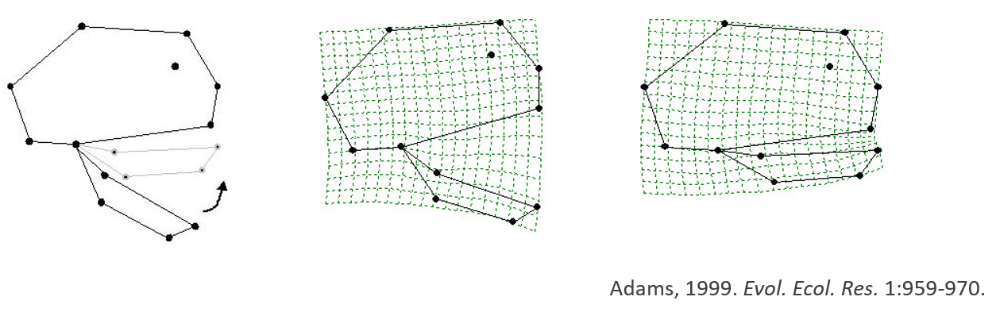
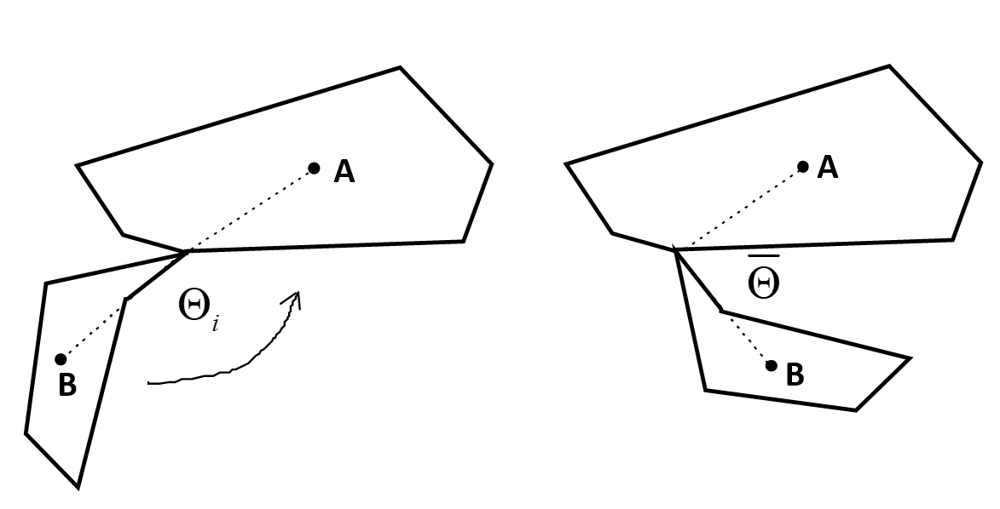
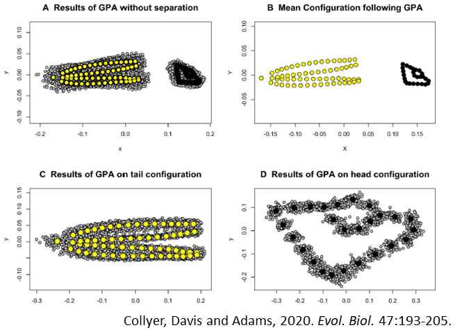

```{r setup, include=FALSE, echo = TRUE, tidy = TRUE}
library(knitr)
library(geomorph)
opts_chunk$set(echo = TRUE)

library(xaringanthemer)
style_mono_light()
```

### Data Compications in GMM

+ GPA: Aligns specimens to the average shape (reference, consensus shape)

  + Removes non-shape information
  + Requires landmark correspondence among specimens, and that all landmarks are present on all specimens
 

### The Problem of Missing Data

.pull-left[
+ GPA: Aligns specimens to the average shape (reference, consensus shape)
  + Removes non-shape information
  + Requires landmark correspondence among specimens, and that all landmarks are present on all specimens
]
.pull-right[
```{r echo=FALSE, fig.align = "center", eval=TRUE,out.width="90%"}
lizards <- readland.nts('LectureData/04.shape.vars/lizards_LAT.nts')
links <- read.csv('LectureData/04.shape.vars/links.txt', header=FALSE, sep = " ")
liz.lab <- read.csv('LectureData/04.shape.vars/liz_groups.csv',header=TRUE, sep="\t")
col.gp <- rep("red",nrow(liz.lab))
col.gp[which(liz.lab$SEX=='M')] <- 'blue'

Y.gpa <- gpagen(lizards, print.progress = FALSE)

par(mfrow=c(1,2)) 
plotAllSpecimens(lizards, links = links)
plotAllSpecimens(Y.gpa$coords, links=links)
par(mfrow=c(1,1)) 
```
]
+ What does one do when specimens have missing data?
---

### Missing Data

+ In some fields (e.g., anthropology), missing data is pervasive
  + Specimens are incomplete, or lack structures entirely

```{r, echo = FALSE,  fig.align = "center", out.width="70%"}
include_graphics("lectureData/13.missing/MissingAnthro.png")
```
---

### Dealing with Missing Data: Delete Specimens

+ Simplest solution is to remove specimens with missing data

```{r, echo = FALSE,  fig.align = "center", out.width="90%"}
include_graphics("lectureData/13.missing/FishDelSpec.png")
```

--

+ Reduces sample size
+ No information from deleted specimens, which could be important (e.g., a rare species)

+ NOT an optimal solution!
---

### Dealing with Missing Data: Delete Landmarks

+ Another option is to delete landmarks that are missing from some specimens

```{r, echo = FALSE,  fig.align = "center", out.width="90%"}
include_graphics("lectureData/13.missing/FishDelLand.png")
```

--

+ Retains original sample size
+ No information from deleted landmarks, which could be biologically important

+ NOT an optimal solution!
---

### Estimate Missing Data $^1$

+ An alternative is to estimate missing data in some intelligent manner
+ Goal is to generate ‘complete’ specimens by estimating missing landmarks
  + Called data *imputation* in the statistical literature
+ Use some reasonable procedure to predict missing landmark locations
+ Several approaches possible

.footnote[1: See Gunz et al. (2009). *J. Hum. Evol.*]
---

### 1: Exploiting Symmetry $^1$

.pull-left[
+ Use biological symmetry to estimate missing landmarks
+ Two approaches:
  + 1: Mirror-image (reflect) portion of structure to the other side
  + 2: Create $\small{2}^{nd}$ full specimen via reflection (and relabeled) 
+ Locations of missing landmarks estimated from location in reflected portion
]
.pull-right[
```{r, echo = FALSE,  fig.align = "center", out.width="80%"}
include_graphics("lectureData/13.missing/Skull1.png")
```
]

.footnote[1: Note: the `reflectMissingLandmarks` function in `StereoMorph` may be used for symmetry-based estimation of missing landmarks]
---

### 1: Exploiting Symmetry: Example

.pull-left[
+ Take one specimen (in red) and eliminate some landmarks

```{r echo=FALSE, fig.align = "center",  eval=TRUE,out.width="95%"}
mydat<-readland.tps("lectureData/13.missing/LizardShape.tps",warnmsg = FALSE)
shape <- gpagen(mydat,print.progress = FALSE)$coords
land.prs<-matrix(c(13, 14,2,11,15, 16,27, 28,3,10,17,19,4, 9,20, 21,22, 24,25, 26,5, 8, 6 ,7),ncol=2,byrow=T)

links<-read.table("lectureData/13.missing/lizardlinks.txt",header=T)
ref<-mshape(shape)
shape.pca <- gm.prcomp(shape)
col.spec <- rep("black",dim(shape)[[3]]); col.spec[62] ="red"
sz.spec <- rep(1.0,dim(shape)[[3]]); sz.spec[62] =2

par(mfrow=c(1,2)) 
plotAllSpecimens(shape,links=links)
plot(shape.pca,pch=21, bg=col.spec, cex=sz.spec)
par(mfrow=c(1,1)) 
```
]
.pull-right[
- Let's delete some landmarks then estimate by exploiting symmetry

```{r, echo = FALSE, fig.align = "center",  out.width="90%"}
include_graphics("lectureData/13.missing/LizardMissing.png")
```
]
---

#### 1: Exploiting Symmetry: Test Procedure

.pull-left[
```{r echo=FALSE,  fig.align = "center", eval=TRUE,out.width="90%"}
flipped<-spec<-shape[,,62]
flipped[,2]<-flipped[,2]*-1  #reflect about Y-axis
  spec[c(5,28,14,4),]<-NA  #create missing
  spec[c(5,28,14,4),]<-flipped[c(8,27,13,9),]  #use mirrored landmarks

plotRefToTarget(shape[,,62],shape[,,62],links=links)
mtext("Original Specimen")
```

]
.pull-right[
```{r echo=FALSE,  fig.align = "center", eval=TRUE,out.width="90%"}
plotRefToTarget(shape[,,62],spec,links=links)
mtext("TPS: Original --> Estimated Specimen")
#dist(rbind(t(matrix(spec)),t(matrix(shape[,,62]))))
```

$\small{D}_{Proc}= 0.009$. Pretty good!
]
---

### 1: Exploiting Symmetry: Thoughts

**Advantages**
  + Exploits spatial relationships of anatomy within a specimen
  + Leverages ‘pseudoreplication’ of symmetric points

**Disadvantages**
  + Not all objects are symmetric
  + Studies of asymmetry are challenged, because by definition only the symmetric portion of shape is used in the reconstruction

--

+ Symmetry methods can be useful but not are not a general solution (limited to symmetric structures)
---

### 2: Mean Substitution $^1$

+ Use landmarks in reference to estimate missing landmarks
  + 1: Superimpose all complete specimens 
  + 2: Obtain reference (average)
  + 3: Replace missing landmarks with values from reference

.footnote[1: see Arbour and Brown. (2014). *Methods. Ecol. Evol.*]
---

### 2: Mean Substitution: Example

+ Here we have some (simulated) fish data:

```{r echo=FALSE,  fig.align = "center", eval=TRUE,out.width="45%"}
spec <- readland.tps('lectureData/13.missing/fish.tps', specID = "imageID", warnmsg = FALSE)
spec <- geomorph:::center.scale(spec[,,1])$coords
links <- read.table("lectureData/13.missing/links.txt")
#Simulate specimens with large allometry effect
CS <- seq(.5,1.5, by =.01)  #size
Dil <- seq(.5,1.5, by =.01)  #size
n <- length(CS); p<-40; k<-2
specs <- array(NA,dim=c(p,k,n))
  for (i in 1:n){
    trans <- matrix(c(Dil[i],0,0,1),nrow=2)
    specs[,,i] <- CS[i]*(spec%*%trans)+.3*CS[i]*matrix(rnorm(n=p*k, sd = 0.01),ncol=2)  
  }
Y.gpa <- gpagen(specs, print.progress = FALSE)  
fishshapes <- Y.gpa$coords
ref <- mshape(fishshapes)

PCA <- gm.prcomp(fishshapes)
PC <- PCA$x[,1]
preds <- shape.predictor(fishshapes, x= PC, Intercept = FALSE, 
                         pred1 = min(PC), pred2 = max(PC)) 

par(mfrow=c(2,2)) 
plot(PCA, pch=21, cex=1,bg="black")
plotRefToTarget(ref,ref,links=links)
plotRefToTarget(ref, preds$pred1, links = links)
mtext("PC1-Negative")
plotRefToTarget(ref, preds$pred2, links = links)
mtext("PC1-Positive")
par(mfrow=c(1,1)) 

```
---

### 2: Mean Substitution: Example 1 (Cont.)

+ Let's take one specimen (in red) and eliminate some landmarks

```{r echo=FALSE,  fig.align = "center", eval=TRUE,out.width="45%"}
fish.colmin <- rep("black",dim(fishshapes)[[3]]); fish.colmin[1] ="red"
fish.szmin <- rep(1.0,dim(fishshapes)[[3]]); fish.szmin[1] =2
plot(PCA,pch=21, bg=fish.colmin, cex=fish.szmin)

```
---

### 2: Mean Substitution: Example 1 (Cont.)

+ Now let's delete some landmarks then estimate by mean substitution

.pull-left[
```{r, echo = FALSE,  fig.align = "center", out.width="80%"}
include_graphics("lectureData/13.missing/FishMinMissing.png")
```

Test Procedure

+ 1: Obtain specimen, delete landmarks
+ 2: Estimate landmarks from mean specimen
+ 3: Calculate $\small{D}_{Proc}$ between original and estimated
]

.pull-right[
```{r echo=FALSE,  fig.align = "center", eval=TRUE,out.width="75%"}
#create some missing data for TPS and regression methods  
shapes.missing<-fishshapes  #delete 1, 7, 15, 26 
shapes.missing[c(1,7,17,26),,1]<-NA
shapes.missing[c(1,7,17,26),,101]<-NA


########  2: Mean Substitution
shapes.mn<-shapes.missing
shapes.mn[c(1,7,17,26),,1]<-ref[c(1,7,17,26),]
shapes.mn[c(1,7,17,26),,101]<-ref[c(1,7,17,26),]

par(mfrow=c(2,2))
plotRefToTarget(ref,ref,links=links)
mtext("Reference")
plotRefToTarget(fishshapes[,,1],fishshapes[,,1],links=links) #original
mtext("Original Specimen")
plotRefToTarget(ref,fishshapes[,,1],links=links)
mtext("TPS: Reference --> Original")
plotRefToTarget(ref,shapes.mn[,,1],links=links)
mtext("TPS: Original --> Estimated Specimen")
par(mfrow=c(1,1)) 
#as.matrix(dist(rbind(t(matrix(ref)),t(matrix(fishshapes[,,1])),t(matrix(shapes.mn[,,1])))))
```

$\small{D}_{Proc_{Ref-Orig}} = 0.26$  $\small{D}_{Proc_{Ref-Est}} = 0.23$

$\small{D}_{Proc_{Orig-Est}} = 0.13$   **Not good at all!**
]
---

### 2: Mean Substitution: Example 2

+ Or let's take a different specimen (in red) and eliminate some landmarks

```{r echo=FALSE,  fig.align = "center", eval=TRUE,out.width="45%"}
fish.colmax <- rep("black",dim(fishshapes)[[3]]); fish.colmax[101] ="red"
fish.szmax <- rep(1.0,dim(fishshapes)[[3]]); fish.szmax[101] =2
plot(PCA,pch=21, bg=fish.colmax, cex=fish.szmax)

```
---

### 2: Mean Substitution: Example 1 (Cont.)

.pull-left[
+ Now let's delete some landmarks then estimate by mean substitution

```{r, echo = FALSE, fig.align = "center",  out.width="80%"}
include_graphics("lectureData/13.missing/FishMaxMissing.png")
```

Test Procedure

+ 1: Obtain specimen, delete landmarks
+ 2: Estimate landmarks from mean specimen
+ 3: Calculate $\small{D}_{Proc}$ between original and estimated

]

.pull-right[

```{r echo=FALSE, fig.align = "center",  eval=TRUE,out.width="75%"}

par(mfrow=c(2,2))
plotRefToTarget(ref,ref,links=links)
mtext("Reference")
plotRefToTarget(fishshapes[,,101],fishshapes[,,101],links=links) #original
mtext("Original Specimen")
plotRefToTarget(ref,fishshapes[,,101],links=links)
mtext("TPS: Reference --> Original")
plotRefToTarget(ref,shapes.mn[,,101],links=links)
mtext("TPS: Original --> Estimated Specimen")
par(mfrow=c(1,1)) 
#as.matrix(dist(rbind(t(matrix(ref)),t(matrix(fishshapes[,,1])),t(matrix(shapes.mn[,,1])))))
```


$\small{D}_{Proc_{Ref-Orig}} = 0.15$  $\small{D}_{Proc_{Ref-Est}} = 0.13$

$\small{D}_{Proc_{Orig-Est}} = 0.08$   **Not good at all!**
]
---

### 2: Mean Substitution: What's Going On?

.pull-left[

```{r echo=FALSE,  fig.align = "center", eval=TRUE,out.width="80%"}
fish.col <- rep("black",dim(fishshapes)[[3]]); fish.col[c(1,101)] ="red"
fish.sz <- rep(1.0,dim(fishshapes)[[3]]); fish.sz[c(1,101)] =2
plot(PCA,pch=21, bg=fish.col, cex=fish.sz)
```

+ Mean substitution does not account for systematic variation (e.g., allometry)
+ If shape covaries with some factor (e.g., size!), it will over- or under-estimate landmark locations

]

.pull-right[
```{r echo=FALSE,  fig.align = "center", eval=TRUE,out.width="80%"}
par(mfrow=c(1,2))
plotRefToTarget(ref,fishshapes[,,1],method="points", links=links)
plotRefToTarget(ref,fishshapes[,,101],method="points", links=links)
par(mfrow=c(1,1))
```

+ **Mean substitution should not be used!**
]
---

### 3: TPS Interpolation $^1$

+ Use thin-plate spline to estimate location of missing landmarks

```{r, echo = FALSE,  fig.align = "center", out.width="70%"}
include_graphics("LectureData/04.shape.vars/GorillaHuman.png")  
```

+ Procedure
  + 1: Identify common landmarks in both reference and target
  + 2: Calculate TPS interpolation
  + 3: Missing landmarks in target estimated from their location in reference, filtered through TPS

.footnote[1: Bookstein et al. (1999). *New. Anat.*; Gunz et al. (2009). *J. Hum. Evol.*]
---

### 3: TPS Interpolation: Concept $^1$

+ Procedure
  + 1: Identify common landmarks in both reference and target
  + 2: Calculate TPS interpolation
  + 3: Missing landmarks in target estimated from their location in reference, filtered through TPS

```{r, echo = FALSE,  fig.align = "center", out.width="70%"}
include_graphics("LectureData/13.missing/TPSMissingConcept.png")  
```

.footnote[1: Bookstein et al. (1999). *New. Anat.*; Gunz et al. (2009). *J. Hum. Evol.*]
---

### 3: TPS Interpolation: Example 1

.pull-left[
```{r echo=TRUE,  fig.align = "center", eval=TRUE,out.width="40%"}
new.tps<-estimate.missing(shapes.missing,method="TPS")
```

```{r echo=FALSE,  fig.align = "center", eval=TRUE,out.width="80%"}
#plots
par(mfrow=c(2,2))
plotRefToTarget(ref,ref,links=links)
mtext("Reference")
plotRefToTarget(ref,fishshapes[,,1],links=links)
mtext("TPS: Reference --> Original")
plotRefToTarget(ref,new.tps[,,1],links=links)
mtext("TPS: Ref --> Estimated Specimen")
plotRefToTarget(fishshapes[,,1],new.tps[,,1],links=links)
mtext("TPS: Original --> Estimated Specimen")

par(mfrow=c(1,1)) 
#as.matrix(dist(rbind(t(matrix(ref)),t(matrix(fishshapes[,,1])),t(matrix(new.tps[,,1])))))
```
]
.pull-right[
$\small{D}_{Proc_{Ref-Orig}} = 0.26$  $\small{D}_{Proc_{Ref-Est}} = 0.27$

$\small{D}_{Proc_{Orig-Est}} = 0.003$   **MUCH Better!**
]
---

### 3: TPS Interpolation: Example 2

```{r echo=FALSE,  fig.align = "center", eval=TRUE,out.width="40%"}

#plots
par(mfrow=c(2,2))
plotRefToTarget(ref,ref,links=links)
mtext("Reference")
plotRefToTarget(ref,fishshapes[,,101],links=links)
mtext("TPS: Reference --> Original")
plotRefToTarget(ref,new.tps[,,101],links=links)
mtext("TPS: Ref --> Estimated Specimen")
plotRefToTarget(fishshapes[,,101],new.tps[,,101],links=links)
mtext("TPS: Original --> Estimated Specimen")

par(mfrow=c(1,1)) 
#as.matrix(dist(rbind(t(matrix(ref)),t(matrix(fishshapes[,,101])),t(matrix(new.tps[,,101])))))
```

$\small{D}_{Proc_{Ref-Orig}} = 0.15$  $\small{D}_{Proc_{Ref-Est}} = 0.15$

$\small{D}_{Proc_{Orig-Est}} = 0.011$   **MUCH Better!**
---

### 3: TPS Interpolation: Thoughts

**Advantages**
  + Exploits spatial relationships of anatomy within a specimen

**Disadvantages**
  + Less accurate if many landmarks in a region missing (common with fossils)
  + Does not leverage additional covariation information in sample

+ TPS interpolation is *very* useful, but may be improved upon
---

### 4: Regression Interpolation $^1$

+ Use covariation between landmarks to estimate locations

+ Procedure
  + 1: Superimpose all complete specimens 
  + 2:Regress landmarks with missing values against complete specimens
  + 3: Use post-hoc prediction on regression for missing landmarks
  + 4: Predicted values serve as missing landmark locations

.footnote[1: Note: Regression scores of PLS typically used as $\small{p>n}$

2: See Gunz et al. (2009). *J. Hum. Evol.*; reviewed in Arbour and Brown (2014). *Methods. Ecol. Evol.*]
---

### 4: Regression Interpolation: Example 1

.pull-left[
```{r echo=TRUE,  fig.align = "center", eval=TRUE,out.width="40%"}
new.reg<-estimate.missing(shapes.missing,method="Reg")
```

```{r echo=FALSE,  fig.align = "center", eval=TRUE,out.width="80%"}
new.reg<-gpagen(new.reg, print.progress=FALSE)$coords

#plots
par(mfrow=c(2,2))
plotRefToTarget(ref,ref,links=links)
mtext("Reference")
plotRefToTarget(ref,fishshapes[,,1],links=links)
mtext("TPS: Reference --> Original")
plotRefToTarget(ref,new.reg[,,1],links=links)
mtext("TPS: Ref --> Estimated Specimen")
plotRefToTarget(fishshapes[,,1],new.reg[,,1],links=links)
mtext("TPS: Original --> Estimated Specimen")

par(mfrow=c(1,1)) 
#as.matrix(dist(rbind(t(matrix(ref)),t(matrix(fishshapes[,,1])),t(matrix(new.tps[,,1])))))
```
]
.pull-right[
$\small{D}_{Proc_{Ref-Orig}} = 0.26$  $\small{D}_{Proc_{Ref-Est}} = 0.27$

$\small{D}_{Proc_{Orig-Est}} = 0.030$   **Pretty good!**
]
---

### 4: Regression Interpolation: Example 2

```{r echo=FALSE,  fig.align = "center", eval=TRUE,out.width="40%"}

#plots
par(mfrow=c(2,2))
plotRefToTarget(ref,ref,links=links)
mtext("Reference")
plotRefToTarget(ref,fishshapes[,,101],links=links)
mtext("TPS: Reference --> Original")
plotRefToTarget(ref,new.reg[,,101],links=links)
mtext("TPS: Ref --> Estimated Specimen")
plotRefToTarget(fishshapes[,,101],new.reg[,,101],links=links)
mtext("TPS: Original --> Estimated Specimen")

par(mfrow=c(1,1)) 
#as.matrix(dist(rbind(t(matrix(ref)),t(matrix(fishshapes[,,101])),t(matrix(new.tps[,,101])))))
```

$\small{D}_{Proc_{Ref-Orig}} = 0.15$  $\small{D}_{Proc_{Ref-Est}} = 0.15$

$\small{D}_{Proc_{Orig-Est}} = 0.011$   **Even Better!**
---

### 4: Regression Interpolation: Thoughts

**Advantages**
  + Exploits spatial relationships of anatomy within a specimen
  + Leverages covariation between anatomical landmarks
  + Leverages covariation within a sample

**Disadvantages**
  + May be less accurate when small samples are examined

###### NOTE: Estimation may be further improved by considering within-sample variation (e.g., use specimens within a species)

--

+ Regression interpolation is *VERY* useful, but is it universally better? 
---

### Estimating Missing Landmarks: Method Comparisons

+ Few systematic comparisons among methods exist, but those that do imply that regression estimation is generally preferred, followed by TPS interpolation

```{r, echo = FALSE,  fig.align = "center", out.width="75%"}
include_graphics("LectureData/13.missing/MethodsCompare.png")  
```

+ Higher error with $\small{\uparrow}$ missing landmarks and $\small{\uparrow}$  specimens containing missing data

+ **Regression method generally preferred**
---

### Estimating Missing Landmarks: Flow of Computations

+ GMM Workflow should be augmented to account for missing landmarks 
  + 1: Digitize data & read into geomorph
  + 2: **Estimate missing landmarks** 
  + 3: GPA + projection
  + 4: Statistical analyses and visualization
---
    
### Missing Data: Conclusions

+ Missing data has been a major challenge to GM analyses
+ Deleting specimens or landmarks ignores information

+ Morphometric-based estimation
  + Exploit symmetry in data
  + Use TPS interpolation

+ ‘Classical’ statistical approaches extended to morphometrics
  + Regression incorporates covariation in sample

+ **Regression approach appears most robust**

---

### Special Considerations: Positional Effects

+ Sometimes objects positional variation  of their subcomponents 
  + Articulations frequently cause this 
+ Thus our data have: shape effects + positional effects 
+ GMM procedures can account for this 

```{r, echo = FALSE, fig.align = "center", out.width="80%"}
  
``` 

---

### Special Considerations: Articulations

+ For articulated structures, several solutions exist
  + Fixing the angle in all specimens through a mathematical transformation
  + Separating the subsets to analyse separately, etc. 
    
```{r, echo = FALSE, fig.align = "center", out.width="80%"}
  
``` 

###### Adams. (1999). *Evol. Ecol. Res.*
---

### Articulation Standardization

+ PUT MATH OF METHOD HERE

---

### Articulation Standardization: Example

+ Standardize some data for relative jaw position

```{r echo=FALSE, fig.align = "center", eval=TRUE, out.width="40%"}
library(geomorph)
data(plethodon)
Y.gpa <- gpagen(plethodon$land, print.progress = FALSE)

rand.jaw <-Y.gpa$coords
for (i in 1:dim(Y.gpa$coords)[[3]]){
  tmp <- fixed.angle(Y.gpa$coords,art.pt=1, angle.pts.1 = 5, angle.pts.2 = 6, 
                     rot.pts = c(2,3,4,5),angle = -1*runif(1,min=0,max=40),degrees=TRUE)
  rand.jaw[,,i] <- tmp[,,i]
}
gpa.rand <- gpagen(rand.jaw, print.progress = FALSE)$coords
```

```{r echo=TRUE, fig.align = "center", eval=TRUE, out.width="40%"}
jaw.fixed <- fixed.angle(gpa.rand, art.pt=1, angle.pts.1 = 5, angle.pts.2 = 6, rot.pts = c(2,3,4,5))

gpa.fixed <- gpagen(jaw.fixed, print.progress = FALSE)$coords

```

.pull-left[
```{r, echo = FALSE, fig.align = "center", out.width="70%"}
plotAllSpecimens(gpa.rand, links = plethodon$links)
mtext("Jaws Random Angles")
```
]

.pull-right[
```{r, echo = FALSE, fig.align = "center", out.width="70%"}
plotAllSpecimens(gpa.fixed, links = plethodon$links)
mtext("Jaws Standardized to Common Angle")
```
]


---

### Special Considerations: Combining Shapes

+ Sometimes we obtain the shape of two subcomponents separately 
+ We wish to combine these for an overall view of shape variation 
+ GMM procedures have been developed for this

```{r, echo = FALSE, fig.align = "center", out.width="50%"}
  
```
---

### Combining Subsets

+ ADD DeSCRIPTION HERE
---

### Combining Subset Procedure

+ math
---

### Combining Subsets: Example

+ Example in R
---

### Conclusions: Special Considerations

+ The Procrustes paradigm provides unparalleled rigor for statistical shape analysis
  + But GPA requires perfect correspondence of variables among objects
  + Also assumes that other non-shape variation is held constant
  
+ Real biological data have challenges
  + Objects are sometimes incomplete (missing components)
  + Objects can have positional variation between parts (articulation variation)
  + Objects are comprised of multiple subcomponents measured separately

+ Adjustments to GMM protocol enable the analysis of shape from these objects