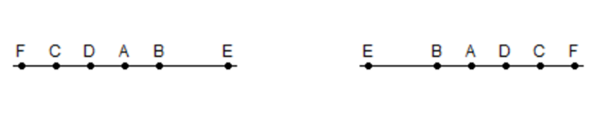

```{r setup, include=FALSE, echo = TRUE, tidy = TRUE}
library(knitr)
library(RRPP)
library(geomorph)
knitr::opts_chunk$set(echo = TRUE)


library(xaringanthemer)
style_mono_light()
```

### Week in Review: Overarching Goal

+ Our goals for the week were:
  + 1: Learn how to quantify anatomical shapes using points, curves, and surfaces
  + 2: Generate a set of shape variables from these data 
  + 3: Statistically evaluate hypotheses of shape variation and covariation using robust statistical methods

.pull-left[    
+ Accomplishing these goals required use of the **Procrustes Paradigm** 

```{r, echo = FALSE, fig.align = "center", out.width="90%"}
include_graphics("LectureData/01.Intro/GenGMProtocol.png")  
```
]

.pull-right[
+ This, then, **must** be coupled with **RRPP and effect size (Z-score) evaluation** for shape analysis: 

$$z =\frac{\log(F) - \mu_{\log(F)}}{\sigma_{\log(F)}}$$ 
]
---

### Recall the RRPP Procedure $^1$

+ For virtually all shape-based hypotheses, we used permutation procedures (RRPP). This is embodied as:

.pull-left[
1: Fit $\small\mathbf{X}_{R}$ for each $\small\mathbf{X}_{F}$; Estimate $\small\hat{\mathbf{Z}}_{R}$ and $\small\mathbf{E}_{R}$

2: Permute, $\small\mathbf{E}_{R}$: obtain pseudo-values as: $\small\mathbf{\mathcal{Z}} = \mathbf{\hat{Z}}_{R} + \mathbf{E}_{R}$

3: Fit $\small\mathbf{X}_{F}$ using $\small\mathbf{\mathcal{Z}}$: obtain coefficients and summary statistics

4: Calculate $\small{F}$-value in every random permutation (observed case counts as one permutation)

5: For $\small{n}$ permutations, $\small{P} = \frac{n(F_{random} \geq F_{obs})}{n}$
]
.pull-right[
6: Calculate *effect size* as a standard deviate of the observed value in a normalized distribution of random values (helps for comparing effects within and between models); i.e.:
$$\small{z} = \frac{
\log\left( F\right) - \mu_{\log\left(F\right)}
} {
 \sigma_{\log\left(F\right)}
}$$
where $\small\mu_{\log\left(F\right)}$ and $\sigma_{\log\left(F\right)}$ are the expected value and standard deviation from the sampling distribution, respectively.
]

.footnote[
1: Collyer et al. *Heredity.* (2015); Adams & Collyer. *Evolution.* (2016); Adams & Collyer. *Evolution.* (2018)

2: Important! RRPP is *not* constrained by *n:p* ratios and in fact is quite useful when $\small{n}\ll{p}$ (displays high power in such cases)
]
---

### Procrustes Paradigm and RRPP: Present Applications

What we learned this week: Procrustes + RRPP with effect sizes ( $Z$-scores) provides the tools to evaluate an inordinately large breadth of biological hypotheses related to shape variation.  A partial list includes:

+ 1: General linear model (GLM) questions: 
  + Do groups differ in shape (manova)?
  + Is there covariation between shape and a continuous variable (regression)?
  + Is there variation in shape across multiple effects (factorial models)?
  + Is there an association between shape & $\small\mathbf{X}$ while accounting for phylogeny (PGLS models)? 
+ 2: 'Advanced' GLM questions: 
  + Which groups differ in shape; which slopes differ in terms of shape covariation (pairwise comparisons)?
  + Do pairs of groups differ in their magnitude or direction of shape change (trajectory analysis)?
  + Are there differences in the degree of shape disparity (dispersion) among groups?

---
    
### Procrustes Paradigm and RRPP: Present Applications (Cont.)

+ 3: Covariation questions:
  + Does shape covary with another set of variables (partial least squares - PLS)?
  + Is the degree of covariation greater in one dataset than another (z-score comparisons)?
+ 4: Phylogenetic questions: 
  + What is the degree of phylogenetic signal in shape?
  + Does shape covary with other variables while accounting for phylogenetic relatedness (PGLS and P-PLS)?
  + Do rates of phenotypic shape evolution differ?
+ 5: GM-specific questions: 
  + Is there shape asymmetry? Is it directional or fluctuating? 
  + Is there modular signal in my data?  Integrated signal? 
  + Is the degree of modularity (or integration) greater in one dataset relative to another?
  + Are there allometric patterns of shape variation? 

###### NOTE: A huge advantage of what we learned this week is the visualization of patterns of shape variation (i.e., statistical plots), combined with visualizations of shape deformations (predicted values, group means, etc.)

---

### What's Left to Do?

+ Given the breadth of topics we covered, one might reasonably ask "In terms of theory, is there nothing left to do?"

+ That is to say, can one reasonably expect additional novel approaches to be developed going forward, that biologists can then use to address new and important questions?

--

+ We contend that the answer to this question is **YES**!!

+ While we do not know all possible avenues of future analytical research, we provide a few obvious areas for future work here
---

### 1: An Improved Procrustes Algorithm

+ Recall the workhorse of geometric morphometrics: the Generalized Procrustes Analysis (superimposition)
  + Translate all specimens to a common location
  + Scale all specimens to unit centroid size
  + Optimally rotate all specimens to minimize LS deviations
    
```{r echo=FALSE, eval=TRUE, fig.align = "center", out.width="35%"}
source('LectureData/plot.specimens/plot.Specimens.r')
lizards <- readland.nts('LectureData/04.shape.vars/lizards_LAT.nts')
links <- read.csv('LectureData/04.shape.vars/links.txt', header=FALSE, sep = " ")
liz.lab <- read.csv('LectureData/04.shape.vars/liz_groups.csv',header=TRUE, sep="\t")
col.gp <- rep("red",nrow(liz.lab))
col.gp[which(liz.lab$SEX=='M')] <- 'blue'

Y.gpa <- gpagen(lizards, print.progress = FALSE)
gdf <- geomorph.data.frame(Y.gpa, gp = col.gp)
n <- dim(lizards)[1];p <- dim(lizards)[2]
Yc <- simplify2array(lapply(1:dim(lizards)[3], function(j) geomorph:::fast.center(lizards[,,j],n,p)))
Yc.rot <- simplify2array(lapply(1:dim(lizards)[3], function(j)  Y.gpa$coords[,,j]*Y.gpa$Csize[[j]]))
par(mfrow=c(2,2)) 
x <- plot.specimens(lizards, links = links, col="dark gray")
mtext("Original Specimens")
x <- plot.specimens(Yc,links = links, col="dark gray")
mtext("Translated Specimens")
x <- plot.specimens(Yc.rot,links = links, col="dark gray")
mtext("Translated and Rotated Specimens")
x <- plot.specimens(Y.gpa$coords, links=links, col="dark gray")
mtext("GPA-Aligned Specimens")
par(mfrow=c(1,1)) 
```
---

### 1: An Improved Procrustes Algorithm

.pull-left[
+ Mathematically, GPA assumes that all landmarks are 'iid' (independent, and identically distributed) in terms of their error distribution

+ This implies that the values for each landmark of each specimen are derived from a circular normal distribution, which is independent landmark by landmark

+ Such an assumption is unrealistic
]

--

.pull-right[
+ For example, recall the 'Pinocchio effect'

```{r, echo = FALSE, fig.align = "center", out.width="80%"}
  include_graphics("LectureData/03.superimposition/GRF-Example.png")  
```

]

--

+ Here, some landmarks display greater variation than do others (and GRF was proposed to 'account' for this, via an ad-hoc procedure)

+ Also, consider the possibility that some landmarks are correlated with others (i.e., landmark changes are correlated)

+ Neither of these conditions is considered by GPA, as it is OLS (=unweighted)
---

### 1: Towards A Weighted Procrustes Algorithm

+ To this point (and for the past 25 years), we have conducted superimposition using GPA, which is an unweighted alignment

+ That is, one translates, rotates, and scales, using mean values

+ As implemented (and as described this week), these steps assume that all landmarks contribute equally during the alignment.

+ This is tantamount to including a $\mathbf{I}_{pk}$ identity matrix within the GPA algorithm

--

+ One could consider a 'weighted GPA' where the translation, rotation, and scale are performed relative to a landmark-coordinate covariance matrix (much like one performs OLS = unweighted regression versus PGLS =  phylogenetically-weighted regression)

+ The algebra for this is well-established statistically, but the 'weighting' covariance matrix in this case is highly singular, causing mathematical difficulties
---

### 1: Towards A Weighted Procrustes Algorithm

+ Some approximations have been proposed (e.g., Theobald and Wuttke 2006)

```{r, echo = FALSE, fig.align = "center", out.width="35%"}
include_graphics("LectureData/14.prospectus/WGPATheobald.png")  
```

+ Here (with simplifying assumptions), one can align protein structures allowing for different variation among landmarks, but with equal variation within (i.e., using a partitioned $\hat{\mathbf\Sigma}=\mathbf\Sigma_p\otimes\Sigma_k$)

+ We are currently developing a general algorithm for weighted GPA that relaxes all of these assumptions, and where the 'standard' GPA approach would be a special case algorithm
---

### 2: Integration and Modularity: A Spatial Perspective

+ The past decade has seen a wonderful resurgence of interest in modularity and integration

+ This has lead to the development of numerous approaches for *quantifying* such patterns

--

+ Recent work (Bookstein 2016) highlighted the need to explore integration across spatial scales 

+ This begs the question: should other (all?) patterns of integration and modularity among sub-units be evaluated relative to some 'null' expectation beyond that of the empirical sampling distribution derived from permuting landmarks into modules?

--

+ We contend that this is an important issue for future investigation

+ Our perspective is to consider the **spatial** proximity of landmarks in developing a null model for integration and modularity tests
---

### 2: Spatial Integration and Modularity

.pull-left[
+ In ecology, data obtained from different geographic localities is expected to covary due to their *spatial proximity*

+ In other words, geographically proximate locations are expected to be more similar, and covary more highly, than are geographically less proximate locations

```{r, echo = FALSE, fig.align = "center", out.width="50%"}
include_graphics("LectureData/14.prospectus/SpatialCov.png")  
```
]

--

.pull-right[
+ For morphometrics, **anatomical proximity** is akin to geographic proximity in spatial statistics

+ We contend that null models of integration and modularity should be **conditioned** on anatomical proximity; analogously to spatial proximity issues

```{r, echo = FALSE, fig.align = "center", out.width="65%"}
include_graphics("LectureData/14.prospectus/Mouse.png")  
```

+ We are presently developing integration and modularity methods that evaluate patterns relative to this anatomical proximity
]
---

### 3: Multivariate Model Comparison

+ The goal is to evaluate two or more models with different sets of parameters to determine if one is 'better' based on criteria quantifying the *fit* of the data to those models.

+ Procedurally, model fit is often obtained using likelihood, and models are compared using likelihood ratio tests, or indexing measures of penalized likelihood (e.g., AIC). 

+ The following univariate data provides a simple example: 

```{r, echo = FALSE, eval = TRUE, fig.align = "center", out.width="50%"}
data(Pupfish)
Pupfish$logSize <- log(Pupfish$CS)
pupfish.pc<-prcomp(Pupfish$coords)$x
gps<-factor(paste(Pupfish$Sex,Pupfish$Pop))
```

.pull-left[
```{r, echo = TRUE, eval = TRUE, fig.align = "center", out.width="50%"}
fit.0<-lm(Pupfish$logSize~1)
fit.S<-lm(Pupfish$logSize~Pupfish$Sex)
fit.P<-lm(Pupfish$logSize~Pupfish$Pop)
fit.SP<-lm(Pupfish$logSize~Pupfish$Sex+Pupfish$Pop)
fit.Full<-lm(Pupfish$logSize~Pupfish$Sex*Pupfish$Pop)
```
]

.pull-right[
```{r, echo = TRUE, eval = TRUE, fig.align = "center", out.width="50%"}
AIC(fit.0,fit.S,fit.P,fit.SP,fit.Full)
```
]

+ Based on AIC, the best model is $\small{Size}={Sex}+{Pop}$ 

---

### 3: Multivariate Model Comparison

+ Note we can confirm this result using likelihood ratio tests (anova), since most of these are nested models.

+ Unfortunately, while the above procedure potentially useful (for univariate data), this over-emphasizes the rank-order component of the process. That is, mentally we tend to think of models in a ranked list.  But is that how they are found in model space? 

.scrollable[
```{r, echo = TRUE, fig.align = "center", out.width="50%"}
anova(fit.Full)
```
]

---

### An Appeal to Geometry

+ This week we've emphasized the 'dual' of algebra and geometry.  Typical model comparison focuses on the algebra: the fitting of models, the summarizing of models, and the comparison of those summaries. But what about the geometric side? Can we also visualize model space?

+ Below are plots for univariate data: first plotted directly along the number line. Then, plotted as a PCoA from the Euclidean distances among points:

```{r, echo = FALSE, fig.align = "center", out.width = "80%"}
  
#a<-matrix(c(6 , 7 , 4 , 5 , 9 , 3))
#rownames(a)<-c("A","B","C","D","E","F")
#as.matrix(dist(a))
#PCoA<-cmdscale(dist(a),eig=TRUE)
#PCoA$eig

#par(mfcol = c(1,2))
#plot(a,rep(0,6), axes=FALSE, pch=21, bg="black", ann=F)
# abline(0,0)
# text(a,rep(0,6),pos=3, labels=rownames(a))
#plot(PCoA$points[,1],rep(0,6),axes=FALSE, pch=21, bg="black", ann=F)
#abline(0,0)
#text(PCoA$points[,1],rep(0,6),pos=3, labels=rownames(a))

```

+ Apart from axis reflection, the plots are the same.  Also, only the first axis contains any variation in the data. This is as it should be: the dimensionality of a data space is: $\small\min({p,(n-1)})$
---

### Visualizing Model Space

+ We conjecture that **the dimensionality of a model space is: $\small\min({p,(m-1)})$** where *p* is the dimensionality of the data space and *m* is the number of models under consideration.

+ For univariate data, model space is a single axis: models 'live' along the number line.  In this context, rank-ordered comparisons of models make sense: it is analogous to evaluating the distance between models.

+ However, for multivariate data, model space will have higher dimensions. Thus, model differences exist both in the *magnitude* and the *direction* in this space. If correct, it is entirely possible that evaluating only the magnitude of model difference (i.e., the typical notion of model comarison) is at best incomplete.  The question is whether these conjectures of model space are accurate. For that we need a method of visualizing model space.  

+ To arrive at a visualization of model space we need a summary measure comparing model fits, and one that is robust for high-dimensional data. 

+ **That is where RRPP can come in**
---

### Visualizing Model Space with RRPP

+ **CAVEAT**: The following is tentative and is not a fully developed approach! We are exploring the underlying theory and specific implementation of how RRPP and derived $\small{z}$-scores may be used in multivariate model comparison. Treat this as illustrative only. *MUCH IS YET TO BE DEVELOPED!!!*

+ Procedure
  + 1: Identify set of potential models (set of H~1~) and the null (H~0~)
  + 2: Obtain $\small{z}$-score for each H~1~ relative to H~0~ 
  + 3: Estimate pairwise $\small{z}$-tests across models following Adams and Collyer (2016, 2019)
  + 4: Assemble $\small{z}$-score matrix from 2 and 3     
  + 5: Use PCoA to visualize model space 
---

### RRPP Visualization of Model Space

+ Here are two examples: one univariate the other multivariate (both the pupfish data): 

```{r, echo = FALSE, fig.align = "center", out.width="35%"}
compare.Z <- function(...){
  dots <- list(...)
  if(length(dots) == 1) n <- length(dots[[1]]) else n <- length(dots)
  if(n == 1) stop("At least two objects are needed")
  if(length(dots) == 1) {
    list.names <- names(dots[[1]]) 
    dots <- lapply(1:n, function(j) dots[[1]][[j]])
    names(dots) <- list.names
  } else list.names <- names(dots)
  if(length(dots) < 2) stop("At least two objects are needed")
  is.anova.lm.rrpp <- function(x) class(x) == "anova.lm.rrpp"
  sdn <- function(x) sqrt(sum((x-mean(x))^2)/length(x))
  list.check <- sapply(1:length(dots), function(j) any(is.anova.lm.rrpp(dots[[j]])))
  if(any(list.check == FALSE)) stop("Not all objects are class anova.lm.rrpp")
  k <- length(list.check)
  if(is.null(list.names)) list.names <- as.list(substitute(list(...)))[-1L]
  k.combn <- combn(k,2)

  list.drs <- sapply(1:k, function(j) log(dots[[j]]$F) - mean(log(dots[[j]]$F[-1])))
  list.sds <- sapply(1:k, function(j) sdn(log(dots[[j]]$F[-1])))
  list.zs <- sapply(1:k, function(j) geomorph:::effect.size(log(dots[[j]]$F)))
  
  z12 <- sapply(1:ncol(k.combn), function(j){
    a <- k.combn[1,j]; b <- k.combn[2,j]
    r1 <- list.drs[a]; r2 <- list.drs[b]; sd1 <- list.sds[a]; sd2 <- list.sds[b]  
    abs(r1-r2)/sqrt(sd1^2+sd2^2)
  })
  z12.p <- sapply(1:length(z12), function(j) 1-pnorm(z12[[j]]))
  d <- rep(0,k); names(d) <- list.names
  D <-dist(d)
  z12.pw <- p12.pw <- D
  for(i in 1:length(z12)) z12.pw[i] <-z12[i]
  for(i in 1:length(z12)) p12.pw[i] <-z12.p[i]
  names(list.zs) <- names(list.sds) <-list.names
  pairwise.z <- as.matrix(z12.pw)
  pairwise.P <- as.matrix(p12.pw)
  diag(pairwise.P) <- 1
  
  out <- list(sample.z = list.zs,
              sample.r.sd.pk.stand = list.sds,
              pairwise.z = pairwise.z,
              pairwise.P = pairwise.P)
  class(out) <- "compare.Z"
  out
}

#Univariate
fit.0<-lm.rrpp(logSize~1, SS.type = "I", data = Pupfish, print.progress = FALSE)
fit.S<-lm.rrpp(logSize~Sex, SS.type = "I", data = Pupfish, print.progress = FALSE)
fit.P<-lm.rrpp(logSize~Pop, SS.type = "I", data = Pupfish, print.progress = FALSE)
fit.SP<-lm.rrpp(logSize~Sex+Pop, SS.type = "I", data = Pupfish, print.progress = FALSE)
fit.Full<-lm.rrpp(logSize~Sex*Pop, SS.type = "I", data = Pupfish, print.progress = FALSE)

Z.S<-anova(fit.0,fit.S,print.progress=FALSE)
Z.P<-anova(fit.0,fit.P,print.progress=FALSE)
Z.SP<-anova(fit.0,fit.SP,print.progress=FALSE)
Z.Full<-anova(fit.0,fit.Full,print.progress=FALSE)
res.Z<-compare.Z(list(Z.S,Z.P,Z.SP, Z.Full))

Z.U<-diag(0,5)
Z.U[1,]<-Z.U[,1]<-c(0,res.Z$sample.z)
Z.U[2:5,2:5]<-res.Z$pairwise.z
PCoA.U<-cmdscale(as.dist(Z.U),eig = TRUE)

#Multivariate
fit.0<-lm.rrpp(coords~1, SS.type = "I", data = Pupfish, print.progress = FALSE)
fit.S<-lm.rrpp(coords~Sex, SS.type = "I", data = Pupfish, print.progress = FALSE)
fit.P<-lm.rrpp(coords~Pop, SS.type = "I", data = Pupfish, print.progress = FALSE)
fit.SP<-lm.rrpp(coords~Sex+Pop, SS.type = "I", data = Pupfish, print.progress = FALSE)
fit.Full<-lm.rrpp(coords~Sex*Pop, SS.type = "I", data = Pupfish, print.progress = FALSE)

Z.S<-anova(fit.0,fit.S,print.progress=FALSE)
Z.P<-anova(fit.0,fit.P,print.progress=FALSE)
Z.SP<-anova(fit.0,fit.SP,print.progress=FALSE)
Z.Full<-anova(fit.0,fit.Full,print.progress=FALSE)
res.Z<-compare.Z(list(Z.S,Z.P,Z.SP, Z.Full))

Z.M<-diag(0,5)
Z.M[1,]<-Z.M[,1]<-c(0,res.Z$sample.z)
Z.M[2:5,2:5]<-res.Z$pairwise.z
PCoA.M<-cmdscale(as.dist(Z.M),eig = TRUE)

#Plots
par(mfcol = c(1, 2))
names<-c("H0", "Z.S","Z.P","Z.SP","Z.Full")
plot(PCoA.U$points, pch=21, bg="black", asp=1, cex=2, xlab="Model Space Axis 1", ylab="Model Space Axis 2")
text(PCoA.U$points,pos=3, labels=names)

plot(PCoA.M$points, pch=21, bg="black", asp=1, cex=2, xlab="Model Space Axis 1", ylab="Model Space Axis 2")
text(PCoA.M$points,pos=3, labels=names)
```

+ Both plots show model spaces, and each includes the null model (H~0~) against which the models are compared. Models further from H~0~ provide a better fit to the data.  **How that is to be formally evaluated has yet to be determined!!**
---

### Unknowns: RRPP Approach to Model Comparisons

+ Obviously the concept of using $\small{z}$-scores from RRPP for model comparison is exciting. However, considerable theoretical research is required to verify the approach, and the steps in its implementation. A partial list includes: 
  +  1: Can we obtain a metric distance measure from $\small{z}$-scores?  The difference matrix used here is not metric, as there were negative eigenvalues. Having a metric distance for $\small{z}$-scores would allow one to confirm the conjecture as to the dimensionality of model space. 
  + 2: What summary measures are used to statistically identify the best model? The $\small{z}$-test of Adams and Collyer (2016) *Evol.* could be considered, but if appropriate this would capture the magnitude of difference only.
  + 3: What is the meaning of different directions in model space, and can one devise a summary test measure for comparing model directionality relative to H~0~? Obviously this question depends upon devising a $\small{z}$-score metric, as interpretation of directions requires a metric space 
  + 4: Does the method generalize to GLS, or is it OLS specific? 

+ **Clearly, there is considerable work left to do, but the initial concept of using $\small{z}$-scores from RRPP for model comparison is promising!** *Stay tuned...*
