```{r setup, include=FALSE, echo = TRUE, tidy = TRUE}
library(knitr)
library(RRPP)
library(geomorph)
library(phytools)
knitr::opts_chunk$set(echo = TRUE)


library(xaringanthemer)
style_mono_light()
```

### Week in Review: Overarching Goal

+ Our goals for the week were:
  + 1: Learn how to quantify anatomical shapes using points, curves, and surfaces
  + 2: Generate a set of shape variables from these data 
  + 3: Statistically evaluate hypotheses of shape variation and covariation using robust statistical methods

.pull-left[    
+ Accomplishing these goals required use of the **Procrustes Paradigm** 

```{r, echo = FALSE, fig.align = "center", out.width="90%"}
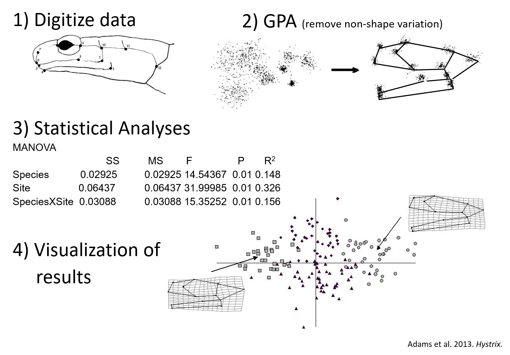  
```
]

.pull-right[
+ This, then, **must** be coupled with **RRPP and effect size (Z-score) evaluation** for shape analysis: 

$$z =\frac{\log(F) - \mu_{\log(F)}}{\sigma_{\log(F)}}$$ 
]
---

### Recall the RRPP Procedure $^1$

+ For virtually all shape-based hypotheses, we used permutation procedures (RRPP). This is embodied as:

.pull-left[
1: Fit $\small\mathbf{X}_{R}$ for each $\small\mathbf{X}_{F}$; Estimate $\small\hat{\mathbf{Z}}_{R}$ and $\small\mathbf{E}_{R}$

2: Permute, $\small\mathbf{E}_{R}$: obtain pseudo-values as: $\small\mathbf{\mathcal{Z}} = \mathbf{\hat{Z}}_{R} + \mathbf{E}_{R}$

3: Fit $\small\mathbf{X}_{F}$ using $\small\mathbf{\mathcal{Z}}$: obtain coefficients and summary statistics

4: Calculate $\small{F}$-value (or other test statistic) in every random permutation (observed case counts as one permutation)

5: For $\small{n}$ permutations, $\small{P} = \frac{n(F_{random} \geq F_{obs})}{n}$
]
.pull-right[
6: Calculate *effect size* as a standard deviate of the observed value in a normalized distribution of random values (helps for comparing effects within and between models); i.e.:
$$\small{z} = \frac{
\log\left( F\right) - \mu_{\log\left(F\right)}
} {
 \sigma_{\log\left(F\right)}
}$$
where $\small\mu_{\log\left(F\right)}$ and $\sigma_{\log\left(F\right)}$ are the expected value and standard deviation from the sampling distribution, respectively.
]

.footnote[
1: Collyer et al. *Heredity.* (2015); Adams & Collyer. *Evolution.* (2016); Adams & Collyer. *Evolution.* (2018)

2: Important! RRPP is *not* constrained by *n:p* ratios and in fact is quite useful when $\small{n}\ll{p}$ (displays high power in such cases)
]
---

### Procrustes Paradigm and RRPP: Present Applications

What we learned this week: Procrustes + RRPP with effect sizes ( $Z$-scores) provides the tools to evaluate an inordinately large breadth of biological hypotheses related to shape variation.  A partial list includes:

+ 1: General linear model (GLM) questions: 
  + Do groups differ in shape (manova)?
  + Is there covariation between shape and a continuous variable (regression)?
  + Is there variation in shape across multiple effects (factorial models)?
  + Is there an association between shape & $\small\mathbf{X}$ while accounting for phylogeny (PGLS models)? 
+ 2: 'Advanced' GLM questions: 
  + Which groups differ in shape; which slopes differ in terms of shape covariation (pairwise comparisons)?
  + Do pairs of groups differ in their magnitude or direction of shape change (trajectory analysis)?
  + Are there differences in the degree of shape disparity (dispersion) among groups?

---
    
### Procrustes Paradigm and RRPP: Present Applications (Cont.)

+ 3: Covariation questions:
  + Does shape covary with another set of variables (partial least squares - PLS)?
  + Is the degree of covariation greater in one dataset than another (z-score comparisons)?
+ 4: Phylogenetic questions: 
  + What is the degree of phylogenetic signal in shape?
  + Does shape covary with other variables while accounting for phylogenetic relatedness (PGLS and P-PLS)?
  + Do rates of phenotypic shape evolution differ?
+ 5: GM-specific questions: 
  + Is there shape asymmetry? Is it directional or fluctuating? 
  + For repeated shapes, is measurement error a concern?
  + Is there modular signal in my data?  Integrated signal? 
  + Is the degree of modularity (or integration) greater in one dataset relative to another?
  + Are there allometric patterns of shape variation? 

###### NOTE: A huge advantage of what we learned this week is the visualization of patterns of shape variation (i.e., statistical plots), combined with visualizations of shape deformations (predicted values, group means, etc.)

---

### What's Left to Do?

+ Given the breadth of topics we covered, one might reasonably ask "In terms of theory, is there anything left to do?"

+ Can empiricists expect additional novel approaches to be developed going forward, that help biologists address new and important questions?

--

+ We argue the answer to this question is **YES**!!

+ Here are some recent '*Up and Coming*' methods from Dean and Mike, as well as our musings on other possible areas of future work
---

### Current 1: Integration/Modularity: the 'Superimposition Effect'

+ GPA optimally aligns all objects to the mean shape
  + However, some covariation is induced by this process

```{r echo = FALSE, fig.align = "center", eval=TRUE,out.width="90%"}
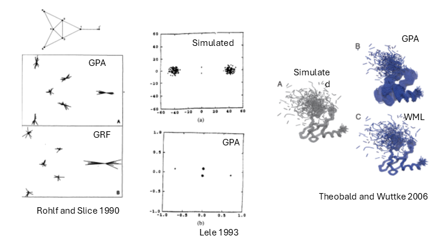
```

---

### Current 1: Superimposition Effect: A Well Known Example

+ GPA optimally aligns all objects to the mean shape
  + However, some covariation within/among landmarks is induced by this process

```{r echo = FALSE, fig.align = "center", eval=TRUE,out.width="90%"}
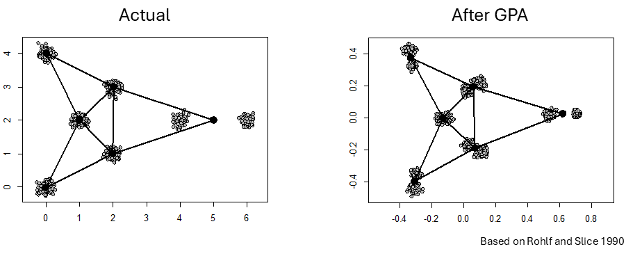
```

This is often referred to as the "Procrustes Problem"

---

### Current 1: Superimposition Effect: Challenges and Questions

+ GPA induces some covariation within/among landmark coordinates
  + This is present in $\hat{\mathbf\Sigma}$, along with biological covariation

+ This can impact tests of integration and modularity, which are based on $\hat{\mathbf\Sigma}$ (see Cardini 2019; Zelditch and Swiderski 2023)

+ Some have proposed 'solutions' (e.g, separate GPA on each subset) but methods not verified

+ Open questions

1: Is it really a Procrustes effect?
2: Are proposed solutions sufficient?
3: If not, what can we do about it?

---

### Current 1: Superimposition Effect: Digging Deeper

+ Simulate isotropic triangles and align with differing methods

```{r echo = FALSE, fig.align = "center", eval=TRUE,out.width="40%"}
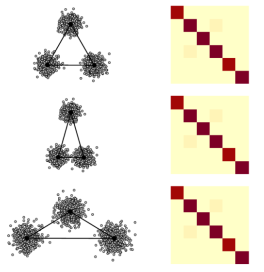
```

---

### Current 1: Superimposition Effect: It's not a Procrustes Problem

+ *ALL* superimposition procedures induce covariation

```{r echo = FALSE, fig.align = "center", eval=TRUE,out.width="40%"}
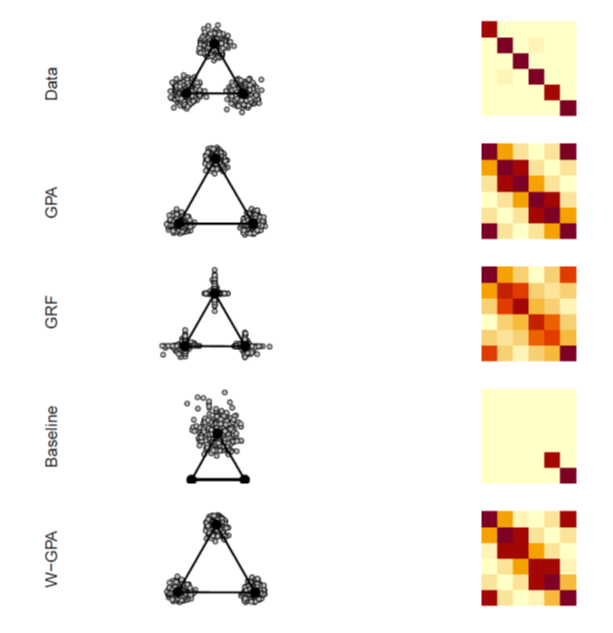
```

---

### Current 1: Superimposition Effect: The Mean Shape Matters

+ The mean shape affects the pattern

```{r echo = FALSE, fig.align = "center", eval=TRUE,out.width="90%"}
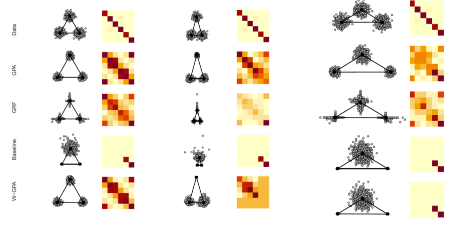
```

---

### Current 1: Superimposition Effect

+ Separate subsets is not the solution

```{r echo = FALSE, fig.align = "center", eval=TRUE,out.width="90%"}
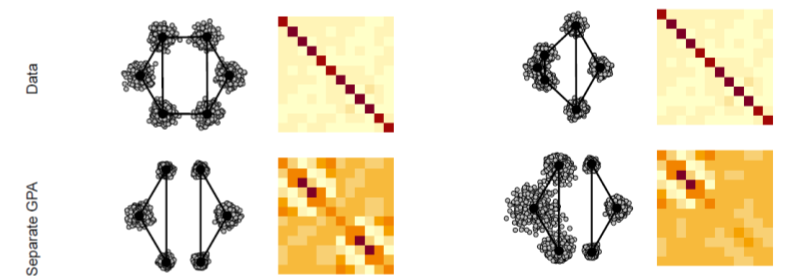
```

---

### Current 1: Superimposition Effect: Solutions

+ We are developing new procedures to account for the superimposition effect when evaluating integration and modularity

1: Estimate the 'geometric null' effect ($c\mathbf{P}$) based solely on the mean shape and the overall variation expressed in $\hat{\mathbf\Sigma}$
  + $\mathbf{P}$ is a projection matrix derived from a set of orthogonal vectors describing translation, rotation, and scale based on the mean shape

2: The matrix of deviations ($\mathbf{E}=\hat{\mathbf\Sigma} - c\mathbf{P}$) describes the residual (biological) covariation not induced by superimposition

3: Tests of integration and modularity are performed on $\mathbf{E}$

+ Method currently in development (initial simulations are promising)
---

### Current 2: Multivariate linear mixed models

**What is a linear mixed model?**
+ A linear mixed model is two linear models in one.
  + Model, $\mathbf{X}$, with estimated **fixed effects**, $\mathbf{B}$
  + Model, $\mathbf{M}$, with estimated **random effects**, $\mathbf{U}$
  + Effects are estimated ***.blue[simultaneously]*** with ML or REML.
  + Random effects can alter either intercepts or slopes for continuous covariates, based on individual subjects, which are  often nested within fixed groups (hierarchical)

Here is the algebra for univariate data.  Note that: $\boldsymbol\Omega^{-1}_A = \boldsymbol{\Lambda_A\Lambda_A}^T$ for GLS estimation among subjects and $\boldsymbol\Omega^{-1}_W = \boldsymbol{\Lambda_W\Lambda_W}^T$ for ML or REML estimation within subjects.

$$
\begin{pmatrix} \boldsymbol{\Lambda}_A^T\textbf{X}^T\textbf{X}\boldsymbol{\Lambda}_A &  \boldsymbol{\Lambda}_A^T\textbf{X}^T\textbf{M}\boldsymbol{\Lambda}_W \end{pmatrix}\textbf{b} = 
\begin{pmatrix} \boldsymbol{\Lambda}_A^T\textbf{X}^T\textbf{z} \end{pmatrix}
$$

and 

$$
\begin{pmatrix} \boldsymbol{\Lambda}_W^T\textbf{M}^T\textbf{X}\boldsymbol{\Lambda}_A & \boldsymbol{\Lambda}_W^T\textbf{M}^T\textbf{M}\boldsymbol{\Lambda}_W + \textbf{I} \end{pmatrix} \textbf{u} = 
\begin{pmatrix}  \boldsymbol{\Lambda}_W^T\textbf{M}^T\textbf{z} \end{pmatrix}.
$$

---

### Current 2: Multivariate linear mixed models

$$
\begin{pmatrix} \boldsymbol{\Lambda}_A^T\textbf{X}^T\textbf{X}\boldsymbol{\Lambda}_A &  \boldsymbol{\Lambda}_A^T\textbf{X}^T\textbf{M}\boldsymbol{\Lambda}_W \end{pmatrix}\textbf{b} = 
\begin{pmatrix} \boldsymbol{\Lambda}_A^T\textbf{X}^T\textbf{z} \end{pmatrix}
$$

and 

$$
\begin{pmatrix} \boldsymbol{\Lambda}_W^T\textbf{M}^T\textbf{X}\boldsymbol{\Lambda}_A & \boldsymbol{\Lambda}_W^T\textbf{M}^T\textbf{M}\boldsymbol{\Lambda}_W + \textbf{I} \end{pmatrix} \textbf{u} = 
\begin{pmatrix}  \boldsymbol{\Lambda}_W^T\textbf{M}^T\textbf{z} \end{pmatrix}.
$$

Note that in the equations above, $\textbf{X}$, $\textbf{M}$, $\boldsymbol{\Lambda}_A$, and $\boldsymbol{\Lambda}_W$ exists in both.  $\boldsymbol{\Lambda}_A$ is theoretical (like in PGLS); $\boldsymbol{\Lambda}_W$ is solved via ML or REML, ***.blue[simultaneously]***.  We can simplify this, as follows:

$$ 
\mathbf{F} \mathbf{b} = \mathcal{F}\mathbf{z} 
$$
and

$$
\mathbf{R} \mathbf{u} = \mathcal{R}\mathbf{z} 
$$
where, $\mathbf{F}$ and $\mathcal{F}$ refer to fixed matrix components and $\mathbf{R}$ and $\mathcal{R}$ refer to random matrix components. 

.red[For multivariate generalization, there are two options!]

---

### Current 2: Multivariate linear mixed models

$$ 
\mathbf{F} \mathbf{b} = \mathcal{F}\mathbf{z} 
$$
and

$$
\mathbf{R} \mathbf{u} = \mathcal{R}\mathbf{z} 
$$
where, $\mathbf{F}$ and $\mathcal{F}$ refer to fixed matrix components and $\mathbf{R}$ and $\mathcal{R}$ refer to random matrix components. 

.red[For multivariate generalization, there are two options!]

1. Find $p$ unique solutions for the $p$ vectors in $\mathbf{Z}$ **(time-consuming!!)**
2. Find
$$ 
\mathbf{F} \mathbf{B} = \mathcal{F}\mathbf{Z} 
$$
and

$$
\mathbf{R} \mathbf{U} = \mathcal{R}\mathbf{Z} 
$$

using a single set of parameters, $\boldsymbol{\Lambda}_W$ **(efficient!!)**
---

### Current 2: Multivariate linear mixed models

How would we find this?? $\boldsymbol{\Lambda}_W$ 

+ This has not been explored!  Not even slightly!
+ Could develop new likelihood equations with *vectorized* $\mathbf{Z}$ that find some solution that exists somewhere between $\mathbf{I} \otimes \mathbf{R}$ or a similar matrix with potentially $p$ unique $\mathbf{R}$ matrices...
  + With hundreds or thousands of variables, this would be so computationally intense that is is rendered practically useless!
+ Could develop theoretical justification for a single $\boldsymbol{\Lambda}_W$ matrix, thus a single $\mathbf{R}$ matrix.
  + But how??
  
+ We have an idea for an algorithm:

  1. Solve, $\mathbf{AZ} = \mathbf{UDV}^T$, with $\mathbf{A} =\mathbf{\tilde{H}}$.
  2. Project data onto major axis, $\mathbf{p} = \mathbf{Zv}_1$.
  3. Use $\mathbf{p}$ to find univariate **best surrogate** for multivariate data, to solve parameters in $\boldsymbol{\Lambda}_W$.

---

### Current 2: Multivariate linear mixed models

**How to determine robustness?**

Statistical research that varies unique $\boldsymbol{\Lambda}_W$ for single variables that could be compiled into a multivariate data set.  Measurement error between estimates using unique $\boldsymbol{\Lambda}_W$ and a surrogate $\boldsymbol{\Lambda}_W$, applied to all variables, will determine efficacy.

***We are on it!***

---

### Future 1: An Improved Procrustes Algorithm

+ Recall the workhorse of geometric morphometrics: the Generalized Procrustes Analysis (superimposition)
  + Translate all specimens to a common location
  + Scale all specimens to unit centroid size
  + Optimally rotate all specimens to minimize LS deviations
    
```{r echo=FALSE, eval=TRUE, fig.align = "center", out.width="35%"}
source('LectureData/plot.specimens/plot.Specimens.r')
lizards <- readland.nts('LectureData/04.shape.vars/lizards_LAT.nts')
links <- read.csv('LectureData/04.shape.vars/links.txt', header=FALSE, sep = " ")
liz.lab <- read.csv('LectureData/04.shape.vars/liz_groups.csv',header=TRUE, sep="\t")
col.gp <- rep("red",nrow(liz.lab))
col.gp[which(liz.lab$SEX=='M')] <- 'blue'

Y.gpa <- gpagen(lizards, print.progress = FALSE)
gdf <- geomorph.data.frame(Y.gpa, gp = col.gp)
n <- dim(lizards)[1];p <- dim(lizards)[2]
Yc <- simplify2array(lapply(1:dim(lizards)[3], function(j) geomorph:::fast.center(lizards[,,j],n,p)))
Yc.rot <- simplify2array(lapply(1:dim(lizards)[3], function(j)  Y.gpa$coords[,,j]*Y.gpa$Csize[[j]]))
par(mfrow=c(2,2)) 
x <- plot.specimens(lizards, links = links, col="dark gray")
mtext("Original Specimens")
x <- plot.specimens(Yc,links = links, col="dark gray")
mtext("Translated Specimens")
x <- plot.specimens(Yc.rot,links = links, col="dark gray")
mtext("Translated and Rotated Specimens")
x <- plot.specimens(Y.gpa$coords, links=links, col="dark gray")
mtext("GPA-Aligned Specimens")
par(mfrow=c(1,1)) 
```
---

### Future 1: An Improved Procrustes Algorithm

.pull-left[
+ Mathematically, GPA assumes that all landmarks are 'iid' (independent, and identically distributed) in terms of their error distribution

+ This implies that the values for each landmark of each specimen are derived from a circular normal distribution, which is independent landmark by landmark

+ Such an assumption is unrealistic
]

--

.pull-right[
+ For example, recall the 'Pinocchio effect'

```{r, echo = FALSE, fig.align = "center", out.width="80%"}
  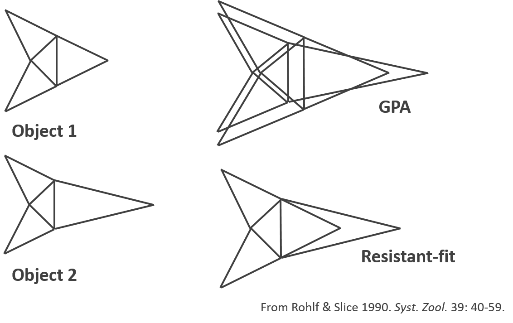  
```

]

--

+ Here, some landmarks display greater variation than do others (and GRF was proposed to 'account' for this, via an ad-hoc procedure)

+ Also, consider the possibility that some landmarks are correlated with others (i.e., landmark changes are correlated)

+ Neither of these conditions is considered by GPA, as it is OLS (=unweighted)
---

### Future 1: Towards A Weighted Procrustes Algorithm

+ To this point (and for the past 35 years), we have conducted superimposition using GPA, which is an unweighted alignment

+ That is, one translates, rotates, and scales, using mean values

+ As implemented (and as described this week), these steps assume that all landmarks contribute equally during the alignment.

+ This is tantamount to including a $\mathbf{I}_{pk}$ identity matrix within the GPA algorithm

--

+ One could consider a 'weighted GPA' where the translation, rotation, and scale are performed relative to a landmark-coordinate covariance matrix (much like one performs OLS = unweighted regression versus PGLS =  phylogenetically-weighted regression)

+ The algebra for this is well-established statistically, but the 'weighting' covariance matrix in this case is highly singular, causing mathematical difficulties
---

### Future 1: Towards A Weighted Procrustes Algorithm

.pull-left[
+ Some approximations have been proposed (e.g., Theobald and Wuttke 2006)

```{r, echo = FALSE, fig.align = "center", out.width="80%"}
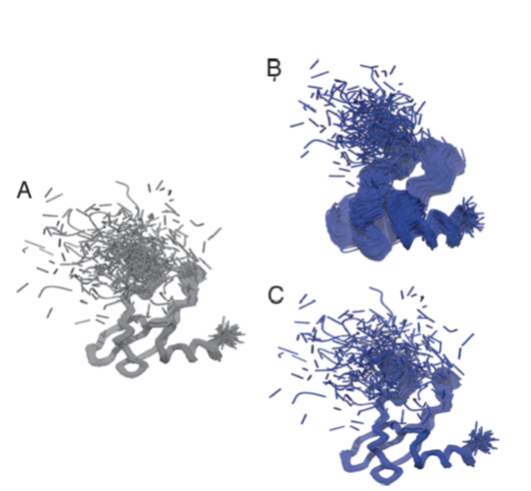  
```
]
.pull-right[
+ Here (with simplifying assumptions), one can align protein structures allowing for different variation among landmarks, but with equal variation within (i.e., using a partitioned $\hat{\mathbf\Sigma}=\mathbf\Sigma_p\otimes\Sigma_k$)

+ We are currently developing a general algorithm for weighted GPA that relaxes all of these assumptions, and where the 'standard' GPA approach would be a special case algorithm
]
---

### Future 2: Integration and Modularity: A Spatial Perspective

+ The past decade has seen a wonderful resurgence of interest in modularity and integration

+ This has lead to the development of numerous approaches for *quantifying* such patterns

--

+ Recent work (Bookstein 2016) highlighted the need to explore integration across spatial scales 

+ This begs the question: should other (all?) patterns of integration and modularity among sub-units be evaluated relative to some 'null' expectation beyond that of the empirical sampling distribution derived from permuting landmarks into modules?

--

+ We contend that this is an important issue for future investigation

+ Our perspective is to consider the **spatial** proximity of landmarks in developing a null model for integration and modularity tests
---

### Future 2: Spatial Integration and Modularity

.pull-left[
+ In ecology, data obtained from different geographic localities is expected to covary due to their *spatial proximity*

+ In other words, geographically proximate locations are expected to be more similar, and covary more highly, than are geographically less proximate locations

```{r, echo = FALSE, fig.align = "center", out.width="50%"}
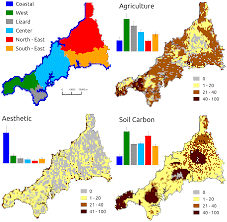  
```
]

--

.pull-right[
+ For morphometrics, **anatomical proximity** is akin to geographic proximity in spatial statistics

+ We contend that null models of integration and modularity should be **conditioned** on anatomical proximity; analogously to spatial proximity issues

```{r, echo = FALSE, fig.align = "center", out.width="65%"}
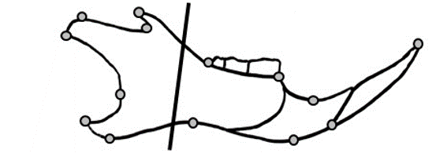  
```

+ We are presently developing integration and modularity methods that evaluate patterns relative to this anatomical proximity
]
---


### Future 2: Spatial Integration and Modularity

.pull-left[
+ There are additional challenges with integration and modularity
    + **Visualizing modularity**

.center[
```{r, echo=FALSE, out.width="30%"}
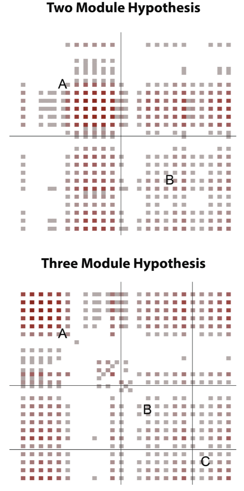 
```

**Module Maps**
]
]

.pull.right[
.center[
```{r, echo=FALSE, out.width="30%"}
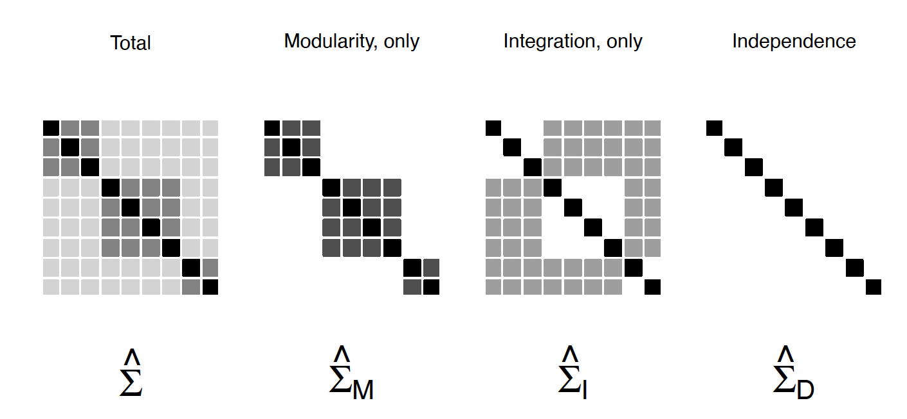 
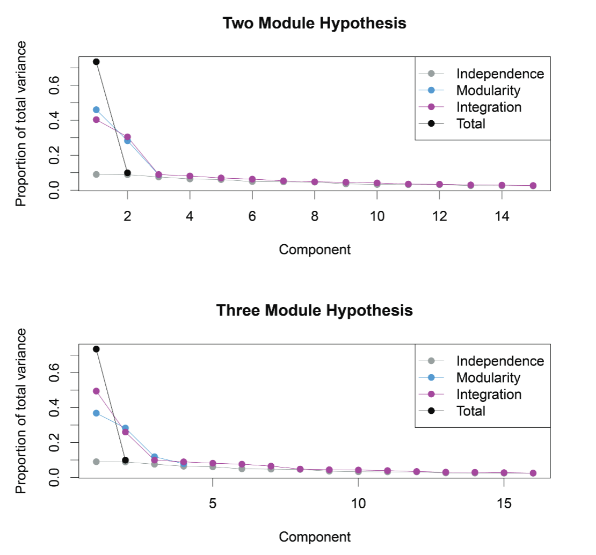 

```

**Module Eigenanalysis**
]]

###### Burns et al. (2023) *Evolution*.
---

### Future 2: Spatial Integration and Modularity

.pull-left[
+ There are additional challenges with integration and modularity
    + Visualizing modularity
    + **Alternative modular hypotheses**
  
.remark-code[It is possible to simulate many partitionings of the same covariance matrix into *K* modules.  Performing **module eigenanalysis** allows a distribution of modular strength to be made.  One can evaluate the strength of modularity in this distribution.  
]]

.pull-right[
.center[
```{r, echo=FALSE, out.width="90%"}
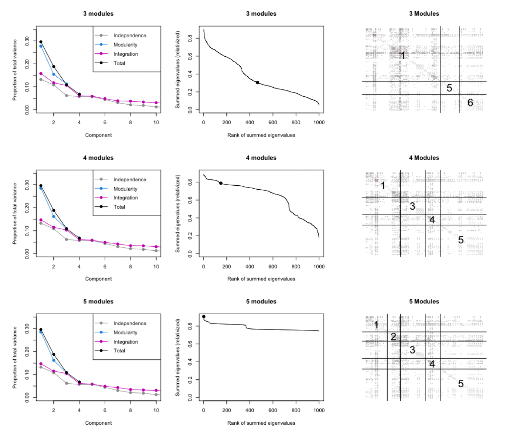 

```

**K-module analysis**
]]


---

### Future 3: Multivariate Model Comparison

+ The goal is to evaluate two or more models with different sets of parameters to determine if one is 'better' based on criteria quantifying the *fit* of the data to those models.

+ Procedurally, model fit is often obtained using likelihood:

$$\mathcal{L}(\hat{\beta}|\textbf{y}) = \frac{e^{-\frac{1}{2}( \textbf{y} - \mathbf{X}\hat\beta)^T\hat{\boldsymbol{\Sigma}}^{-1} ( \textbf{y} - \mathbf{X}\hat\beta)}}{\sqrt{2\pi^{np}|\hat{\boldsymbol{\Sigma}}|}}$$
+ Likelihood ratio tests are then performed to compare models

$$-2\lambda_{LR}= -2*\frac{\mathcal{L}(\hat{\beta}_0|\textbf{y})}{\mathcal{L}(\hat{\beta}_1|\textbf{y})} \sim\chi^2$$

--

+ LRT-based hypothesis testing is what we've used throughout this workshop to evaluate linear models 

+ Possible shortcomings include: 
  + Model overfitting (improper application can lead one to infer that an overly complicated model is best)
  + LRT is commonly not used for non-nested models (though it can be: Vuong 1989; Lewis et al. 2011)


---

### Future 3: Multivariate Model Comparison

+ Models are also compared using indexing measures of penalized likelihood (e.g., AIC).

$$AIC = -2\mathcal{L}(\hat{\beta}|\textbf{y}) + 2[pk+0.5p(p+1)]$$

+ Lower AIC values represent preferred models, with a cut-off typically stated as $\small\Delta_{AIC} > 4$ (for *univariate* data)

--

+ AIC (and similar) measures represent a 'balance' between model fit and the number of parameters used

+ They are related to Kullback–Leibler information theory, and are a sort of 'distance'

+ Note that for multivariate data, the parameter penalty can become quite 'heavy')


---

### Model Comparison via RRPP-Based Effect Sizes

+ One can combine the strengths of LRT and AIC via RRPP-based effect sizes

  + For each candidate model, $\mathcal{L}(\hat{\beta}|\textbf{y})$ can be obtained
  + RRPP may be used to generate an empirical sampling distribution of $\mathcal{L}(\hat{\beta}|\textbf{y})$
  + An effect size, $Z$-score, may be calculated for each model

--

+ Larger $Z$-scores imply a stronger strength of signal for that model

+ This is akin to a 'distance' of the candidate model relative to an intercept model: $Z \sim 1$
+ The model with the largest $Z$-score is the best model
+ NOTE: one can also perform two-sample comparisons of effect sizes (sensu Adams and Collyer 2016; 2019) to compare models

---

### Future 3: Multivariate Model Comparison: Example

+ Here is a simple (univariate: snake head size: CS) example using AIC: 

```{r, echo = FALSE, eval = TRUE, fig.align = "center", out.width="50%"}
snake<-read.csv("LectureData/14.prospectus/13-snake.csv",header=T)
site<-as.factor(snake[,1])
region<-as.factor(snake[,2])
sex<-as.factor(snake[,3])
svl<-snake[,4]
hs<-snake[,5] # hs= head size, calculated as centroid size from lm
rdf <- data.frame(svl = svl, hs = hs, sex = sex, site = site, region = region)
```

.pull-left[
```{r, echo = TRUE, eval = TRUE, fig.align = "center", out.width="50%"}
f.0 <- lm.rrpp(hs ~ 1, data = rdf)
f.svl <- lm.rrpp(hs ~ svl, data = rdf)
f.sex <- lm.rrpp(hs ~ sex, data = rdf)
f.reg <- lm.rrpp(hs ~ region, data = rdf)
f.svl.reg <- lm.rrpp(hs ~ svl + region, data = rdf, SS.type = "II")
f.svl.by.reg <- lm.rrpp(hs ~ svl * region, data = rdf, SS.type = "II")
```
]

.pull-right[
```{r, echo = TRUE, eval = TRUE, fig.align = "center", out.width="50%"}
model.comparison(f.0, f.svl, f.sex, f.reg, f.svl.reg, f.svl.by.reg, type = "logLik")
```
]

+ Based on AIC, the best model is $\small{Size}={Sex}+{Region}$ 

---

### Future 3: Multivariate Model Comparison: Example

+ Using likelihood ratio tests (anova), this model is also preferred

.scrollable[
```{r, echo = TRUE, fig.align = "center", out.width="50%"}
anova(f.svl.by.reg)
```
]

---

### Future 3: Multivariate Model Comparison: Example

+ And now let's look at the effect sizes of the models:

```{r, echo = TRUE, eval = TRUE, fig.align = "center", out.width="50%"}
model.comparison(f.0, f.svl, f.sex, f.reg, f.svl.reg, f.svl.by.reg, type = "Z")
```

+ Again in this case, the model with the strongest signal is $\small{Size}={Sex}+{Region}$ 

+ **Clearly, there is considerable work left to do to verify this new theoretical procedure, but the initial concept of using $Z$-scores from RRPP for model comparison is promising!** *Stay tuned...*


