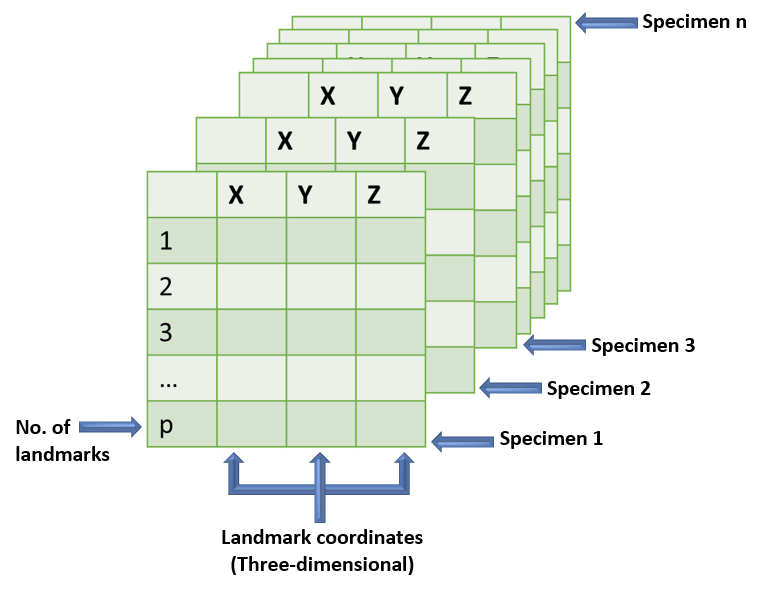
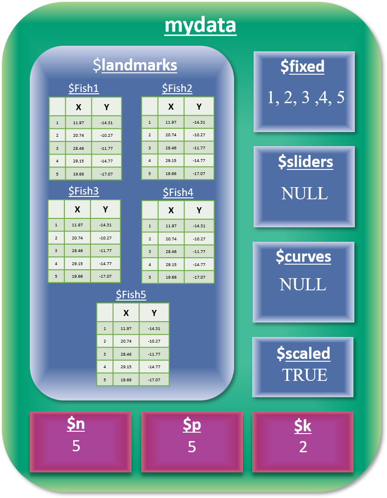

```{r, echo=F}
#knitr::read_chunk("scripts/Index.R")
knitr::opts_chunk$set(dev.args=list(bg = 'transparent'), fig.align = 'center', class.source = ".custom-inline", class.output = ".custom-inline")
```

Morphometric analyses in `geomorph` are frequently performed on two-dimensional or three-dimensional landmark data. However, other types of data can be analyzed using functions found in `geomorph`, and therefore there are multiple data structures that the user should be familiar with.

<br></br>

## **Three-dimensional Arrays**

<div style="float:right;position: relative; top:-30px; left: 20px">

<style>
figure {
  text-align: center;
}
</style>

<figure>
    
    <figcaption>Figure 1. Three Dimensional Array</figcaption>
</figure>

</div>

One of the most common data types used in `geomorph` functions is the three-dimensional array. This is a volumetric matrix, meaning that it contains multiple distinct specimens - with the possibility of attaching names to those specimens - as well as landmark data. This is best illustrated as a stack of cards, as shown in Figure 1. Each specimen (card) is a matrix containing $p$ landmarks in three dimensions (x, y, z). The array itself consists of nested $n$ specimens, that can be accessed separately, or acted upon collectively. For more information on this data type, visit the [All About Arrays]() tutorial.

<br></br>


## **Two-dimensional Matrix**

Some functions in `geomorph` can also be run with landmark data in a 2D matrix format. In terms of structure, a 2d matrix is a matrix of $n$ rows and $p x k$ columns, as if all of the specimen "cards" that are stacked in a 3D array (Figure 1) are laid out next to one another in a single horizontal line. Therefore, each row of a 2D matrix contains coordinates for $one$ $landmark$ for every specimen in the dataset. To put it another way, the first three columns of a 2D matrix contain the xyz coordinates of each three-dimensional landmark (by row) of the first specimen in a dataset. This format is most useful, however, when one wishes to incorporate other morphological data aside from landmarks. Data (including 3D arrays) can be coerced into this format with the function [`two.d.array`](), and will not impede the function of `geomorph` stats functions. However, it is important to note that data in this format cannot be used for [shape visualization]() in `geomorph`.

<br></br>

<div style="float:left;position: relative; top: +20px; left: -30px">

<style>
figure {
  text-align: center;
}
</style>

<figure>
    
    <figcaption>Figure 2. A geomorphShapes Object</figcaption>
</figure>

</div>

## **Geomorph Shapes**
Another commonly used data type in `geomorph` is the geomorphShapes file. This is a list-like object, that can be created using the function [`readlandShapes`](). A single geomorphShapes file contains (Figure 2, left): landmark coordinates for a set of specimens `($landmarks)`, as well as information on the number of specimens `($n)`, the number of landmarks `($p)`, and the number of dimensions `($k)`. Additionally, if semilandmarks are included in the dataset, a geomorphShapes object includes identifiers of fixed `($fixed)` and sliding `($sliders)` landmarks. If there are no sliders in the data, the latter of these will have a value of `NULL`. If there are semilandmark curves in the dataset, a matrix identifying the sliding and anchor points of each curve is included `($curves)`. This matrix is used in conjunction with the [`gpagen`]()  function to perform semilandmark sliding. Finally, a logical (TRUE/FALSE) value to indicate whether landmarks have been scaled can be accessed via `$scaled`. Each of these subsets of a geomorphShapes object can be accessed using the `$` operator.
