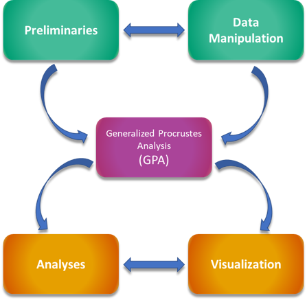

```{r, echo=F}
knitr::read_chunk("scripts/Index.R")
knitr::opts_chunk$set(dev.args=list(bg = 'transparent'), fig.align = 'center', class.source = ".custom-inline", class.output = ".custom-inline")
```

```{r, prelims, include=FALSE}

```

<center>


</center>
<br>

**Welcome to the geomorph tutorial web pages!** Here you will find links to various tutorials that provide instructions and examples for how to use geomorph to perform the latest morphometric analyses.


<div style="float:right;position: relative; top: -1px; left: 20px">


</div>

### **Introduction**

These tutorials are arranged to match the geometric morphometric workflow as laid out in Adams et al. (2013). For brand new users of geomorph, we *highly* recommend following this workflow in order to avoid confusion. Though landmarking can be performed in geomorph (see the help files for the functions `digit.fixed`, `digitize2d`, and others), these tutorials were written with the assumption that the reader has 2D or 3D landmark data already prepared for analysis. These data can be in one of several possible forms, including shapes,.tps,.nts, .csv, .txt, and morphologika. Most tutorials are written around a single function found within the `geomorph` R package.

Following this structure - from left to right on the navigation bar above - the user will be taken through the entire process of analyzing shape data using geomorph. This begins with the preliminary step of reading data into R.

Also within the heading of preliminaries are tutorials that fall under the topic of data manipulation. This includes accessing the different dimensions of a 3D array, deleting, naming and reflecting specimens, swapping and deleting landmarks, estimating missing data,checking for outliers, obtaining symmetric shapes, standardizing articulations, and matching data to a phylogeny. Finally, this section also includes tutorials for some more basic data manipulation in R that does not necessarily involve functions in geomorph. 


The next major set of tutorials is a series on aligning one's landmark data via a Generalized Procrustes Analysis (GPA). These tutorials are based on the geomorph function `gpagen` and are split by type of landmark (standard, curve, surface).
 
The next two sets of tutorials take the user through statistical analyses and visualization of results using geomorph. This includes calculating integration and modularity, asymmetry, Principal and phylogenetically-aligned Components analysis, and phylogenetic and Procrustes ANOVA.

Finally, we have put together several tutorials incorporating functions from each of the previous topics. These are meant to be used as full workflows to achieve a particular analytical goal (i.e. group comparisons). Each workflow tutorial begins with reading-in and manipulating data and takes the reader through the entire process of analysis.

### **Structure of the Tutorials**

Each tutorial begins with an introduction explaining the context of its subject, and why it is important. For each step that is explained, sample R code is embedded for the purpose of illustration. The analytical and visualization tutorials include as well sections to allow the user some hands-on (so-to-speak) experience. Aside from the base text, there are three other structures found in the tutorials that one should be aware of: 

When a geomorph function is mentioned for the first time, there will be a blue box like below. Click the arrow to expand it for more information on the function.

<div class = "func">
<details>
   <summary> <font size="+2"> `function() (Expand for more details)` </font> </summary>
* $A$: Here we will list the relevant inputs (arguments) for a given function and what they do.
* $B$: Many functions will have additional arguments not covered in the main tutorials.
* $C$: These more advanced arguments can be found in the [Advanced Options]() tutorial.
</details>
</div>
<br>

**Embedded R code chunks look like this:**
<div class = "code">
```{r, results, include=TRUE}

```
</div>
<br>

<div class = "note">
#### **Important Details...** 
...or other tips to keep in mind, are displayed in orange boxes. **Ignore these at your peril!**
</div>
<br></br>